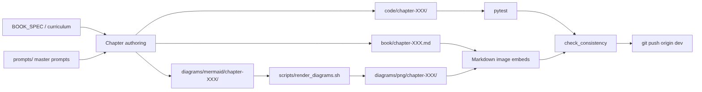
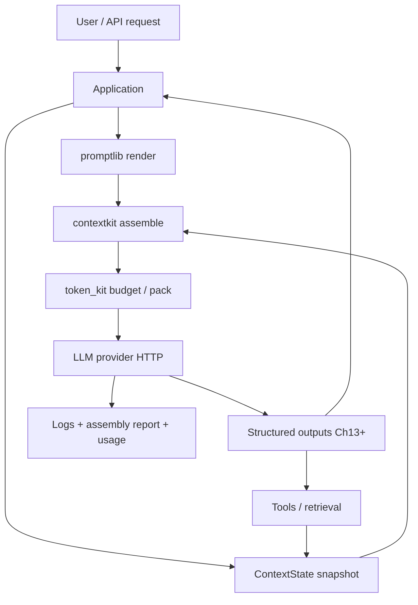
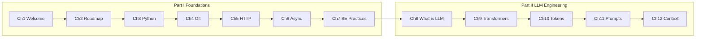

# AI Agent Engineering Bootcamp (2026 Edition)

From Python to production AI agent systems — an engineering textbook, bootcamp curriculum, and evolving platform codebase.

## Repository layout

```text
BOOK_MANIFEST.md              # Mission & non-negotiable rules
BOOK_SPECIFICATION.md         # Curriculum & chapter template
BOOK_BIBLE.md                 # Canonical architecture & terminology
AI_ENGINEERING_PLAYBOOK.md    # Patterns & checklists

prompts/                      # Master authoring / review / code prompts
book/                         # Manuscript chapters
code/                         # Per-chapter production code
diagrams/                     # Mermaid (and other) diagrams
scripts/                      # Automation CLI (generate, review, build, release)
playbook/                     # Extracted reusable notes
assets/                       # Images, datasets, icons
```

## Quick start

```bash
# Authoring automation
pip install -r scripts/requirements.txt
cp scripts/config.example.yaml scripts/config.yaml
export OPENAI_API_KEY=...   # or ANTHROPIC_API_KEY

python scripts/generate_chapter.py --chapter 1 --dry-run
python scripts/check_consistency.py --progress
python scripts/build_book.py

# Chapter code examples
cd code/chapter-001 && pytest -q
cd ../chapter-007 && pytest -q
```

See `scripts/README.md` for the full automation workflow.

## Git workflow

| Branch | Purpose |
|--------|---------|
| `dev` | **Active development** — all new work is committed and pushed here |
| `main` | Stable line — update via PR/merge from `dev` when ready to release |

```bash
git checkout dev
git pull origin dev
# ... make changes ...
git add -A
git commit -m "Your message"
git push origin dev
```

Do **not** commit feature work directly to `main`.

## Workflow diagrams

Rendered PNGs (sources under `diagrams/mermaid/`):







Regenerate after editing `.mmd` files:

```bash
npm install --no-fund @mermaid-js/mermaid-cli puppeteer
./scripts/render_diagrams.sh
python3 scripts/embed_diagram_images.py
```

See `diagrams/README.md`. Each chapter also has a **Visual diagrams** section with chapter-local PNGs.

## Chapters present

Manuscript and code slices currently include chapters **1–66** (through Part VII Production Engineering). Next: Part VIII — Build Your Own Framework (67+).

## Philosophy

Teach **engineering**, not frameworks. Build manually first, then compare alternatives. One evolving platform across the book.
