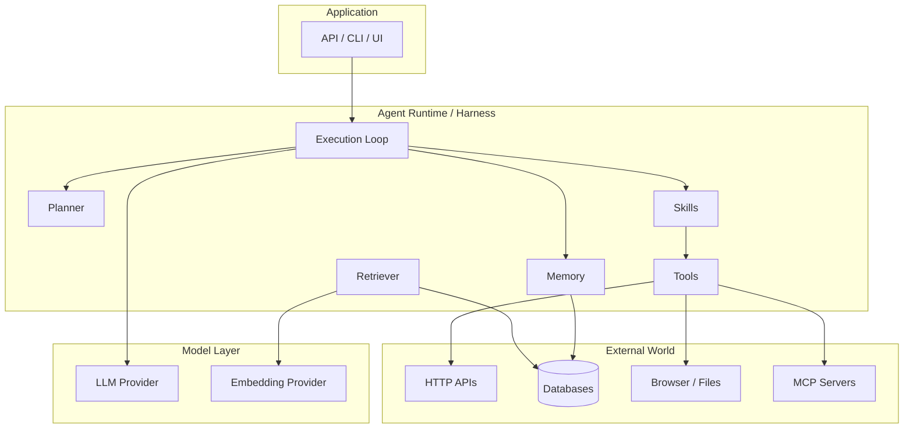
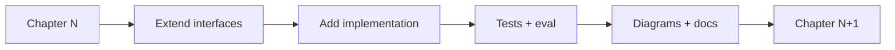
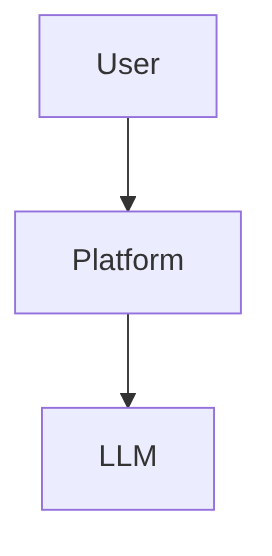

# Chapter 1: Welcome to AI Agent Engineering

## Chapter Overview

This book exists because most AI projects fail for engineering reasons, not model reasons.

Teams can call an LLM API in an afternoon. Shipping a system that is reliable, observable, secure, evaluable, and maintainable under real traffic is a different discipline. That discipline is **AI Agent Engineering**.

This chapter introduces:

- what AI Agent Engineering is (and is not)
- why framework tutorials are not enough
- the mental model used for the rest of the book
- the single evolving platform you will build
- how to set up your environment and learning journal

If you already build backend systems, you will feel at home. The goal is not to turn you into a prompt hobbyist. The goal is to train you as an engineer who can design production AI systems from first principles—and therefore learn any framework quickly.

**How this chapter connects forward:** Chapter 2 maps the full AI engineering stack (LLM → Tools → Skills → Workflows → Graphs → Agents → Multi-Agent → Applications). Everything after that deepens one layer at a time while extending the same project.

---

## Learning Objectives

After completing this chapter, you can:

- Define AI Agent Engineering in precise engineering terms
- Explain why principles outrank frameworks
- Describe the book’s teaching progression (WHY → WHAT → HOW → IMPLEMENT → DEBUG → EVALUATE → DEPLOY)
- Initialize the AI Platform repository structure used throughout the book
- Establish a development environment suitable for production-quality Python work
- Start a learning journal and portfolio habit that compounds across 94 chapters

---

## Prerequisites

- Comfortable writing basic Python (functions, modules, virtual environments)
- Ability to use a terminal and Git at a beginner level
- No prior LLM or machine-learning experience required

If Python is shaky, still continue—but plan extra time for Chapters 3–7.

---

## Motivation

Imagine this production incident.

Your company ships a “customer support agent.” Demo day looked great. Two weeks later:

- the bot invents refund policies that do not exist
- tool calls hit the wrong internal API
- costs spike because every turn resends a 40k-token history
- nobody can explain *why* a particular answer was produced
- there are no evaluations, only screenshots
- rotating the OpenAI key requires a code change and a redeploy

The model is not uniquely broken. The **system** is.

AI Agent Engineering exists to prevent that class of failure. It treats intelligent behavior as an application architecture problem:

| Fragile demo | Engineered system |
|---|---|
| One giant prompt | Layered components with clear boundaries |
| Hidden tool calls | Explicit tool contracts and permissions |
| No memory model | Working / episodic / semantic memory design |
| “It usually works” | Evaluation gates and regression suites |
| Logs = print statements | Structured logs, traces, cost metrics |
| Opaque framework behavior | Replaceable adapters over stable interfaces |

This book teaches the right-hand column.

---

## First Principles

### 1. Engineering over frameworks

Frameworks change. LangGraph, CrewAI, AutoGen, OpenAI Agents SDK, Semantic Kernel, and whatever ships next year are **implementations of ideas**.

If you understand:

- execution loops
- tool boundaries
- planning
- memory
- retrieval
- graphs / workflows
- harnesses
- evaluation

…you can reimplement or replace any framework.

**Non-negotiable rule of this book:** always teach WHY first, build manually first, then show frameworks as optional accelerators.

### 2. Systems, not chatboxes

An agent is not “ChatGPT with a loop.” A production agent is a system with:

- inputs and outputs
- state
- side effects (tools)
- policies (permissions, budgets, stop conditions)
- observability
- failure modes
- SLOs

### 3. One evolving platform

We do **not** create disconnected toy apps each chapter. We build one AI platform that evolves:

```
CLI → LLM chat → memory → RAG → tools → planner →
workflows → graphs → harness → MCP → FastAPI →
Docker → cloud → production multi-agent platform
```

Every chapter modifies that system deliberately.

### 4. Production concerns are not “advanced topics”

Security, performance, evaluation, and debugging are introduced continuously—not saved for a final “enterprise” section.

---

## Mental Model

Use these analogies consistently for the rest of the book:

| Concept | Analogy | Why it helps |
|---|---|---|
| LLM | CPU | Executes reasoning steps; needs clear instructions |
| Context window | RAM | Limited working set; eviction matters |
| Memory stores | Disk | Durable knowledge across sessions |
| Embeddings / index | Search index | Approximate retrieval over large corpora |
| Retriever | Search engine | Ranking and filtering pipeline |
| Tool | System call | Side effect into the outside world |
| Skill | Function library | Composed capabilities |
| Planner | Scheduler / compiler frontend | Decomposes goals into work |
| Workflow | Scripted job | Deterministic orchestration |
| Graph | Program control-flow | Branching, cycles, fan-out/fan-in |
| Harness | Runtime / OS process manager | Lifecycle, isolation, recovery |
| Agent | Autonomous worker process | Goal-directed loop with policies |
| Multi-agent | Distributed workers | Specialization and coordination |
| MCP | Protocol / plugin bus | Standard tool/resource connectivity |

If a new framework invents new vocabulary, map it back to this table before adopting it.



---

## Core Theory

### What is AI Agent Engineering?

**Definition:** AI Agent Engineering is the discipline of designing, implementing, evaluating, securing, deploying, and operating software systems in which language models participate in goal-directed control loops with tools, memory, and policies.

It sits at the intersection of:

- software architecture
- distributed systems thinking
- product reliability engineering
- applied LLM capabilities
- human–computer interaction (especially human-in-the-loop)

It is **not**:

- a ChatGPT usage guide
- pure ML research
- a framework cookbook
- prompt-only “automation”

### The capability hierarchy

Every chapter should be placeable on this ladder:

```
LLM
 └─ Tools
     └─ Skills
         └─ Workflows
             └─ Graphs
                 └─ Agents
                     └─ Multi-Agent Systems
                         └─ Applications / Platforms
```

Lower layers must be solid before higher layers become trustworthy. A multi-agent debate system on top of untyped tool calls and no evaluation is theater.

### Why agents fail in production

Common failure classes you will learn to design against:

1. **Hallucinated authority** — model invents facts or policy
2. **Unbounded loops** — agent retries forever
3. **Tool blast radius** — over-privileged actions
4. **Context rot** — relevant signal drowned by history
5. **Silent quality drift** — no regression evaluation
6. **Cost explosions** — naive context and model routing
7. **Unobservable decisions** — cannot debug why
8. **Framework lock-in** — core logic stuck in vendor abstractions

### Teaching method used in this book

Every substantial topic follows:

1. Problem
2. Naive solution
3. Limitations
4. Better solution
5. Production solution
6. Framework implementation
7. Comparison and trade-offs

Never reverse that order.

---

## Architecture

At the end of the book, the platform resembles a small internal AI operating environment. At the start (this chapter), we only establish the **repository and boundaries**.

Canonical top-level layout (will deepen over time):

```
AI-Agent-Engineering-Bootcamp/
├── BOOK_MANIFEST.md
├── BOOK_SPECIFICATION.md
├── BOOK_BIBLE.md
├── AI_ENGINEERING_PLAYBOOK.md
├── prompts/                   # master authoring / review / code prompts
├── book/                      # manuscript chapters
├── code/                      # per-chapter production code
│   └── chapter-001/
├── diagrams/
│   └── mermaid/
├── playbook/                  # reusable patterns extracted from chapters
├── assets/
└── scripts/                   # authoring automation
```

Application code (evolving platform) will converge toward boundaries such as:

```
platform/
  llm/           # provider clients, retries, streaming
  memory/
  retrieval/
  tools/
  skills/
  planner/
  workflow/
  graph/
  harness/
  api/           # FastAPI later
  eval/
  observability/
```

You do not need all folders today. You need the **habit of boundaries**.



---

## Internal Implementation

This chapter’s “manual implementation” is environment and repository scaffolding—not an agent loop yet.

### 1) Python environment

Target: **Python 3.12+** when available (3.10+ acceptable while tooling catches up).

```bash
cd AI-Agent-Engineering-Bootcamp
python3 -m venv .venv
source .venv/bin/activate
python -m pip install --upgrade pip
```

Create a minimal root dependency file for platform work (chapter code will add more):

```toml
# code/chapter-001/pyproject.toml
[project]
name = "ai-agent-platform-chapter-001"
version = "0.1.0"
description = "Chapter 1 scaffold for AI Agent Engineering Bootcamp"
requires-python = ">=3.10"
dependencies = [
  "python-dotenv>=1.0",
  "pydantic>=2.0",
  "rich>=13.0",
]

[project.optional-dependencies]
dev = ["pytest>=8.0", "ruff>=0.6"]
```

### 2) Configuration without secrets in code

```python
# code/chapter-001/platform_config.py
from __future__ import annotations

import os
from dataclasses import dataclass
from pathlib import Path

from dotenv import load_dotenv


@dataclass(frozen=True)
class Settings:
    """Process settings loaded from environment."""

    app_name: str = "ai-agent-platform"
    environment: str = "dev"
    log_level: str = "INFO"
    openai_api_key: str | None = None

    @classmethod
    def from_env(cls, env_file: str | None = ".env") -> "Settings":
        if env_file and Path(env_file).is_file():
            load_dotenv(env_file)
        return cls(
            app_name=os.getenv("APP_NAME", "ai-agent-platform"),
            environment=os.getenv("APP_ENV", "dev"),
            log_level=os.getenv("LOG_LEVEL", "INFO"),
            openai_api_key=os.getenv("OPENAI_API_KEY"),
        )


def require_non_secret_summary(settings: Settings) -> dict[str, str]:
    """Return a log-safe settings summary (never include secrets)."""
    return {
        "app_name": settings.app_name,
        "environment": settings.environment,
        "log_level": settings.log_level,
        "openai_api_key_set": "yes" if settings.openai_api_key else "no",
    }
```

### 3) Structured logging from day one

```python
# code/chapter-001/logging_setup.py
from __future__ import annotations

import logging
import sys


def setup_logging(level: str = "INFO") -> None:
    logging.basicConfig(
        level=getattr(logging, level.upper(), logging.INFO),
        format="%(asctime)s %(levelname)s %(name)s %(message)s",
        stream=sys.stdout,
    )
```

### 4) First CLI entrypoint

```python
# code/chapter-001/main.py
from __future__ import annotations

import logging

from logging_setup import setup_logging
from platform_config import Settings, require_non_secret_summary

logger = logging.getLogger("platform")


def main() -> int:
    settings = Settings.from_env()
    setup_logging(settings.log_level)
    summary = require_non_secret_summary(settings)
    logger.info("platform_boot", extra={"settings": summary})
    print(f"{settings.app_name} ready in {settings.environment} mode")
    print("Next: Chapter 2 — map the AI engineering stack.")
    return 0


if __name__ == "__main__":
    raise SystemExit(main())
```

### 5) Test the bootstrap

```python
# code/chapter-001/tests/test_settings.py
from platform_config import Settings, require_non_secret_summary


def test_settings_defaults(monkeypatch):
    monkeypatch.delenv("OPENAI_API_KEY", raising=False)
    monkeypatch.setenv("APP_ENV", "test")
    s = Settings.from_env(env_file=None)
    assert s.environment == "test"
    summary = require_non_secret_summary(s)
    assert "openai_api_key" not in summary
    assert summary["openai_api_key_set"] == "no"
```

Run:

```bash
cd code/chapter-001
pip install -e ".[dev]"
pytest -q
python main.py
```

---

## Production Implementation

Even a scaffold has production rules:

1. **Secrets only via environment / secret manager** — never commit `.env`
2. **Log structure early** — correlation IDs come later; format discipline starts now
3. **Config objects, not globals** — enables testing and dependency injection
4. **Explicit environments** — `dev` / `test` / `staging` / `prod`
5. **Package boundaries** — chapter folders today; installable platform package as the project matures
6. **CI mindset** — if it is not tested, it is a demo

When we add LLMs (Part II), these same seams host retries, timeouts, token accounting, and provider failover.

---

## Framework Implementation

No agent framework is introduced in this chapter.

That is intentional.

If a tool insists you start with `pip install <framework>` before you understand loops, tools, and evaluation, treat that as a **teaching smell**. Frameworks appear in Part VI only after you have built the underlying components yourself.

---

## Trade-offs

| Approach | Pros | Cons |
|---|---|---|
| Tutorial-first frameworks | Fast demo | Weak mental models; lock-in |
| Research-first theory | Deep understanding | Slow path to shipping |
| **This book: principles + evolving platform** | Transferable skill; portfolio artifact | Requires discipline and iteration |

Trade-off we accept: early chapters feel “software engineering heavy.” That is the point. AI systems are software systems.

---

## Debugging

Bootstrap failures you should know how to diagnose:

| Symptom | Likely cause | Fix |
|---|---|---|
| `ModuleNotFoundError` | Wrong venv / cwd | Activate `.venv`; run from package dir |
| API key “missing” later | Env not loaded | Check `.env` path; never hardcode |
| Tests pass, CLI fails | Different env vars | Use same `Settings.from_env` path |
| Logs unreadable | `print` soup | Use `logging` with levels |

**Debugging habit:** reproduce with the smallest command, then add observability—not the reverse.

---

## Performance

Not model latency yet. Engineer your **developer loop**:

- fast tests for config and pure functions
- local virtualenv per machine
- avoid reinstalling the world every chapter
- keep chapter packages thin; promote stable code into shared platform modules when patterns stabilize

Token and latency performance become central from Part II onward.

---

## Security

Day-one security baseline:

- never commit API keys, tokens, or customer data dumps
- add `.env` to `.gitignore`
- prefer least privilege when cloud accounts appear later
- assume all model output is untrusted once tools exist (prompt injection is covered in depth later)
- write log-safe summaries that cannot leak secrets

```bash
# good
export OPENAI_API_KEY=...

# bad
api_key = "sk-living-dangerously"
```

---

## Best Practices

1. Read `BOOK_MANIFEST.md` before every major section of the book
2. Keep the evolving project green (tests pass) at chapter boundaries
3. Write architecture notes when you change component boundaries
4. Prefer small, typed modules over notebooks for platform code
5. Capture decisions in a learning journal (what changed, why, what broke)
6. Map every new framework feature back to the canonical mental model table

---

## Anti-Patterns

| Anti-pattern | Why it hurts |
|---|---|
| New toy repo every tutorial | No architecture muscle memory |
| Giant notebook as the system | Untestable, undeployable |
| Prompt as the only control plane | No policy, no contracts |
| Skipping evaluation until “later” | Later never comes |
| Copy-pasting framework samples without interfaces | Lock-in and brittle glue |
| Logging secrets “just for debug” | Incidents and leaks |

---

## Hands-on Exercise

**Time box:** 45–90 minutes.

1. Create/activate a virtual environment at the repo root
2. Create `code/chapter-001/` with:
   - `platform_config.py`
   - `logging_setup.py`
   - `main.py`
   - `tests/test_settings.py`
   - `README.md`
3. Run `pytest` and `python main.py`
4. Create a private `.env` (not committed) with a placeholder variable `APP_ENV=dev`
5. Confirm logs never print secret values

**Acceptance criteria**

- CLI boots and prints environment mode
- tests pass
- `.env` is gitignored
- README explains how to run the scaffold

---

## Mini Project

**Initialize the AI Platform repository.**

Deliver a commit (local is fine) that includes:

1. Chapter 1 code package under `code/chapter-001/`
2. A short `code/chapter-001/README.md` with setup steps
3. A learning journal entry: `playbook/learning-journal.md` (create if missing) with:
   - date
   - definition of AI Agent Engineering in your own words
   - one production failure you have seen or can imagine
   - what you want the final platform to do

This journal becomes portfolio evidence by Chapter 94.

---

## Visual diagrams





## Chapter Deliverables

By the end of this chapter you should have:

| Artifact | Location |
|---|---|
| Chapter understanding | notes / journal |
| Bootable scaffold | `code/chapter-001/` |
| Tests | `code/chapter-001/tests/` |
| Architecture diagram | this chapter + `diagrams/mermaid/chapter-001/` |
| Environment discipline | venv + `.env` pattern |
| Git checkpoint | local commit recommended |

---

## Interview Questions

1. **Conceptual:** What is AI Agent Engineering, and how does it differ from prompt engineering?
2. **Conceptual:** Why should engineers build components manually before adopting frameworks?
3. **Architecture:** Map LLM, tool, skill, workflow, graph, agent, and harness with one-sentence responsibilities each.
4. **Scenario:** A demo agent works in a notebook but fails in production with cost spikes and silent wrong tool calls. What engineering gaps do you inspect first?
5. **Coding:** Sketch a settings object that loads from environment variables without exposing secrets in logs.
6. **Architecture:** Why is “one evolving platform” pedagogically and technically better than many toy apps?
7. **Security:** List three secret-handling mistakes common in early AI prototypes.
8. **Evaluation:** Why are screenshots insufficient evidence that an agent works?
9. **Trade-offs:** When is a simple workflow preferable to an autonomous agent?
10. **Career:** What portfolio artifacts prove AI systems engineering skill better than certificate badges?

**Model answers (concise)**

1. Systems discipline for goal-directed LLM applications with tools, state, policy, eval, and ops—not just phrasing prompts.
2. Manual builds expose invariants; frameworks become replaceable adapters.
3. LLM=inference; tool=side effect; skill=composed capability; workflow=deterministic orchestration; graph=control flow; agent=policy-bounded loop; harness=runtime lifecycle.
4. Observability, tool contracts/permissions, context growth, retries/timeouts, evaluation baselines.
5. Dataclass/Pydantic settings via env; log booleans like `api_key_set`, never raw keys.
6. Continuity forces integration thinking and yields a shippable portfolio system.
7. Keys in source, keys in logs, over-broad cloud tokens.
8. They are not regressions, not statistical, not edge-case covering.
9. When steps are stable and correctness > open-ended autonomy.
10. Production repo with tests, evals, diagrams, incident writeups, and clear architecture.

---

## Quiz

**Multiple choice**

1. The book’s primary subject is:
   - A) Framework APIs  
   - B) Engineering principles for AI systems  
   - C) GPU kernel optimization  
   - D) Marketing demos  
   **Answer:** B

2. Context window is best analogized as:
   - A) Disk  
   - B) CPU  
   - C) RAM  
   - D) Load balancer  
   **Answer:** C

3. Tools are best analogized as:
   - A) System calls / side effects  
   - B) Pure functions only  
   - C) Loss functions  
   - D) CSS selectors  
   **Answer:** A

**True/False**

4. Framework tutorials alone are sufficient for production AI systems. **False**  
5. Security and evaluation should wait until the final deployment chapter. **False**  
6. This book builds one evolving platform across chapters. **True**

**Short answer**

7. Name four layers in the AI engineering hierarchy beneath Applications.  
   **Sample:** LLM, Tools, Skills, Workflows/Graphs/Agents (any correct subset).  
8. Give two reasons demos fail after launch.  
   **Sample:** no evals; unbounded cost/context; weak tool permissions; no observability.  
9. What belongs in logs at boot for an API key?  
   **Sample:** whether it is set—not the value.  
10. Why map framework vocabulary to a canonical mental model?  
    **Sample:** transfer learning across tools; avoid lock-in confusion.

---

## Cheat Sheet

| Term | Meaning |
|---|---|
| AI Agent Engineering | Design/build/eval/operate LLM systems with tools & policies |
| Source of truth order | Manifest → Specification → Bible → Playbook |
| Teaching order | WHY → WHAT → HOW → IMPLEMENT → DEBUG → EVALUATE → DEPLOY |
| LLM / Context / Memory | CPU / RAM / Disk |
| Tool / Skill | Side effect / Composed capability |
| Workflow vs Agent | Deterministic script vs autonomous policy loop |
| Harness | Runtime lifecycle, isolation, recovery |
| Golden rule | Build manually before frameworks |
| Secret rule | Env/secret manager only; never log secrets |
| Project rule | One evolving platform, not toy-per-chapter |

**Commands**

```bash
python3 -m venv .venv && source .venv/bin/activate
cd code/chapter-001 && pip install -e ".[dev]"
pytest -q && python main.py
```

---

## Curated Free Resources

- [Python Packaging User Guide](https://packaging.python.org/) — environment and packaging fundamentals
- [The Twelve-Factor App](https://12factor.net/) — config/secrets and process discipline (still relevant)
- [OpenAI — Production best practices (docs)](https://platform.openai.com/docs/guides/production-best-practices) — vendor ops checklist; map ideas to first principles
- [Anthropic — Prompt engineering / safety docs](https://docs.anthropic.com/) — model behavior and safety framing
- [OpenTelemetry concepts](https://opentelemetry.io/docs/concepts/) — vocabulary for later observability chapters
- Repository docs in this project: `BOOK_MANIFEST.md`, `BOOK_SPECIFICATION.md`, `BOOK_BIBLE.md`

Prefer official docs and primary engineering references over paywalled “ultimate agent” listicles.

---

## Chapter Summary

- AI Agent Engineering is systems engineering for goal-directed LLM applications.
- Frameworks are examples; principles are the curriculum.
- We will build one platform that evolves from CLI to production multi-agent system.
- Day one is not model worship—it is environment, config, logging, tests, and boundaries.
- Canonical mental models (CPU/RAM/Disk, tools as syscalls, harness as runtime) will stay stable while tools change.

**What changed in the project**

- Chapter 1 manuscript established
- Scaffold path defined under `code/chapter-001/`
- Security and logging norms introduced

---

## What's Next

**Chapter 2 — The AI Engineering Roadmap** zooms out across the full stack: LLMs, tools, skills, workflows, graphs, agents, multi-agent systems, MCP, and harnesses. You will see how the pieces connect before we deep-dive each layer.

Bring your learning journal. In Chapter 2 you will draw the complete stack diagram and locate where your future platform components will live.
