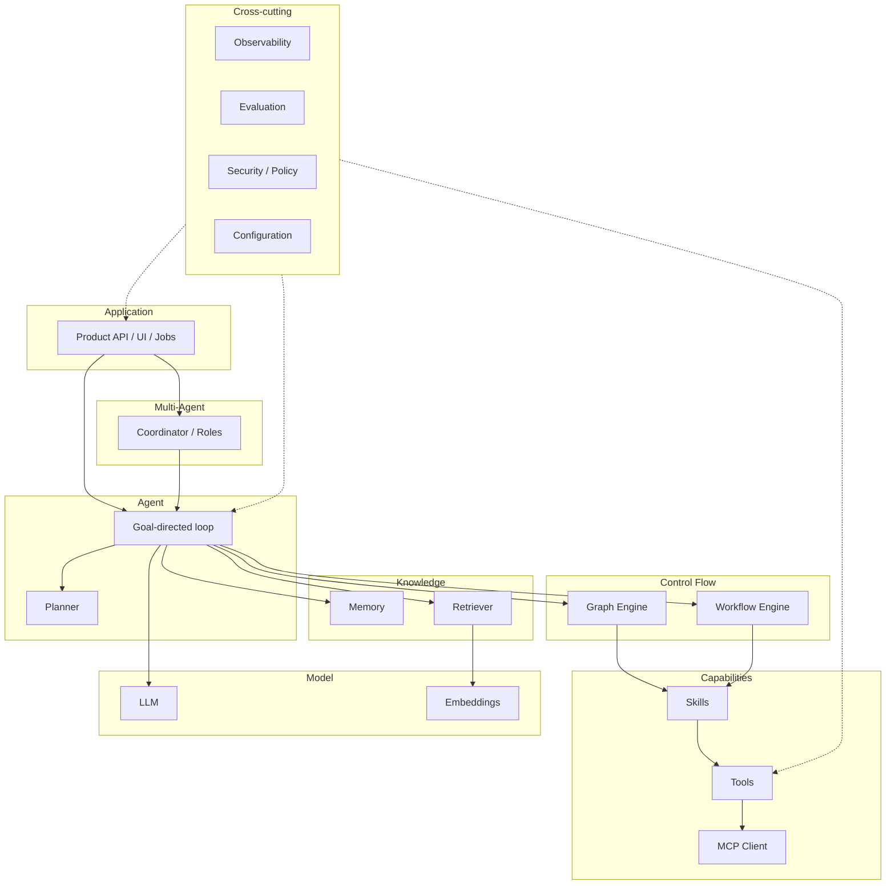
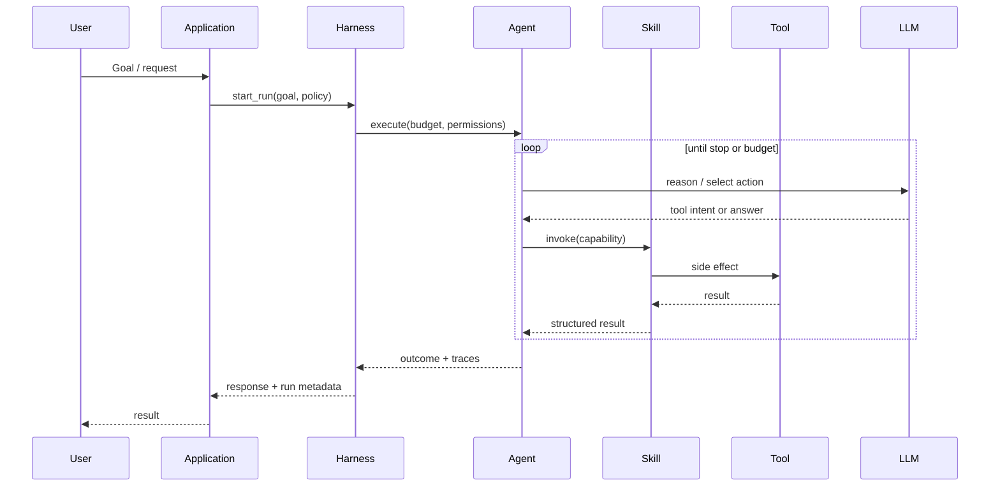
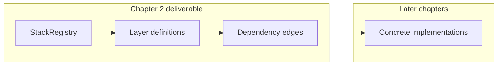

# Chapter 2: The AI Engineering Roadmap

## Chapter Overview

Chapter 1 defined the discipline and bootstrapped the platform. This chapter draws the **map** you will travel for the rest of the book.

Without a map, every new tutorial feels like a new universe: “agents,” “tools,” “graphs,” “RAG,” “MCP,” “harnesses,” “multi-agent crews.” Vocabulary multiplies. Architecture does not.

Here you will learn a single layered stack:

```
LLM
 → Tools
   → Skills
     → Workflows
       → Graphs
         → Agents
           → Multi-Agent Systems
             → Applications / Platforms
```

…and the cross-cutting runtime pieces that make it production-ready:

- **Memory** and **Retrieval** (knowledge over time and corpora)
- **Planner** (goal decomposition)
- **Harness** (lifecycle, isolation, recovery)
- **MCP** (standard connectivity to tools and resources)
- **Evaluation** and **Observability** (quality and operability)

This is not implementation depth yet. It is **orientation**: responsibilities, boundaries, failure modes, and how layers compose. Later chapters implement each layer inside the same evolving project.

**How this chapter connects:** Chapter 3 sharpens the Python skills required to express these boundaries cleanly. Parts II–V then climb the stack from LLMs to production agent systems.

---

## Learning Objectives

After completing this chapter, you can:

- Explain each layer of the AI engineering stack in one crisp sentence
- Place a feature request on the correct layer (and refuse the wrong one)
- Distinguish workflows, graphs, and agents without marketing language
- Describe what a harness is responsible for versus what an agent policy decides
- Explain where MCP sits relative to tools and applications
- Draw the complete stack and locate memory, retrieval, planning, eval, and observability
- Extend the Chapter 1 platform with a typed **architecture registry** that documents the roadmap in code

---

## Prerequisites

- Chapter 1 completed (environment, config, logging bootstrap)
- Basic Python comfort (we introduce light typing and dataclasses; Chapter 3 goes deeper)

---

## Motivation

A product manager says: “Add an agent that reads our Notion docs, files Jira tickets, and emails customers when SLA is at risk.”

A fragile team response:

> “We’ll install Framework X, turn on multi-agent mode, and prompt it hard.”

An engineering response starts with placement questions:

1. What must be **deterministic** vs **autonomous**?
2. Which steps are **tools** (side effects) vs **reasoning**?
3. Is knowledge **in context**, **in memory**, or **retrieved**?
4. What are the **permissions** and **human approvals**?
5. How do we **evaluate** correctness before production?
6. What does the **runtime** do on timeout, partial failure, or budget exhaustion?

If you cannot answer those, you do not have an agent architecture—you have a demo plan.

This chapter gives you the vocabulary and layering to answer them every time.

---

## First Principles

### 1. Layers exist to control complexity

Each layer should earn its keep by answering a specific design problem:

| Layer | Core problem it solves |
|---|---|
| LLM | Flexible reasoning and language I/O |
| Tool | Controlled side effects in the outside world |
| Skill | Reusable capability composition |
| Workflow | Reliable multi-step procedures |
| Graph | Non-linear control flow with state |
| Agent | Goal-directed autonomy under policy |
| Multi-agent | Specialization and coordination |
| Application | User value, UX, tenancy, product surface |

Skipping layers is allowed when the problem is simple. **Skipping understanding** is not.

### 2. Higher layers do not erase lower contracts

An “agent” that calls HTTP without a tool boundary still has tools—they are just implicit, untested, and over-privileged.

### 3. Determinism is a feature

Not everything should be an agent. Many production systems should be workflows with occasional LLM steps. Autonomy is expensive: harder to test, harder to secure, harder to explain.

### 4. Runtime is not policy

- **Policy** (agent/planner): what to try next
- **Runtime / harness**: how execution is scheduled, limited, observed, cancelled, and recovered

Confusing these produces frameworks that hide critical controls inside opaque loops.

### 5. Protocols beat plugins

MCP (Model Context Protocol) matters because connectivity should not be reinvented per app. Treat it as a **boundary**, not a religion.

---

## Mental Model

Keep Chapter 1’s analogies and extend them into a stack:



**Reading the diagram**

- Vertical = composition (apps sit on agents/workflows, which sit on skills/tools, which sit on models and systems)
- Side boxes = always present in production, never “phase 2”
- MCP attaches at the tool/connectivity boundary

---

## Core Theory

### The complete AI engineering stack

#### 1) LLM (Model layer)

**Purpose:** Transform inputs (messages, tools schemas, context) into outputs (text, structured data, tool-call intents).

**Is:** a probabilistic component with latency, cost, and error modes  
**Is not:** a database, a permission system, or a source of truth for business policy

You will implement provider clients, retries, streaming, and token accounting in Part II.

#### 2) Tools

**Purpose:** Perform **side effects** through explicit contracts: search, HTTP, SQL, email, browser, filesystem, internal APIs.

Good tools have:

- typed inputs/outputs
- timeouts
- auth scopes
- idempotency notes
- audit logging
- least privilege

Bad tools are “whatever the model decides to curl.”

#### 3) Skills

**Purpose:** Package multi-step or domain capabilities above raw tools—e.g., `refund_order`, `prepare_weekly_research_brief`.

Skills may:

- call multiple tools
- enforce business rules
- return structured results to planners/agents

Think **function library for the platform**, not a prompt file.

#### 4) Workflows

**Purpose:** Run **mostly deterministic** sequences: step A → B → C, with branches, retries, and SLAs.

Use workflows when:

- the path is known
- auditability matters
- humans need predictable automation

LLM calls can appear *inside* workflow steps without turning the whole system into an autonomous agent.

#### 5) Graphs

**Purpose:** Express control flow as nodes and edges: conditionals, cycles, fan-out/fan-in, checkpointing.

Graphs generalize workflows when routing is state-dependent and non-linear. They are still **not automatically agents**—a graph can be fully deterministic.

#### 6) Agents

**Purpose:** Pursue a goal via a policy-bounded loop:

```
while not done and within budget:
  observe state
  decide next action (plan / act / ask human)
  execute tool/skill
  update memory
  evaluate stop conditions
```

Agents need explicit:

- stop conditions
- tool permissions
- token/time budgets
- escalation paths

#### 7) Multi-agent systems

**Purpose:** Split work across specialized roles (researcher, coder, reviewer) with coordination protocols.

They multiply failure modes: deadlock, debate loops, inconsistent shared state, cost amplification. Use only when specialization value exceeds coordination cost.

#### 8) Applications / platforms

**Purpose:** Deliver user value: APIs, UIs, tenancy, authn/z, billing, compliance, SLOs.

The platform is where engineering meets product. A perfect agent loop with no auth model is not production.

---

### Cross-cutting subsystems

These are not “optional add-ons.” They are peers to the stack.

#### Memory

Retention beyond the current prompt: working state, session history, episodic traces, long-term preferences/facts.

Without memory design, every turn reinvents context packing—and costs explode.

#### Retrieval (RAG)

Fetch relevant external knowledge into context. Retrieval is an engineering pipeline (chunk, index, rank, cite, evaluate)—not a single vector DB checkbox.

#### Planner

Decomposes goals into tasks or action candidates. May be heuristic, LLM-based, or hybrid. Planners propose; harnesses constrain.

#### Harness (runtime)

Owns execution mechanics:

- start/stop/cancel
- concurrency
- retries and backoff
- sandboxing
- state checkpoints
- budget enforcement
- hooks for logs/metrics/traces/evals

If your “agent class” secretly contains all of this, extract a harness.

#### MCP

A protocol for exposing tools, resources, and prompts from servers to clients. In stack terms: **standardized tool/resource connectivity**, reducing one-off integrations.

#### Evaluation

Offline and online measures of quality: task success, faithfulness, tool correctness, regression suites, canaries.

#### Observability

Logs, metrics, traces, cost ledgers, transcript stores—enough to answer “what happened?” without myth.

---

### How layers connect (composition rules)

1. **Applications invoke** workflows, graphs, or agents—not raw model HTTP from UI code.
2. **Agents/workflows call skills**; skills call tools; tools may call MCP servers or native SDKs.
3. **Agents read/write memory**; retrieval supplies documents into context under policy.
4. **Harness wraps** agent/graph runs with limits and observability.
5. **Evaluation probes** the same interfaces users hit (or faithful shadows of them).



### Decision guide: workflow vs graph vs agent

| If your problem looks like… | Prefer |
|---|---|
| Fixed business procedure, compliance-heavy | Workflow |
| Branchy procedure with shared state & checkpoints | Graph |
| Open-ended goal, tool use, uncertain path | Agent |
| Specialized parallel roles with merge/review | Multi-agent (on top of agents) |
| Single LLM call with schema validation | Just LLM + validation (no agent) |

**Rule of thumb:** start one layer lower than your ambition. Promote only when metrics demand it.

### Where upcoming book parts live on the map

| Book phase | Stack focus |
|---|---|
| Part I Foundations | Language, Git, HTTP, async, SE practices |
| Part II LLM Engineering | Model layer mastery |
| Part III Retrieval | Retriever + knowledge pipelines |
| Part IV Agent Engineering | Tools, skills, plans, memory, graphs, MCP |
| Part V Agent Systems | Harness, eval, security, scale |
| Part VI Frameworks | Map third-party graphs/agents onto *this* stack |
| Part VII Production | API, data stores, deploy, observability |
| Part VIII Build-your-own | Reimplement core platform components |
| Part IX Projects | Full applications on the platform |
| Part X Career | System design & portfolio |

---

## Architecture

### Canonical platform modules (target shape)

As the repo evolves, code should converge toward interfaces like:

```
platform/
  llm/            # clients, streaming, usage
  embeddings/
  memory/
  retrieval/
  tools/
  skills/
  planner/
  workflow/
  graph/
  agent/
  multi_agent/
  harness/
  mcp/
  eval/
  observability/
  api/            # later
```

Chapter 2 does not implement all modules. It introduces a **stack registry**: typed metadata that forces you to name layers, dependencies, and responsibilities—the architectural equivalent of a table of contents.



### Responsibility boundaries (cheat table)

| Component | Owns | Must not own |
|---|---|---|
| LLM client | Provider I/O, retries, usage | Business permissions |
| Tool | One side-effect contract | Global conversation policy |
| Skill | Domain capability orchestration | Process-level sandboxing |
| Workflow/Graph | Control flow & state transitions | Provider HTTP details |
| Agent | Goal policy within budgets | OS-level isolation |
| Harness | Run lifecycle & enforcement | Product UX copy |
| MCP client | Protocol connectivity | Hidden unbounded tools |
| Eval | Scoring & gates | Mutating prod data unsafely |

---

## Internal Implementation

We extend the evolving platform by adding a pure-Python **architecture map** under `code/chapter-002/`.

### Domain types

```python
# code/chapter-002/stack_model.py
from __future__ import annotations

from dataclasses import dataclass, field
from enum import Enum
from typing import Iterable


class LayerId(str, Enum):
    LLM = "llm"
    EMBEDDINGS = "embeddings"
    MEMORY = "memory"
    RETRIEVAL = "retrieval"
    TOOL = "tool"
    SKILL = "skill"
    WORKFLOW = "workflow"
    GRAPH = "graph"
    PLANNER = "planner"
    AGENT = "agent"
    MULTI_AGENT = "multi_agent"
    HARNESS = "harness"
    MCP = "mcp"
    EVAL = "eval"
    OBSERVABILITY = "observability"
    APPLICATION = "application"


@dataclass(frozen=True)
class Layer:
    id: LayerId
    title: str
    purpose: str
    analogy: str
    depends_on: tuple[LayerId, ...] = ()
    produces: tuple[str, ...] = ()
    failure_modes: tuple[str, ...] = ()


@dataclass
class StackRegistry:
    """Canonical AI engineering stack for this book/platform."""

    layers: dict[LayerId, Layer] = field(default_factory=dict)

    def register(self, layer: Layer) -> None:
        if layer.id in self.layers:
            raise ValueError(f"Duplicate layer: {layer.id}")
        self.layers[layer.id] = layer

    def get(self, layer_id: LayerId) -> Layer:
        return self.layers[layer_id]

    def validate_dependencies(self) -> list[str]:
        errors: list[str] = []
        for layer in self.layers.values():
            for dep in layer.depends_on:
                if dep not in self.layers:
                    errors.append(f"{layer.id.value} depends on missing {dep.value}")
        return errors

    def dependents_of(self, layer_id: LayerId) -> list[LayerId]:
        return [lid for lid, layer in self.layers.items() if layer_id in layer.depends_on]

    def summarize(self) -> list[str]:
        lines: list[str] = []
        for layer in self.layers.values():
            deps = ", ".join(d.value for d in layer.depends_on) or "—"
            lines.append(f"{layer.id.value}: {layer.purpose} (depends: {deps})")
        return lines
```

### Canonical stack definition

```python
# code/chapter-002/canonical_stack.py
from __future__ import annotations

from stack_model import Layer, LayerId, StackRegistry


def build_canonical_stack() -> StackRegistry:
    reg = StackRegistry()
    specs: list[Layer] = [
        Layer(
            LayerId.LLM,
            "LLM",
            "Probabilistic reasoning and language generation",
            "CPU",
            depends_on=(),
            produces=("messages", "tool_call_intents", "structured_outputs"),
            failure_modes=("hallucination", "latency_spikes", "format_errors"),
        ),
        Layer(
            LayerId.EMBEDDINGS,
            "Embeddings",
            "Map text/code into vectors for similarity",
            "Index encoding",
            produces=("vectors",),
            failure_modes=("domain_mismatch", "stale_embeddings"),
        ),
        Layer(
            LayerId.MEMORY,
            "Memory",
            "Persist state across turns and sessions",
            "Disk",
            depends_on=(),
            produces=("working_state", "episodic_records"),
            failure_modes=("stale_facts", "unbounded_growth"),
        ),
        Layer(
            LayerId.RETRIEVAL,
            "Retrieval",
            "Fetch relevant knowledge into context",
            "Search engine",
            depends_on=(LayerId.EMBEDDINGS,),
            produces=("passages", "citations"),
            failure_modes=("missed_docs", "noisy_context"),
        ),
        Layer(
            LayerId.TOOL,
            "Tool",
            "Typed side effects with permissions",
            "System call",
            produces=("external_results",),
            failure_modes=("timeouts", "auth_failures", "overreach"),
        ),
        Layer(
            LayerId.MCP,
            "MCP",
            "Protocol for tools/resources/prompts connectivity",
            "Plugin bus",
            depends_on=(),
            produces=("remote_tools", "resources"),
            failure_modes=("untrusted_servers", "schema_drift"),
        ),
        Layer(
            LayerId.SKILL,
            "Skill",
            "Composable domain capabilities over tools",
            "Function library",
            depends_on=(LayerId.TOOL, LayerId.MCP),
            produces=("capability_results",),
            failure_modes=("hidden_side_effects", "poor_contracts"),
        ),
        Layer(
            LayerId.WORKFLOW,
            "Workflow",
            "Deterministic multi-step orchestration",
            "Scripted job",
            depends_on=(LayerId.SKILL, LayerId.LLM),
            produces=("job_outcomes",),
            failure_modes=("brittle_happy_paths", "weak_retries"),
        ),
        Layer(
            LayerId.GRAPH,
            "Graph",
            "Stateful non-linear control flow",
            "Program control-flow",
            depends_on=(LayerId.SKILL, LayerId.LLM, LayerId.MEMORY),
            produces=("graph_state", "routed_outcomes"),
            failure_modes=("cycles_without_bounds", "checkpoint_loss"),
        ),
        Layer(
            LayerId.PLANNER,
            "Planner",
            "Decompose goals into actionable plans",
            "Scheduler frontend",
            depends_on=(LayerId.LLM, LayerId.MEMORY),
            produces=("plans", "task_graphs"),
            failure_modes=("over_decomposition", "invalid_steps"),
        ),
        Layer(
            LayerId.AGENT,
            "Agent",
            "Goal-directed loop under policy and budgets",
            "Worker process",
            depends_on=(
                LayerId.LLM,
                LayerId.SKILL,
                LayerId.PLANNER,
                LayerId.MEMORY,
                LayerId.RETRIEVAL,
            ),
            produces=("goal_outcomes", "action_traces"),
            failure_modes=("unbounded_loops", "tool_spam", "goal_drift"),
        ),
        Layer(
            LayerId.MULTI_AGENT,
            "Multi-Agent",
            "Coordinated specialized agents",
            "Distributed workers",
            depends_on=(LayerId.AGENT,),
            produces=("consensus_results", "role_outputs"),
            failure_modes=("deadlock", "cost_amplification"),
        ),
        Layer(
            LayerId.HARNESS,
            "Harness",
            "Runtime lifecycle, isolation, recovery, budgets",
            "OS process manager",
            depends_on=(LayerId.AGENT, LayerId.GRAPH, LayerId.WORKFLOW),
            produces=("run_records", "enforced_limits"),
            failure_modes=("resource_leaks", "missed_cancellations"),
        ),
        Layer(
            LayerId.EVAL,
            "Evaluation",
            "Measure quality and gate releases",
            "QA / scoreboards",
            depends_on=(LayerId.APPLICATION, LayerId.AGENT),
            produces=("scores", "regression_signals"),
            failure_modes=("metric_gaming", "offline_online_gap"),
        ),
        Layer(
            LayerId.OBSERVABILITY,
            "Observability",
            "Logs, metrics, traces, cost ledgers",
            "Telemetry",
            produces=("traces", "metrics"),
            failure_modes=("blind_spots", "PII_in_logs"),
        ),
        Layer(
            LayerId.APPLICATION,
            "Application",
            "Product surface: API/UI/jobs/tenancy",
            "Product",
            depends_on=(LayerId.HARNESS, LayerId.OBSERVABILITY),
            produces=("user_value",),
            failure_modes=("auth_gaps", "no_SLOs"),
        ),
    ]
    for layer in specs:
        reg.register(layer)
    return reg
```

### Placement helper (force architectural thinking)

```python
# code/chapter-002/placement.py
from __future__ import annotations

from dataclasses import dataclass

from stack_model import LayerId


@dataclass(frozen=True)
class PlacementDecision:
    layer: LayerId
    rationale: str
    avoid: tuple[LayerId, ...] = ()


def place_feature(description: str) -> PlacementDecision:
    """Heuristic teacher—not production routing.

    Real systems use design review; this function trains instincts.
    """
    text = description.lower()

    if any(k in text for k in ("sla", "cron", "invoice pipeline", "etl", "nightly")):
        return PlacementDecision(
            LayerId.WORKFLOW,
            "Procedure looks deterministic; prefer workflow before autonomy.",
            avoid=(LayerId.MULTI_AGENT,),
        )
    if "approve" in text or "human in the loop" in text or "review step" in text:
        return PlacementDecision(
            LayerId.GRAPH,
            "Explicit states/approvals map cleanly to graph nodes and interrupts.",
            avoid=(),
        )
    if any(k in text for k in ("research", "investigate", "open-ended", "figure out")):
        return PlacementDecision(
            LayerId.AGENT,
            "Open-ended goals with tool use suggest a policy-bounded agent loop.",
            avoid=(),
        )
    if "debate" in text or "multiple roles" in text or "reviewer agent" in text:
        return PlacementDecision(
            LayerId.MULTI_AGENT,
            "Specialized roles imply multi-agent coordination costs—use deliberately.",
            avoid=(),
        )
    if any(k in text for k in ("http", "sql", "email", "browser", "jira", "ticket")):
        return PlacementDecision(
            LayerId.TOOL,
            "Side effects belong behind typed tool contracts (skills may compose them).",
            avoid=(LayerId.LLM,),
        )
    if "notion" in text or "pdf" in text or "documentation" in text or "knowledge base" in text:
        return PlacementDecision(
            LayerId.RETRIEVAL,
            "Large corpora should be retrieved, not pasted wholesale into prompts.",
            avoid=(),
        )
    return PlacementDecision(
        LayerId.APPLICATION,
        "Unclear automation shape—start from product requirements, then descend layers.",
        avoid=(LayerId.MULTI_AGENT,),
    )
```

### CLI: print the roadmap

```python
# code/chapter-002/main.py
from __future__ import annotations

import argparse
import logging
import sys
from pathlib import Path

# Allow running next to chapter-001 utilities if present
CHAPTER1 = Path(__file__).resolve().parents[1] / "chapter-001"
if CHAPTER1.is_dir():
    sys.path.insert(0, str(CHAPTER1))

from canonical_stack import build_canonical_stack
from placement import place_feature
from stack_model import LayerId

try:
    from logging_setup import setup_logging
    from platform_config import Settings
except ImportError:
    def setup_logging(level: str = "INFO") -> None:
        logging.basicConfig(level=getattr(logging, level.upper(), logging.INFO))

    class Settings:  # minimal fallback
        @classmethod
        def from_env(cls, env_file=None):
            return cls()

        log_level = "INFO"
        app_name = "ai-agent-platform"
        environment = "dev"


logger = logging.getLogger("platform.roadmap")


def cmd_map() -> int:
    stack = build_canonical_stack()
    errors = stack.validate_dependencies()
    if errors:
        for err in errors:
            logger.error("stack_invalid %s", err)
        return 1
    print("AI Engineering Stack (canonical)\n")
    for line in stack.summarize():
        print(f"  • {line}")
    print("\nDependency check: OK")
    return 0


def cmd_place(feature: str) -> int:
    decision = place_feature(feature)
    print(f"Feature: {feature}")
    print(f"Place at: {decision.layer.value}")
    print(f"Rationale: {decision.rationale}")
    if decision.avoid:
        print("Avoid jumping to: " + ", ".join(a.value for a in decision.avoid))
    return 0


def cmd_show(layer: str) -> int:
    stack = build_canonical_stack()
    try:
        layer_id = LayerId(layer)
    except ValueError:
        print(f"Unknown layer '{layer}'. Valid: {[x.value for x in LayerId]}")
        return 2
    item = stack.get(layer_id)
    print(f"{item.title} ({item.id.value})")
    print(f"Purpose:  {item.purpose}")
    print(f"Analogy:  {item.analogy}")
    print(f"Depends:  {[d.value for d in item.depends_on] or '—'}")
    print(f"Produces: {list(item.produces) or '—'}")
    print(f"Failures: {list(item.failure_modes) or '—'}")
    print(f"Used by:  {[d.value for d in stack.dependents_of(layer_id)] or '—'}")
    return 0


def main(argv: list[str] | None = None) -> int:
    settings = Settings.from_env()
    setup_logging(getattr(settings, "log_level", "INFO"))

    parser = argparse.ArgumentParser(description="Chapter 2 — AI engineering roadmap CLI")
    sub = parser.add_subparsers(dest="cmd", required=True)

    sub.add_parser("map", help="Print the canonical stack")
    p_show = sub.add_parser("show", help="Show one layer")
    p_show.add_argument("layer", help="e.g. agent, tool, harness")
    p_place = sub.add_parser("place", help="Suggest a layer for a feature description")
    p_place.add_argument("feature", help="Natural language feature request")

    args = parser.parse_args(argv)
    if args.cmd == "map":
        return cmd_map()
    if args.cmd == "show":
        return cmd_show(args.layer)
    if args.cmd == "place":
        return cmd_place(args.feature)
    return 2


if __name__ == "__main__":
    raise SystemExit(main())
```

Run:

```bash
cd code/chapter-002
python main.py map
python main.py show harness
python main.py place "Research competitors and open Jira tickets"
```

---

## Production Implementation

A roadmap becomes production practice when it constrains delivery:

1. **Architecture review checklist** — every PR names the layer(s) it touches  
2. **Interface-first modules** — forbid UI code from calling provider SDKs directly  
3. **Default to workflow** — promote to agent only with eval evidence  
4. **Harness budgets** on every autonomous run (max steps, max tokens, max wall time)  
5. **Tool allowlists** per agent role  
6. **Trace every layer transition** (agent → skill → tool)  
7. **Eval gates** before expanding autonomy  

### Minimal production policy object (preview)

Later chapters implement this fully; learn the fields now:

```python
@dataclass(frozen=True)
class RunPolicy:
    max_steps: int = 12
    max_tokens: int = 50_000
    max_wall_time_s: int = 120
    allowed_tools: tuple[str, ...] = ()
    require_human_on: tuple[str, ...] = ("refund", "delete", "email_customer")
```

If a framework cannot express this policy, it is not production-ready for your threat model—regardless of demo quality.

---

## Framework Implementation

No vendor framework yet.

When Part VI arrives, you will map each product onto this chapter’s layers:

| Framework concept (examples) | Canonical layer |
|---|---|
| Chat model / completions | LLM |
| Tool / function | Tool |
| Graph node / state graph | Graph |
| Crew / swarm / role agents | Multi-agent |
| Runner / executor | Harness |
| Memory module | Memory |
| Retriever chain | Retrieval |

**Exercise for later:** open any framework README and rewrite it using only this chapter’s vocabulary. If you cannot, the framework is inventing ontology—or you need a sharper map.

---

## Trade-offs

| Choice | Gains | Costs |
|---|---|---|
| Single LLM call | Simple, cheap, testable | Weak for multi-step side effects |
| Workflow + LLM steps | Predictable ops | Less flexible on novel goals |
| Agent loop | Handles uncertainty | Eval/security/cost burden |
| Multi-agent | Specialization | Coordination failures, spend |
| Heavy graph framework early | Fast diagrams/demos | Lock-in before interfaces exist |
| Protocol (MCP) adoption | Shared tool ecosystem | Trust & auth complexity |

**Engineering bias of this book:** climb the stack only when the lower layer’s limitations are proven, not when Twitter demos are exciting.

---

## Debugging

Stack-oriented debugging questions:

| Symptom | Inspect first |
|---|---|
| Wrong facts | Retrieval/memory before “smarter model” |
| Wrong side effect | Tool contract, auth scope, agent permissions |
| Infinite run | Harness budgets, stop conditions, graph cycles |
| Huge bills | Context growth, agent step count, model routing |
| “Works in demo only” | Missing eval set; hidden prompt hardcoding |
| Role agents disagree forever | Multi-agent protocol; add merge/judge or reduce roles |

**Method:** locate the **lowest layer that could cause the bug**, fix the contract, then re-test higher layers.

---

## Performance

Performance is a stack property:

| Layer | Primary costs |
|---|---|
| LLM | Tokens in/out, model tier, latency |
| Retrieval | Index size, rerank, chunk strategy |
| Tools | Network I/O, rate limits |
| Agent | Steps × (model + tools) |
| Multi-agent | Multiplier on agent costs |
| Harness | Overhead should be small vs model I/O |

Design rule: **measure step counts and tokens per successful task** before optimizing microbenchmarks.

---

## Security

Threats appear at every layer:

| Layer | Threat examples | Controls |
|---|---|---|
| LLM | Prompt injection via retrieved docs | Sandbox tools; cite; filter |
| Tools | SSRF, data exfil, destructive ops | Allowlists, auth, confirmations |
| Skills | Hidden privileged composition | Explicit skill permissions |
| Agent | Goal hijack | Budgets, human-in-the-loop |
| MCP | Malicious servers | Trust registry, scopes |
| App | Broken tenant isolation | Authn/z, audit logs |
| Observability | Secrets/PII in traces | Redaction policies |

Never give an agent a tool you would not give a junior employee without supervision—unless the harness enforces stronger controls than that employee’s laptop.

---

## Best Practices

1. Draw the stack before selecting a framework  
2. Name components with canonical terms (tool ≠ skill ≠ agent)  
3. Prefer typed contracts at every boundary  
4. Put budgets in the harness, not free-text prompts alone  
5. Keep application code free of provider SDK sprawl  
6. Document failure modes next to features  
7. Add eval cases when you add autonomy  
8. Review multi-agent designs with a “coordination tax” estimate  

---

## Anti-Patterns

| Anti-pattern | Why it fails |
|---|---|
| Everything is an agent | Unneeded nondeterminism and cost |
| Tools without schemas | Injection and breakage |
| Skills that are just mega-prompts | No testable surface |
| Graphs with no max-cycle policy | Runaway execution |
| Multi-agent as default | Coordination theater |
| Harness logic inside prompts | Unenforceable limits |
| MCP as infinite trust bus | Remote code/data risk |
| Framework-first design | Ontology confusion; rewrites later |

---

## Hands-on Exercise

**Time box:** 60–90 minutes.

1. Implement (or copy from this chapter) `stack_model.py`, `canonical_stack.py`, `placement.py`, `main.py` under `code/chapter-002/`.
2. Run `python main.py map` and confirm dependency validation passes.
3. For each feature below, run `place` and **write one sentence agreeing or disagreeing** in your learning journal:
   - “Nightly invoice reconciliation email”
   - “Open-ended market research with web browse”
   - “Refund customer up to $50”
   - “Sync Notion docs into answers”
4. Extend `canonical_stack.py` with one additional `failure_modes` entry on `AGENT` that you have personally seen or fear.
5. Add a unit test that fails if `APPLICATION` does not depend on `HARNESS` or `OBSERVABILITY` (architectural regression test).

---

## Mini Project

**Ship the Architecture Atlas for the AI Platform.**

Deliverables in `code/chapter-002/`:

1. Canonical stack registry with validation  
2. CLI: `map`, `show`, `place`  
3. Tests for dependency integrity and placement heuristics  
4. `README.md` explaining how later chapters will replace stubs with real modules  
5. Export a markdown summary generated from the registry (optional script or CLI flag)

Optional stretch: emit Mermaid from the registry (nodes = layers, edges = depends_on) so docs and code cannot drift.

This atlas is referenced whenever a later chapter adds a component: **update the registry in the same PR as the implementation**.

---

## Chapter Deliverables

| Artifact | Location |
|---|---|
| Roadmap chapter | `book/chapter-002.md` |
| Stack registry + CLI | `code/chapter-002/` |
| Tests | `code/chapter-002/tests/` |
| Stack diagrams | `diagrams/mermaid/chapter-002/` |
| Journal notes | `playbook/learning-journal.md` (layer definitions in your words) |

---

## Interview Questions

1. Define tool, skill, workflow, graph, agent, harness—without using vendor names.  
2. When is a workflow better than an agent?  
3. What belongs in a harness vs an agent policy?  
4. How does MCP change tool integration strategy?  
5. Why can multi-agent systems increase cost without increasing quality?  
6. Place “customer support answer from PDF knowledge base” on the stack and justify.  
7. Name three failure modes unique to agent loops (not plain LLM calls).  
8. How do evaluation and observability differ?  
9. What is wrong with calling provider SDKs directly from a React frontend?  
10. How would you explain this stack to a skeptical backend tech lead in 90 seconds?

**Concise model answers**

1. Tool=typed side effect; skill=composed capability; workflow=deterministic steps; graph=stateful control flow; agent=goal loop under policy; harness=runtime enforcement/lifecycle.  
2. Stable procedures, compliance, predictable automation.  
3. Harness: cancel, budgets, isolation, retries; policy: what to attempt next.  
4. Standardizes connectivity; still needs auth/trust.  
5. Parallel roles multiply tokens/steps; coordination may not improve task success.  
6. App → agent or workflow → retrieval → LLM; tools only if actions required.  
7. Unbounded steps, tool spam, goal drift.  
8. Eval scores quality; observability explains runtime behavior.  
9. Leaks keys, bypasses policy, prevents server-side control.  
10. “We layer model I/O, typed side effects, orchestration, autonomy, and runtime controls—same as any serious distributed system, with probabilistic components.”

---

## Quiz

**Multiple choice**

1. A typed HTTP side effect belongs primarily at which layer?  
   - A) Skill  
   - B) Tool  
   - C) Harness  
   - D) Embedding  
   **Answer:** B

2. Max-steps enforcement should live primarily in the:  
   - A) System prompt only  
   - B) Harness/runtime  
   - C) Embedding index  
   - D) Frontend CSS  
   **Answer:** B

3. MCP is best described as:  
   - A) A training algorithm  
   - B) A connectivity protocol for tools/resources  
   - C) A vector database  
   - D) A replacement for evaluation  
   **Answer:** B

**True/False**

4. Every production LLM feature should be a multi-agent system. **False**  
5. Graphs are always autonomous agents. **False**  
6. Applications should depend on harness/runtime controls for autonomous features. **True**

**Short answer**

7. List the stack path from model to multi-agent.  
8. Give one failure mode for retrieval and one for tools.  
9. Why do skills exist if tools already call APIs?  
10. Name two cross-cutting concerns that are not “a later phase.”

**Sample answers**

7. LLM → tools/skills → workflows/graphs → agents → multi-agent.  
8. Retrieval miss/noise; tool timeout/overreach.  
9. Skills compose tools + business rules into reusable capabilities.  
10. Security and observability (also eval, config).

---

## Cheat Sheet

| Layer | One-liner | Analogy |
|---|---|---|
| LLM | Probabilistic reasoning I/O | CPU |
| Embeddings | Vector encoding | Index encoding |
| Memory | Persist state across time | Disk |
| Retrieval | Fetch relevant knowledge | Search engine |
| Tool | Typed side effect | System call |
| Skill | Composed capability | Function library |
| Workflow | Deterministic orchestration | Scripted job |
| Graph | Stateful control flow | Program CFG |
| Planner | Goal decomposition | Scheduler frontend |
| Agent | Goal loop + policy | Worker process |
| Multi-agent | Coordinated workers | Distributed roles |
| Harness | Runtime enforcement | Process manager |
| MCP | Standard connectivity | Plugin bus |
| Eval | Quality gates | QA scoreboard |
| Observability | Explain runtime | Telemetry |
| Application | User value surface | Product |

**CLI**

```bash
python main.py map
python main.py show agent
python main.py place "Your feature here"
```

**Golden rules**

- Start lower on the stack than your hype.  
- Budgets in harness; permissions on tools.  
- Name layers correctly in design docs.  
- Frameworks map *onto* this stack—not the reverse.

---

## Curated Free Resources

- Project docs: `BOOK_BIBLE.md` (canonical architecture), `BOOK_SPECIFICATION.md` (curriculum map)
- [Twelve-Factor App](https://12factor.net/) — boundaries for config and process (still useful for harness/app split)
- [OpenTelemetry docs](https://opentelemetry.io/docs/) — vocabulary for observability as a real layer
- [Model Context Protocol specification](https://modelcontextprotocol.io/) — primary MCP reference
- Provider docs for *one* LLM API of your choice — read only “chat + tool calling” sections; ignore product marketing

Avoid “ultimate agent stack” blog posts that rename layers without contracts.

---

## Chapter Summary

- The AI engineering stack is a layered system: models → capabilities → control flow → autonomy → product.
- Workflows, graphs, and agents solve different problems; autonomy is optional and expensive.
- Harness, eval, security, and observability are first-class—not final polish.
- MCP standardizes connectivity at the tool/resource boundary.
- Chapter 2’s platform contribution is an **Architecture Atlas** (typed stack registry + CLI) that later implementations must respect.

**What changed in the project**

- Roadmap codified in `code/chapter-002/`
- Placement heuristics to train design instincts
- Diagrams for full stack and run sequence

---

## What's Next

**Chapter 3 — Python for AI Engineers** builds the language fluency required to implement these boundaries cleanly: typing, dataclasses, protocols, errors, and modular design.

You will not train models. You will make the platform codebase look like something a principal engineer would trust—because the stack only works if the code can express it.
