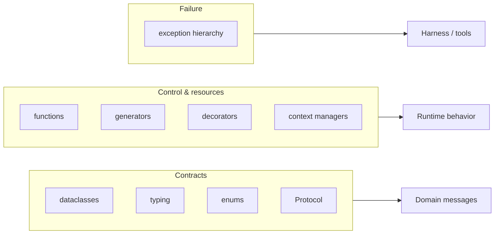
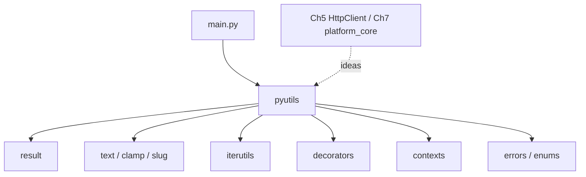

# Chapter 3: Python for AI Engineers

## Chapter Overview

The AI engineering stack from Chapter 2 only becomes real when you can express it in clean, typed, modular Python. Framework demos hide this. Production platforms do not.

This chapter is not “Python from zero.” It is the **subset of modern Python that AI engineers use daily** to build platforms:

- functions and pure helpers
- classes vs dataclasses vs protocols
- typing for contracts across tool/LLM boundaries
- enums for stable vocabularies
- generators for streams and lazy pipelines
- decorators for cross-cutting policy (retries, timing)
- context managers for resources and spans
- errors that fail closed and carry context
- packages that stay importable as the monorepo grows

You will ship a **reusable utilities kit** under `code/chapter-003/`—the kind of foundation Chapter 5’s HTTP client and Chapter 7’s `platform_core` already assume.

**Continuity:** Chapter 1 bootstrapped the repo; Chapter 2 drew the map. Here you gain the language tools to implement boundaries without turning every file into a notebook cell.

---

## Learning Objectives

After completing this chapter, you can:

- Write typed functions and dataclasses that document intent at API boundaries
- Choose among function, class, dataclass, and `Protocol` appropriately
- Model finite sets (roles, statuses, tool kinds) with enums
- Use generators for streaming and batching without loading everything into memory
- Apply decorators and context managers for retries, timing, and resource safety
- Design exception hierarchies that tools and harnesses can handle programmatically
- Structure a small importable package with tests
- Build reusable utilities used by later chapters

---

## Prerequisites

- Chapters 1–2 (platform layout + stack vocabulary)
- Basic Python: variables, control flow, lists/dicts, running scripts
- Ability to run `pytest` in a virtual environment

---

## Motivation

A teammate pastes this into production tooling:

```python
def call(model, prompt, tools=None):
    data = {"m": model, "p": prompt}
    if tools: data["t"] = tools
    r = post(data)
    return r["out"]
```

Six weeks later:

- nobody knows valid `model` values
- `tools` is sometimes a list, sometimes a dict, sometimes a string
- failures return `None` or raise bare `Exception`
- streaming is impossible without a rewrite
- tests require the network

The model is fine. The **Python surface** is not.

AI systems need contracts:

| Boundary | Python tool |
|---|---|
| Request/response shapes | dataclasses + typing |
| Status / role vocabularies | `Enum` |
| Swappable providers | `Protocol` |
| Token streams | generators / iterators |
| Retries, metrics | decorators / context managers |
| Failure modes | typed exceptions |

---

## First Principles

### 1. Types are documentation that machines can check

You do not need full mypy perfection on day one. You need signatures that stop “stringly typed” chaos at tool and LLM edges.

### 2. Prefer data + functions until behavior needs identity

Not everything should be a class. Dataclasses excel as messages. Classes excel when they hold collaborators or lifecycle.

### 3. Explicit errors beat boolean soup

`Result`/`Ok`/`Err` or typed exceptions—pick a style and be consistent. Never return `None` for five different failure reasons.

### 4. Laziness is a resource strategy

Generators let you stream tokens, pages, and log lines without multi-GB lists.

### 5. Cross-cutting policy should not clutter domain logic

Decorators and context managers exist so `complete()` does not also implement timing, logging, and lock acquisition inline forever.

### 6. Packages are product boundaries

`import platform_utils` should be boring and reliable. Circular imports and import-time network calls are design bugs.

---

## Mental Model

Map Python constructs to platform layers:

| Python construct | Platform use |
|---|---|
| `dataclass` | Tool args, LLM messages, run records |
| `Protocol` | `LLMPort`, `ToolPort` (Chapter 7) |
| `Enum` | Agent status, tool kind, severity |
| generator | Streamed tokens, chunked retrieval |
| decorator | retry, trace, cache |
| context manager | HTTP client session, file, span |
| package | `platform_core`, chapter kits |



---

## Core Theory

### Functions

Write **small, total functions** where possible:

```python
def clamp_temperature(value: float, *, lo: float = 0.0, hi: float = 2.0) -> float:
    if lo > hi:
        raise ValueError("lo must be <= hi")
    return max(lo, min(hi, value))
```

Guidelines:

- Prefer keyword-only args for options (`*, timeout_s: float`)
- Avoid mutable default arguments (`def f(x=[])` is a bug)
- Pure functions are easy to test; isolate I/O at edges

### Classes vs dataclasses

| Use a class when… | Use a dataclass when… |
|---|---|
| You manage lifecycle / collaborators | You primarily store data |
| Invariants need methods over time | You need hashable/frozen messages |
| Polymorphism with real behavior | You want less boilerplate |

```python
from dataclasses import dataclass

@dataclass(frozen=True)
class ToolCall:
    name: str
    arguments: dict[str, object]
```

`frozen=True` prevents accidental mutation of messages that will be logged or retried.

### Typing essentials for AI code

| Feature | Example |
|---|---|
| Built-ins | `list[str]`, `dict[str, float]` |
| Optional | `str \| None` |
| Unions | `str \| int` |
| TypeAlias | `JsonValue = ...` |
| Protocol | structural typing for ports |
| TypeVar | generic repositories |

```python
from typing import Protocol

class Embedder(Protocol):
    def embed(self, texts: list[str]) -> list[list[float]]: ...
```

You can pass any object with a compatible `embed` method—no inheritance required.

### Enums

Enums beat ad-hoc string literals for statuses and kinds:

```python
from enum import Enum

class RunStatus(str, Enum):
    PENDING = "pending"
    RUNNING = "running"
    SUCCEEDED = "succeeded"
    FAILED = "failed"
    CANCELLED = "cancelled"
```

Inheriting from `str` keeps JSON serialization simple.

### Generators

```python
def batched(items: list[str], size: int):
    batch: list[str] = []
    for item in items:
        batch.append(item)
        if len(batch) >= size:
            yield batch
            batch = []
    if batch:
        yield batch
```

Streaming pseudo-pattern:

```python
def iter_token_deltas(events):
    for event in events:
        if event.get("type") == "delta":
            yield event["text"]
```

### Decorators

Decorators wrap callables. Classic AI uses: timing, retry, auth injection.

```python
import functools
import time

def timed(fn):
    @functools.wraps(fn)
    def wrapper(*args, **kwargs):
        start = time.perf_counter()
        try:
            return fn(*args, **kwargs)
        finally:
            elapsed = time.perf_counter() - start
            wrapper.last_elapsed_s = elapsed  # type: ignore[attr-defined]
    return wrapper
```

Preserve metadata with `functools.wraps`.

### Context managers

```python
from contextlib import contextmanager

@contextmanager
def log_span(name: str):
    print(f"start {name}")
    try:
        yield
    finally:
        print(f"end {name}")
```

Use for files, locks, HTTP sessions, tracing spans, temporary env changes.

### Errors

Design a small hierarchy:

```python
class PlatformError(Exception):
    """Base for recoverable platform failures."""

class ValidationError(PlatformError):
    pass

class TransientError(PlatformError):
    """Safe to retry under policy."""
```

Catch specific types in harnesses; log and wrap at boundaries; never bare `except:`.

### Packages

```text
code/chapter-003/
  pyutils/
    __init__.py
    types.py
    result.py
    text.py
    iterutils.py
    decorators.py
    contexts.py
    errors.py
  tests/
  main.py
```

Rules:

- relative imports inside the package only when needed
- no network at import time
- public API re-exported carefully from `__init__.py`

---

## Architecture

### Chapter 3 utilities kit



These utilities are **teaching-grade but production-minded**. Later you may promote them into `platform_core` (Chapter 7 path).

---

## Internal Implementation

### Result type

```python
# pyutils/result.py
from __future__ import annotations

from dataclasses import dataclass
from typing import Callable, Generic, TypeVar

T = TypeVar("T")
E = TypeVar("E")
U = TypeVar("U")


@dataclass(frozen=True)
class Ok(Generic[T]):
    value: T

    def map(self, fn: Callable[[T], U]) -> "Ok[U] | Err[E]":
        return Ok(fn(self.value))

    def unwrap(self) -> T:
        return self.value


@dataclass(frozen=True)
class Err(Generic[E]):
    error: E

    def map(self, fn: Callable[[T], U]) -> "Err[E]":
        return self

    def unwrap(self) -> T:
        raise RuntimeError(f"unwrap called on Err: {self.error}")


Result = Ok[T] | Err[E]
```

### Text and validation helpers

```python
# pyutils/text.py
from __future__ import annotations

import re

from pyutils.errors import ValidationError

_SLUG_RE = re.compile(r"[^a-z0-9]+")


def clamp(value: float, *, lo: float, hi: float) -> float:
    if lo > hi:
        raise ValidationError("lo must be <= hi")
    return max(lo, min(hi, value))


def slugify(text: str, *, max_len: int = 48) -> str:
    s = text.strip().lower()
    s = _SLUG_RE.sub("-", s).strip("-")
    if not s:
        raise ValidationError("cannot slugify empty text")
    return s[:max_len].rstrip("-")


def truncate(text: str, max_chars: int, *, suffix: str = "…") -> str:
    if max_chars < 0:
        raise ValidationError("max_chars must be >= 0")
    if len(text) <= max_chars:
        return text
    if max_chars == 0:
        return ""
    keep = max(0, max_chars - len(suffix))
    return text[:keep] + (suffix if keep < len(text) else "")
```

### Enums and errors

```python
# pyutils/errors.py
from __future__ import annotations

from enum import Enum


class Severity(str, Enum):
    DEBUG = "debug"
    INFO = "info"
    WARNING = "warning"
    ERROR = "error"
    CRITICAL = "critical"


class PlatformError(Exception):
    def __init__(self, message: str, *, severity: Severity = Severity.ERROR) -> None:
        super().__init__(message)
        self.severity = severity


class ValidationError(PlatformError):
    def __init__(self, message: str) -> None:
        super().__init__(message, severity=Severity.WARNING)


class TransientError(PlatformError):
    def __init__(self, message: str) -> None:
        super().__init__(message, severity=Severity.ERROR)
```

### Itertools-style helpers

```python
# pyutils/iterutils.py
from __future__ import annotations

from typing import Iterable, Iterator, TypeVar

T = TypeVar("T")


def batched(items: Iterable[T], size: int) -> Iterator[list[T]]:
    if size <= 0:
        raise ValueError("size must be positive")
    batch: list[T] = []
    for item in items:
        batch.append(item)
        if len(batch) >= size:
            yield batch
            batch = []
    if batch:
        yield batch


def first_n(items: Iterable[T], n: int) -> list[T]:
    if n < 0:
        raise ValueError("n must be >= 0")
    out: list[T] = []
    for i, item in enumerate(items):
        if i >= n:
            break
        out.append(item)
    return out
```

### Decorators

```python
# pyutils/decorators.py
from __future__ import annotations

import functools
import time
from collections.abc import Callable
from typing import TypeVar

from pyutils.errors import TransientError

F = TypeVar("F", bound=Callable[..., object])


def timed(fn: F) -> F:
    @functools.wraps(fn)
    def wrapper(*args, **kwargs):
        start = time.perf_counter()
        try:
            return fn(*args, **kwargs)
        finally:
            wrapper.last_elapsed_s = time.perf_counter() - start  # type: ignore[attr-defined]

    wrapper.last_elapsed_s = 0.0  # type: ignore[attr-defined]
    return wrapper  # type: ignore[return-value]


def retry(
    *,
    attempts: int = 3,
    exceptions: tuple[type[BaseException], ...] = (TransientError,),
    delay_s: float = 0.0,
) -> Callable[[F], F]:
    if attempts < 1:
        raise ValueError("attempts must be >= 1")

    def decorator(fn: F) -> F:
        @functools.wraps(fn)
        def wrapper(*args, **kwargs):
            last: BaseException | None = None
            for i in range(1, attempts + 1):
                try:
                    return fn(*args, **kwargs)
                except exceptions as exc:
                    last = exc
                    if i >= attempts:
                        break
                    if delay_s:
                        time.sleep(delay_s)
            assert last is not None
            raise last

        return wrapper  # type: ignore[return-value]

    return decorator
```

### Context managers

```python
# pyutils/contexts.py
from __future__ import annotations

import time
from contextlib import contextmanager
from dataclasses import dataclass
from typing import Iterator


@dataclass
class Span:
    name: str
    elapsed_s: float = 0.0


@contextmanager
def timer_span(name: str) -> Iterator[Span]:
    span = Span(name=name)
    start = time.perf_counter()
    try:
        yield span
    finally:
        span.elapsed_s = time.perf_counter() - start
```

### Message dataclass example

```python
# pyutils/types.py
from __future__ import annotations

from dataclasses import dataclass, field
from typing import Any


@dataclass(frozen=True)
class Message:
    role: str
    content: str
    metadata: dict[str, Any] = field(default_factory=dict)

    def __post_init__(self) -> None:
        if self.role not in {"system", "user", "assistant", "tool"}:
            raise ValueError(f"invalid role: {self.role}")
        if not isinstance(self.content, str):
            raise ValueError("content must be str")
```

### CLI

```bash
cd code/chapter-003
python main.py demo
python main.py slug "Agent Tool Registry!"
python main.py batch 2 a b c d e
pytest -q
```

---

## Production Implementation

### Standards that survive contact with agents

| Standard | Practice |
|---|---|
| Typing | Public functions annotated |
| Dataclasses | Frozen for messages crossing boundaries |
| Validation | At the edge (CLI, HTTP, tool args) |
| Errors | Hierarchy + context |
| Logging | Outside pure helpers; inject logger in services |
| Tests | Pure utils 100% offline |
| Packaging | Importable without side effects |

### Where this code goes next

| Utility | Later consumer |
|---|---|
| `Message` | LLM chat adapters |
| `batched` | embedding pipelines |
| `retry` / `timed` | HTTP tools (Ch 5/6) |
| `Result` | tool outcomes without exceptions |
| `timer_span` | observability hooks |
| `slugify` | run names, branch-ish labels |

Chapter 7 promotes the *ideas* into ports/services; this chapter trains the *language*.

---

## Framework Implementation

No AI framework in this chapter.

When frameworks force untyped `dict[str, Any]` everywhere, wrap their I/O with **your** dataclasses at the boundary. Do not let vendor JSON shapes colonize your domain.

---

## Trade-offs

| Choice | Pros | Cons |
|---|---|---|
| Exceptions | Pythonic; stack traces | Easy to ignore specificity |
| `Result` types | Explicit success/failure | Verbosity; dual styles |
| Protocols | Flexible adapters | Weaker runtime checks unless validated |
| ABC inheritance | Explicit hierarchy | Heavier |
| Decorators | Clean call sites | Stacking can obscure flow |
| Inline try/except | Local clarity | Duplication |

**Book default:** exceptions for truly exceptional paths; dataclasses + protocols for contracts; decorators for thin cross-cutting policy.

---

## Debugging

| Symptom | Likely cause | Fix |
|---|---|---|
| `TypeError` deep inside | Untyped boundary | Validate/dataclass at edge |
| Mutable default bug | `def f(x=[])` | Use `None` + create inside |
| Generator already consumed | Reused iterator | Re-create or materialize once |
| Decorator loses name | Missing `wraps` | Use `functools.wraps` |
| Circular import | Package tangle | Dependency rule; lazy import |
| Tests hit network | I/O in utils | Keep utils pure |

---

## Performance

| Pattern | Note |
|---|---|
| Generators | Stream large corpora / tokens |
| `batched` | Control embedding/API payload sizes |
| Frozen dataclasses | Safer sharing; minor alloc cost |
| Decorators | Keep thin; avoid huge work in wrappers |

Measure before micro-optimizing pure Python—network and model latency dominate later chapters.

---

## Security

| Risk | Python practice |
|---|---|
| Injection via strings | Prefer structured types over string concat for SQL/shell |
| Secret in exceptions | Do not put tokens in error messages |
| Unsafe `eval` on model output | Never |
| Path traversal from slugs | `slugify` + allowlist directories |
| Log oversharing | Truncate content; redaction later |

Model output is **untrusted input**. Types help, but validation is mandatory.

---

## Best Practices

1. Annotate public APIs  
2. Prefer `frozen` dataclasses for messages  
3. Use enums for closed vocabularies  
4. Keep utilities pure and tested  
5. Isolate I/O in adapters/services  
6. Use `wraps` on decorators  
7. Context-manage resources  
8. Raise specific errors  
9. Avoid mutable defaults  
10. Design packages for boring imports  

---

## Anti-Patterns

| Anti-pattern | Why it fails |
|---|---|
| Everything is `dict` | No invariants; silent key bugs |
| God class `Utils` | Unowned chaos |
| Bare `except:` | Swallows bugs |
| Import-time I/O | Surprise failures; hard tests |
| String statuses | Typos become production incidents |
| Unbounded in-memory lists | OOM on corpora/streams |
| Nested decorator stacks without tests | Opaque runtime |

---

## Hands-on Exercise

**Time box:** 60–90 minutes.

1. Implement `code/chapter-003/pyutils/` as described.  
2. Pass all unit tests offline.  
3. Extend `Message` to reject empty `content` with `ValidationError`.  
4. Write a generator that yields sliding windows of size `k` over a list of tokens.  
5. Apply `@timed` to a function and assert `last_elapsed_s >= 0`.  
6. Journal: which construct—dataclass, Protocol, or Enum—will matter most when you implement tools? Why?

---

## Mini Project

**Build reusable platform utilities.**

Deliverables:

1. `pyutils` package with result, text, iter, decorator, context, error, message types  
2. CLI demos: slugify, batch, timed retry demo  
3. Tests covering success and failure paths  
4. `README.md` describing what later chapters should import vs reimplement  
5. Optional stretch: a `Protocol` for `Tokenizer` with a naive whitespace implementation  

Acceptance:

- `pytest -q` green  
- No network dependencies  
- Public functions type-annotated  

---

## Chapter Deliverables

| Artifact | Location |
|---|---|
| Manuscript | `book/chapter-003.md` |
| Utilities package | `code/chapter-003/pyutils/` |
| Tests | `code/chapter-003/tests/` |
| Diagrams | `diagrams/mermaid/chapter-003/` |

---

## Interview Questions

1. When do you prefer a dataclass over a class?  
2. What problem do Protocols solve for LLM providers?  
3. Why are mutable default arguments dangerous?  
4. How do generators help with streaming model output?  
5. Decorator vs context manager—when each?  
6. Design an exception hierarchy for tools.  
7. Why inherit `str, Enum` for API statuses?  
8. What is a pure function and why test it first?  
9. How would you type a JSON-like structure conservatively?  
10. Show a safe pattern for optional list parameters.

**Concise model answers**

1. Data/messages → dataclass; lifecycle/collaborators → class.  
2. Structural typing for swappable adapters without inheritance.  
3. Shared mutable state across calls.  
4. Yield tokens/events without buffering entire completion.  
5. Decorator wraps callable policy; CM scopes resources/spans.  
6. Base PlatformError → Validation/Transient/Permission.  
7. JSON-friendly values + type safety.  
8. No side effects; deterministic unit tests.  
9. `dict[str, Any]` at edges only; narrow ASAP.  
10. `items: list[str] \| None = None` then `items = list(items or [])`.

---

## Quiz

**Multiple choice**

1. Best structure for an immutable tool-call message:  
   - A) Global dict  
   - B) Frozen dataclass  
   - C) Untyped list  
   - D) CSV string  
   **Answer:** B

2. `Protocol` is most useful for:  
   - A) GPU kernels  
   - B) Defining adapter contracts  
   - C) CSS  
   - D) Git commits  
   **Answer:** B

3. Generators are preferable when:  
   - A) You need all data sorted multiple times in memory always  
   - B) You want lazy incremental processing  
   - C) You hate iterators  
   - D) You need random access only  
   **Answer:** B

**True/False**

4. Mutable default arguments are a common footgun. **True**  
5. Bare `except:` is recommended for production agents. **False**  
6. Enums help eliminate ad-hoc string statuses. **True**

**Short answer**

7. Name three typing features useful in AI codebases.  
8. What does `functools.wraps` preserve?  
9. Give one use of a context manager in an agent runtime.  
10. Why keep utilities free of network I/O?

**Sample answers**

7. Optional/`\|`, Protocol, generics/TypeVar (also TypedDict, Annotated).  
8. Function name, docstring, metadata.  
9. Trace span; file lock; DB session; HTTP client.  
10. Testability and import safety.

---

## Cheat Sheet

```bash
cd code/chapter-003
pytest -q
python main.py demo
python main.py slug "My Agent Skill"
python main.py batch 3 t1 t2 t3 t4
```

| Need | Tool |
|---|---|
| Message/DTO | `@dataclass(frozen=True)` |
| Adapter contract | `Protocol` |
| Closed set | `str, Enum` |
| Stream | generator |
| Wrap policy | decorator + `wraps` |
| Resource scope | context manager |
| Failure | typed exceptions / `Result` |
| Package | `pyutils/` importable, pure |

---

## Curated Free Resources

- [Python typing docs](https://docs.python.org/3/library/typing.html)  
- [dataclasses](https://docs.python.org/3/library/dataclasses.html)  
- [enum](https://docs.python.org/3/library/enum.html)  
- [contextlib](https://docs.python.org/3/library/contextlib.html)  
- [PEP 8](https://peps.python.org/pep-0008/)  
- [pytest](https://docs.pytest.org/)  

---

## Chapter Summary

- AI platforms are software: Python fluency is non-negotiable.  
- Dataclasses, typing, enums, and protocols express contracts.  
- Generators, decorators, and context managers structure runtime behavior.  
- Typed errors and pure utilities make later HTTP/agent layers testable.  
- Chapter 3 delivers `pyutils` as a reusable foundation.

**What changed in the project**

- `code/chapter-003/pyutils/` utility package  
- Offline tests and CLI demos  
- Language patterns used by Chapters 5 and 7  

---

## What's Next

**Chapter 4 — Git & GitHub** (if you are reading in curriculum order) applies engineering discipline to collaboration: branches, conventional commits, PRs, and CI—so the utilities and platform code you write remain reviewable as the monorepo grows.

If you already completed Chapter 4, continue with **Chapter 5 — HTTP, APIs & JSON**, where these types and error patterns meet the network.
