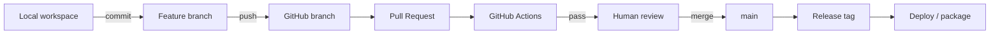
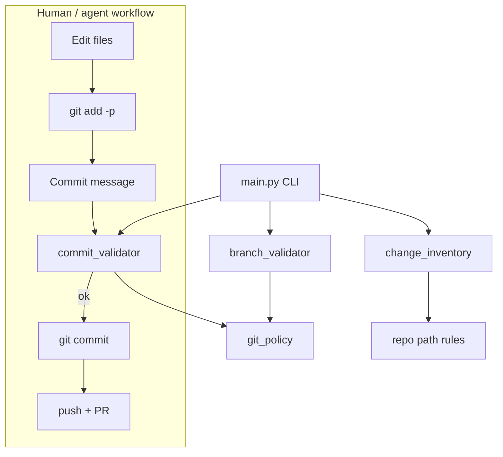

# Chapter 4: Git & GitHub

## Chapter Overview

An AI platform without professional version control is a demo that cannot survive contact with a team, an incident, or time.

Models change. Prompts change. Tool schemas change. Evaluation baselines change. If those changes are not **reviewable, revertible, and attributable**, you cannot operate the system—only hope.

This chapter establishes the Git and GitHub practices used for the rest of the bootcamp:

- repository hygiene for an evolving monorepo (`book/`, `code/`, `diagrams/`)
- branching and pull-request workflow
- conventional (semantic) commits
- code review habits for AI-assisted changes
- CI as a quality gate (GitHub Actions concepts)
- portfolio-ready history

You will extend the platform with a small **engineering workflow toolkit**: commit-message validation, branch-name checks, and a change inventory that lists which chapters/modules a branch touches. These are the same instincts you will later encode in agent harnesses (budgets, policies, audits)—applied first to human collaboration.

**Continuity:** Chapters 1–2 defined the discipline and stack. Chapter 3 (Python fluency) strengthens implementation skill. Here you make the repository a **production artifact**, not a dump folder.

---

## Learning Objectives

After completing this chapter, you can:

- Explain why AI projects need stricter Git discipline than throwaway notebooks
- Use a trunk-based / short-lived branch workflow suitable for this monorepo
- Write conventional commits that make history searchable
- Open pull requests with reviewable diffs and clear risk notes
- Avoid committing secrets, large binary blobs, and generated junk
- Describe what CI should gate before merge (tests, lint, structure checks)
- Run the Chapter 4 toolkit to validate commits and summarize branch impact
- Shape GitHub history that supports a professional portfolio

---

## Prerequisites

- Chapters 1–2 concepts (platform layout, stack thinking)
- Chapter 3 recommended (Python modules/tests); you can still follow along
- Git installed locally (`git --version`)
- A GitHub account (optional for pure local exercises; required for PR/Actions practice)

---

## Motivation

Two engineers “finish” an agent feature on Friday.

**Team A**

- Works on `main`
- Commit messages: `fix`, `wip`, `asdf`
- API keys in `.env` committed “temporarily”
- Prompt edits mixed with unrelated formatting
- Monday: nobody can bisect the cost regression

**Team B**

- Branch `feat/tool-timeouts`
- Commits: `feat(tools): add timeout + retry policy`
- PR checklist: tests, eval note, risk, rollback
- CI runs unit tests + secret scan
- Monday: revert is one click; incident timeline is readable

Same model. Different operations maturity.

AI systems increase the cost of messy history because:

1. **Nondeterminism** already makes debugging hard—history must not add chaos.
2. **Prompts and configs are code.** Unreviewed prompt edits are unreviewed production logic.
3. **Generated artifacts** (datasets, model dumps, huge logs) destroy repository health.
4. **Agents will eventually open PRs.** If humans lack workflow discipline, automated changes become hostile.

---

## First Principles

### 1. The repository is the system of record

If it is not in version control (or a linked artifact store), it is not part of the system.

### 2. History is a product

Future you—and reviewers, auditors, and incident commanders—consume commit history under stress. Optimize for that reader.

### 3. Small, reversible changes beat heroic merges

Especially when LLM outputs and eval scores move.

### 4. `main` should be releasable

Broken trunk trains the team (and later CI agents) that green is optional.

### 5. Secrets never belong in Git

Not in history, not in “private” repos, not in notebooks, not in “just this once.”

### 6. Review the risk, not only the syntax

For AI work, review: tool permissions, prompt injection surface, cost impact, eval coverage—not only PEP8.

---

## Mental Model

Think of Git as the **time machine and collaboration bus** of the platform:

| Concept | Analogy |
|---|---|
| Commit | Immutable checkpoint of intent |
| Branch | Parallel experiment / change proposal |
| Pull request | Change control board (lightweight) |
| CI | Automated reviewer for mechanical gates |
| Tag/release | Named snapshot for ops |
| `main` | Current trusted product line |



For this bootcamp monorepo, treat paths as product surfaces:

| Path | Meaning |
|---|---|
| `book/` | Curriculum manuscript |
| `code/chapter-XXX/` | Executable lessons / platform slices |
| `diagrams/` | Architecture truth aids |
| `scripts/` | Authoring automation |
| Root `BOOK_*.md` | Source of truth (highest review bar) |

---

## Core Theory

### Version control essentials (sharp, not encyclopedic)

**Working tree** — files you edit  
**Staging area** — exact snapshot pieces for the next commit  
**Commit** — content-addressed snapshot + metadata  
**Branch** — movable pointer to a commit  
**Remote** — shared hosting (GitHub)

Daily loop:

```bash
git status
git diff
git add -p          # stage hunks deliberately
git commit
git push -u origin HEAD
```

Prefer `git add -p` over `git add .` when prompts, secrets, and generated files may hide nearby.

### Branching strategy for this book/platform

Use **short-lived branches** off `main`:

```
main
 └─ feat/chapter-004-git-toolkit
 └─ fix/retrieval-empty-query
 └─ chore/ci-secret-scan
 └─ docs/chapter-002-typo
```

Rules:

1. Branch from updated `main`
2. One intent per branch
3. Rebase or merge-main frequently (avoid multi-week drift)
4. Delete branch after merge
5. Never force-push `main`

**Avoid** long-lived `develop` complexity until you have multi-team release trains. For an evolving teaching platform, short PRs win.

### Semantic (conventional) commits

Format:

```
<type>(<optional scope>): <short summary>

[optional body]

[optional footer]
```

Common types:

| Type | Use |
|---|---|
| `feat` | User-facing capability |
| `fix` | Bug fix |
| `docs` | Manuscript / README only |
| `test` | Tests only |
| `refactor` | Behavior-preserving restructure |
| `chore` | Tooling, deps, CI glue |
| `perf` | Performance improvement |
| `build` | Packaging / build system |

Examples for this repo:

```text
feat(chapter-004): add conventional commit validator
docs(chapter-002): clarify harness vs agent boundary
fix(tools): honor timeout on HTTP tool client
test(chapter-001): cover missing API key summary
chore(ci): run pytest on code/** changes
```

Why this matters for AI platforms:

- You can generate changelogs later
- You can audit when prompts/tools changed relative to eval score drops
- Agents can be constrained to emit conventional commits

### Pull requests that reviewers can trust

A strong PR description for AI/platform work:

1. **Summary** — what/why (5–10 lines)
2. **Layer touch list** — tool / skill / harness / docs (Chapter 2 vocabulary)
3. **Risk** — security, cost, data, backwards compatibility
4. **Test plan** — commands run + results
5. **Eval impact** — none / new cases / score delta
6. **Rollback** — how to revert safely

Keep diffs small. A 2,000-line “agent refactor + prompt rewrite + CI + formatting” PR is an incident generator.

### GitHub Actions (CI concepts)

CI is a harness for human (and later agent) changes. Minimum gates for this monorepo:

| Gate | Purpose |
|---|---|
| Unit tests for touched `code/chapter-*` | Behavior |
| Ruff/format (optional early) | Consistency |
| Secret scanning | Safety |
| Chapter structure check (scripts) | Manuscript quality |
| No `.env` / key patterns | Safety |

Example workflow shape (conceptual):

```yaml
# .github/workflows/ci.yml
name: ci
on:
  pull_request:
  push:
    branches: [main]
jobs:
  test:
    runs-on: ubuntu-latest
    steps:
      - uses: actions/checkout@v4
      - uses: actions/setup-python@v5
        with:
          python-version: "3.12"
      - run: pip install pytest
      - run: |
          for d in code/chapter-*; do
            if [ -d "$d/tests" ]; then
              (cd "$d" && pytest -q)
            fi
          done
```

You will deepen CI in Part VII; install the **habit** now.

### What never goes in Git

- API keys, tokens, private URLs with embedded creds
- Production customer transcripts with PII (use redacted fixtures)
- Multi‑GB datasets/models (use LFS or object storage + pointers)
- Local venvs (`.venv/`), `__pycache__/`, `.pytest_cache/`
- One-off debug dumps (`trace.json`, `out/`)

Use `.gitignore` aggressively; verify with `git status` before every commit.

### AI-assisted development and Git

When using coding agents or chat tools:

| Practice | Reason |
|---|---|
| Separate agent branch | Isolate blast radius |
| Review every diff | Models invent APIs and “helpfully” delete tests |
| Do not auto-commit secrets from local env | Agents may read `.env` |
| Prefer small PR stacks | Easier human oversight |
| Record prompts/decisions in PR when architectural | Auditability |

An agent that can `git commit` without policy is a tool with write side effects—treat it like production access.

### Portfolio discipline

Hiring managers read GitHub differently than recruiters:

- Consistent commits over months > one giant dump
- Real tests and READMEs > certificate screenshots
- Issues/PR discussions show engineering judgment
- Clean monorepo story (“evolving AI platform”) beats 40 toy repos

This bootcamp’s single evolving project is portfolio-native if your history stays intentional.

---

## Architecture

### Chapter 4 toolkit in the platform

```
code/chapter-004/
  git_policy.py          # rules: commit types, branch patterns
  commit_validator.py    # validate conventional commits
  branch_validator.py    # validate branch names
  change_inventory.py    # map changed paths → chapters/areas
  main.py                # CLI
  tests/
```



These modules are deliberately dependency-light: pure Python + stdlib, so they can later move into a shared `platform/devtools` package.

---

## Internal Implementation

### Policy configuration

```python
# code/chapter-004/git_policy.py
from __future__ import annotations

import re
from dataclasses import dataclass

CONVENTIONAL_TYPES = (
    "feat",
    "fix",
    "docs",
    "style",
    "refactor",
    "perf",
    "test",
    "build",
    "ci",
    "chore",
    "revert",
)

# type(scope)?: subject
COMMIT_RE = re.compile(
    r"^(?P<type>"
    + "|".join(CONVENTIONAL_TYPES)
    + r")"
    r"(?:\((?P<scope>[a-z0-9/_.,-]+)\))?"
    r"(?P<breaking>!)?"
    r": "
    r"(?P<subject>.+)$"
)

BRANCH_RE = re.compile(
    r"^(main|master|develop)$|"
    r"^(feat|fix|docs|chore|test|refactor|ci|perf|release)\/[a-z0-9._/-]+$"
)

AREA_PREFIXES: dict[str, tuple[str, ...]] = {
    "book": ("book/",),
    "code": ("code/",),
    "diagrams": ("diagrams/",),
    "scripts": ("scripts/",),
    "source_of_truth": (
        "BOOK_MANIFEST.md",
        "BOOK_SPECIFICATION.md",
        "BOOK_BIBLE.md",
        "AI_ENGINEERING_PLAYBOOK.md",
    ),
}


@dataclass(frozen=True)
class ValidationResult:
    ok: bool
    errors: tuple[str, ...] = ()
    warnings: tuple[str, ...] = ()
```

### Commit validator

```python
# code/chapter-004/commit_validator.py
from __future__ import annotations

from git_policy import COMMIT_RE, CONVENTIONAL_TYPES, ValidationResult


def validate_commit_message(message: str) -> ValidationResult:
    lines = [ln.rstrip() for ln in message.strip().splitlines()]
    if not lines or not lines[0].strip():
        return ValidationResult(False, errors=("empty commit message",))

    header = lines[0].strip()
    errors: list[str] = []
    warnings: list[str] = []

    if len(header) > 72:
        warnings.append(f"header is {len(header)} chars; prefer ≤72")

    match = COMMIT_RE.match(header)
    if not match:
        errors.append(
            "header must match: type(scope)?: subject — "
            f"allowed types: {', '.join(CONVENTIONAL_TYPES)}"
        )
        return ValidationResult(False, errors=tuple(errors), warnings=tuple(warnings))

    subject = match.group("subject").strip()
    if not subject:
        errors.append("subject must not be empty")
    if subject.endswith("."):
        warnings.append("prefer subject without trailing period")
    if subject[0].isupper():
        warnings.append("prefer lower-case subject start (conventional style)")
    if subject.lower().startswith("wip") or subject.lower() in {"fix", "updates", "changes"}:
        errors.append("subject is too vague for production history")

    if len(lines) > 1 and lines[1].strip() != "":
        errors.append("blank line required between header and body")

    return ValidationResult(not errors, errors=tuple(errors), warnings=tuple(warnings))
```

### Branch validator

```python
# code/chapter-004/branch_validator.py
from __future__ import annotations

from git_policy import BRANCH_RE, ValidationResult


def validate_branch_name(name: str) -> ValidationResult:
    name = name.strip()
    if not name:
        return ValidationResult(False, errors=("empty branch name",))
    if name.startswith("origin/"):
        name = name[len("origin/") :]
    if not BRANCH_RE.match(name):
        return ValidationResult(
            False,
            errors=(
                "branch must be main/develop or "
                "{feat|fix|docs|chore|test|refactor|ci|perf|release}/slug",
            ),
        )
    if len(name) > 80:
        return ValidationResult(False, errors=("branch name too long (>80)",))
    return ValidationResult(True)
```

### Change inventory

```python
# code/chapter-004/change_inventory.py
from __future__ import annotations

import re
from collections import defaultdict
from dataclasses import dataclass

from git_policy import AREA_PREFIXES

CHAPTER_RE = re.compile(r"chapter-(\d{3})")


@dataclass(frozen=True)
class ChangeInventory:
    areas: dict[str, list[str]]
    chapters: dict[str, list[str]]
    other: list[str]

    def summary_lines(self) -> list[str]:
        lines: list[str] = []
        for area in sorted(self.areas):
            lines.append(f"area:{area} ({len(self.areas[area])} files)")
        for ch in sorted(self.chapters):
            lines.append(f"chapter:{ch} ({len(self.chapters[ch])} files)")
        if self.other:
            lines.append(f"other: {len(self.other)} files")
        return lines


def inventory_paths(paths: list[str]) -> ChangeInventory:
    areas: dict[str, list[str]] = defaultdict(list)
    chapters: dict[str, list[str]] = defaultdict(list)
    other: list[str] = []

    for raw in paths:
        path = raw.strip().replace("\\", "/")
        if not path:
            continue
        matched_area = False
        for area, prefixes in AREA_PREFIXES.items():
            if any(path == p or path.startswith(p) for p in prefixes):
                areas[area].append(path)
                matched_area = True
                break
        ch = CHAPTER_RE.search(path)
        if ch:
            chapters[ch.group(1)].append(path)
        if not matched_area:
            other.append(path)

    return ChangeInventory(
        areas={k: v for k, v in areas.items()},
        chapters={k: v for k, v in chapters.items()},
        other=other,
    )
```

### CLI

```python
# code/chapter-004/main.py
from __future__ import annotations

import argparse
import subprocess
import sys

from branch_validator import validate_branch_name
from change_inventory import inventory_paths
from commit_validator import validate_commit_message


def _git_lines(args: list[str]) -> list[str]:
    try:
        out = subprocess.check_output(["git", *args], text=True, stderr=subprocess.DEVNULL)
    except (subprocess.CalledProcessError, FileNotFoundError):
        return []
    return [ln for ln in out.splitlines() if ln.strip()]


def cmd_check_commit(message: str) -> int:
    result = validate_commit_message(message)
    for w in result.warnings:
        print(f"WARNING: {w}")
    if not result.ok:
        for e in result.errors:
            print(f"ERROR: {e}")
        return 1
    print("OK: commit message")
    return 0


def cmd_check_branch(name: str | None) -> int:
    if not name:
        lines = _git_lines(["rev-parse", "--abbrev-ref", "HEAD"])
        name = lines[0] if lines else ""
    result = validate_branch_name(name)
    if not result.ok:
        for e in result.errors:
            print(f"ERROR: {e}")
        return 1
    print(f"OK: branch '{name}'")
    return 0


def cmd_inventory(base: str) -> int:
    paths = _git_lines(["diff", "--name-only", f"{base}...HEAD"])
    if not paths:
        # fallback: working tree changes
        paths = _git_lines(["diff", "--name-only"]) + _git_lines(["diff", "--name-only", "--cached"])
        paths = sorted(set(paths))
    inv = inventory_paths(paths)
    if not paths:
        print("No changed files detected.")
        return 0
    print(f"Changed files: {len(paths)}")
    for line in inv.summary_lines():
        print(f"  • {line}")
    if "source_of_truth" in inv.areas:
        print("NOTE: source-of-truth docs changed — elevate review standards.")
    return 0


def main(argv: list[str] | None = None) -> int:
    parser = argparse.ArgumentParser(description="Chapter 4 — Git workflow toolkit")
    sub = parser.add_subparsers(dest="cmd", required=True)

    p_cc = sub.add_parser("check-commit", help="Validate a conventional commit message")
    p_cc.add_argument("message")

    p_br = sub.add_parser("check-branch", help="Validate branch name (default: current)")
    p_br.add_argument("name", nargs="?", default=None)

    p_inv = sub.add_parser("inventory", help="Summarize changed paths vs base")
    p_inv.add_argument("--base", default="main", help="Diff base ref (default: main)")

    args = parser.parse_args(argv)
    if args.cmd == "check-commit":
        return cmd_check_commit(args.message)
    if args.cmd == "check-branch":
        return cmd_check_branch(args.name)
    if args.cmd == "inventory":
        return cmd_inventory(args.base)
    return 2


if __name__ == "__main__":
    raise SystemExit(main())
```

Run:

```bash
cd code/chapter-004
python main.py check-commit "feat(chapter-004): add commit validator"
python main.py check-branch feat/git-toolkit
python main.py inventory --base main
pytest -q
```

---

## Production Implementation

### Repository standards checklist

| Standard | Practice |
|---|---|
| Default branch protection | Require PR + 1 review + CI green |
| Signed commits (optional) | Stronger attribution |
| CODEOWNERS | Route `BOOK_*.md` and `scripts/` to maintainers |
| Templates | PR template with risk/eval sections |
| Secrets | GitHub Actions secrets only; never in repo |
| Releases | Tags `v0.1.0` matching book release script milestones |

### Suggested PR template (drop in `.github/PULL_REQUEST_TEMPLATE.md`)

```markdown
## Summary
<!-- what & why -->

## Stack layers touched
<!-- tool / skill / workflow / agent / harness / docs / ci -->

## Risk
<!-- security, cost, data, compatibility -->

## Test plan
- [ ] `pytest` in affected chapter packages
- [ ] Manual checks:

## Eval impact
- [ ] None
- [ ] Added/updated cases

## Rollback
<!-- revert strategy -->
```

### Pre-commit mindset (even before installing hooks)

Before every commit:

1. `git status` / `git diff`
2. Confirm no secrets
3. Validate message with Chapter 4 CLI
4. Run tests for touched chapters
5. Keep the commit about one intent

Later you can wire `pre-commit` hooks; understanding beats tooling cargo-cult.

### Operating with monorepo chapters

When a branch touches `book/chapter-004.md` + `code/chapter-004/**`, treat it as one vertical slice. Avoid mixing Chapter 12 agent runtime with Chapter 4 docs in the same PR unless the change is truly cross-cutting (e.g., CI).

---

## Framework Implementation

Git/GitHub are the collaboration framework. Vendor “AI coding platforms” should **adapt** to your branch/PR/CI rules—not replace them.

When evaluating AI pair tools:

- Can they work on a branch?
- Can they show diffs before commit?
- Can commit messages be policy-validated?
- Can CI still be the merge gate?

If a tool only edits files on `main` silently, it fails the harness test from Chapter 2.

---

## Trade-offs

| Approach | Pros | Cons |
|---|---|---|
| Commit straight to `main` | Fast alone | Broken history; no review |
| Short-lived PRs | Review + CI | Slight ceremony |
| Heavy GitFlow (develop/release/hotfix always) | Formal releases | Overhead for small teams/books |
| Squash merge always | Clean main linear history | Loses fine-grained commit detail |
| Merge commits always | Preserves branch topology | Noisier `main` |
| Monorepo (this book) | One platform story | Requires path discipline |
| Many toy repos | Simple per demo | No architecture continuity |

**Default for this bootcamp:** short-lived branches, conventional commits, PR + CI, squash or rebase merge to keep `main` readable.

---

## Debugging

| Problem | Diagnosis | Fix |
|---|---|---|
| “Works on my machine” after merge | Uncommitted local files | `git status`; track needed files |
| Secret committed | `git log -p` / secret scan | Rotate secret immediately; purge history if needed |
| Cannot bisect regression | Vague commits / mixed intents | Smaller conventional commits |
| Merge hell | Long-lived branch | Rebase early; cut PR size |
| CI red, local green | Env drift | Match Python version; freeze deps |
| Accidental huge file | `git status` before push | Git LFS or external storage; rewrite if pushed |

**Incident rule:** if a key was committed, **rotate first**, clean history second. Assume compromise.

---

## Performance

Git performance issues in AI repos usually come from **large binaries** and **node_modules-style pollution**, not commit message length.

Practices:

- Keep datasets under `assets/` only when small; otherwise pointer + remote storage
- Ignore caches and venvs
- Do not commit model weights
- Prefer text prompts/configs over screenshots of prompts

CI performance:

- Run tests only for changed chapters when the monorepo grows (path filters)
- Cache pip dependencies in Actions

---

## Security

| Risk | Control |
|---|---|
| Secrets in repo | `.gitignore`, secret scanning, pre-commit checks |
| Malicious PR | Review + CI; never `pull` untrusted remote blindly into prod |
| Dependency confusion later | Pin versions; review lockfiles |
| Token leakage in Actions logs | Mask secrets; least-privilege tokens |
| Prompt/data exfil via forked PRs | Restrict secrets on fork workflows |
| Overbroad `GITHUB_TOKEN` | Default permissions: read; elevate per job |

Also: **do not paste production secrets into chat agents** to “fix CI.” Use temporary least-privilege tokens and revoke.

---

## Best Practices

1. Update `main` before branching  
2. One intent per branch and per commit  
3. Conventional commits with meaningful scopes (`chapter-004`, `tools`, `ci`)  
4. PR description includes risk + test plan  
5. Protect `main` with CI + review  
6. Never commit `.env`  
7. Delete merged branches  
8. Tag releases for milestones (`v0.1.0` first 10 chapters, etc.)  
9. Use CODEOWNERS for source-of-truth docs  
10. Treat agent-generated diffs like junior-engineer diffs: verify everything  

---

## Anti-Patterns

| Anti-pattern | Why it hurts |
|---|---|
| `git add .` reflex | Secrets & junk sneak in |
| `commit -m "fix"` | Unsearchable history |
| Direct pushes to `main` | No gates |
| 5,000-line PR | Unreviewable |
| Committing `.venv` | Repo bloat / non-portability |
| Storing prod transcripts | PII & legal risk |
| Force-pushing shared branches | Collaboration hazards |
| Disabling CI to “ship faster” | Breaks the harness |

---

## Hands-on Exercise

**Time box:** 60–90 minutes.

1. Implement the Chapter 4 package under `code/chapter-004/` (or copy from this chapter).  
2. Run unit tests: `pytest -q`.  
3. Validate good and bad messages:

```bash
python main.py check-commit "feat(chapter-004): add inventory cli"
python main.py check-commit "fix"           # should fail
python main.py check-branch feat/ok-name
python main.py check-branch randomBranch    # should fail
```

4. Create a local branch `feat/chapter-004-practice` and make a docs-only commit to your learning journal using a conventional message.  
5. Draft a mock PR description for that change using the template above.  
6. Confirm `.gitignore` excludes `.env`, `.venv/`, `__pycache__/`.

---

## Mini Project

**Professional Git workflow for the AI Platform.**

Deliver:

1. Working toolkit + tests in `code/chapter-004/`  
2. A written **team workflow** note in `code/chapter-004/WORKFLOW.md`:
   - branch naming  
   - commit rules  
   - PR checklist  
   - what CI must run  
3. Optional: add `.github/PULL_REQUEST_TEMPLATE.md` at repo root  
4. Optional: add a starter `.github/workflows/ci.yml` that runs pytest for chapter packages  
5. Learning journal entry: paste one example of a bad commit from your past and rewrite it conventionally  

Acceptance: another engineer can clone the repo and follow `WORKFLOW.md` without asking you questions.

---

## Chapter Deliverables

| Artifact | Location |
|---|---|
| Chapter manuscript | `book/chapter-004.md` |
| Git toolkit | `code/chapter-004/` |
| Tests | `code/chapter-004/tests/` |
| Workflow note | `code/chapter-004/WORKFLOW.md` |
| Diagrams | `diagrams/mermaid/chapter-004/` |

---

## Interview Questions

1. Why are conventional commits valuable in an AI system monorepo?  
2. What should a PR include beyond “what changed”?  
3. How do you handle a secret that was committed two weeks ago?  
4. Compare squash merge vs merge commit for `main`.  
5. How does CI act like a harness (Chapter 2 vocabulary)?  
6. Why is `git add -p` safer than `git add .` for prompt-heavy work?  
7. Design branch naming for a team shipping tools + evals + docs.  
8. What GitHub settings protect `main` in a small team?  
9. How should coding agents interact with Git safely?  
10. How would you structure commits when changing a prompt and a tool schema together?

**Concise model answers**

1. Searchable history, changelogs, incident correlation, agent policy friendliness.  
2. Risk, test plan, eval impact, rollback, layers touched.  
3. Rotate secret immediately; then remove from history; audit logs.  
4. Squash → linear readable main; merge commits → preserve topology, noisier.  
5. Enforces budgets/gates mechanically before integration.  
6. Avoids accidental secret/junk staging.  
7. `feat|fix|docs|chore|test|ci/...` short-lived; one intent.  
8. PR required, status checks, no force push, optional CODEOWNERS.  
9. Branch isolation, mandatory human review, no silent main commits, secret isolation.  
10. Prefer coupled single `feat` if atomic; or `feat(tools)` + `docs` if separable—never mix unrelated refactors.

---

## Quiz

**Multiple choice**

1. Best commit message for adding HTTP timeouts to tools:  
   - A) `updates`  
   - B) `feat(tools): add timeout and retry policy`  
   - C) `Fixed stuff`  
   - D) `WIP`  
   **Answer:** B

2. A secret committed to GitHub should first be:  
   - A) Ignored  
   - B) Rotated/revoked  
   - C) Commented out  
   - D) Left if repo is private  
   **Answer:** B

3. Short-lived feature branches primarily improve:  
   - A) GPU utilization  
   - B) Reviewability and integration risk  
   - C) Embedding quality  
   - D) Tokenization speed  
   **Answer:** B

**True/False**

4. Private repositories make committing API keys safe. **False**  
5. CI should be bypassable whenever a deadline is near. **False**  
6. Source-of-truth docs deserve higher review standards. **True**

**Short answer**

7. Name three conventional commit types.  
8. List three sections of a strong PR description.  
9. What paths in this monorepo are “product surfaces”?  
10. Give one reason AI projects need stricter Git hygiene than a solo homework repo.

**Sample answers**

7. feat, fix, docs (also test, chore, refactor…).  
8. Summary, risk, test plan (also eval, rollback).  
9. `book/`, `code/`, `diagrams/`, `scripts/`, root BOOK docs.  
10. Prompts/tools are production logic; nondeterminism demands audit trails.

---

## Cheat Sheet

```bash
# daily
git switch -c feat/my-change
git status
git diff
git add -p
git commit -m "feat(scope): summary"
git push -u origin HEAD

# chapter toolkit
python main.py check-commit "feat(chapter-004): ..."
python main.py check-branch
python main.py inventory --base main
```

| Item | Rule |
|---|---|
| Branch | `feat|fix|docs|chore|.../slug` |
| Commit | `type(scope): subject` |
| PR | risk + tests + eval + rollback |
| Secrets | never commit; rotate if leaked |
| `main` | protected, releasable |
| Diff size | small, one intent |

---

## Curated Free Resources

- [Pro Git book](https://git-scm.com/book/en/v2) — official deep reference  
- [Conventional Commits](https://www.conventionalcommits.org/) — commit spec  
- [GitHub Docs: protecting branches](https://docs.github.com/en/repositories/configuring-branches-and-merges-in-your-repository/managing-protected-branches)  
- [GitHub Actions documentation](https://docs.github.com/en/actions)  
- [Keeping secrets out of Git](https://docs.github.com/en/authentication/keeping-your-account-and-data-secure/removing-sensitive-data-from-a-repository) — if you need history cleanup after rotation  

Prefer official docs over random “Git cheatsheet” PDFs with outdated commands.

---

## Chapter Summary

- Git/GitHub are operational infrastructure for AI systems, not optional polish.  
- Short-lived branches, conventional commits, and reviewable PRs keep an evolving monorepo healthy.  
- CI is a mechanical harness; secrets never belong in history.  
- AI-assisted coding increases the need for diff discipline.  
- Chapter 4 ships a small toolkit to validate commits/branches and inventory change impact.

**What changed in the project**

- `code/chapter-004/` workflow toolkit  
- Manuscript and diagrams for collaboration architecture  
- Team workflow expectations for all future chapters

---

## What's Next

**Chapter 5 — HTTP, APIs & JSON** builds the network literacy every tool, MCP bridge, and model provider client depends on: REST, headers, auth, serialization, streaming, and rate limits.

Your Git discipline will matter immediately: provider clients and tool adapters should land as reviewable, tested PRs—not notebook cells pasted onto `main`.
