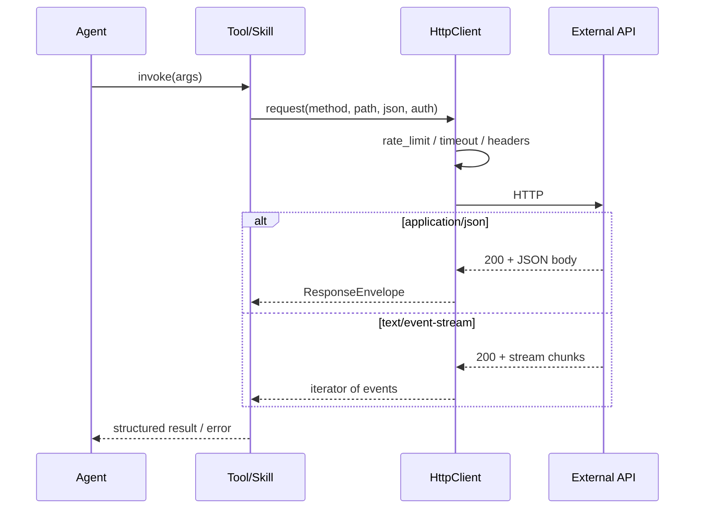
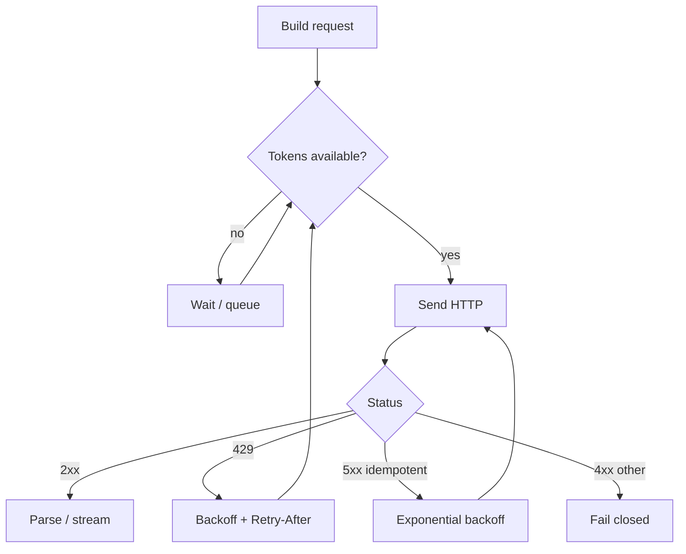
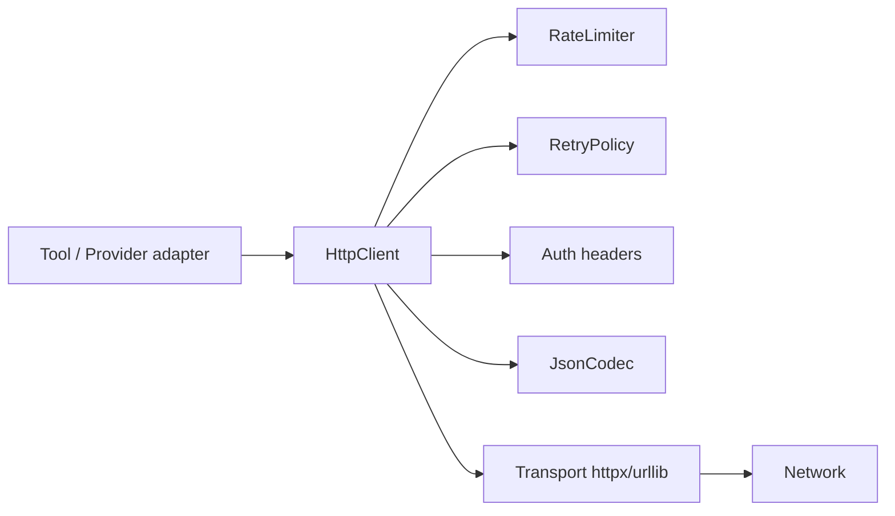

# Chapter 5: HTTP, APIs & JSON

## Chapter Overview

Every production AI system is a networked system.

LLM providers are HTTP APIs. Vector databases are HTTP APIs. Your tools call HTTP APIs. MCP transports often ride on HTTP. Your future FastAPI surface *is* HTTP. If you treat networking as an afterthought—“just use the SDK”—you will not be able to debug timeouts, auth failures, partial streams, rate limits, or poison JSON when demos end and incidents begin.

This chapter builds the network literacy required for the rest of the bootcamp:

- REST semantics and idempotency
- headers that matter (auth, content type, request IDs, retries)
- authentication patterns without leaking secrets
- JSON as a contract (schema, validation, versioning)
- streaming responses (token streams, chunked transfer)
- rate limits, backoff, and retry policy
- a production-minded **API client** for the evolving platform

Chapter 6 will make this client concurrent with async Python. Later chapters will wrap it as the substrate for tool calls and provider adapters. Here we get the **synchronous contracts** right.

**Continuity:** Chapters 1–2 defined the stack; Chapter 4 made changes reviewable. HTTP is how stack layers reach the outside world—**tools as system calls over the network**.

---

## Learning Objectives

After completing this chapter, you can:

- Map common AI platform traffic onto HTTP methods, status codes, and headers
- Design request/response JSON contracts that fail closed under validation
- Implement authentication headers without hard-coding secrets
- Apply timeouts, retries, and exponential backoff safely (especially for non-idempotent calls)
- Explain rate limiting from both client and server perspectives
- Consume streaming HTTP responses incrementally
- Ship a reusable platform HTTP client with tests
- Debug the most common API failure modes in LLM and tool integrations

---

## Prerequisites

- Chapters 1–2 (platform layout, tool/agent boundaries)
- Chapter 4 Git workflow recommended
- Comfort with Python modules, exceptions, and tests
- Optional: Chapter 3 typing/dataclasses depth

---

## Motivation

Your agent “randomly” fails in production.

Logs show:

```text
OpenAITimeout
JSONDecodeError: Expecting value
429 Too Many Requests
401 Unauthorized
httpx.RemoteProtocolError: incomplete chunked read
```

The model is not “moody.” The **HTTP layer** is under-specified:

| Missing control | Symptom |
|---|---|
| No timeout | Hung workers |
| Retry on POST without idempotency | Double side effects |
| No rate-limit handling | Thundering herd after 429 |
| Trusting raw JSON | Crashes on partial/invalid payloads |
| Secrets in source | Key rotation nightmares |
| Ignoring stream abort | Truncated tool calls / half answers |

Tools are side effects. HTTP is how most side effects travel. Treat it like production infrastructure.

---

## First Principles

### 1. HTTP is a contract, not a transport detail

Status codes, methods, headers, and body schemas *are* your interface. SDKs hide them; incidents reveal them.

### 2. Timeouts are mandatory

A request without a timeout is a latent deadlock.

### 3. Retries are a correctness feature

Retrying is safe only when the operation is **idempotent** or protected by **idempotency keys**. Blind retries can refund twice or create two tickets.

### 4. JSON is untrusted input

Even from “your” provider. Validate before use. Partial streams are not complete JSON objects until they are.

### 5. Auth is a header policy + secret storage problem

Never a string literal in a repository.

### 6. Rate limits are part of the API

They are not insults. Design client-side budgets and backoff as first-class behavior.

### 7. Streaming changes error handling

Failures can occur **after** headers succeed and **after** some bytes were processed. Your client must handle mid-stream termination.

---

## Mental Model

Map networking to Chapter 2 vocabulary:

| Network concept | Platform analogy |
|---|---|
| HTTP request | Tool invocation message |
| Status code | Outcome class (ok / caller error / server error) |
| Headers | Policy + metadata (auth, request id, content type) |
| JSON body | Typed contract across a boundary |
| Rate limit | Harness budget at the edge |
| Stream | Incremental observation feed |



---

## Core Theory

### REST in practice (what AI engineers actually need)

REST is often diluted to “JSON over HTTP.” Focus on **semantics**:

| Method | Safe | Idempotent | Typical AI platform use |
|---|---|---|---|
| GET | yes | yes | Fetch model metadata, job status |
| HEAD | yes | yes | Existence / size checks |
| POST | no | no* | Chat completions, embeddings, create resources |
| PUT | no | yes | Replace resource configuration |
| PATCH | no | no* | Partial config update |
| DELETE | no | yes | Delete file / assistant / key |

\*Can be made effectively idempotent with **Idempotency-Key** headers when the server supports them.

**Status code classes**

| Range | Meaning | Client default stance |
|---|---|---|
| 2xx | Success | Parse body |
| 3xx | Redirect | Follow carefully; auth may drop |
| 4xx | Caller/request problem | Do not retry blindly |
| 5xx | Server problem | Retry with backoff if idempotent |
| 429 | Rate limited | Backoff; honor `Retry-After` |

Special cases:

- **401** — auth missing/invalid → fix credentials; don’t spin
- **403** — authenticated but forbidden → permission problem
- **408 / 425 / 429 / 500 / 502 / 503 / 504** — often transient
- **400 / 422** — schema/validation → fix payload

### Headers that matter

| Header | Role |
|---|---|
| `Authorization` | Bearer/API key schemes |
| `Content-Type` | `application/json` for JSON bodies |
| `Accept` | What you can parse |
| `User-Agent` | Identify your platform in vendor logs |
| `X-Request-ID` / `Idempotency-Key` | Correlation and safe retries |
| `Retry-After` | Server-guided wait (seconds or HTTP date) |
| `OpenAI-Organization` etc. | Vendor-specific routing |

Always propagate a **request ID** you generate if the server does not. It becomes the join key across agent traces and provider support tickets.

### Authentication patterns

| Pattern | Example | Notes |
|---|---|---|
| Bearer token | `Authorization: Bearer sk-...` | Common for LLM APIs |
| API key header | `x-api-key: ...` | Anthropic-style and many SaaS tools |
| Basic auth | `Authorization: Basic base64` | Rare for modern LLM; still in enterprise |
| Query token | `?api_key=` | Avoid; leaks via logs/referrers |

**Rules**

1. Load secrets from environment / secret manager (Chapter 1 settings pattern)
2. Never log Authorization headers
3. Prefer short-lived tokens when available
4. Scope keys per environment (`dev` / `staging` / `prod`)

### JSON as a contract

JSON is syntax. **Schema** is the contract.

Problems you must design for:

- missing fields
- wrong types (`"temperature": "0.7"`)
- extra fields (forward compatibility vs strictness)
- unicode and large payloads
- `null` vs absent
- numbers that should be ints
- provider “error” objects shaped differently from success objects

**Practical approach for the platform**

1. Decode bytes → Python objects with a JSON library
2. Validate into dataclasses / Pydantic models
3. Reject or coerce explicitly—never silently guess in tools
4. Version public APIs (`/v1/...`) when you own the server

### Serialization boundaries

| Direction | Concern |
|---|---|
| Outbound | `ensure_ascii`, datetime encoding, enum values, omit secrets |
| Inbound | size limits, decode errors, schema validation |
| Logs | redaction of tokens, PII, raw prompts in restricted envs |

### Streaming

LLM APIs often stream tokens as:

- **SSE** (`text/event-stream`) with `data: {...}` lines
- **NDJSON** (newline-delimited JSON)
- chunked raw bytes

Implications:

- You cannot `response.json()` the whole body up front
- You must handle incomplete final chunks
- Cancellation should close the socket
- Token accounting may be partial until the terminal event

### Rate limits

Servers protect capacity with:

- requests per minute (RPM)
- tokens per minute (TPM)
- concurrent connections

Clients should:

1. Read `Retry-After` on 429
2. Apply exponential backoff with jitter
3. Keep a local token bucket for known budgets
4. Avoid synchronized retries across workers (jitter)



### Timeouts and retries (policy sketch)

| Control | Starting point | Notes |
|---|---|---|
| Connect timeout | 5s | Fail fast on network issues |
| Read timeout | 30–120s | Longer for big generations; prefer streaming |
| Max retries | 2–3 | On transient statuses only |
| Backoff | 0.5s × 2^n + jitter | Cap max wait |
| Retry POST | only with idempotency key or safe read-like ops | Default: do not retry side effects |

---

## Architecture

### Platform HTTP client (Chapter 5 deliverable)

```
code/chapter-005/
  models.py           # request/response/auth value objects
  json_codec.py       # dump/load helpers
  rate_limit.py       # token bucket
  retry.py            # backoff policy
  http_client.py      # sync client facade
  streaming.py        # SSE/NDJSON iterators
  main.py             # CLI demos against httpbin or mockable base URL
  tests/
```

Design goals:

- **No secrets in code**
- Explicit timeouts
- Observable request IDs
- Pluggable base URL (providers and tools look the same at this layer)
- Sync first (async in Chapter 6)



Later chapters insert:

- provider-specific adapters on top of `HttpClient`
- tool runtimes that translate tool args → HTTP
- harness budgets that tighten rate limits per run

---

## Internal Implementation

### Value objects

```python
# code/chapter-005/models.py
from __future__ import annotations

from dataclasses import dataclass, field
from typing import Any, Mapping


@dataclass(frozen=True)
class AuthConfig:
    """How to attach credentials. Values come from env at call sites."""

    kind: str = "none"  # none | bearer | header | basic
    token: str | None = None
    header_name: str = "Authorization"
    username: str | None = None
    password: str | None = None

    def headers(self) -> dict[str, str]:
        if self.kind == "none" or not self.token and self.kind != "basic":
            if self.kind == "basic" and self.username is not None:
                import base64

                raw = f"{self.username}:{self.password or ''}".encode()
                return {"Authorization": "Basic " + base64.b64encode(raw).decode()}
            return {}
        if self.kind == "bearer":
            return {"Authorization": f"Bearer {self.token}"}
        if self.kind == "header":
            return {self.header_name: self.token or ""}
        raise ValueError(f"unknown auth kind: {self.kind}")


@dataclass(frozen=True)
class RequestSpec:
    method: str
    url: str
    headers: Mapping[str, str] = field(default_factory=dict)
    json_body: Any | None = None
    params: Mapping[str, str] | None = None
    timeout_s: float = 30.0
    idempotent: bool = False


@dataclass(frozen=True)
class ResponseEnvelope:
    status_code: int
    headers: Mapping[str, str]
    body_text: str
    request_id: str
    elapsed_s: float

    def json(self) -> Any:
        from json_codec import loads

        return loads(self.body_text)
```

### JSON codec

```python
# code/chapter-005/json_codec.py
from __future__ import annotations

import json
from typing import Any


class JsonError(ValueError):
    pass


def dumps(data: Any) -> str:
    try:
        return json.dumps(data, ensure_ascii=False, separators=(",", ":"), default=str)
    except (TypeError, ValueError) as exc:
        raise JsonError(f"json encode failed: {exc}") from exc


def loads(text: str) -> Any:
    if text is None or text.strip() == "":
        raise JsonError("empty json body")
    try:
        return json.loads(text)
    except json.JSONDecodeError as exc:
        raise JsonError(f"json decode failed: {exc}") from exc
```

### Rate limiter (token bucket)

```python
# code/chapter-005/rate_limit.py
from __future__ import annotations

import time
from dataclasses import dataclass


@dataclass
class TokenBucket:
    rate_per_s: float
    capacity: float
    tokens: float | None = None
    updated_at: float | None = None

    def __post_init__(self) -> None:
        if self.tokens is None:
            self.tokens = float(self.capacity)
        if self.updated_at is None:
            self.updated_at = time.monotonic()

    def _refill(self) -> None:
        now = time.monotonic()
        assert self.updated_at is not None and self.tokens is not None
        elapsed = now - self.updated_at
        self.tokens = min(self.capacity, self.tokens + elapsed * self.rate_per_s)
        self.updated_at = now

    def acquire(self, cost: float = 1.0, block: bool = True) -> float:
        """Consume tokens. Returns seconds waited."""
        waited = 0.0
        while True:
            self._refill()
            assert self.tokens is not None
            if self.tokens >= cost:
                self.tokens -= cost
                return waited
            if not block:
                raise TimeoutError("rate limit: not enough tokens")
            need = cost - self.tokens
            sleep_s = need / self.rate_per_s if self.rate_per_s > 0 else 0.1
            time.sleep(sleep_s)
            waited += sleep_s
```

### Retry policy

```python
# code/chapter-005/retry.py
from __future__ import annotations

import random
from dataclasses import dataclass


TRANSIENT = frozenset({408, 425, 429, 500, 502, 503, 504})


@dataclass(frozen=True)
class RetryPolicy:
    max_attempts: int = 3
    base_delay_s: float = 0.5
    max_delay_s: float = 8.0
    jitter_s: float = 0.2

    def allow(self, method: str, status: int | None, idempotent: bool, attempt: int) -> bool:
        if attempt >= self.max_attempts:
            return False
        if status is None:
            return True  # network error
        if status in TRANSIENT:
            if method.upper() == "POST" and not idempotent and status != 429:
                # allow 429 even for POST; avoid replaying unknown POSTs on 500s
                return status == 429
            return True
        return False

    def delay_s(self, attempt: int, retry_after_s: float | None = None) -> float:
        if retry_after_s is not None and retry_after_s >= 0:
            return min(self.max_delay_s, retry_after_s)
        exp = min(self.max_delay_s, self.base_delay_s * (2 ** max(0, attempt - 1)))
        return exp + random.uniform(0, self.jitter_s)
```

### HTTP client (httpx with clear errors)

```python
# code/chapter-005/http_client.py
from __future__ import annotations

import time
import uuid
from typing import Any, Iterator, Mapping

import httpx

from json_codec import dumps, loads
from models import AuthConfig, RequestSpec, ResponseEnvelope
from rate_limit import TokenBucket
from retry import RetryPolicy
from streaming import iter_sse_lines, iter_ndjson


class HttpClientError(RuntimeError):
    def __init__(self, message: str, *, status_code: int | None = None, request_id: str = ""):
        super().__init__(message)
        self.status_code = status_code
        self.request_id = request_id


class HttpClient:
    def __init__(
        self,
        *,
        base_url: str = "",
        auth: AuthConfig | None = None,
        default_headers: Mapping[str, str] | None = None,
        rate_limiter: TokenBucket | None = None,
        retry: RetryPolicy | None = None,
        user_agent: str = "ai-agent-platform/0.1",
    ) -> None:
        self.base_url = base_url.rstrip("/")
        self.auth = auth or AuthConfig()
        self.default_headers = dict(default_headers or {})
        self.default_headers.setdefault("User-Agent", user_agent)
        self.default_headers.setdefault("Accept", "application/json")
        self.rate_limiter = rate_limiter
        self.retry = retry or RetryPolicy()

    def _url(self, path_or_url: str) -> str:
        if path_or_url.startswith("http://") or path_or_url.startswith("https://"):
            return path_or_url
        if not self.base_url:
            return path_or_url
        return f"{self.base_url}/{path_or_url.lstrip('/')}"

    def request(self, spec: RequestSpec) -> ResponseEnvelope:
        url = self._url(spec.url)
        request_id = str(uuid.uuid4())
        headers = {
            **self.default_headers,
            **self.auth.headers(),
            **dict(spec.headers),
            "X-Request-ID": request_id,
        }
        content: bytes | None = None
        if spec.json_body is not None:
            content = dumps(spec.json_body).encode("utf-8")
            headers.setdefault("Content-Type", "application/json")

        attempt = 0
        last_error: Exception | None = None
        while True:
            attempt += 1
            if self.rate_limiter:
                self.rate_limiter.acquire(1.0)
            started = time.perf_counter()
            try:
                with httpx.Client(timeout=spec.timeout_s) as client:
                    response = client.request(
                        spec.method.upper(),
                        url,
                        headers=headers,
                        content=content,
                        params=spec.params,
                    )
                elapsed = time.perf_counter() - started
                envelope = ResponseEnvelope(
                    status_code=response.status_code,
                    headers={k.lower(): v for k, v in response.headers.items()},
                    body_text=response.text,
                    request_id=request_id,
                    elapsed_s=elapsed,
                )
                if response.status_code >= 400:
                    if self.retry.allow(
                        spec.method, response.status_code, spec.idempotent, attempt
                    ):
                        retry_after = _parse_retry_after(envelope.headers.get("retry-after"))
                        time.sleep(self.retry.delay_s(attempt, retry_after))
                        continue
                    raise HttpClientError(
                        f"HTTP {response.status_code} for {spec.method} {url}",
                        status_code=response.status_code,
                        request_id=request_id,
                    )
                return envelope
            except (httpx.TimeoutException, httpx.NetworkError, httpx.RemoteProtocolError) as exc:
                last_error = exc
                if not self.retry.allow(spec.method, None, spec.idempotent, attempt):
                    raise HttpClientError(
                        f"network failure for {spec.method} {url}: {exc}",
                        request_id=request_id,
                    ) from exc
                time.sleep(self.retry.delay_s(attempt))
        raise HttpClientError(f"exhausted retries: {last_error}", request_id=request_id)

    def get_json(self, path: str, **kwargs: Any) -> Any:
        env = self.request(RequestSpec(method="GET", url=path, idempotent=True, **kwargs))
        return env.json()

    def post_json(self, path: str, body: Any, *, idempotent: bool = False, **kwargs: Any) -> Any:
        env = self.request(
            RequestSpec(method="POST", url=path, json_body=body, idempotent=idempotent, **kwargs)
        )
        return env.json()

    def stream_lines(self, spec: RequestSpec) -> Iterator[str]:
        url = self._url(spec.url)
        request_id = str(uuid.uuid4())
        headers = {
            **self.default_headers,
            **self.auth.headers(),
            **dict(spec.headers),
            "X-Request-ID": request_id,
            "Accept": spec.headers.get("Accept", "text/event-stream"),
        }
        if self.rate_limiter:
            self.rate_limiter.acquire(1.0)
        with httpx.Client(timeout=spec.timeout_s) as client:
            with client.stream(spec.method.upper(), url, headers=headers, params=spec.params) as resp:
                if resp.status_code >= 400:
                    raise HttpClientError(
                        f"HTTP {resp.status_code} streaming {url}",
                        status_code=resp.status_code,
                        request_id=request_id,
                    )
                for line in resp.iter_lines():
                    yield line


def _parse_retry_after(value: str | None) -> float | None:
    if not value:
        return None
    try:
        return float(value)
    except ValueError:
        return None
```

### Streaming helpers

```python
# code/chapter-005/streaming.py
from __future__ import annotations

from typing import Any, Iterable, Iterator

from json_codec import JsonError, loads


def iter_sse_lines(lines: Iterable[str]) -> Iterator[str]:
    """Yield data payloads from SSE-style lines."""
    for raw in lines:
        line = raw.strip("\r")
        if not line or line.startswith(":"):
            continue
        if line.startswith("data:"):
            yield line[5:].lstrip()


def iter_ndjson(lines: Iterable[str]) -> Iterator[Any]:
    for raw in lines:
        text = raw.strip()
        if not text:
            continue
        try:
            yield loads(text)
        except JsonError:
            continue
```

### CLI

```bash
cd code/chapter-005
python main.py get-json https://httpbin.org/json
python main.py post-json https://httpbin.org/post '{"hello":"platform"}'
python main.py demo-rate-limit
pytest -q
```

---

## Production Implementation

### Client defaults for AI platforms

| Setting | Recommendation |
|---|---|
| Timeouts | Always set; separate connect/read when possible |
| Retries | Transient only; careful with POST |
| User-Agent | Identify service + version |
| Request IDs | Generate if absent; log them |
| Connection pooling | Reuse clients in long-running workers (Chapter 6/7) |
| TLS | System CAs; pin only when required by enterprise |
| Proxy | Honor `HTTPS_PROXY` in corporate envs |

### Provider adapter pattern (preview)

Do **not** scatter `httpx.post("https://api.openai.com/...")` across tools.

```text
Tool → ProviderAdapter → HttpClient → Network
```

Adapters own:

- base URL + auth scheme
- request/response schema mapping
- stream event translation
- vendor error normalization

`HttpClient` owns:

- transport mechanics
- retries/rate limits/timeouts
- header hygiene

### Observability hooks

Log (structured):

- method, host, path template (not raw secrets)
- status code
- latency
- request id
- retry count
- rate-limit wait time

Do **not** log full Authorization headers or unrestricted raw prompts in multi-tenant prod without policy.

### Ownership of rate limits

| Layer | Responsibility |
|---|---|
| HttpClient | Per-process polite client limits |
| Harness (later) | Per-run budgets |
| Global worker fleet | Distributed limiters (Redis later) |

---

## Framework Implementation

SDKs (OpenAI, Anthropic, etc.) are convenience adapters. You still need to understand:

- how they set timeouts
- whether they retry POST
- how streams surface cancellation
- where keys are read

When a framework hides HTTP poorly, wrap or replace it with your `HttpClient` + adapter. Chapter 2 rule: **frameworks map onto your stack**, not the reverse.

---

## Trade-offs

| Choice | Pros | Cons |
|---|---|---|
| Official vendor SDK only | Fast start | Opaque retries/timeouts; lock-in |
| Thin HttpClient + adapters | Control, testability | More code |
| Retry all failures | Masks blips | Duplicate side effects |
| No retries | Simple | Brittle under 429/5xx |
| Strict JSON schema | Safety | Churn when providers add fields |
| Loose JSON (`dict`) | Flexible | Latent type bugs |
| Streaming | Low TTFB, cancelable | Harder parsing/errors |
| Buffer full body | Simple JSON | Latency + memory |

**Book default:** thin client + explicit policies + validated JSON at boundaries.

---

## Debugging

| Symptom | Likely cause | What to check |
|---|---|---|
| Hang forever | No read timeout | Client timeout config |
| 401 loops | Bad/rotated key; wrong header name | Auth scheme; env var |
| 429 storms | No backoff / synchronized workers | Retry-After; jitter |
| `JSONDecodeError` | Empty/HTML error body; partial stream | Status + `Content-Type` + raw snippet |
| Double tool effect | Retried non-idempotent POST | Retry policy; idempotency keys |
| Works in curl, fails in app | Missing header; HTTP/2 proxy; TLS | Diff headers; proxy env |
| Truncated stream | Client cancel; proxy idle timeout | Timeouts; mid-stream errors |

**Method:** capture request id, status, latency, and a **redacted** body snippet. Fix the lowest layer first (DNS/TLS → HTTP → JSON → adapter → tool).

---

## Performance

| Lever | Effect |
|---|---|
| Connection reuse | Lower latency for multi-call tools |
| Streaming | Faster first token; lower memory |
| Compression | `Accept-Encoding` when payloads large |
| Parallelism | Chapter 6; watch TPM/RPM |
| Payload size | Truncate tool results; avoid megabyte prompts |
| Regional endpoints | Lower RTT when available |

Measure **p95 latency** and **retry rate**, not only happy-path averages.

---

## Security

| Risk | Control |
|---|---|
| Secret leakage in Git/logs | Env secrets; redacted logging |
| SSRF via user-controlled URLs | Allowlist hosts in tools |
| Header injection | Reject CR/LF in header values |
| Oversized JSON | Body size limits |
| Open redirects | Do not follow blindly with auth headers |
| Untrusted HTTPS endpoints | Stay on TLS; validate certs |
| Prompt/data exfil through tools | Tool allowlists + egress policies |

A tool that accepts arbitrary URLs from a model is a **remote-controlled HTTP client**. That is a security product decision, not a convenience feature.

---

## Best Practices

1. Always set timeouts  
2. Generate and propagate request IDs  
3. Validate JSON before acting on it  
4. Retry only with a written policy  
5. Honor `Retry-After`  
6. Keep auth construction in one place  
7. Separate transport client from vendor adapters  
8. Write tests for 401/429/5xx/invalid JSON  
9. Prefer streaming for long generations  
10. Allowlist egress for model-driven tool HTTP  

---

## Anti-Patterns

| Anti-pattern | Why it fails |
|---|---|
| `requests.get(url)` with no timeout | Hung processes |
| Retry every exception on checkout POST | Double charges |
| `eval`/`exec` on remote JSON | Catastrophic |
| Logging bearer tokens | Instant incident |
| Parsing streams with naive `split` only | Breaks on partial frames |
| One giant SDK call in UI code | No policy boundary |
| Ignoring 429 | Account bans / cascading failure |
| Trusting model-supplied URLs | SSRF |

---

## Hands-on Exercise

**Time box:** 60–90 minutes.

1. Implement `code/chapter-005/` modules (or copy from this chapter).  
2. Run unit tests (no network required for core tests).  
3. Optional network smoke (requires connectivity):

```bash
python main.py get-json https://httpbin.org/json
python main.py post-json https://httpbin.org/post '{"source":"chapter-005"}'
```

4. Force a validation failure: pass invalid JSON string to `loads` and confirm `JsonError`.  
5. Simulate rate limiting by configuring a small `TokenBucket(rate_per_s=1, capacity=1)` and two acquires.  
6. Journal: write the retry rule you want for `POST /v1/chat/completions` in your platform.

---

## Mini Project

**Build the platform API client.**

Deliverables:

1. `HttpClient` with auth, timeouts, retries, rate limit hooks  
2. JSON codec with explicit errors  
3. Streaming line helpers  
4. Tests for retry decisions, rate limiter, JSON errors, header auth  
5. `README.md` with usage against a public echo API and offline tests  
6. Short design note in README: how a future `OpenAIAdapter` would call this client  

Acceptance criteria:

- No secret literals in repo  
- Default path unit tests pass offline  
- CLI can perform GET JSON and POST JSON when network available  

---

## Chapter Deliverables

| Artifact | Location |
|---|---|
| Manuscript | `book/chapter-005.md` |
| API client package | `code/chapter-005/` |
| Tests | `code/chapter-005/tests/` |
| Diagrams | `diagrams/mermaid/chapter-005/` |

---

## Interview Questions

1. When is retrying a POST safe?  
2. Difference between 401 and 403?  
3. How do you handle 429 properly?  
4. Why are timeouts non-negotiable?  
5. How does streaming change error handling?  
6. Design headers for an internal tool calling a billing API.  
7. How would you prevent SSRF in a browsing tool?  
8. Why separate `HttpClient` from `OpenAIAdapter`?  
9. What do you log for a failed provider call?  
10. How are rate limits related to a harness budget?

**Concise model answers**

1. When idempotent or protected by idempotency keys / server dedupe.  
2. 401 unauthenticated; 403 authenticated but not allowed.  
3. Backoff; honor Retry-After; jitter; reduce concurrency.  
4. Otherwise threads/workers block indefinitely.  
5. Errors can occur mid-body; partial data may exist.  
6. Auth, request id, content-type, tight timeout, maybe idempotency key.  
7. Allowlist schemes/hosts; block link-local/metadata IPs.  
8. Transport policy vs vendor schema/endpoint mapping.  
9. Request id, status, latency, error class, redacted body snippet.  
10. Harness caps run cost; client rate limiter shapes local egress politeness.

---

## Quiz

**Multiple choice**

1. Best default action for HTTP 401:  
   - A) Retry 10 times  
   - B) Fix credentials / stop  
   - C) Ignore  
   - D) Switch to HTTP  
   **Answer:** B

2. `Retry-After: 2` on 429 means:  
   - A) Retry immediately  
   - B) Wait ~2 seconds before retry  
   - C) Give up forever  
   - D) Upgrade TLS  
   **Answer:** B

3. JSON from providers should be:  
   - A) Trusted completely  
   - B) Validated at boundaries  
   - C) `eval`’d  
   - D) Stored only as screenshots  
   **Answer:** B

**True/False**

4. GET is idempotent. **True**  
5. POST is always safe to retry. **False**  
6. Streaming responses can fail after a 200 status is received. **True**

**Short answer**

7. Name three headers important for AI API clients.  
8. What is a token bucket used for?  
9. Why generate `X-Request-ID`?  
10. Name two transient status codes.

**Sample answers**

7. Authorization, Content-Type, Retry-After (also Accept, User-Agent, Idempotency-Key).  
8. Client-side rate limiting.  
9. Correlate logs across services and vendor tickets.  
10. 429, 503 (also 502/504/408).

---

## Cheat Sheet

```bash
# chapter toolkit
python main.py get-json https://httpbin.org/json
python main.py post-json https://httpbin.org/post '{"ok":true}'
python main.py demo-rate-limit
pytest -q
```

| Topic | Rule |
|---|---|
| Timeout | Always |
| Retry POST | Only if idempotent / keyed |
| 429 | Backoff + Retry-After + jitter |
| JSON | Validate; fail closed |
| Auth | Env secrets; never log |
| Stream | Handle mid-stream failure |
| SSRF | Allowlist tool egress |
| Layers | Tool → Adapter → HttpClient |

**Status quick read:** 2xx ok · 4xx fix request · 5xx maybe retry · 429 slow down.

---

## Curated Free Resources

- [MDN HTTP overview](https://developer.mozilla.org/en-US/docs/Web/HTTP) — methods, headers, status codes  
- [RFC 9110 — HTTP Semantics](https://www.rfc-editor.org/rfc/rfc9110) — authoritative reference  
- [JSON RFC 8259](https://www.rfc-editor.org/rfc/rfc8259) — JSON grammar  
- [httpx documentation](https://www.python-httpx.org/) — modern Python HTTP client  
- [OWASP SSRF](https://owasp.org/www-community/attacks/Server_Side_Request_Forgery) — tool egress threat model  

Vendor API docs (OpenAI/Anthropic/etc.) are useful *after* you understand the HTTP substrate.

---

## Chapter Summary

- AI platforms are HTTP systems: providers, tools, and your APIs.  
- Correctness requires timeouts, disciplined retries, JSON validation, and auth hygiene.  
- Rate limits and streaming are normal operating modes, not edge cases.  
- Chapter 5 delivers a synchronous platform `HttpClient` used by later tool/provider layers.  
- Security includes secret handling and SSRF-aware tool design.

**What changed in the project**

- `code/chapter-005/` API client, JSON codec, rate limiter, retry policy, streaming helpers  
- Diagrams for request flow and rate-limit control loop  

---

## What's Next

**Chapter 6 — Async Python** upgrades this foundation for concurrent tool calls and parallel provider requests: `async`/`await`, task groups, async HTTP, and structured concurrency without turning the platform into a race-condition museum.

You will keep the same contracts (`RequestSpec`, retry policy, rate limits)—but execute many of them at once, safely.
