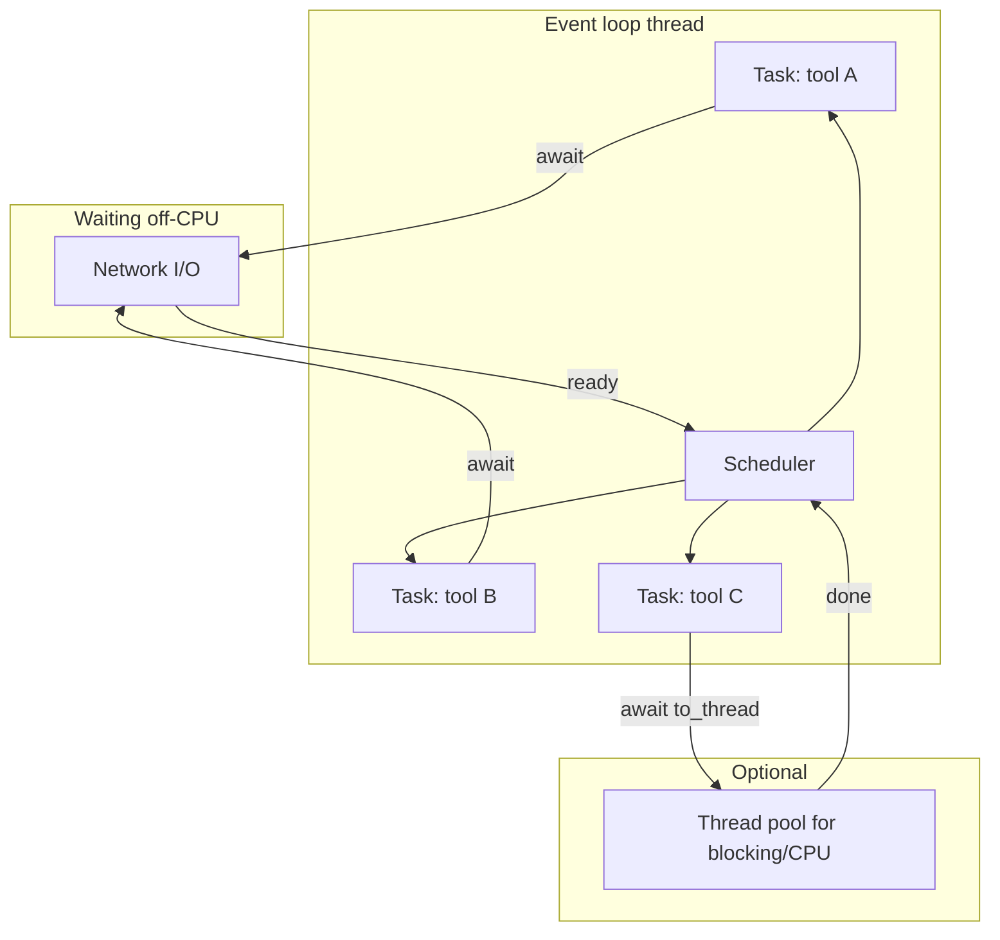
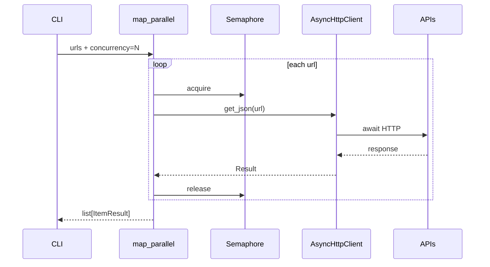

# Chapter 6: Async Python

## Chapter Overview

Chapter 5 gave you a correct **synchronous** HTTP substrate: timeouts, retries, JSON contracts, auth, rate limits. That is enough for many tools. It is not enough when an agent must:

- call three tools at once
- embed 200 chunks with bounded concurrency
- stream tokens while other work continues
- wait on multiple provider requests without blocking a worker forever

This chapter upgrades the platform with **async Python**:

- `async` / `await` and the event loop mental model
- tasks, cancellation, and structured concurrency
- bounded parallelism (`Semaphore`, task groups / gather)
- when to use thread pools (CPU-bound or blocking libraries)
- async HTTP with the same policies as Chapter 5
- a **parallel API client** mini-project for the evolving platform

**Continuity:** Keep Chapter 5 contracts (`RequestSpec`-style ideas, retry discipline, request IDs). Async changes *scheduling*, not *semantics*.

---

## Learning Objectives

After completing this chapter, you can:

- Explain concurrency vs parallelism in CPython terms
- Write `async def` coroutines and await I/O-bound work correctly
- Spawn tasks safely and cancel them on failure or timeout
- Bound concurrency so you do not stampede provider rate limits
- Use `asyncio.to_thread` (or executors) for blocking calls without freezing the loop
- Implement async HTTP GET/POST with retries and timeouts
- Fan out parallel API requests and collect successes/failures
- Avoid classic async footguns (blocking the loop, unbounded gather, swallowed cancellations)

---

## Prerequisites

- Chapter 5 (HTTP client concepts, status codes, retry policy)
- Chapter 3 typing comfort recommended
- Ability to run `pytest` and install `httpx`

---

## Motivation

Your research agent must:

1. search the web  
2. fetch 8 URLs  
3. summarize each  
4. merge results  

**Sync approach:** total latency ≈ sum of all calls.  
**Naive async approach:** fire 500 tasks, get 429s, corrupt shared state, hang on cancellation.  
**Engineered async approach:** bounded concurrency, per-request timeouts, isolated errors, cooperative cancellation, shared rate limiter.

Async is not “make it fast for free.” It is **overlap waiting time** without losing control.

---

## First Principles

### 1. Async shines when you wait

Disk, DNS, TLS, HTTP, and queues release the event loop while waiting. CPU-heavy pure Python does not—unless you offload it.

### 2. Concurrency ≠ parallelism

- **Concurrency:** many tasks in progress (interleaved on one thread)  
- **Parallelism:** many tasks executing at the same moment (multi-core)

CPython’s GIL limits CPU parallelism in pure Python; async still wins on I/O.

### 3. Never block the event loop

`time.sleep`, heavy CPU, or sync `requests` inside `async def` stalls **everything** on that loop.

### 4. Bound fan-out

Unbounded `asyncio.gather` on user/model-controlled lists is a self-DoS.

### 5. Cancellation is part of the API

Timeouts cancel tasks. Clean up sockets and partial state.

### 6. Preserve Chapter 5 policy

Retries, idempotency, and auth do not become optional because you added `async`.

---

## Mental Model



| Concept | Analogy |
|---|---|
| Event loop | Single efficient receptionist |
| Coroutine | Job description that can pause |
| Task | Scheduled job instance |
| `await` | Pause until this I/O finishes |
| Semaphore | Limited number of open counter windows |
| Thread pool | Back office for blocking work |

---

## Core Theory

### `async` / `await`

```python
import asyncio

async def fetch_title(client, url: str) -> str:
    response = await client.get(url)
    return response.json()["title"]

async def main() -> None:
    # ...
    await fetch_title(client, "https://example.test/a")

asyncio.run(main())
```

- `async def` defines a coroutine function  
- calling it returns a coroutine object—it does not run until awaited/scheduled  
- `asyncio.run()` is the usual CLI entry (one shot)

### Tasks

```python
task = asyncio.create_task(fetch_title(client, url))
result = await task
```

Tasks run concurrently on the loop. Prefer structured patterns over fire-and-forget.

### Gather vs TaskGroup

```python
results = await asyncio.gather(coro1(), coro2(), return_exceptions=True)
```

- `return_exceptions=True` prevents one failure from losing siblings’ results  
- On Python 3.11+, `asyncio.TaskGroup` provides structured concurrency (failure cancels siblings)

This chapter uses `gather` for broad 3.10+ compatibility and shows bounded patterns explicitly.

### Timeouts

```python
async with asyncio.timeout(5):  # 3.11+
    await do_work()

# Portable:
await asyncio.wait_for(do_work(), timeout=5)
```

### Semaphores (bounded concurrency)

```python
sem = asyncio.Semaphore(5)

async def bounded(url: str):
    async with sem:
        return await fetch(url)
```

### Thread pools

Use when a library is sync/blocking:

```python
result = await asyncio.to_thread(cpu_bound_or_sync_fn, arg)
```

Do **not** default all work to threads—that wastes resources and reintroduces GIL contention.

### Async HTTP

`httpx.AsyncClient` (or equivalent) shares Chapter 5 concerns:

- timeouts  
- headers / auth  
- connection pooling (reuse one client)  
- stream APIs  

Create **one** `AsyncClient` per process/request scope—not per call.

### Error isolation in fan-out

When fetching many URLs:

| Strategy | Behavior |
|---|---|
| gather default | first exception cancels usefulness of others |
| gather + return_exceptions | collect mix of values/exceptions |
| per-task try/except | normalize to Result objects |

Platform preference: **normalized outcomes** (`Ok`/`Err` or dataclass) for tool batches.

### Race conditions and shared state

Async tasks interleave. Protect shared mutable state:

- prefer immutable messages  
- use `asyncio.Lock` when mutating shared caches  
- do not assume “it is single-threaded so races are impossible” for logical races

---

## Architecture

### Chapter 6 package

```text
code/chapter-006/
  async_http.py       # AsyncHttpClient
  concurrency.py      # map_parallel, gather_limited
  rate_limit_async.py # async token bucket
  models.py           # shared request/response types (subset)
  main.py             # CLI demos
  tests/
```



Relationship to Chapter 5:

| Chapter 5 | Chapter 6 |
|---|---|
| `HttpClient` sync | `AsyncHttpClient` |
| `time.sleep` backoff | `asyncio.sleep` |
| sync token bucket | async-aware limiter |
| single request | parallel map |

---

## Internal Implementation

### Models

```python
# models.py — compact shared types
@dataclass(frozen=True)
class RequestSpec:
    method: str
    url: str
    json_body: Any | None = None
    timeout_s: float = 30.0
    idempotent: bool = False

@dataclass(frozen=True)
class ItemResult:
    key: str
    ok: bool
    value: Any = None
    error: str | None = None
    status_code: int | None = None
```

### Async rate limiter

```python
# rate_limit_async.py
class AsyncTokenBucket:
    async def acquire(self, cost: float = 1.0) -> None:
        while True:
            self._refill()
            if self.tokens >= cost:
                self.tokens -= cost
                return
            await asyncio.sleep(need / rate)
```

### Async HTTP client (sketch)

```python
class AsyncHttpClient:
    def __init__(self, ..., transport=None):
        self._client = httpx.AsyncClient(timeout=30.0, transport=transport)

    async def aclose(self) -> None:
        await self._client.aclose()

    async def request(self, spec: RequestSpec) -> ResponseEnvelope:
        # retry loop with asyncio.sleep; raise on final failure
        ...

    async def get_json(self, url: str) -> Any:
        ...
```

### Parallel map

```python
async def map_parallel(keys, worker, *, concurrency: int = 5) -> list[ItemResult]:
    sem = asyncio.Semaphore(concurrency)

    async def run(key):
        async with sem:
            try:
                value = await worker(key)
                return ItemResult(key=key, ok=True, value=value)
            except Exception as exc:
                return ItemResult(key=key, ok=False, error=str(exc))

    return await asyncio.gather(*(run(k) for k in keys))
```

### CLI

```bash
cd code/chapter-006
python main.py parallel-demo
python main.py gather-urls https://httpbin.org/json https://httpbin.org/uuid
pytest -q
```

---

## Production Implementation

### Client lifecycle

| Pattern | Guidance |
|---|---|
| CLI script | `async with AsyncHttpClient(...) as client:` |
| Long worker | one client per process; close on shutdown |
| FastAPI | shared client on app state / lifespan |

### Limits that matter

| Limit | Typical starting point |
|---|---|
| Tool fan-out concurrency | 5–20 |
| Embedding batch concurrency | tied to RPM/TPM |
| Per-request timeout | 10–60s depending on model |
| Global async rate limiter | match provider budget |

### Observability

Log for each parallel item:

- key/url host (not secrets)  
- status / error class  
- latency  
- request id  

### Mixing sync chapters

Calling Chapter 5 sync client from async code:

```python
await asyncio.to_thread(sync_client.get_json, url)
```

Prefer native async for hot paths.

---

## Framework Implementation

Agent frameworks often hide executors. Inspect:

- Do tool calls run concurrent or serial?  
- Is concurrency bounded?  
- Are cancellations propagated?  
- Do they block the loop with sync SDKs?

If a framework blocks, wrap tools with async adapters **you** control—or run the framework in a worker process.

---

## Trade-offs

| Approach | Pros | Cons |
|---|---|---|
| Sync only | Simple stack traces | Poor multi-tool latency |
| Async I/O | Overlap waits | Harder debugging |
| Threads for all I/O | Familiar | Heavier; less scalable |
| Unbounded gather | Minimal code | Rate-limit storms |
| Process pool | True CPU parallelism | Serialization overhead |

**Book default:** async for network-bound tool/provider I/O; threads for stubborn sync libraries; always bound concurrency.

---

## Debugging

| Symptom | Cause | Fix |
|---|---|---|
| Everything slow despite async | Sync I/O inside coroutines | Find blocking calls; to_thread or async driver |
| 429 storms | High concurrency | Semaphore + rate limiter |
| Hang on shutdown | Open client/tasks | `aclose()`, cancel tasks |
| `RuntimeError: Event loop is closed` | Bad lifecycle | Single `asyncio.run`, await closes |
| Lost errors | gather without handling | return_exceptions or ItemResult |
| Random shared dict corruption | Unlocked mutation | Lock or immutable messages |

---

## Performance

Measure:

- wall time for N parallel GETs vs serial  
- p95 per request  
- retry rate under load  

Tune concurrency until error rate rises, then back off.

Streaming remains important: async streams free the loop between chunks.

---

## Security

| Risk | Async angle |
|---|---|
| SSRF fan-out | Model-controlled URL lists + high concurrency = amplified SSRF | Allowlist + low concurrency |
| Credential leaks in task logs | Same redaction rules |
| Cancellation gaps | Ensure auth sessions close |
| Thundering herd on outage | Jittered backoff still required |

---

## Best Practices

1. One long-lived `AsyncClient` per scope  
2. Always set timeouts  
3. Bound concurrency with semaphores  
4. Normalize per-item errors in fan-out  
5. Use `asyncio.sleep`, never `time.sleep`, on the loop  
6. Offload blocking libs with `to_thread`  
7. Cancel and close cleanly  
8. Keep retry/idempotency rules from Chapter 5  
9. Prefer immutable result objects  
10. Test with mock transports offline  

---

## Anti-Patterns

| Anti-pattern | Why it fails |
|---|---|
| `time.sleep` in `async def` | Blocks entire loop |
| New client per request | Connection overhead |
| `gather(*[...])` on unbounded model lists | Self-DoS |
| Ignoring `CancelledError` | Resource leaks |
| Shared mutable counter without lock | Logical races |
| CPU-bound work on loop | Starvation of I/O tasks |
| Fire-and-forget tasks without tracking | Silent failure |

---

## Hands-on Exercise

**Time box:** 60–90 minutes.

1. Implement `code/chapter-006/` async client + `map_parallel`.  
2. Offline tests with `httpx.MockTransport` / ASGI-style mocks.  
3. Compare serial vs parallel wall time in a demo (mock delays).  
4. Force concurrency=1 vs concurrency=5; observe ordering independence.  
5. Journal: what concurrency cap would you set for a web-fetch tool? Why?

---

## Mini Project

**Parallel API requests for the platform.**

Deliverables:

1. `AsyncHttpClient` with timeout + retry + request IDs  
2. `map_parallel` with semaphore  
3. CLI: fetch multiple URLs, print JSON summary of ok/error counts  
4. Tests: parallel success, isolated failure, concurrency bound  
5. README: when to choose sync Ch5 vs async Ch6  

Acceptance:

- offline tests green  
- one failing URL does not drop successful siblings  
- concurrency parameter respected (test with instrumentation)

---

## Chapter Deliverables

| Artifact | Location |
|---|---|
| Manuscript | `book/chapter-006.md` |
| Async toolkit | `code/chapter-006/` |
| Tests | `code/chapter-006/tests/` |
| Diagrams | `diagrams/mermaid/chapter-006/` |

---

## Interview Questions

1. Concurrency vs parallelism?  
2. Why can async hurt if misused?  
3. How do you bound fan-out?  
4. When `asyncio.to_thread`?  
5. How does cancellation interact with HTTP clients?  
6. Why reuse `AsyncClient`?  
7. Design error handling for 50 parallel tool calls.  
8. What breaks if you call sync `requests` in async tools?  
9. How do rate limits interact with semaphores?  
10. Structured concurrency benefit?

**Concise model answers**

1. Overlapped tasks vs simultaneous execution.  
2. Blocking loop / storms / races.  
3. Semaphore or worker pool size.  
4. Blocking or CPU-bound sync libraries.  
5. Timeouts cancel tasks; connections must close.  
6. Pooling, DNS, TLS session reuse.  
7. Per-item Result; aggregate report.  
8. Stalls the event loop.  
9. Semaphore limits in-flight; rate limiter spaces starts.  
10. Failures cancel siblings; lifetimes nested cleanly.

---

## Quiz

**Multiple choice**

1. Best primitive to limit 100 concurrent fetches to 8:  
   - A) Global variable  
   - B) `asyncio.Semaphore(8)`  
   - C) More threads always  
   - D) Remove timeouts  
   **Answer:** B

2. Inside `async def`, prefer:  
   - A) `time.sleep(1)`  
   - B) `await asyncio.sleep(1)`  
   - C) Busy loop  
   - D) `os.system("sleep 1")`  
   **Answer:** B

3. Async is usually best for:  
   - A) Pure CPU matrix multiply in Python  
   - B) Many network waits  
   - C) Replacing all data structures  
   - D) Avoiding tests  
   **Answer:** B

**True/False**

4. `asyncio.gather` always runs tasks on multiple cores. **False**  
5. Unbounded fan-out can trigger provider rate limits. **True**  
6. One failing gathered task can be isolated with `return_exceptions=True` or per-task handlers. **True**

**Short answer**

7. What does `await` mean?  
8. Name two async footguns.  
9. Why keep Chapter 5 retry rules?  
10. What should a parallel tool return for mixed outcomes?

**Sample answers**

7. Suspend coroutine until awaitable completes.  
8. Blocking the loop; unbounded gather.  
9. Correctness (idempotency, 429 handling) is independent of scheduling.  
10. Per-item success/error records.

---

## Cheat Sheet

```bash
cd code/chapter-006
pytest -q
python main.py parallel-demo
```

| Need | Tool |
|---|---|
| Start async CLI | `asyncio.run(main())` |
| Concurrent wait | `await asyncio.gather(...)` |
| Bound in-flight | `Semaphore(n)` |
| Timeout | `wait_for` / `timeout` |
| Blocking lib | `asyncio.to_thread` |
| HTTP | `httpx.AsyncClient` |
| Pause | `await asyncio.sleep` |

**Rule:** overlap waits; bound fan-out; never block the loop.

---

## Curated Free Resources

- [asyncio docs](https://docs.python.org/3/library/asyncio.html)  
- [httpx async](https://www.python-httpx.org/async/)  
- [AnyIO / structured concurrency discussions](https://anyio.readthedocs.io/) (optional deeper dive)  
- Chapter 5 manuscript for HTTP policy baseline  

---

## Chapter Summary

- Async Python overlaps I/O waits for multi-tool and multi-request agent workloads.  
- Correctness still requires timeouts, bounded concurrency, and Chapter 5 retry discipline.  
- Tasks, semaphores, and normalized per-item results make fan-out operable.  
- Thread offload is for blocking/CPU outliers—not a substitute for async I/O.  
- Chapter 6 delivers `AsyncHttpClient` + `map_parallel` for the platform.

**What changed in the project**

- `code/chapter-006/` async HTTP and concurrency utilities  
- Parallel request mini-project and offline tests  

---

## What's Next

**Chapter 7 — Software Engineering Best Practices** (if reading in order) freezes these patterns into ports, DI, and package structure so async clients and sync clients both plug into a maintainable `platform_core`.

If Chapter 7 is already done, continue into **Part II — LLM Engineering** with Chapter 8, implementing provider adapters on top of the HTTP layers you now have in both sync and async forms.
