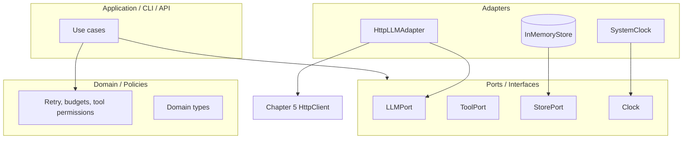
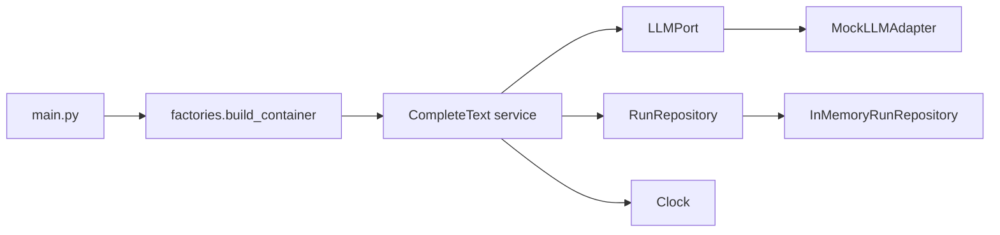

# Chapter 7: Software Engineering Best Practices

## Chapter Overview

Parts II–X will demand more than scripts that “work on my machine.” You will build provider clients, tools, planners, graphs, harnesses, and multi-agent runtimes. Without software engineering discipline, that stack collapses into a ball of helpers with hidden globals, untestable side effects, and copy-pasted retry logic.

This chapter closes **Part I — Foundations** by making engineering standards explicit:

- SOLID, DRY, KISS applied to AI platform code
- dependency injection over ambient globals
- repository and factory patterns where they earn their keep
- testing strategy (unit, integration, contract, eval hooks)
- project structure for an evolving monorepo
- a **refactored platform core** that absorbs lessons from Chapters 1–5

You are not learning enterprise ceremony for its own sake. You are installing the habits that keep agent systems debuggable when nondeterminism, tools, and cloud APIs enter the chat.

**Continuity:** Chapter 5 gave you HTTP contracts; Chapter 6 (async) makes them concurrent. Here you reorganize boundaries so later LLM chapters plug into stable interfaces—not into random functions.

---

## Learning Objectives

After completing this chapter, you can:

- Explain SOLID principles with AI-platform examples (not textbook animals)
- Spot violations: god modules, hidden I/O, untestable constructors
- Apply dependency injection to config, clocks, HTTP, and stores
- Use repository and factory patterns appropriately (and refuse them when pointless)
- Structure tests by failure mode and speed (unit vs integration)
- Organize a `platform/`-style package layout for long-term evolution
- Refactor prior chapter ideas into a small, tested core library
- Write a PR-ready design note for a structural change

---

## Prerequisites

- Chapters 1–2 (platform mission + stack map)
- Chapter 4 (reviewable changes)
- Chapter 5 (HTTP client concepts)
- Chapter 3 and 6 recommended (typing fluency; async awareness)

---

## Motivation

Two codebases implement “call the model and maybe a tool.”

**Codebase A**

```python
API_KEY = open(".env").read()
def run(prompt):
    r = requests.post(URL, json={"prompt": prompt, "key": API_KEY}, timeout=None)
    data = r.json()
    open("out.txt","a").write(str(data))
    return data["text"]
```

**Codebase B**

- `LLMClient` protocol with injectable transport
- `Clock` and `IdFactory` for deterministic tests
- `ToolRepository` behind an interface
- retries/timeouts as policy objects
- logs with request IDs; secrets never printed
- tests for auth failure, timeout, invalid JSON

Both can demo. Only **B** can become a product.

AI systems amplify SE debt because:

1. Side effects (tools) mix with probabilistic outputs (models)
2. Failures are partial and streaming
3. Costs accrue per mistake
4. Agents will call your code in loops—bugs multiply

---

## First Principles

### 1. Design for change at the right seams

Provider SDKs change. Models change. Your domain logic should not be welded to either.

### 2. Dependencies point inward

Domain rules should not import FastAPI, httpx details, or vendor SDKs. Adapters depend on domain interfaces—not the reverse.

### 3. Make the implicit explicit

Hidden globals, singleton clients, and import-time I/O are production hazards.

### 4. Test behavior at boundaries

Unit-test pure decisions. Integration-test adapters. Evaluate agent quality separately (later chapters)—do not confuse evals with unit tests.

### 5. Complexity needs a budget

KISS beats speculative abstraction. Introduce a pattern when it removes real pain (testing, reuse, multi-provider), not when a blog post mentioned it.

### 6. Refactors are product work

A monorepo that cannot absorb clean refactors cannot absorb multi-agent frameworks safely.

---

## Mental Model

Think of the platform as ports and adapters:



| Idea | Meaning here |
|---|---|
| Port | Interface your core depends on |
| Adapter | Concrete HTTP/DB/vendor implementation |
| Use case | Application workflow orchestration |
| Policy object | Injectable rule set (retry, rate limit) |

---

## Core Theory

### SOLID for AI platforms

#### S — Single Responsibility

A module should have one reason to change.

| Bad | Better |
|---|---|
| `agent.py` calls HTTP, parses JSON, retries, logs, writes DB, formats UX | Split: transport, adapter, policy, repository, presenter |

#### O — Open/Closed

Open for extension, closed for modification.

Add `AnthropicAdapter` without editing `OpenAIAdapter` call sites—depend on `LLMPort`.

#### L — Liskov Substitution

Subtypes must honor the contract.

If `LLMPort.complete()` promises “raises `ProviderError` on 4xx,” a subclass that returns `None` breaks callers.

#### I — Interface Segregation

Prefer small interfaces.

Do not force a simple embedder to implement chat streaming + tool calling + batch scoring.

#### D — Dependency Inversion

Depend on abstractions.

```python
class LLMPort(Protocol):
    def complete(self, request: CompletionRequest) -> CompletionResponse: ...
```

Core code accepts `LLMPort`, not `OpenAISdkWrapper`.

### DRY and KISS

| Principle | Good application | Bad application |
|---|---|---|
| DRY | One retry policy implementation | A shared 2,000-line “utils” god module |
| KISS | Flat package until real subdomains appear | Micro-framework on day one |

**Rule:** duplicate once if the abstraction is unclear; unify when the third copy appears *and* the concept has a name.

### Dependency injection (DI)

DI means: **collaborators are passed in**, not constructed deep inside with ambient state.

```python
@dataclass
class RunAgent:
    llm: LLMPort
    tools: ToolPort
    clock: Clock
    logger: logging.Logger

    def __call__(self, goal: str) -> RunResult:
        ...
```

Benefits:

- tests inject fakes
- production injects real adapters
- no import-time network

### Repository pattern

A repository provides collection-like access to a persistence boundary:

```python
class RunRepository(Protocol):
    def save(self, run: RunRecord) -> None: ...
    def get(self, run_id: str) -> RunRecord | None: ...
```

Use when:

- you have durable entities (runs, memories, tool audit logs)
- you want to swap memory ↔ SQLite ↔ Postgres later

Skip when:

- you only pass ephemeral dicts through a single function

### Factory pattern

Factories centralize complex creation:

```python
def build_llm(provider: str, settings: Settings, http: HttpClient) -> LLMPort:
    if provider == "openai":
        return OpenAIAdapter(http, settings)
    if provider == "mock":
        return MockLLM()
    raise ValueError(provider)
```

Use when construction has branching policy. Do not invent factories for every dataclass.

### Testing strategy

| Layer | What | Speed | Example |
|---|---|---|---|
| Unit | Pure logic / policies | ms | retry allow/deny |
| Unit + fakes | Use cases with ports | ms–tens ms | agent step with MockLLM |
| Integration | Real HTTP/DB boundary | slower | client against mock transport or testcontainer |
| Contract | Adapter honors port | medium | both providers pass same suite |
| Eval (later) | Task quality | slow | golden sets, graders |

**Pyramid bias:** many unit tests, fewer integration tests, explicit eval harness later—not screenshots.

### Project structure (target for the evolving platform)

```text
platform/
  domain/           # types, errors, pure policies
  ports/            # Protocols / ABCs
  adapters/         # HTTP, DB, vendor SDKs
  app/              # use cases / services
  observability/    # logging metrics hooks
  devtools/         # chapter 4 git toolkit, etc.
```

Chapter packages (`code/chapter-XXX/`) remain pedagogical slices. Over time, promote stable code **into** `platform/` (this chapter starts a minimal `platform_core` package as that seed).

### Refactoring previous chapters (mental map)

| Earlier idea | Cleaner home |
|---|---|
| Chapter 1 `Settings` | `platform_core.config` |
| Chapter 2 stack registry | `platform_core.architecture` (docs/codegen later) |
| Chapter 4 validators | `platform_core.devtools` |
| Chapter 5 HttpClient | `platform_core.http` (or adapters transport) |
| Future LLM calls | `ports.LLMPort` + vendor adapters |

You do not need a big-bang rewrite. Promote on contact: when Chapter 8 needs settings + HTTP, import the core—not a forked copy.

---

## Architecture

### Chapter 7 deliverable: `platform_core` seed

```text
code/chapter-007/
  platform_core/
    __init__.py
    config.py          # settings (DI-friendly)
    clock.py           # Clock port + system/fake
    errors.py          # domain errors
    ports.py           # LLMPort, RunRepository, ...
    domain.py          # CompletionRequest/Response, RunRecord
    policies.py        # pure retry decision helpers (echo ch5 lessons)
    factories.py       # build services from settings
    services.py        # use cases (CompleteText, RecordRun)
    adapters/
      mock_llm.py
      memory_repo.py
  main.py
  tests/
```



This is intentionally small. Its job is to **demonstrate seams**, not to implement the full agent stack.

---

## Internal Implementation

### Domain errors and types

```python
# platform_core/errors.py
class PlatformError(Exception):
    """Base error for platform_core."""


class ProviderError(PlatformError):
    def __init__(self, message: str, *, status_code: int | None = None):
        super().__init__(message)
        self.status_code = status_code


class ValidationError(PlatformError):
    pass
```

```python
# platform_core/domain.py
from __future__ import annotations
from dataclasses import dataclass, field
from typing import Any


@dataclass(frozen=True)
class CompletionRequest:
    prompt: str
    model: str = "demo"
    temperature: float = 0.0
    metadata: dict[str, Any] = field(default_factory=dict)


@dataclass(frozen=True)
class CompletionResponse:
    text: str
    model: str
    usage_tokens: int = 0


@dataclass(frozen=True)
class RunRecord:
    run_id: str
    goal: str
    output: str
    created_at: float
    provider: str
```

### Ports

```python
# platform_core/ports.py
from __future__ import annotations
from typing import Protocol
from platform_core.domain import CompletionRequest, CompletionResponse, RunRecord


class LLMPort(Protocol):
    def complete(self, request: CompletionRequest) -> CompletionResponse: ...


class RunRepository(Protocol):
    def save(self, run: RunRecord) -> None: ...
    def get(self, run_id: str) -> RunRecord | None: ...


class Clock(Protocol):
    def time(self) -> float: ...


class IdFactory(Protocol):
    def new_id(self) -> str: ...
```

### Clock + config

```python
# platform_core/clock.py
import time
from dataclasses import dataclass


@dataclass
class SystemClock:
    def time(self) -> float:
        return time.time()


@dataclass
class FakeClock:
    now: float = 0.0

    def time(self) -> float:
        return self.now

    def advance(self, seconds: float) -> None:
        self.now += seconds
```

```python
# platform_core/config.py
from __future__ import annotations
import os
from dataclasses import dataclass


@dataclass(frozen=True)
class Settings:
    app_name: str = "ai-agent-platform"
    environment: str = "dev"
    default_model: str = "demo"
    provider: str = "mock"  # mock | (future: openai, ...)

    @classmethod
    def from_env(cls) -> "Settings":
        return cls(
            app_name=os.getenv("APP_NAME", "ai-agent-platform"),
            environment=os.getenv("APP_ENV", "dev"),
            default_model=os.getenv("DEFAULT_MODEL", "demo"),
            provider=os.getenv("LLM_PROVIDER", "mock"),
        )
```

### Adapters

```python
# platform_core/adapters/mock_llm.py
from platform_core.domain import CompletionRequest, CompletionResponse
from platform_core.errors import ValidationError


class MockLLMAdapter:
    """Deterministic adapter for tests and local demos."""

    def complete(self, request: CompletionRequest) -> CompletionResponse:
        if not request.prompt.strip():
            raise ValidationError("prompt must not be empty")
        text = f"[{request.model}] echo: {request.prompt.strip()}"
        return CompletionResponse(
            text=text,
            model=request.model,
            usage_tokens=max(1, len(request.prompt.split())),
        )
```

```python
# platform_core/adapters/memory_repo.py
from platform_core.domain import RunRecord


class InMemoryRunRepository:
    def __init__(self) -> None:
        self._items: dict[str, RunRecord] = {}

    def save(self, run: RunRecord) -> None:
        self._items[run.run_id] = run

    def get(self, run_id: str) -> RunRecord | None:
        return self._items.get(run_id)
```

### Use case service (DI)

```python
# platform_core/services.py
from __future__ import annotations
from dataclasses import dataclass
import logging

from platform_core.domain import CompletionRequest, RunRecord
from platform_core.ports import Clock, IdFactory, LLMPort, RunRepository


@dataclass
class CompleteText:
    llm: LLMPort
    runs: RunRepository
    clock: Clock
    ids: IdFactory
    logger: logging.Logger
    default_model: str = "demo"

    def __call__(self, prompt: str, *, model: str | None = None) -> RunRecord:
        req = CompletionRequest(prompt=prompt, model=model or self.default_model)
        self.logger.info("complete_start model=%s", req.model)
        response = self.llm.complete(req)
        record = RunRecord(
            run_id=self.ids.new_id(),
            goal=prompt,
            output=response.text,
            created_at=self.clock.time(),
            provider=response.model,
        )
        self.runs.save(record)
        self.logger.info("complete_done run_id=%s tokens=%s", record.run_id, response.usage_tokens)
        return record
```

### Factory / composition root

```python
# platform_core/factories.py
from __future__ import annotations
import logging
import uuid
from dataclasses import dataclass

from platform_core.adapters.memory_repo import InMemoryRunRepository
from platform_core.adapters.mock_llm import MockLLMAdapter
from platform_core.clock import SystemClock
from platform_core.config import Settings
from platform_core.ports import IdFactory, LLMPort, RunRepository
from platform_core.services import CompleteText


class UuidFactory:
    def new_id(self) -> str:
        return str(uuid.uuid4())


@dataclass
class Container:
    settings: Settings
    complete_text: CompleteText
    runs: RunRepository
    llm: LLMPort


def build_container(settings: Settings | None = None) -> Container:
    settings = settings or Settings.from_env()
    if settings.provider != "mock":
        # Future: wire OpenAIAdapter(HttpClient(...), settings)
        raise ValueError(f"unsupported provider: {settings.provider}")

    llm: LLMPort = MockLLMAdapter()
    runs: RunRepository = InMemoryRunRepository()
    logger = logging.getLogger("platform")
    service = CompleteText(
        llm=llm,
        runs=runs,
        clock=SystemClock(),
        ids=UuidFactory(),
        logger=logger,
        default_model=settings.default_model,
    )
    return Container(settings=settings, complete_text=service, runs=runs, llm=llm)
```

### CLI

```bash
cd code/chapter-007
python main.py complete "Design a tool boundary"
python main.py show-run <run_id>
pytest -q
```

---

## Production Implementation

### Composition root discipline

Create concrete adapters **only** at the edges:

- CLI `main`
- FastAPI lifespan (later)
- worker bootstrap (later)

Never deep inside domain functions.

### Logging vs print

- Use `logging` with levels
- Bind `run_id` / `request_id` in context when available
- Never log secrets or raw auth headers (Chapter 5)

### Packaging

Even a teaching package should be importable:

- clear module layout
- no circular imports
- `pyproject.toml` with dependencies
- tests outside or under `tests/` with `pythonpath` configured

### Refactor playbook (for this monorepo)

1. Identify a seam (e.g., settings, HTTP, LLM)
2. Define a port + domain types
3. Move/adapt one concrete implementation
4. Keep chapter packages working (thin wrappers OK)
5. Add tests before deleting old paths
6. Update diagrams and Chapter 2 atlas when boundaries change

### Definition of done for platform changes

| Check | Question |
|---|---|
| SRP | Can you name the module’s one job? |
| DI | Can you test without network? |
| Errors | Are failure modes typed/explicit? |
| Obs | Are successes/failures loggable with IDs? |
| Docs | Does README state how to extend? |

---

## Framework Implementation

Frameworks (LangGraph, CrewAI, etc.) will tempt you to put business logic inside their abstractions.

**SE rule for Part VI:** frameworks are **adapters/runtimes**, not your domain model. Keep ports clean so you can:

- run without the framework in tests
- swap frameworks
- keep eval harness stable

If a framework forces god-objects, wrap it at the edge; do not let it colonize `platform_core`.

---

## Trade-offs

| Choice | Pros | Cons |
|---|---|---|
| Many small modules | Clear SRP | Navigation overhead |
| Few large modules | Fast early | Merge conflicts; weak tests |
| DI everywhere | Testable | Verbose if overused |
| Service locator / globals | Quick | Hidden coupling |
| Repository for all dicts | Consistent | Pointless boilerplate |
| Big-bang platform rewrite | Clean story | Breaks teaching continuity |

**Book default:** pragmatic DI at I/O boundaries; repositories for durable entities; factories at composition roots; KISS elsewhere.

---

## Debugging

| Smell | Likely SE issue | Fix |
|---|---|---|
| Cannot unit test without network | Missing port/DI | Inject transport/LLMPort |
| Changing provider edits 12 files | No adapter boundary | Introduce LLMPort |
| Flaky time-based tests | Real clock | FakeClock |
| Logs useless in incidents | No run/request IDs | Structured context |
| “Just one more global client” | Ambient state | Composition root |
| Circular imports | Layering violation | Dependency rule: domain ← adapters |

---

## Performance

Good SE often **improves** performance work:

- You can benchmark adapters in isolation
- Caching belongs behind interfaces (`CachePort`)
- Connection pooling lives in HTTP adapters (Chapter 5/6), not domain

Avoid premature micro-optimizations that destroy clarity before measuring.

---

## Security

SE practices that are security controls:

| Practice | Security effect |
|---|---|
| DI of secrets via settings | No hard-coded keys |
| Narrow ports | Less accidental tool surface |
| Repository audit logs | Forensics |
| Explicit errors | No silent auth bypass |
| Test fakes | Safer local dev without prod credentials |

A messy architecture is a vulnerability multiplier: nobody can reason about who can call which tool.

---

## Best Practices

1. Depend on ports at the core; implement adapters at the edges  
2. Inject clocks, IDs, and clients for determinism  
3. Keep policy objects pure and unit-tested  
4. One composition root per process  
5. Prefer clear names over design-pattern jargon in module titles  
6. Refactor toward `platform/` when a chapter concept stabilizes  
7. Match test type to risk (pure unit vs boundary integration)  
8. Document extension points in README  
9. Fail fast on invalid config  
10. Review architecture in PRs using Chapter 2 layer vocabulary  

---

## Anti-Patterns

| Anti-pattern | Why it hurts |
|---|---|
| God `utils.py` | No ownership; circular mess |
| Import-time side effects | Hard tests; surprise I/O |
| Subclassing for every feature | Fragile hierarchies; prefer composition |
| Mocking everything that moves | Tests mirror implementation, not behavior |
| Pattern theater | Factories of factories with one implementation |
| Copy-paste chapter code forever | Divergent bug fixes |
| Framework logic in domain | Lock-in; untestable core |

---

## Hands-on Exercise

**Time box:** 60–90 minutes.

1. Implement `code/chapter-007/platform_core/` as described.  
2. Write unit tests for:
   - `MockLLMAdapter` validation  
   - `CompleteText` saves a `RunRecord`  
   - `FakeClock` timestamps  
3. Add a deliberate temporary bad design (global LLM), then refactor it to DI—note the diff size in your journal.  
4. Draw your package import graph; confirm adapters import domain, not vice versa.  
5. Run:

```bash
pytest -q
python main.py complete "Explain dependency inversion for tools"
```

---

## Mini Project

**Refactor toward a platform core.**

Deliverables:

1. Working `platform_core` package with ports, adapters, services, factories  
2. Tests (≥8) offline and deterministic  
3. `REFACTOR_NOTES.md` mapping Chapters 1/2/4/5 concepts → new modules  
4. CLI demonstrating a complete text use case with persisted run records  
5. One extension: add `EchoToolPort` *or* a second repository implementation without changing `CompleteText`’s business logic  

Acceptance:

- `CompleteText` tests never open network sockets  
- Swapping `MockLLMAdapter` for another adapter requires factory changes only  
- README explains how Chapter 8 will plug a real provider adapter into the same port  

---

## Chapter Deliverables

| Artifact | Location |
|---|---|
| Manuscript | `book/chapter-007.md` |
| Platform core seed | `code/chapter-007/platform_core/` |
| Tests | `code/chapter-007/tests/` |
| Refactor notes | `code/chapter-007/REFACTOR_NOTES.md` |
| Diagrams | `diagrams/mermaid/chapter-007/` |

---

## Interview Questions

1. Explain dependency inversion with an LLM provider example.  
2. When would you reject the repository pattern?  
3. Difference between unit test and eval?  
4. How does SRP apply to an “agent” class that also does HTTP?  
5. What belongs in a composition root?  
6. How do FakeClock and IdFactory improve tests?  
7. SOLID vs “move fast” in a startup shipping agents?  
8. How do you prevent frameworks from taking over domain logic?  
9. What is a port/adapter trade-off?  
10. Design a test plan for retry policy + provider adapter.

**Concise model answers**

1. Core depends on `LLMPort`; OpenAI/Anthropic adapters implement it.  
2. When there is no persistence boundary—just ephemeral values.  
3. Unit tests check code correctness; evals check task quality under models.  
4. Split transport/tool policy/orchestration; agent class should not own HTTP details.  
5. Wiring settings → adapters → services; process entry only.  
6. Deterministic timestamps/IDs; assert exact records.  
7. Use thin seams early; avoid enterprise soup; still no secrets/globals.  
8. Wrap framework at edges; keep ports owned by you.  
9. Extra types/files vs swappability and testability.  
10. Pure tests for policy; contract tests for adapter with mock transport; one integration smoke.

---

## Quiz

**Multiple choice**

1. Dependency injection primarily improves:  
   - A) GPU speed  
   - B) Testability and swappable collaborators  
   - C) Embedding quality  
   - D) CSS rendering  
   **Answer:** B

2. A composition root should:  
   - A) Be scattered across domain functions  
   - B) Wire adapters once at the process edge  
   - C) Download models at import time always  
   - D) Disable logging  
   **Answer:** B

3. SOLID’s “D” means:  
   - A) Don’t repeat yourself  
   - B) Dependency inversion  
   - C) Delete all interfaces  
   - D) Deploy immediately  
   **Answer:** B

**True/False**

4. Every dict needs a repository. **False**  
5. Domain code should depend on vendor SDKs directly. **False**  
6. Fake clocks help deterministic tests. **True**

**Short answer**

7. Name the five SOLID principles.  
8. Give one AI-platform example of SRP violation.  
9. What two collaborators are useful to inject besides LLMPort?  
10. Where should `httpx` live: domain or adapter?

**Sample answers**

7. SRP, OCP, LSP, ISP, DIP.  
8. Class that calls HTTP, parses prompts, and writes DB.  
9. Clock, RunRepository (or IdFactory, logger).  
10. Adapter/transport layer—not domain.

---

## Cheat Sheet

| Principle | One-liner |
|---|---|
| SRP | One reason to change |
| OCP | Extend without editing call sites |
| LSP | Honor the contract |
| ISP | Small interfaces |
| DIP | Depend on ports |
| DRY | Don’t fork policy logic |
| KISS | Abstract only with evidence |
| DI | Pass collaborators in |
| Repository | Persist behind interface |
| Factory | Centralize complex creation |

```bash
pytest -q
python main.py complete "your prompt"
```

**Import rule:** `domain/ports ← app ← adapters` (adapters depend inward).

---

## Curated Free Resources

- [Martin Fowler — Inversion of Control](https://martinfowler.com/articles/injection.html)  
- [A Philosophy of Software Design (overview talks/notes)](https://web.stanford.edu/~ouster/cgi-bin/book.php) — complexity budgeting  
- [pytest documentation](https://docs.pytest.org/)  
- [PEP 8](https://peps.python.org/pep-0008/) / [PEP 484 typing](https://peps.python.org/pep-0484/)  
- Project sources: `BOOK_BIBLE.md` architecture, `prompts/MASTER_CODE_GENERATION_PROMPT.md` standards  

Prefer primary engineering references over “10 SOLID examples with animals.”

---

## Chapter Summary

- Software engineering is the load-bearing structure under AI agent systems.  
- SOLID, DI, and clear ports keep providers/tools replaceable and testable.  
- Use repositories and factories when boundaries are real; refuse pattern theater.  
- Testing strategy separates pure logic, adapters, and (later) evals.  
- Chapter 7 seeds `platform_core` and a refactor path for prior chapters.

**What changed in the project**

- `code/chapter-007/platform_core/` composition-root architecture  
- Deterministic services with injectable LLM/repo/clock/ids  
- Refactor notes tying Chapters 1–5 into long-term layout  

---

## What's Next

**Part II begins with Chapter 8 — What is an LLM?** You will study training vs inference, capabilities, and limits—then implement provider adapters **against the ports defined here**, not as one-off scripts.

If `platform_core` feels small, that is intentional. Every later feature should either fit these seams or force you to improve the seams deliberately.
