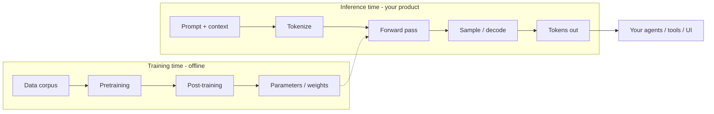
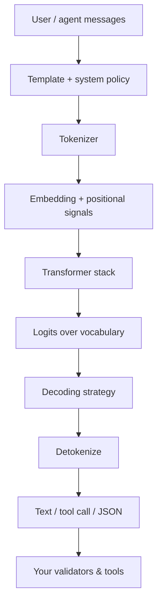
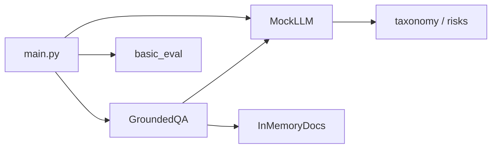

# Chapter 8: What is an LLM?

## Chapter Overview

Part I gave you the engineering foundation: Python, Git, HTTP, async I/O, and clean architecture. Part II asks a different question: **what exactly is the probabilistic component at the center of the stack?**

A Large Language Model (LLM) is not a database, not a search engine, and not a reliable reasoning engine by default. It is a **learned next-token predictor** that, at sufficient scale and with the right interfaces, becomes a flexible substrate for tools, agents, and applications.

This chapter establishes the operational definition every later chapter depends on:

- training vs inference
- parameters and scale (what “size” means in practice)
- capabilities you can plan products around
- limitations you must design against
- hallucinations as an engineering risk class
- reasoning as pattern completion under constraints—not guaranteed logic
- a high-level transformer pipeline diagram (math deferred to Chapter 9)

You will also ship a small **LLM concept lab**: typed capability/risk models, a mock model with controllable failure modes, and a first evaluation sketch for “grounded vs invented” answers—preparing the `LLMPort` path from Chapter 7 for real providers.

**Continuity:** Chapter 2 placed the LLM as the model layer (CPU analogy). Chapter 5–6 move bytes to providers. Here you understand **what those bytes mean** so tools and harnesses are not built on superstition.

---

## Learning Objectives

After completing this chapter, you can:

- Define an LLM in engineering terms (not marketing terms)
- Distinguish pretraining, post-training, and inference
- Explain parameters, context, and why scale changes behavior without guaranteeing truth
- List core capabilities relevant to agents (generation, classification, tool intent, structured output)
- Enumerate failure modes: hallucination, brittleness, non-determinism, sycophancy, data cutoff
- Design product controls that assume models can be wrong
- Run a mock LLM lab that demonstrates grounded vs ungrounded answers
- Sketch a minimal eval that flags likely unsupported claims

---

## Prerequisites

- Part I complete (especially Chapters 2, 5, 7)
- Comfort with typed Python and ports/adapters
- No ML research background required

---

## Motivation

A founder demos an “AI legal assistant” that quotes case law. Investors applaud. Two weeks later counsel discovers the citations do not exist.

The model did what models do: produce **fluent, plausible language**. The product failed because the system treated fluency as authority.

Engineering response:

1. Treat model text as **untrusted** until verified  
2. Separate **generation** from **grounding** (retrieval, tools, rules)  
3. Measure hallucination risk with evals before launch  
4. Constrain high-stakes actions with human approval and tool allowlists  

This chapter builds the vocabulary for that response.

---

## First Principles

### 1. LLMs predict tokens; applications need truth

Next-token prediction optimizes for likely continuations, not for database correctness.

### 2. Training ≠ deployment behavior guarantees

Post-training (instruction tuning, preference optimization, tool training) shapes behavior, but does not install a perfect world model or real-time knowledge.

### 3. Capability without control is liability

Long context, tool calling, and coding skill increase blast radius if harnesses are weak.

### 4. Non-determinism is normal

Temperature, sampling, provider updates, and prompt drift change outputs. Design tests and evals accordingly.

### 5. “Reasoning” is useful and fallible

Chain-of-thought style behavior can improve multi-step tasks and still invent intermediate steps.

### 6. Interfaces matter as much as models

The same model is safe or dangerous depending on tools, prompts, retrieval, and budgets (your platform).

---

## Mental Model



| Analogy (Ch 2) | LLM reality |
|---|---|
| CPU | Runs a learned program (weights) over tokens |
| RAM | Context window (limited working set) |
| Disk | External memory/retrieval—not inside weights by default |

Weights are a **lossy compression of training data patterns**, not a queryable archive of the internet.

---

## Core Theory

### What is an LLM?

**Engineering definition:**  
An LLM is a parameterized neural model trained to assign probabilities to token sequences and to generate tokens conditioned on prior context, typically using the transformer architecture at large scale.

**Practical definition for builders:**  
A managed API (or local runtime) that maps `messages + optional tools/schemas` → `text | structured data | tool calls`, with latency, cost, and error characteristics you must engineer around.

### Training vs inference

| Phase | When | Who usually runs it | Your job as app engineer |
|---|---|---|---|
| Pretraining | Offline, expensive | Labs / vendors | Choose base capability |
| Mid/post-training | Offline | Vendors / fine-tuners | Align to instructions/tools |
| Inference | Online, per request | You + provider | Latency, cost, safety, eval |

You will rarely pretrain. You will **always** own inference integration quality.

### Parameters

“7B”, “70B”, “frontier” refer roughly to **learnable weights**. More parameters often mean:

- stronger in-context learning  
- better tool-use and coding (on average)  
- higher cost and latency  

They do **not** mean:

- always factual  
- immune to prompt injection  
- stable across versions  

Treat model IDs as **versioned dependencies**, not eternal constants.

### Capabilities (product-relevant)

| Capability | Agent relevance |
|---|---|
| Open-ended generation | Drafting, planning narratives |
| Classification / routing | Workflow branches |
| Extraction | Structured fields from text |
| Summarization | Context compression (Ch 12) |
| Code generation | Coding agents (later) |
| Tool/function intent | Tool calling (Ch 14) |
| Multimodal (some models) | Image/docs inputs |

Capabilities are **probabilistic distributions over behaviors**, not SLA guarantees.

### Limitations

1. **Knowledge cutoff / staleness** — training data ends; live facts need tools/retrieval  
2. **Hallucination** — fluent falsehoods  
3. **Context limits** — finite window (Ch 10)  
4. **Instruction brittleness** — small prompt changes, big behavior shifts  
5. **Inconsistency** — same prompt, different samples  
6. **Weak exact math/logic** without tools  
7. **Sycophancy / overconfidence** — sounds sure when wrong  
8. **Safety residual risk** — filters fail; design defense in depth  

### Hallucinations

**Hallucination (operational):** model output that is presented as fact but is unsupported by provided context, tools, or verifiable sources.

Types you will design for:

| Type | Example | Mitigation |
|---|---|---|
| Factual invention | Fake citation | Retrieval + citation requirement + verify |
| Faithfulness error | Misstates a provided doc | Grounded prompts + span checks |
| Tool hallucination | Invents tool results | Execute tools; never trust claimed side effects |
| Schema hallucination | Invalid JSON/fields | Structured outputs + validation (Ch 13) |

**Rule:** high-stakes claims require grounding or refusal.

### Reasoning

Modern models can perform multi-step decompositions that look like reasoning. Engineering stance:

- Use it for planning sketches and intermediate structure  
- Verify with tools, unit tests, or formal checks when correctness matters  
- Do not ship “the model thought hard” as an audit trail without logs of tools/evidence  

### High-level inference pipeline



Chapter 9 deepens attention and layers. Here, remember: **your code surrounds this pipeline**—policies before, validation after.

### LLMs in the agent stack

```text
Application
  → Harness (budgets, cancel)
    → Agent loop
      → LLM  ← this chapter
      → Tools / retrieval / memory
```

The LLM proposes; **tools and policies dispose**.

---

## Architecture

### Chapter 8 lab package

```text
code/chapter-008/
  llm_concepts/
    taxonomy.py      # capabilities, risks, training phases
    messages.py      # chat message types
    mock_llm.py      # controllable mock model
    grounding.py     # simple grounded QA over a doc store
    eval_basic.py    # heuristic unsupported-claim checks
  main.py
  tests/
```



This lab does **not** call paid APIs by default. It teaches failure modes you will still see with frontier models.

---

## Internal Implementation

### Taxonomy

```python
class TrainingPhase(str, Enum):
    PRETRAINING = "pretraining"
    POST_TRAINING = "post_training"
    INFERENCE = "inference"

class Capability(str, Enum):
    GENERATION = "generation"
    CLASSIFICATION = "classification"
    EXTRACTION = "extraction"
    TOOL_INTENT = "tool_intent"
    CODE = "code"

class RiskClass(str, Enum):
    HALLUCINATION = "hallucination"
    STALE_KNOWLEDGE = "stale_knowledge"
    NON_DETERMINISM = "non_determinism"
    PROMPT_INJECTION = "prompt_injection"
    OVERCONFIDENCE = "overconfidence"
```

### Mock LLM with modes

```python
class MockMode(str, Enum):
    ECHO = "echo"
    GROUNDED = "grounded"
    HALLUCINATE = "hallucinate"

class MockLLM:
    def complete(self, prompt: str, *, context: str | None = None) -> str:
        if mode is HALLUCINATE:
            return "According to Case 99-ZZZ (fictional)..."
        if mode is GROUNDED and context:
            return answer_from_context(prompt, context)
        return f"ECHO: {prompt}"
```

### Grounded QA skeleton

Provide documents; answer only if keyword/overlap evidence exists; otherwise refuse.

### Basic eval

Flag answers that:

- contain fake citation patterns when no sources provided  
- assert numbers not present in context  
- refuse correctly when context is empty  

---

## Production Implementation

### Product rules that fall out of this chapter

| Stake level | Control |
|---|---|
| Creative draft | Light review |
| Customer-facing facts | Retrieval + citations + sampling checks |
| Money / legal / medical | Tools + human approval + strong eval gates |
| Side effects (email, refunds) | Never from free-text alone |

### Versioning models

Pin model IDs in config. Record `model`, `provider`, `request_id`, prompt hash in run logs. When quality drops, you need bisectability (Chapter 4 history discipline).

### Dual-path architecture

```text
Ungrounded chat  →  labeling / ideation
Grounded path    →  retrieval → LLM → validate → answer
Action path      →  LLM intent → typed tool → result → LLM summarize
```

Do not force every feature through one “just chat” path.

---

## Framework Implementation

Frameworks often default to “send messages to a model.” Your job:

- map framework “memory” to real memory design (later)  
- ensure tool results are injected, not imagined  
- add eval hooks the framework may lack  

Framework convenience never removes hallucination risk.

---

## Trade-offs

| Choice | Pros | Cons |
|---|---|---|
| Larger model | Stronger general skill | Cost, latency |
| Smaller model | Cheap, fast | More scaffolding needed |
| Always retrieve | Better faithfulness | Complexity, latency |
| Never retrieve | Simple | Stale + hallucination |
| High temperature | Creative | Unstable |
| Temperature 0 | More deterministic | Still not guaranteed truth |

---

## Debugging

| Symptom | Hypothesis | Action |
|---|---|---|
| Invented APIs/docs | Ungrounded generation | Add retrieval / link tools |
| Inconsistent answers | Sampling / prompt drift | Pin model; lower temperature; golden tests |
| Ignores instructions | Prompt conflict / long context loss | Simplify system policy; move rules earlier |
| “Confident” wrong math | No tool | Calculator/code tool |
| Sudden quality drop | Provider model swap | Pin version; compare logs |

---

## Performance

At inference:

- latency ≈ queue-to-first-token + token generation  
- cost ≈ tokens in + tokens out (+ tool calls)  

Async (Ch 6) helps multi-request fan-out; it does not make a single giant completion free. Later chapters cover caching and routing.

---

## Security

| Risk | Why LLMs change the game |
|---|---|
| Prompt injection | Untrusted text becomes instructions |
| Data exfil via tools | Model can be manipulated to call tools |
| Training-data leakage | Rare but non-zero; don’t put secrets in prompts |
| Over-trust UI | Users believe fluent lies |

Security controls live in **harness + tools + validation**, not in hoping the model “behaves.”

---

## Best Practices

1. Define LLM as untrusted component in design docs  
2. Separate grounded vs creative paths  
3. Log model id, tokens, request ids  
4. Prefer tools for facts and actions  
5. Eval faithfulness before launch  
6. Pin model versions  
7. Refuse when evidence is missing  
8. Keep system policies short and consistent  
9. Measure cost/latency per feature  
10. Teach the team failure modes, not just demos  

---

## Anti-Patterns

| Anti-pattern | Failure |
|---|---|
| “The model knows” as architecture | Hallucinated prod behavior |
| No evals, only screenshots | Regressions invisible |
| Free-text that triggers refunds | Fraud / mistakes at scale |
| Mixing secrets into prompts | Leakage |
| One mega-prompt for all tasks | Brittleness |
| Ignoring model version changes | Silent quality cliffs |

---

## Hands-on Exercise

**Time box:** 60–90 minutes.

1. Implement `code/chapter-008/llm_concepts/`.  
2. Run mock completions in `echo`, `grounded`, and `hallucinate` modes.  
3. Build a 3-document mini corpus; ask questions answerable and unanswerable.  
4. Run `basic_eval` on outputs; confirm unanswerable cases prefer refusal.  
5. Journal: list three product features in your domain and label each grounded vs creative.

---

## Mini Project

**LLM concept lab for the platform.**

Deliverables:

1. Taxonomy enums + descriptions  
2. `MockLLM` with explicit modes  
3. `GroundedQA` over in-memory docs  
4. Heuristic eval report (JSON)  
5. CLI commands: `explain`, `ask`, `eval-demo`  
6. README mapping lab → future real `LLMPort` adapter  

Acceptance:

- offline tests green  
- hallucinate mode deliberately fails faithfulness checks  
- grounded mode answers from docs or refuses  

---

## Chapter Deliverables

| Artifact | Location |
|---|---|
| Manuscript | `book/chapter-008.md` |
| Concept lab | `code/chapter-008/` |
| Tests | `code/chapter-008/tests/` |
| Diagrams | `diagrams/mermaid/chapter-008/` |

---

## Interview Questions

1. What does an LLM optimize for during pretraining?  
2. Difference between training and inference for app engineers?  
3. Why can larger models still hallucinate?  
4. Define hallucination operationally.  
5. How should an agent treat model-claimed tool results?  
6. What is a knowledge cutoff problem?  
7. When is temperature > 0 appropriate?  
8. How do ports/adapters help with multi-provider LLMs?  
9. Name three mitigations for factual QA.  
10. Why pin model versions?

**Concise model answers**

1. Next-token likelihood on training data.  
2. Training builds weights offline; inference serves tokens online under your SLOs.  
3. Objective isn’t guaranteed truth; distributional generation.  
4. Fluent unsupported/false claims relative to evidence policy.  
5. Execute tools; never trust claimed side effects.  
6. Weights lack fresh facts; need retrieval/tools.  
7. Creative generation; not strict extractions.  
8. Swap providers behind `LLMPort` without rewriting domain.  
9. Retrieval, citations, verification tools, refusal, evals.  
10. Reproducibility and regression control.

---

## Quiz

**Multiple choice**

1. Pretraining primarily teaches models to:  
   - A) Query live SQL  
   - B) Predict tokens from context  
   - C) Guarantee legal advice  
   - D) Manage Kubernetes  
   **Answer:** B

2. Best immediate mitigation when a model invents citations:  
   - A) Increase temperature  
   - B) Require grounding/retrieval and verification  
   - C) Remove all logs  
   - D) Disable timeouts  
   **Answer:** B

3. Inference is:  
   - A) Only offline  
   - B) The online generation step using trained weights  
   - C) Only fine-tuning  
   - D) DNS resolution  
   **Answer:** B

**True/False**

4. Fluency implies correctness. **False**  
5. Application engineers usually own pretraining clusters. **False**  
6. Tool results should be injected as observations, not imagined. **True**

**Short answer**

7. Name two training-time phases and one deployment phase.  
8. Give two LLM limitations affecting agents.  
9. What does the CPU/RAM/Disk analogy map to?  
10. Why run a mock hallucinating model in tests?

**Sample answers**

7. Pretraining, post-training; inference.  
8. Hallucination; context limits (also non-determinism, stale knowledge).  
9. LLM / context window / external memory.  
10. To validate detectors and grounded paths before production.

---

## Cheat Sheet

| Term | One-liner |
|---|---|
| LLM | Large next-token model used as flexible text/tool substrate |
| Pretraining | Learn general token patterns from large corpora |
| Post-training | Shape instruction/tool behavior |
| Inference | Online token generation |
| Parameter count | Capacity proxy—not truth meter |
| Hallucination | Unsupported fluent claim |
| Grounding | Tie answers to evidence/tools |
| Eval | Measure failures before users do |

```bash
cd code/chapter-008
pytest -q
python main.py explain
python main.py ask "What is the refund window?"
python main.py eval-demo
```

---

## Curated Free Resources

- Provider “overview” docs for one frontier API (capabilities section only)  
- [Attention Is All You Need](https://arxiv.org/abs/1706.03762) — optional historical paper; Ch 9 covers concepts  
- Stanford CS324/CS25 style lecture notes (public offerings vary)—conceptual LLM intros  
- Your `BOOK_MANIFEST.md` — engineering-over-frameworks reminder  

Avoid “ultimate ChatGPT tricks” lists as architecture guidance.

---

## Chapter Summary

- An LLM is a probabilistic token generator, not a source of truth.  
- Training builds weights; inference is what your platform runs under SLOs.  
- Capabilities enable agents; limitations demand harnesses, tools, and evals.  
- Hallucinations are a primary risk class—design grounded paths.  
- Chapter 8’s lab makes failure modes tangible before real API spend.

**What changed in the project**

- `book/chapter-008.md`  
- `code/chapter-008/` concept lab (mock LLM, grounding, basic eval)  
- Transformer pipeline diagrams at conceptual level  

---

## What's Next

**Chapter 9 — Transformer Architecture** zooms into attention, layers, and decoding—still with minimal math—so “forward pass” stops being a black box when you debug latency, context, and model behavior.
