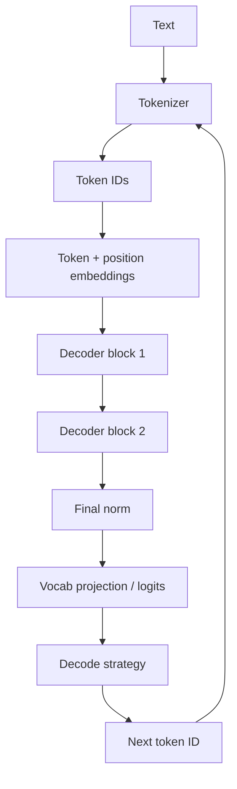
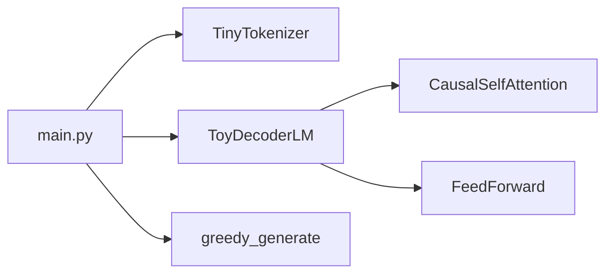
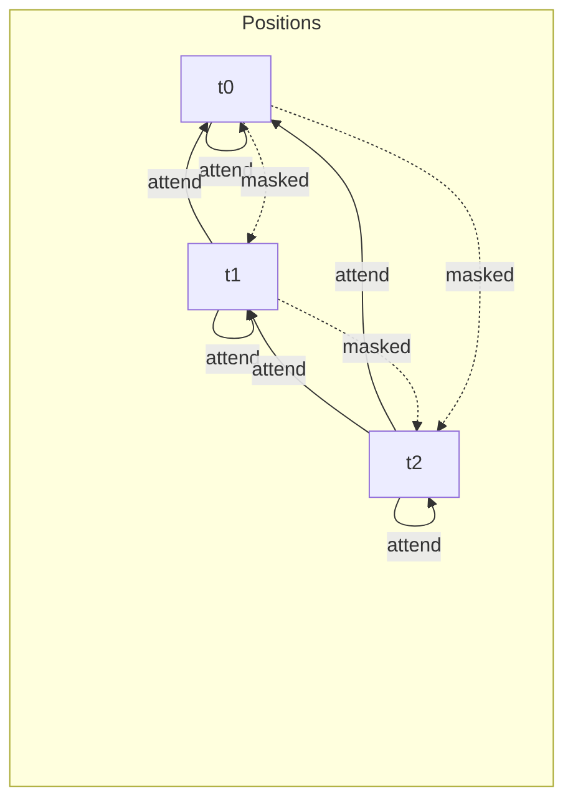
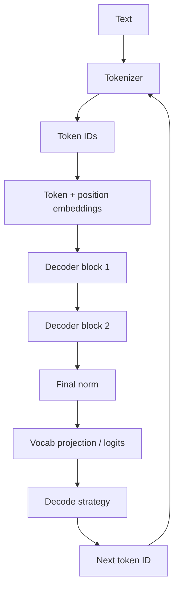

# Chapter 9: Transformer Architecture

## Chapter Overview

Chapter 8 defined an LLM as a next-token generator and sketched inference as a pipeline. This chapter opens that box—**conceptually**, without graduate-level math.

You will learn the pieces that dominate real systems work:

- tokens as the atomic I/O of models
- embeddings as vectors for meaning/context
- attention as “soft wiring” between positions
- stacked layers that refine representations
- the decoder-only pattern used by most chat/code models
- inference as repeated forward passes + decoding

You will implement a **tiny, readable transformer lab** (toy sizes, pure Python) so attention, masks, and greedy generation stop feeling magical. This is not a production model. It is a flight simulator for intuition—so when Chapter 10 discusses context windows and cost, you know *what* grows with sequence length.

**Continuity:** Chapter 8’s pipeline becomes named components. Later chapters (tokens/cost, prompting, tools) attach to this mental model.

---

## Learning Objectives

After completing this chapter, you can:

- Trace a string from text → tokens → embeddings → layers → logits → next token
- Explain self-attention in plain language (queries, keys, values)
- Describe why causal masks matter for decoder-only generation
- Sketch a decoder block: attention + feed-forward + residual connections (conceptually)
- Relate depth/width to latency and memory at a systems level
- Run a toy model that attends, masks, and generates greedily
- Debug product issues using architecture vocabulary (context length, KV growth, decode steps)

---

## Prerequisites

- Chapter 8 (LLM as inference-time generator)
- Basic Python (lists, loops, dataclasses)
- Optional: matrix multiply memory from school—formulas stay minimal

---

## Motivation

On-call alert: “p95 latency doubled after we doubled max_tokens.”

Without architecture literacy, people guess “the API is slow.” With it, you ask:

- Are we paying **prefill** cost on a huge prompt every time?  
- Is **decode** step count = new tokens?  
- Did context length force more attention work (roughly growing with sequence length)?  
- Are we streaming, or buffering the full completion?  

Transformers make those questions concrete. You do not need to derive gradients. You need to know **what the machine does per token**.

---

## First Principles

### 1. Discrete tokens, continuous vectors

Text is tokenized into IDs; IDs index embedding vectors. Everything after that is linear algebra on those vectors.

### 2. Attention is content-based routing

Each position builds a weighted mix of other positions’ values, weights from similarity of queries and keys.

### 3. Causality enables left-to-right generation

Decoder-only models mask future tokens so position *t* cannot “see” *t+1…* during training/inference for next-token prediction.

### 4. Depth refines representations

Many identical-in-structure layers stack. More depth ≠ automatic truthfulness; it does affect compute.

### 5. Inference is a loop

One forward pass predicts the next token distribution; sampling appends a token; repeat.

### 6. Systems costs follow the architecture

Sequence length, batch size, and model width/depth drive FLOPs, memory, and dollars.

---

## Mental Model



| Piece | Role | Product intuition |
|---|---|---|
| Tokenizer | String ↔ IDs | Multilingual quirks; token taxes |
| Embedding | ID → vector | Model’s atomic features |
| Attention | Mix information across positions | Long context is expensive |
| FFN | Per-position MLP | Most parameters often live here |
| Causal mask | Block future leakage | Enables autoregressive chat |
| Logits | Score per vocab token | Softmax → probabilities |
| Decode | Pick token(s) | Greedy vs sample vs beam |

---

## Core Theory

### Tokens

A tokenizer splits text into subword units (BPE, Unigram, etc.).

Implications:

- “Hello” might be 1 token; a rare name might be many  
- Spaces and punctuation are tokens too  
- Different models → different tokenizers → different costs for the same string  

Chapter 10 deepens budgeting. Here: **models never see raw characters as primary input**—they see IDs.

### Embeddings

Each token ID maps to a learned vector of size `d_model`. Positional information is added (sinusoidal, learned, RoPE in modern models—details vary).

Intuition: embeddings place tokens in a space where geometry supports attention and prediction.

### Self-attention (plain language)

For each position:

1. Build a **query** (“what am I looking for?”)  
2. Compare to all **keys** (“what does each position advertise?”)  
3. Turn similarities into weights (softmax)  
4. Take a weighted sum of **values** (“what content do I pull?”)  

```text
weights = softmax(scores(Q, K) + mask)
output  = weights · V
```

**Multi-head attention:** run several attentions in parallel with different projections, then concatenate—diverse relationship patterns (syntax, coreference, code structure).

### Causal mask

For decoder-only LMs, scores from position *i* to *j > i* are set to −∞ (or equivalent) before softmax so weight is 0 on the future.

Without this, the model could cheat in training by looking ahead.

### Decoder block (typical stack unit)

A modern decoder block roughly:

```text
x = x + Attention(Norm(x))     # residual
x = x + FFN(Norm(x))           # residual
```

Residuals and norms stabilize deep stacks. You do not need the algebra of LayerNorm to remember: **blocks transform sequences of vectors of the same length**.

### Stacks and “the model”

```text
Embedding
 → N × DecoderBlock
 → Norm
 → Linear to vocabulary size
```

Chat models are usually **decoder-only**. Encoder-decoder (T5-style) still matters for some tasks; agents mostly call decoder-only APIs today.

### Inference loop

```text
tokens = tokenize(prompt)
loop:
  logits = forward(tokens)          # focus on last position for next-token
  next_id = decode(logits)          # greedy argmax or sample
  append next_id
  stop if EOS or max_new_tokens
detokenize(tokens)
```

**Prefill:** process the prompt once (can be heavy for long context).  
**Decode:** generate new tokens one (or few) at a time; latency often dominated by steps × cost-per-step.

KV caching (systems detail): implementations cache key/value tensors so decode does not fully recompute attention over the whole past every time. You will hear “KV cache memory grows with batch × layers × sequence.”

### What we skip (on purpose)

- Backprop and training dynamics  
- Optimizer details  
- Full RoPE/FlashAttention math  
- Distributed training  

Engineers benefit most from **dataflow + cost intuition**. Specialists can go deeper later.

---

## Architecture

### Toy lab package

```text
code/chapter-009/
  toy_transformer/
    tokenizer.py      # tiny whitespace/vocab tokenizer
    tensors.py        # minimal vector/matrix helpers
    attention.py      # scaled dot-product + causal mask
    blocks.py         # embedding, FFN, decoder block, model
    generate.py       # greedy generation
  main.py
  tests/
```



Constraints of the toy:

- vocab of dozens of tokens  
- `d_model` tiny (e.g. 16–32)  
- random or fixed pseudo-weights (teaching forward shape, not quality)  
- pure Python (no GPU, no training)

---

## Internal Implementation

### Tiny tokenizer

```python
class TinyTokenizer:
    def encode(self, text: str) -> list[int]: ...
    def decode(self, ids: list[int]) -> str: ...
```

Special tokens: `<pad>`, `<bos>`, `<eos>`, `<unk>`.

### Attention

```python
def causal_mask(n: int) -> list[list[float]]:
    # 0 on allowed, large negative on future

def attention(q, k, v, mask) -> output:
    # scores = q k^T / sqrt(d)
    # softmax(scores + mask) @ v
```

### Model forward

```python
class ToyDecoderLM:
    def forward(self, token_ids: list[int]) -> list[float]:
        # returns logits for last position over vocab
```

### Greedy generate

```python
def greedy_generate(model, tokenizer, prompt, max_new_tokens=10) -> str:
    ids = tokenizer.encode(prompt)
    for _ in range(max_new_tokens):
        logits = model.forward(ids)
        next_id = argmax(logits)
        ids.append(next_id)
        if next_id == eos: break
    return tokenizer.decode(ids)
```

Because weights are toy, output text is nonsense—**the point is the control flow**.

---

## Production Implementation

### Mapping toy concepts → provider APIs

| Toy lab | Hosted API reality |
|---|---|
| `encode` | Provider tokenizer (opaque) |
| `forward` | GPU kernels + KV cache |
| `greedy_generate` | `temperature=0` completion |
| vocab logits | You usually only see sampled text/tool calls |
| causal mask | Built into decoder models |

### Systems checklist for platform engineers

1. **Prompt tokens** dominate cost when completions are short  
2. **max_tokens** caps decode steps (latency upper bound)  
3. **Long context** increases prefill and memory pressure  
4. **Streaming** returns tokens as decoded—better UX, same decode work  
5. **Batching** (server side) amortizes overhead—you rarely control it fully on SaaS  

### Debugging with architecture words

| Symptom | Architectural angle |
|---|---|
| Slow first token | Prefill / queue / cold start |
| Slow overall completion | Many decode steps |
| Quality drop at long prompts | Attention dilution / lost-in-the-middle (later RAG) |
| OOM on local models | Weights + KV cache + batch |

---

## Framework Implementation

Frameworks may expose “LLM graphs” without teaching attention. When they mention:

- sliding window / attention implementations  
- speculative decoding  
- quantization  

…map them back to: **same dataflow, different systems optimizations**. Your contracts (messages, tools, validation) stay above this layer.

---

## Trade-offs

| Design | Benefit | Cost |
|---|---|---|
| Deeper models | Often stronger | Latency, price |
| Longer context | More room for docs | Quadratic-ish attention cost classically; still pricey |
| Greedy decode | Stable | Less diverse |
| Sampling | Creative | Flaky tests |
| Local full weights | Control | Ops burden |
| Hosted API | Leverage | Less visibility into internals |

---

## Debugging

| Lab issue | Cause |
|---|---|
| Softmax NaNs | Forgot mask on +inf/-inf handling |
| Attention peeks at future | Mask not applied |
| Generation infinite | Missing EOS / max_new_tokens |
| Shape errors | d_model mismatch in projections |

| Production issue | Questions |
|---|---|
| Token bill spike | Did tokenizer or prompt template change? |
| Latency cliff at 8k context | Prefill cost; truncate/summarize |

---

## Performance

Rough intuition (not exact modern kernel math):

- Attention mixes information across **sequence length**  
- FFN applies heavy per-token work across **width**  
- Decode repeats work per **new token**  

Optimizations you will hear about: KV cache, FlashAttention, continuous batching, speculative decoding, quantization—all keep the same conceptual architecture.

---

## Security

Architecture-aware security notes:

- **Prompt injection** rides the same attention pathways that make models follow instructions—untrusted text in context can dominate  
- **Logits leakage** (rare in APIs) could reveal info; treat provider outputs as data  
- **Local model supply chain** — weights are code-like artifacts; verify sources  

---

## Best Practices

1. Keep a one-page architecture sketch in the team wiki  
2. Separate prefill vs decode when analyzing latency  
3. Budget tokens with tokenizer awareness (Ch 10)  
4. Prefer streaming for UX on long generations  
5. Don’t expect architectural depth alone to fix hallucinations  
6. Use toy models to teach new engineers the loop  
7. Pin model versions; internals still change  
8. Log token counts and latency phases when providers expose them  
9. Design agents assuming attention over long noisy context is imperfect  
10. Measure before blaming “the transformer”  

---

## Anti-Patterns

| Anti-pattern | Why |
|---|---|
| Treating the model as a DB index | Wrong abstraction |
| Ignoring tokenizer differences across models | Silent cost/behavior shifts |
| Unlimited max_tokens | Tail latency bombs |
| Debugging only final text | Miss prefill/decode structure |
| Reimplementing production transformers in app code | Use providers/kernels |

---

## Hands-on Exercise

**Time box:** 60–90 minutes.

1. Implement `toy_transformer` modules.  
2. Print attention weights for a 4-token sequence; confirm upper triangle is ~0 under causal mask.  
3. Run greedy generation for 5 steps; show token IDs each step.  
4. Change `d_model` and confirm shapes still align (tests).  
5. Journal: in your product, is user latency more prefill-bound or decode-bound?

---

## Mini Project

**Toy decoder LM lab.**

Deliverables:

1. Tokenizer with encode/decode  
2. Causal self-attention + tests for masking  
3. Stacked decoder blocks + logits at last position  
4. Greedy generation CLI  
5. Diagram export or ASCII dump of attention weights  
6. README: mapping toy parts → real API concepts  

Acceptance:

- offline tests prove causal mask blocks future  
- forward returns vocab-sized logits  
- generate stops on EOS or max steps  

---

## Visual diagrams






## Chapter Deliverables

| Artifact | Location |
|---|---|
| Manuscript | `book/chapter-009.md` |
| Toy transformer | `code/chapter-009/toy_transformer/` |
| Tests | `code/chapter-009/tests/` |
| Diagrams | `diagrams/mermaid/chapter-009/` |

---

## Interview Questions

1. What is self-attention doing?  
2. Why causal masks in decoder-only LMs?  
3. Token vs embedding?  
4. Prefill vs decode?  
5. What is a residual connection’s role (intuitively)?  
6. Why might longer prompts increase latency?  
7. Multi-head attention purpose?  
8. Where do logits live in the pipeline?  
9. Why won’t studying architecture alone stop hallucinations?  
10. How does KV cache help decode?

**Concise model answers**

1. Weighted mixing of positions based on similarity.  
2. Prevent looking at future tokens when predicting next.  
3. Token=ID; embedding=vector for that ID (+ position).  
4. Prefill processes prompt; decode emits new tokens step by step.  
5. Ease deep stacking by letting layers add refinements.  
6. More tokens to process in attention/prefill.  
7. Multiple relationship patterns in parallel.  
8. Pre-softmax scores over vocabulary for next token.  
9. Objective isn’t guaranteed world truth.  
10. Reuse past keys/values instead of full recompute each step.

---

## Quiz

**Multiple choice**

1. Causal masking prevents:  
   - A) GPU overheating  
   - B) Attending to future positions  
   - C) JSON mode  
   - D) HTTP retries  
   **Answer:** B

2. Logits are:  
   - A) Final user-facing strings only  
   - B) Raw scores over vocabulary before/around decoding  
   - C) SQL queries  
   - D) Git commits  
   **Answer:** B

3. Decoder-only stack is most associated with:  
   - A) Autoregressive next-token models  
   - B) Only vision CNNs  
   - C) DNS  
   - D) CSS layout  
   **Answer:** A

**True/False**

4. Transformers require you to hand-write GPU kernels to call hosted APIs. **False**  
5. Attention weights always guarantee correct citations. **False**  
6. Generation repeatedly runs forward passes as tokens append. **True**

**Short answer**

7. Name the three attention matrices Q, K, V in words.  
8. What does the tokenizer produce?  
9. Give one systems reason max_tokens matters.  
10. What is residual addition doing at a high level?

**Sample answers**

7. Query, Key, Value.  
8. Token ID sequences.  
9. Bounds decode steps/latency/cost.  
10. Let layers refine without overwriting the stream blindly.

---

## Cheat Sheet

```bash
cd code/chapter-009
pytest -q
python main.py encode "hello agent world"
python main.py attend
python main.py generate "hello" --max-new-tokens 5
```

| Stage | Output |
|---|---|
| tokenize | `list[int]` |
| embed | vectors `[T, d]` |
| attend | mixed vectors `[T, d]` |
| project | logits `[vocab]` at last t |
| decode | next token id |

**Remember:** mask the future; loop to generate; cost tracks tokens and steps.

---

## Curated Free Resources

- [The Illustrated Transformer](https://jalammar.github.io/illustrated-transformer/) — visual intuition  
- [Attention Is All You Need](https://arxiv.org/abs/1706.03762) — original paper (skim concepts)  
- [Harvard NLP annotated transformer](https://nlp.seas.harvard.edu/annotated-transformer/) — optional code reading  
- Chapter 8 manuscript — training vs inference framing  

---

## Chapter Summary

- Transformers turn tokens into embeddings, mix them with attention, refine via stacked blocks, and emit logits for the next token.  
- Causal masks make decoder-only generation possible.  
- Inference is prefill + iterative decode—the root of latency and cost patterns.  
- A toy implementation builds transferable vocabulary for systems debugging.  
- Architecture literacy supports platform engineering; it does not replace grounding and evals.

**What changed in the project**

- `book/chapter-009.md`  
- `code/chapter-009/toy_transformer/`  
- Attention and stack diagrams  

---

## What's Next

**Chapter 10 — Tokens & Context Windows** turns this architecture into budgeting: tokenization details, context limits, compression, and cost control for production prompts and agent traces.
