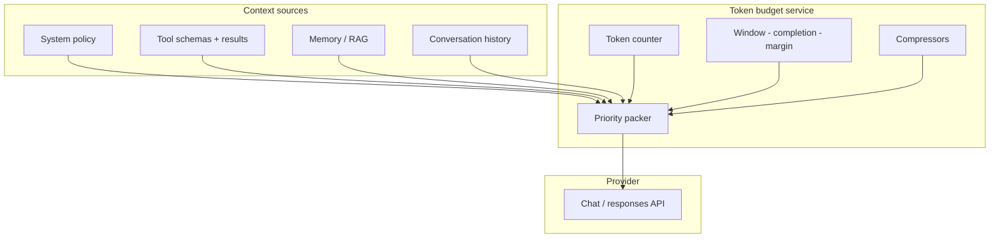
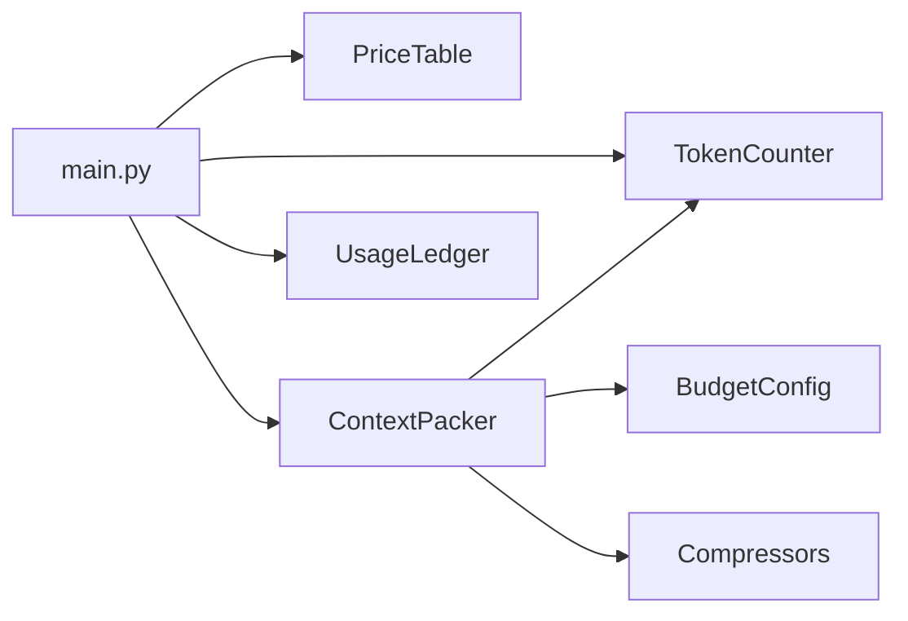
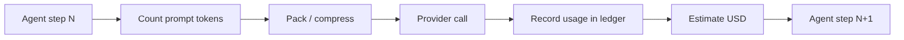
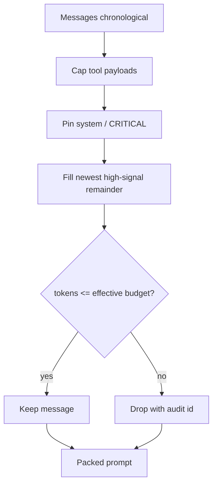

# Chapter 10: Tokens & Context Windows

## Chapter Overview

Chapter 9 showed that models consume **token IDs**, not raw strings, and that inference cost tracks sequence length and decode steps. This chapter turns that fact into **production budget engineering**.

You will learn to:

- measure tokens the way platforms bill and limit them
- design prompts and agent traces that fit context windows
- estimate cost before shipping features
- compress and prioritize context without silent corruption
- implement a **token calculator and context packer** used by later agent harnesses

In agent systems, context is a scarce resource shared by system policy, tools, retrieval passages, memory, and conversation history. Overflow is not a UX inconvenience—it is a reliability and security failure mode (dropped instructions, truncated tools, lost audit trails).

**Continuity:** Chapter 5–6 move HTTP; Chapter 8–9 define the model. Here you meter the **fuel** (tokens) and the **tank size** (context window).

---

## Learning Objectives

After completing this chapter, you can:

- Explain why the same English string tokenizes differently across models
- Compute prompt, completion, and total token estimates for chat messages
- Map provider context limits to hard application budgets (with safety margins)
- Estimate USD cost from token counts and price tables
- Prioritize context packing under a token ceiling (system > tools > recent turns)
- Apply compression strategies: truncation, sliding window, tool-result capping, summary slots
- Instrument agent runs with token accounting fields
- Ship and test a production-minded token toolkit offline

---

## Prerequisites

- Chapters 8–9 (LLM inference + transformer token pipeline)
- Chapter 3 typing; Chapter 7 ports mindset recommended
- Basic comfort with JSON message lists

---

## Motivation

Three production incidents, one root class:

1. **Silent instruction drop** — system policy no longer fits after a long tool dump; model “forgets” safety rules.  
2. **Cost spike** — agent retries re-send a 40k-token transcript every step.  
3. **Hard 400 from provider** — context_length_exceeded in the customer path; no preflight check.

All are token/context failures. The fix is not “use a bigger model” alone. The fix is **metering, budgets, packing, and compression** as first-class platform services.

---

## First Principles

### 1. Tokens are the unit of limit, latency, and money

APIs meter tokens. Context windows are token-bounded. Prefill cost scales with input tokens.

### 2. Tokenization is model-specific

Never assume `words ≈ tokens`. Code, non-English text, and markup often expand.

### 3. Reserve capacity deliberately

A context window is not 100% usable for free-form chat. Reserve for:

- system policy  
- tool schemas / definitions  
- max completion tokens  
- safety margin  

### 4. Newest high-signal context wins under pressure

When truncating, prefer recent observations and immutable policy over ancient chit-chat—unless compliance requires full retention (then summarize offline).

### 5. Measure before mutate

Log estimated tokens at pack time; fail closed or compress when over budget.

### 6. Compression changes meaning

Summaries and truncations are lossy. Record what was dropped for audit.

---

## Mental Model



| Concept | Meaning |
|---|---|
| Context window | Max tokens model can attend over (prompt+often completion policy-dependent) |
| Prompt tokens | Tokens sent as input |
| Completion tokens | Tokens generated |
| Effective budget | `window - max_completion - margin - reserved_blocks` |
| Packing | Selecting/ordering messages to fit budget |
| Compression | Reducing tokens while preserving task signal |

---

## Core Theory

### Tokenization

Modern LLMs use subword tokenizers (BPE / Unigram). Practical consequences:

| Content | Typical token pressure |
|---|---|
| Plain English prose | ~0.6–0.8 tokens/word (rule of thumb only) |
| Code | Often denser (symbols, identifiers) |
| Base64 / hex | Very dense |
| JSON with verbose keys | Easy to bloat |
| Non-English scripts | Highly model-dependent |

**Engineering rule:** estimate with a real or faithful tokenizer for the target model family; treat heuristics as fallbacks.

### Costs

Cost model (simplified):

```text
cost ≈ in_tokens * price_in + out_tokens * price_out
```

Platform features that multiply cost:

- retries (full prompt resend)  
- multi-agent debate  
- verbose tool dumps in-loop  
- high `max_tokens`  

### Prompt limits vs context limits

Providers enforce:

- absolute context length  
- per-request size  
- sometimes separate output caps  

Your application should enforce **stricter** budgets to leave room for completion and variance between estimators and server tokenizers.

### Compression strategies

| Strategy | When | Risk |
|---|---|---|
| Tail truncation | Drop oldest messages | Lose early constraints |
| Sliding window | Keep last K turns | Same |
| Tool-result cap | Truncate large tool payloads | Lose details |
| Schema shrinking | Shorter tool defs | Weaker tool use |
| Summary slot | Replace old turns with summary | Summary error |
| RAG instead of paste | Retrieve top chunks | Retrieval miss |

### Prompt budgeting for agents

Recommended reserved layout (example for 128k model—tune per product):

```text
system + policies           5–15%
tool definitions            5–20%
working memory / RAG        20–40%
recent transcript           remainder
max_completion              fixed reservation
safety margin               2–5%
```

### Accounting fields (run records)

Every LLM call should record:

- `model`  
- `tokenizer_name` / estimator  
- `prompt_tokens_est`  
- `completion_tokens_est` or provider usage  
- `budget_limit`  
- `truncated` / `dropped_message_ids`  

This is how you debug cost and overflow later.

---

## Architecture

### Chapter 10 package

```text
code/chapter-010/
  token_kit/
    types.py              # Message, BudgetConfig, TokenUsage, PackResult
    tokenizers.py         # TokenCounter protocol + implementations
    pricing.py            # model price table + cost estimate
    budget.py             # effective budget calculation
    packer.py             # priority packing + truncation
    compress.py           # tool cap, sliding window, summary placeholder
    accounting.py         # run-level usage ledger
  main.py
  tests/
```



Design goals:

- no network required for core paths  
- swappable tokenizer backends  
- deterministic packing for tests  
- clear audit of dropped content  

---

## Internal Implementation

### Token counters

```python
class TokenCounter(Protocol):
    name: str
    def count_text(self, text: str) -> int: ...
    def count_messages(self, messages: list[ChatMessage]) -> int: ...
```

Implementations:

1. **`ApproxCl100kCounter`** — regex-based OpenAI-ish approximation (offline, dependency-free)  
2. **`CharHeuristicCounter`** — `ceil(len/4)` fallback  
3. **`TiktokenCounter`** (optional) — if `tiktoken` installed  

### Budget

```python
effective = context_window - max_completion - margin - reserved_system - reserved_tools
```

### Packer priority

1. System messages (never drop without explicit override)  
2. Tool definitions block  
3. Newest user/assistant/tool messages first when filling remainder  
4. Emit `PackResult` with `kept`, `dropped`, `tokens_est`, `over_budget`  

### Calculator CLI

```bash
python main.py count --text "hello"
python main.py cost --model gpt-4.1 --input 1200 --output 400
python main.py pack --budget 500 --messages-file sample.json
python main.py agent-report --messages-file sample.json --window 8192
```

---

## Production Implementation

### Preflight gate

Before calling a provider:

```text
if pack.tokens_est + max_completion + margin > context_window:
    compress or fail
```

Failing open (send anyway) produces intermittent 400s and truncated policies.

### Multi-model routing

Different models → different tokenizers and windows. Budget service must take `model_id` as input, not global constants.

### Tool results

Cap tool payloads at ingestion time (e.g. 2–4k tokens) with clear `truncated: true` markers so the model knows data is incomplete.

### Caching

Prompt prefix caching (provider-specific) rewards stable system/tool prefixes. Keep static policy tokens identical across calls when possible.

### Human-in-the-loop products

Show users approximate token/cost meters for power features (batch analysis, site-wide summarization).

---

## Framework Implementation

LangChain/LlamaIndex/etc. often auto-trim history. Treat framework trim as **untrusted**:

- verify what was dropped  
- enforce your priority order  
- keep system policy pinned  

Your packer should sit behind `LLMPort` so every provider path shares one budget brain.

---

## Trade-offs

| Approach | Pros | Cons |
|---|---|---|
| Bigger context model | Simpler packing | Cost, latency, distraction |
| Aggressive summarization | Fits window | Information loss |
| Strict preflight fail | Predictable | UX friction |
| Soft truncate always | Always calls model | Silent policy loss |
| Exact tokenizer dep | Accuracy | Extra dependency / versioning |
| Heuristic only | Simple | Billing mismatch |

**Book default:** approximate faithfully offline; optional exact backend; always reserve completion+margin; never drop system without explicit strategy.

---

## Debugging

| Symptom | Check |
|---|---|
| context_length_exceeded | Packer not used; wrong window; completion not reserved |
| Policy ignored mid-session | System truncated; long tool dump |
| Cost 10× expected | Retries; full history each step; huge tools |
| Estimator drift vs bill | Different tokenizer; message formatting tokens |
| Agent loops get dumber | Sliding window cut task goals |

---

## Performance

- Counting tokens is cheap vs model I/O—run it every call  
- Avoid packing algorithms that are O(n²) on huge histories without need  
- Prefer incremental accounting in agent loops (add tokens of new tool result, subtract dropped)  

Async (Ch 6) does not reduce tokens; it only overlaps waits.

---

## Security

| Risk | Token/context angle |
|---|---|
| Prompt injection via tools | Huge untrusted tool text dominates attention—cap and isolate |
| Secret leakage | Secrets in history inflate risk surface—redact before pack |
| Policy stripping | Truncation that removes system rules is a security bug |
| User data retention | Summaries may still contain PII—treat as sensitive |

---

## Best Practices

1. Budget as a shared platform service  
2. Reserve completion + margin always  
3. Pin system policy; compress elsewhere first  
4. Cap tool results at the boundary  
5. Log usage every LLM call  
6. Model-specific windows and tokenizers  
7. Preflight before provider HTTP  
8. Mark truncations explicitly in content  
9. Load-test packing with adversarial long tool dumps  
10. Align product UX with cost meters for heavy features  

---

## Anti-Patterns

| Anti-pattern | Failure |
|---|---|
| `len(text)//4` only forever | Surprise bills and 400s |
| Unbounded history append | Death by transcript |
| Dropping system first | Safety/policy wipe |
| Pasting entire PDFs into prompts | Context + cost explosion |
| Ignoring completion reservation | Cannot generate answer |
| No audit of drops | Undebuggable agents |

---

## Hands-on Exercise

**Time box:** 60–90 minutes.

1. Implement `token_kit` with counter, pricing, packer, ledger.  
2. Count tokens for English vs code strings; compare.  
3. Pack a 20-message transcript into 800 tokens; inspect drops.  
4. Cap a 50k-character tool result; ensure marker present.  
5. Produce an agent report JSON with estimated cost for a mock model.  

---

## Mini Project

**Production token calculator + context packer.**

Deliverables:

1. Pluggable `TokenCounter`  
2. Price table + cost estimator  
3. `BudgetConfig` + effective budget math  
4. `ContextPacker` with priorities and audit  
5. Compressors: sliding window, tool cap  
6. `UsageLedger` for multi-step agents  
7. CLI + fixtures + tests  
8. README with integration notes for `LLMPort`  

Acceptance:

- offline tests green  
- packing never exceeds budget in tests  
- system messages retained under default policy  
- cost estimate matches `in*pin + out*pout`  

---

## Visual diagrams






## Chapter Deliverables

| Artifact | Location |
|---|---|
| Manuscript | `book/chapter-010.md` |
| Token toolkit | `code/chapter-010/token_kit/` |
| Tests | `code/chapter-010/tests/` |
| Diagrams | `diagrams/mermaid/chapter-010/` |
| Sample fixtures | `code/chapter-010/fixtures/` |

---

## Interview Questions

1. Why can two models bill differently for the same prompt string?  
2. How do you compute an effective input budget?  
3. What should be dropped first under pressure?  
4. How do tool results threaten context windows?  
5. Difference between estimator tokens and provider usage?  
6. Design token fields on an agent run record.  
7. When is summarization better than truncation?  
8. How does max_completion interact with packing?  
9. Security risk of naive truncation?  
10. How would you test a packer?

**Concise model answers**

1. Different tokenizers and message framing.  
2. window − completion − margin − reserved blocks.  
3. Oldest low-priority chat—not system policy.  
4. Unbounded payloads crowd out instructions.  
5. Local estimate vs billed ground truth.  
6. model, in/out tokens, drops, budget, cost.  
7. When older turns carry durable facts you still need.  
8. Must reserve space or generation fails/truncates.  
9. Dropping safety policy.  
10. Fixtures with known counts; assert invariants.

---

## Quiz

**Multiple choice**

1. Best unit for context limits:  
   - A) Characters only  
   - B) Tokens  
   - C) PDF pages  
   - D) HTTP headers  
   **Answer:** B

2. Effective input budget should subtract:  
   - A) Only emoji count  
   - B) max completion + margin (+ reserved)  
   - C) GPU temperature  
   - D) Git commits  
   **Answer:** B

3. Under overflow, default drop:  
   - A) System policy first  
   - B) Oldest low-priority history first  
   - C) All tool schemas always  
   - D) Model id  
   **Answer:** B

**True/False**

4. `words ≈ tokens` is exact for all languages. **False**  
5. Provider usage fields should be logged when available. **True**  
6. Unbounded tool dumps are safe in 128k windows always. **False**

**Short answer**

7. Formula for rough USD cost?  
8. Name three compression strategies.  
9. What is a safety margin for?  
10. Why mark truncated tool output?

**Sample answers**

7. in×price_in + out×price_out.  
8. Sliding window, tool cap, summary slot.  
9. Estimator drift / formatting overhead.  
10. So the model knows data is incomplete.

---

## Cheat Sheet

```bash
cd code/chapter-010
pytest -q
python main.py count --text "def foo():\n  return 1"
python main.py cost --model gpt-4.1 --input 1000 --output 500
python main.py pack --budget 600 --messages-file fixtures/sample_messages.json
python main.py agent-report --messages-file fixtures/sample_messages.json --window 8192
```

| Item | Rule |
|---|---|
| Count | model-faithful tokenizer when possible |
| Budget | window − completion − margin − reserved |
| Pack | system pinned; newest first for chat |
| Tools | cap + `truncated` marker |
| Log | usage every call |

---

## Curated Free Resources

- OpenAI/Anthropic tokenizer docs for your primary provider  
- [tiktoken](https://github.com/openai/tiktoken) (optional exact OpenAI counts)  
- Provider pricing pages (pin date in your price table)  
- Chapter 9 — why sequence length hurts  

---

## Chapter Summary

- Tokens meter limits, latency, and cost; context windows are hard constraints.  
- Tokenization is model-specific—measure, don’t guess forever.  
- Production systems pack and compress under explicit budgets with audit trails.  
- Agent loops need ongoing accounting, not one-time prompt sizing.  
- Chapter 10 delivers a token calculator, packer, and ledger for the platform.

**What changed in the project**

- `book/chapter-010.md`  
- `code/chapter-010/token_kit/` production-minded toolkit  
- Budget/packing diagrams and fixtures  

---

## What's Next

**Chapter 11 — Prompt Engineering** builds on budgets: system policies, patterns, and few-shot design that fit windows and survive packing—without turning prompts into untestable folklore.
