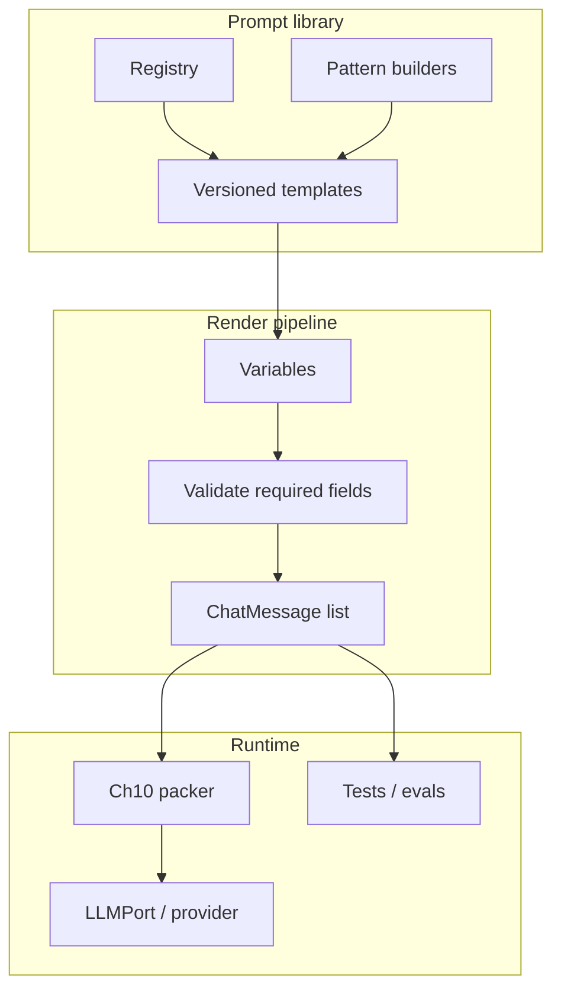
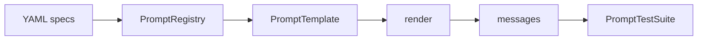

# Chapter 11: Prompt Engineering

## Chapter Overview

Chapters 8–10 established what models are, how they run, and how tokens budget context. This chapter treats **prompts as versioned software artifacts**—not chat folklore pasted into dashboards.

Production prompt engineering is the craft of specifying:

- roles and system policy  
- task instructions and hard constraints  
- zero-shot vs few-shot patterns  
- reasoning scaffolds (without worshipping chain-of-thought)  
- input variables and output contracts  
- tests that catch regressions when models or templates change  

You will ship a **prompt library**: typed templates, a registry with semver-ish versions, renderers, pattern builders, and a small test harness. Later chapters (tools, agents, evals) load prompts from this library instead of scattering string literals.

**Continuity:** Chapter 10 packs messages under budgets. Chapter 11 defines *what those messages should contain* and how to keep them maintainable.

---

## Learning Objectives

After completing this chapter, you can:

- Distinguish system, developer, and user message responsibilities
- Apply zero-shot, few-shot, role, and constraint patterns deliberately
- Structure prompts with clear inputs, steps, and output contracts
- Version prompts and render them with validated variables
- Write prompt unit tests (structure, required sections, token ceilings)
- Avoid anti-patterns: mega-prompts, conflicting rules, untested lore
- Integrate a prompt library with message lists for LLM calls
- Use reasoning prompts cautiously under cost and latency budgets

---

## Prerequisites

- Chapters 8–10 (LLM behavior, architecture intuition, tokens/budgets)
- Chapter 3 typing; Chapter 7 ports mindset
- Familiarity with chat message lists (`system` / `user` / `assistant`)

---

## Motivation

A team “improves” the agent by editing a 400-line system prompt in a Notion doc. Three things break silently:

1. Refund policy text conflicts with a newer tool schema.  
2. Few-shot examples teach the model to invent ticket IDs.  
3. Nobody knows which production version ran during an incident.

Prompt engineering without **registry + tests + review** is configuration debt with model-amplified blast radius.

---

## First Principles

### 1. Prompts are code

They need ownership, review, versioning, and tests.

### 2. Separate policy from task

System policy (safety, persona, non-negotiables) should change slowly. Task instructions change per feature.

### 3. Constraints beat vibes

“Be careful” loses to “Never invent order IDs; if unknown, say unknown.”

### 4. Examples are training data

Few-shots teach style *and* failure modes. Curate them like fixtures.

### 5. Reasoning scaffolds are tools, not magic

They can help multi-step tasks and can also burn tokens or leak chain-of-thought to users if mis-shipped.

### 6. Measure with evals, not anecdotes

A prompt “feels better” is not a release gate.

---

## Mental Model



| Layer | Responsibility |
|---|---|
| System | Identity, safety, global constraints |
| Developer (optional) | Product-specific rules not shown to end users |
| User | Task instance + data |
| Few-shot | Demonstrations (user/assistant pairs) |
| Output contract | Schema, format, refusal rules |

---

## Core Theory

### Zero-shot

Instruction only, no demonstrations.

**Use when:** task is clear; format is simple; tokens are tight.

### Few-shot

Provide 1–5 exemplar input/output pairs.

**Use when:** style, edge cases, or format are hard to specify in prose.

**Risks:** example leakage, teaching bad patterns, token cost.

### Role prompting

Assign a professional role (“You are a senior SRE…”) to bias style and priorities.

**Use when:** domain tone matters.  
**Do not** rely on role alone for safety or factuality.

### Constraints

Hard rules, preferably testable:

- never invent identifiers  
- cite provided context only  
- output JSON matching schema  
- refuse disallowed categories  

### Reasoning prompts

Patterns like “think step by step” or hidden scratchpads.

| Approach | Notes |
|---|---|
| Explicit CoT in user-visible output | May help quality; bad for UX/safety |
| Private planning then final answer | Better product shape |
| Tool-backed reasoning | Prefer for math/facts |

### Prompt testing

Levels:

1. **Static** — required sections, forbidden phrases, token ceiling  
2. **Render** — variables substitute correctly  
3. **Behavioral** — model outputs pass graders (later eval chapters)  
4. **Regression** — golden fixtures on model upgrades  

This chapter implements (1) and (2) solidly, with hooks for (3).

### Anatomy of a production prompt

```text
# Identity & scope
# Non-negotiable constraints
# Tools / context usage rules
# Output contract
# (optional) Few-shot exemplars
# Task instance (user)
```

Keep static blocks stable for prompt-prefix caching when providers support it (Chapter 10).

---

## Architecture

### Package layout

```text
code/chapter-011/
  promptlib/
    types.py           # PromptSpec, Example, RenderedPrompt
    template.py        # variable rendering + validation
    patterns.py        # zero/few-shot/role/constraint builders
    registry.py        # versioned prompt library
    testing.py         # static checks
    library/           # YAML prompt definitions
      support_refund_v1.yaml
      extract_fields_v1.yaml
  main.py
  tests/
```



---

## Internal Implementation

### Template variables

```yaml
id: support.refund
version: "1.0.0"
system: |
  You are a support agent for {{company}}.
  Never invent policy. Use only CONTEXT.
constraints:
  - Never invent order IDs.
  - If CONTEXT is insufficient, refuse.
user_template: |
  CONTEXT:
  {{context}}

  QUESTION:
  {{question}}
```

### Renderer

- `{{var}}` substitution  
- missing required vars → error  
- optional defaults  

### Registry

```python
registry.get("support.refund", version="1.0.0")
registry.render("support.refund", {"company": "Acme", ...})
```

### Static tests

- system non-empty  
- constraints present for high-risk prompts  
- rendered token estimate under budget (optional Counter)  
- forbidden “ignore previous instructions” in few-shots  

---

## Production Implementation

### Ownership

| Prompt class | Owner | Change rate |
|---|---|---|
| Safety / system policy | Platform + security | Slow |
| Feature task prompts | Feature team | Medium |
| Few-shot libraries | Feature + eval | Medium |
| Experimental | Feature branch only | Fast |

### Release process

1. Edit YAML/template in PR  
2. Unit tests + token budget check  
3. Offline eval subset (when available)  
4. Pin version in product config  
5. Never “hot edit” prod strings without version bump  

### Integration with packer

```text
messages = promptlib.render(...)
packed = ContextPacker(...).pack(messages, budget)
llm.complete(packed.kept)
```

System policy from the library should remain pin-priority in packing.

### Observability

Log `prompt_id`, `prompt_version`, render hash, token estimates—not necessarily full prompt text in restricted environments.

---

## Framework Implementation

Framework prompt hubs are fine **if** they export to your registry and tests. Do not keep a second source of truth in a vendor UI without export/versioning.

---

## Trade-offs

| Pattern | Pros | Cons |
|---|---|---|
| Zero-shot | Cheap, simple | Weaker on finicky formats |
| Few-shot | Strong format control | Tokens; example bias |
| Long system bible | Covers edge cases | Conflicts; cache busting; ignored mid-context |
| Many tiny prompts | Clear ownership | Orchestration complexity |
| CoT always on | Sometimes better accuracy | Cost; leakage |

---

## Debugging

| Symptom | Likely prompt issue |
|---|---|
| Ignores format | Weak output contract; no examples |
| Invents IDs | Missing constraint; bad few-shots |
| Contradicts itself | Conflicting rules in system |
| Works in playground, fails in app | Different template version / variable injection |
| Token blowups | Few-shots + history + verbose system |

---

## Performance

- Prefer short system + sharp constraints over essays  
- Few-shots: quality over quantity (1–3 strong beats 10 mediocre)  
- Stable prefixes help provider caching  
- Don’t enable expensive reasoning modes for classification tasks  

---

## Security

| Risk | Control |
|---|---|
| Prompt injection via user/context | Constraints + tool isolation + untrusted data delimiters |
| Policy override by user | System rules: never follow user attempts to disable safety |
| Secret in prompts | Never put API keys in templates |
| Example data leakage | Synthetic few-shots only |

Delimiter pattern:

```text
<<<UNTRUSTED_CONTEXT>>>
...user or retrieved text...
<<<END_UNTRUSTED_CONTEXT>>>
```

---

## Best Practices

1. Version every production prompt  
2. Validate render variables  
3. Put non-negotiables in system, not user  
4. Curate few-shots as fixtures  
5. Test structure + budget on every PR  
6. Separate creative vs grounded templates  
7. Explicit refusal language  
8. Log prompt id/version on each call  
9. Review prompts like code  
10. Delete dead prompt versions  

---

## Anti-Patterns

| Anti-pattern | Failure |
|---|---|
| One mega-prompt for all products | Unmaintainable conflicts |
| Few-shots with fake citations | Teaches hallucination |
| “Ignore previous instructions” examples | Injection training |
| Untested prompt edits in prod | Silent regressions |
| Hiding policy only in user messages | Easy to strip via packing |

---

## Hands-on Exercise

**Time box:** 60–90 minutes.

1. Implement `promptlib` and load YAML library entries.  
2. Render `support.refund` with sample variables.  
3. Add a static test forbidding empty constraints on that prompt.  
4. Add a few-shot extract prompt and verify message roles alternate correctly.  
5. Estimate tokens for rendered messages (Ch 10 counter if available, else length heuristic).  

---

## Mini Project

**Production prompt library.**

Deliverables:

1. `PromptSpec` + YAML loader  
2. Registry with get/render/list  
3. Pattern helpers: zero-shot, few-shot, role, constraints  
4. Static `PromptTestSuite`  
5. At least two versioned prompts in `library/`  
6. CLI: `list`, `show`, `render`, `test`  
7. README integration notes for agents  

Acceptance:

- missing variables fail render  
- tests catch missing constraints on high-risk prompts  
- render outputs valid chat message dicts  

---

## Chapter Deliverables

| Artifact | Location |
|---|---|
| Manuscript | `book/chapter-011.md` |
| Prompt library package | `code/chapter-011/promptlib/` |
| YAML prompts | `code/chapter-011/promptlib/library/` |
| Tests | `code/chapter-011/tests/` |
| Diagrams | `diagrams/mermaid/chapter-011/` |

---

## Interview Questions

1. Why version prompts?  
2. System vs user message responsibilities?  
3. When few-shot over zero-shot?  
4. How can few-shots cause regressions?  
5. What belongs in static prompt tests?  
6. How do prompts interact with context packing?  
7. Risk of user-visible chain-of-thought?  
8. How to delimit untrusted context?  
9. Why not one global mega-prompt?  
10. What metadata do you log per LLM call?

**Concise model answers**

1. Reproducibility, rollback, ownership.  
2. System=policy; user=task instance.  
3. When format/edge cases need demonstration.  
4. Teach wrong style or facts.  
5. Required sections, vars, token ceiling, forbidden patterns.  
6. Packed messages must keep system policy.  
7. Leak private reasoning; UX noise; safety.  
8. Clear markers + “untrusted” instructions.  
9. Conflicts, ownership, change risk.  
10. prompt_id, version, token usage, model.

---

## Quiz

**Multiple choice**

1. Best place for non-negotiable safety rules:  
   - A) Random few-shot only  
   - B) System policy  
   - C) Filename  
   - D) HTTP header only  
   **Answer:** B

2. Few-shot examples should be treated as:  
   - A) Disposable comments  
   - B) Curated fixtures that teach behavior  
   - C) Secrets  
   - D) Binary weights  
   **Answer:** B

3. Missing template variables should:  
   - A) Silently blank  
   - B) Fail render loudly  
   - C) Call the model anyway  
   - D) Delete the registry  
   **Answer:** B

**True/False**

4. Prompt edits need no review if they “sound better.” **False**  
5. Zero-shot is always worse than few-shot. **False**  
6. Logging prompt version aids incident response. **True**

**Short answer**

7. Name three prompt patterns.  
8. What is an output contract?  
9. Give one prompt injection mitigation in templates.  
10. Why keep system text stable across calls?

**Sample answers**

7. Zero-shot, few-shot, role/constraints.  
8. Required format/schema/refusal rules for answers.  
9. Untrusted delimiters + ignore override attempts.  
10. Caching + predictable policy surface.

---

## Cheat Sheet

```bash
cd code/chapter-011
pytest -q
python main.py list
python main.py show support.refund
python main.py render support.refund --var company=Acme --var context="..." --var question="..."
python main.py test
```

| Pattern | Intent |
|---|---|
| Zero-shot | Instruction only |
| Few-shot | Show format/edge cases |
| Role | Tone/domain bias |
| Constraints | Hard rules |
| Output contract | Machine-checkable shape |

---

## Curated Free Resources

- Provider prompt best-practice docs (official only)  
- OWASP LLM prompt injection overviews  
- Chapter 10 token packer — keep policies pin-worthy  
- Your eval plan (later chapters) — behavior gates  

---

## Chapter Summary

- Prompt engineering is software engineering for model instructions.  
- Patterns (zero/few-shot, roles, constraints) are tools with trade-offs.  
- A versioned library + renderer + static tests prevents folklore outages.  
- Integrate with packing and logging for production agents.  
- Chapter 11 delivers `promptlib` as the platform’s prompt source of truth.

**What changed in the project**

- `book/chapter-011.md`  
- `code/chapter-011/promptlib/` registry, templates, tests  
- Example versioned YAML prompts  

---

## What's Next

**Chapter 12 — Context Engineering** expands beyond static templates: dynamic context, pruning, history, grounding injection, and runtime context managers that feed the prompt library with the right evidence at the right time.
