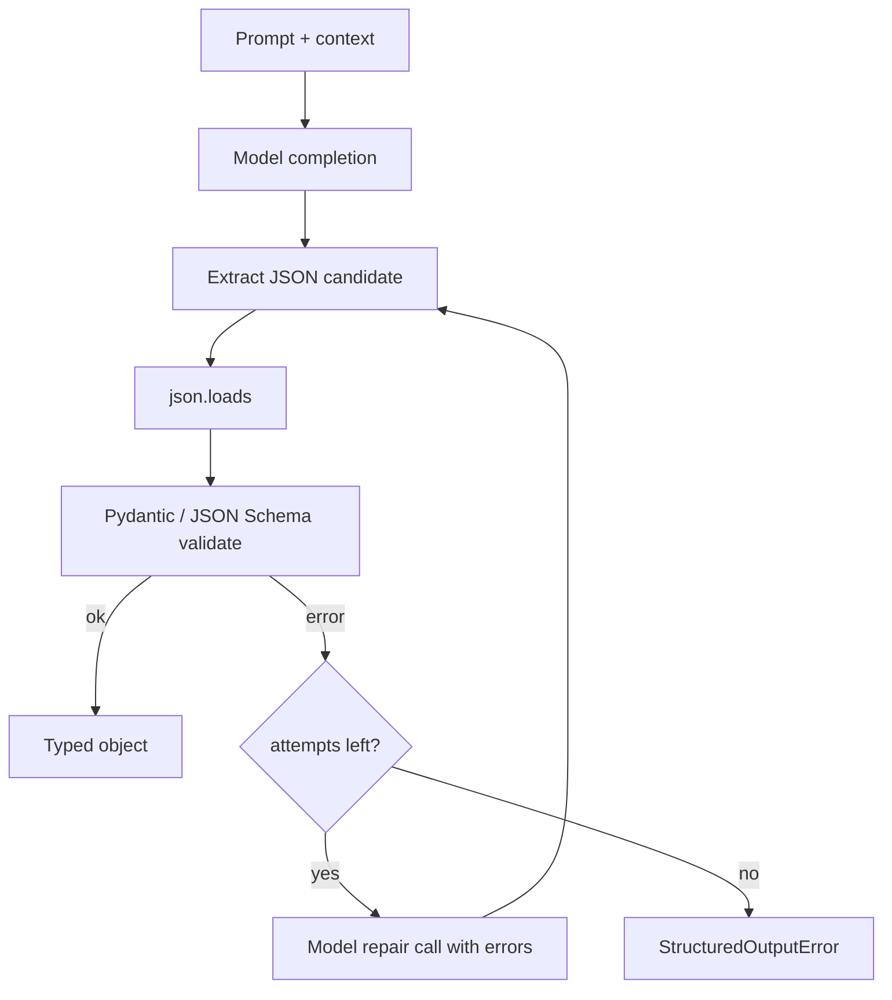
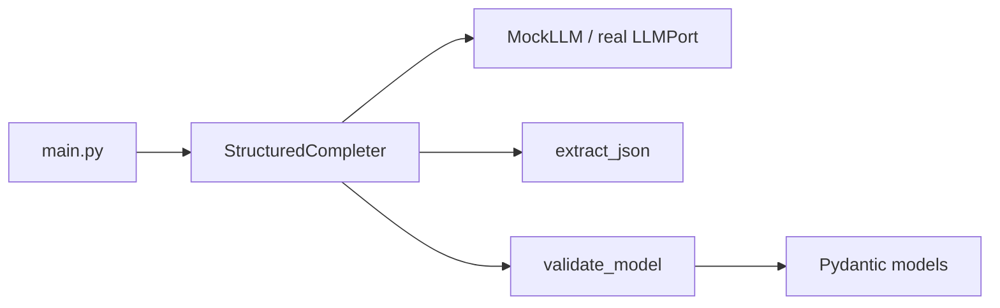
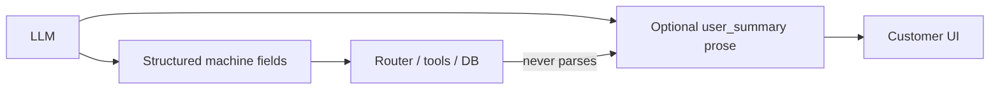

# Chapter 13: Structured Outputs

## Chapter Overview

Chapters 8–12 taught you how models generate language, how tokens meter cost, how prompts encode policy, and how context assembly chooses evidence. None of that matters operationally if the model’s **reply** cannot be consumed by the rest of the system.

Free text is for humans. Software needs **contracts**: fields, types, enums, required keys, and explicit failure modes. When an agent says “sure, refund order ABC,” your billing service cannot execute a string. It needs something closer to:

```json
{
  "decision": "deny",
  "order_id": "A-100",
  "reason_code": "outside_window",
  "confidence": 0.81,
  "needs_human": false
}
```

…and it needs that object to be **validated** before any side effect runs.

This chapter is about making model outputs machine-reliable: JSON Schema, Pydantic models, parsing, repair loops, and a production-minded `structured` package that turns messy completions into typed values or typed errors. Chapter 14 will use the same idea for tool/function arguments. Here we establish the reliability substrate: **schema → parse → validate → (optional repair) → accept or fail closed**.

---

## Learning Objectives

After completing this chapter, you can:

- Explain why free-text outputs are an integration liability in agent systems
- Define output contracts with JSON Schema and Pydantic models
- Parse model text that may include fences, prose, or partial JSON
- Validate types, enums, ranges, and cross-field rules
- Implement a bounded repair loop that re-asks the model with validator errors
- Fail closed when structure is invalid after budgeted attempts
- Extract structured records from untrusted documents under grounding rules
- Instrument structured-output calls with schema id, attempt count, and error classes

---

## Prerequisites

- Chapters 8–12 (LLM behavior, tokens, prompts, context)
- Python typing and dataclasses/`pydantic` comfort
- Basic JSON literacy

---

## Motivation

A “routing agent” returns:

> I’ll classify this as billing-related (high confidence) — intent=billing.

A downstream `if intent == "billing"` never matches. Someone adds brittle regex. It works until the model says “billing intent” or switches language. Then tickets route wrong for a weekend.

Another failure: the model returns valid JSON but `order_id` is invented. Schema validity ≠ semantic validity. Structured outputs solve **syntax and type contracts**. Grounding (Ch 8/12) and tools (Ch 14+) still own facts. The point of structure is to make the boundary between “language” and “program state” explicit and testable.

---

## First Principles

### 1. Interfaces beat improvisation

If a component is software, give it a schema. Do not parse English for control flow.

### 2. Validation is part of the model call, not a nicety afterward

Treat `complete_structured()` as the API. Bare `complete_text()` is for drafting UX copy.

### 3. Schemas should be strict where side effects live

Optional fields and free-form “notes” are fine for display. Money, identity, and tool arguments need required fields and enums.

### 4. Repair is bounded

One or two repair attempts with validator errors can raise success rate. Infinite repair loops waste tokens and hide prompt bugs.

### 5. Fail closed on control paths

If structure is invalid after repairs, return an error object to the harness—do not “best effort” execute a half-parsed refund.

### 6. Separate structural validity from truth

`{"temperature_c": -5}` can be schema-valid and still wrong for Miami. Structure enables checks; it does not replace retrieval or tools.

---

## Mental Model



| Stage | Responsibility |
|---|---|
| Contract | Schema / Pydantic model definition |
| Extraction | Pull JSON from fences or embedded objects |
| Validation | Types, enums, constraints |
| Repair | Feed errors back to the model |
| Acceptance | Typed value or explicit failure |

---

## Core Theory

### What “structured output” means

At minimum: a serialization format with a schema. In practice for agents:

1. **JSON object** (most common over chat APIs)  
2. **JSON Schema** describing allowed shape  
3. **Runtime validation** (Pydantic v2 is the Python default in this book)  
4. **Provider-native modes** when available (JSON mode, schema-constrained decoding)

Provider constraints reduce invalid JSON but do not remove the need for app-level validation of business rules.

### JSON Schema vs Pydantic

| Approach | Strength |
|---|---|
| JSON Schema | Portable across languages/providers; good for OpenAPI |
| Pydantic models | Idiomatic Python, excellent errors, validators, serialization |

Recommended pattern: **Pydantic is source of truth in Python**; export JSON Schema for docs and provider APIs when needed (`model_json_schema()`).

### Extraction reality

Models often return:

- pure JSON  
- Markdown fences ` ```json ... ``` `  
- prose before/after JSON  
- single quotes or trailing commas (invalid JSON)  
- multiple JSON objects  

A robust extractor:

1. Prefer fenced blocks  
2. Else first balanced `{...}` region  
3. Reject empty / non-object payloads for object schemas  
4. Never `eval`

### Reliability techniques

| Technique | Use |
|---|---|
| Low temperature | Classification / extraction |
| Explicit output contract in prompt | Field list + example |
| JSON mode / schema mode | When provider supports |
| Enum fields | Closed sets of actions |
| `model_validate` strictness | Forbid extras if needed |
| Repair loop | 1–2 attempts with error text |
| Dual channel | Structure for control, prose for user display |

### Structured extraction project shape

Input: untrusted document text + question/task  
Output: typed record with `evidence` spans or quotes  
Rule: if evidence missing → `null` / refuse fields, not invention  

That bridges Chapter 8’s grounding with machine-readable results.

---

## Architecture

```text
code/chapter-013/
  structured/
    types.py          # errors, AttemptLog
    extract.py        # pull JSON from model text
    schema_models.py  # example domain models (Pydantic)
    validate.py       # validate dict → model
    complete.py       # StructuredCompleter with repair loop
    mock_llm.py       # deterministic LLM for tests
  fixtures/
  tests/
  main.py
```



The completer is provider-agnostic: it needs only a callable `generate(messages) -> str`. Tomorrow that callable is OpenAI; today it is `MockLLM`.

---

## Internal Implementation

### Domain models (examples)

```python
class Intent(str, Enum):
    billing = "billing"
    shipping = "shipping"
    refund = "refund"
    other = "other"

class RouteDecision(BaseModel):
    intent: Intent
    confidence: float = Field(ge=0, le=1)
    needs_human: bool
    rationale: str = Field(max_length=500)

class RefundAssessment(BaseModel):
    decision: Literal["approve", "deny", "escalate"]
    order_id: str | None
    reason_code: str
    evidence: list[str]
    needs_human: bool
```

### Extraction

`extract_json_object(text) -> dict` raises `StructureParseError` with a stable error code.

### Completer

```python
result = completer.complete(
    messages=[...],
    model_type=RouteDecision,
    max_repairs=2,
)
# result.value: RouteDecision | None
# result.error: StructuredOutputError | None
# result.attempts: list of raw/error traces
```

### Repair prompt content

On validation failure, append a user message:

```text
Your previous answer failed validation:
- confidence: Input should be less than or equal to 1
Return ONLY a corrected JSON object matching the schema.
```

No infinite loops: `max_repairs` default 2 (3 total tries).

### CLI

```bash
python main.py extract --text '```json\n{"a":1}\n```'
python main.py route --message "Where is my package?"
python main.py refund --doc fixtures/order_note.txt
python main.py schema RouteDecision
```

---

## Production Implementation

### API shape for the platform

Prefer one entry point used by agents:

```python
class LLMPort(Protocol):
    def complete_text(self, messages: list[Message]) -> str: ...
    def complete_structured(self, messages: list[Message], model: type[T]) -> T: ...
```

Internally, `complete_structured` owns extraction, validation, and repair policy.

### When to use provider JSON mode

Use it when available for the model you pin. Still run Pydantic validation: providers can satisfy “is JSON” while violating your field constraints.

### Logging

Log:

- schema / model name  
- attempt index  
- parse vs validation error class  
- token usage per attempt  
- final accept/reject  

Do not log full document contents if they contain PII unless policy allows.

### User-facing vs machine-facing

Often return both:

```json
{
  "machine": { "...typed fields..." },
  "user_summary": "short natural language"
}
```

Keep `user_summary` out of control flow.

### Testing strategy

| Layer | Test |
|---|---|
| extract | fences, prose wrappers, invalid JSON |
| validate | enums, bounds, missing fields |
| completer | repair succeeds; repair exhausted fails |
| golden | fixture docs → expected decisions |

---

## Framework Implementation

Frameworks increasingly offer “with_structured_output.” Use them as adapters behind your port. Do not scatter framework-specific schema helpers through domain code. Your domain imports Pydantic models; infrastructure wires the provider.

---

## Trade-offs

| Choice | Gain | Cost |
|---|---|---|
| Free text only | Flexible UX | Brittle integration |
| JSON mode | Fewer parse errors | Still need business validation |
| Strict schemas | Safer automation | More repair / refusals |
| Many repair attempts | Higher fill rate | Tokens, latency, masking bugs |
| Huge schemas | Expressive | Model confusion; token cost |

**Default:** strict models for side-effect paths; looser models for assistive drafting; repairs ≤ 2.

---

## Debugging

| Symptom | Likely cause | Action |
|---|---|---|
| Constant parse errors | Prompt lacks contract; temp too high | Add schema + example; lower temp |
| Valid JSON, wrong types | Weak schema | Add Field constraints |
| Repair thrash | Conflicting instructions | Fix schema/prompt, not max_repairs |
| Invented ids in JSON | Grounding failure | Require evidence fields; add tools |
| Works in playground, fails in app | Different extraction path | Unify on `complete_structured` |

---

## Performance

Structured calls often use **more** tokens when repairs run. Track:

- accept rate on first try  
- mean attempts  
- tokens per accepted object  

If first-try accept rate is low, invest in schema simplicity and few-shot extracts (Ch 11), not more retries.

---

## Security

| Risk | Control |
|---|---|
| Model returns extra fields that trigger dangerous branches | `model_config` forbid extras; allowlist fields |
| JSON injection in strings | Typed fields; do not re-parse nested code blindly |
| Oversized outputs | `max_tokens` + size limits on strings |
| Schema leakage of secrets | Never put secrets into schemas or examples |

---

## Best Practices

1. One Pydantic model per decision boundary  
2. Enums for actions and categories  
3. Explicit nullability instead of magic strings  
4. Central `complete_structured`  
5. Bound repairs  
6. Log schema + attempts  
7. Test extractors with messy fixtures  
8. Keep user prose out of control flow  
9. Export JSON Schema for cross-service contracts  
10. Fail closed before tools with side effects  

---

## Anti-Patterns

| Anti-pattern | Failure |
|---|---|
| Regex over English for routing | Constant breakage |
| `json.loads` without schema | Silent wrong types |
| Accepting first `{` scrape unconstrained | Truncated/wrong object |
| Infinite repair while tools execute | Cost + hazard |
| Schema with 80 optional fields | Model dumps garbage |

---

## Hands-on Exercise

1. Implement `structured/` package.  
2. Feed intentionally broken model outputs through extract+validate.  
3. Demonstrate a repair that fixes `confidence: 1.5` → `1.0`.  
4. Run refund assessment on a short policy+order fixture; assert deny outside 30 days with evidence list non-empty.  
5. Export JSON Schema for `RouteDecision` and store under `fixtures/`.  

---

## Mini Project

**Structured extraction service** for the platform:

- routing decisions  
- refund assessments with evidence  
- CLI + tests + mock LLM  
- clear error taxonomy: parse / validate / exhausted  

Acceptance: unit tests offline; no network; first-try and repair paths covered.

---

## Visual diagrams




## Chapter Deliverables

| Artifact | Location |
|---|---|
| Manuscript | `book/chapter-013.md` |
| Package | `code/chapter-013/structured/` |
| Fixtures | `code/chapter-013/fixtures/` |
| Tests | `code/chapter-013/tests/` |
| Diagrams | `diagrams/mermaid/chapter-013/` + PNGs |

---

## Interview Questions

1. Why not drive agents with free text alone?  
2. JSON mode vs application validation?  
3. How does a repair loop work?  
4. When should structured output fail closed?  
5. How do you extract JSON from messy completions?  
6. What belongs in attempt logs?  
7. Structure validity vs factual validity?  
8. How would you version output schemas?  
9. Risk of optional-everything schemas?  
10. How does this prepare for tool calling?

---

## Quiz

1. Structured outputs primarily improve: **integration reliability**  
2. After schema validation fails twice, production default: **fail closed / error to harness**  
3. Pydantic models in this book: **app-level source of truth for Python contracts**  

T/F: Valid JSON guarantees correct business decisions. **False**  
T/F: Repair loops should be unbounded. **False**

---

## Cheat Sheet

```bash
cd code/chapter-013
pytest -q
python main.py route --message "I want a refund"
python main.py refund --doc fixtures/order_note.txt
python main.py schema RouteDecision
```

| Step | Function |
|---|---|
| Extract | `extract_json_object` |
| Validate | `model_validate` |
| Repair | re-prompt with errors |
| Accept | typed model instance |

---

## Curated Free Resources

- [Pydantic v2 docs](https://docs.pydantic.dev/)  
- [JSON Schema](https://json-schema.org/)  
- Provider docs on JSON/schema modes for your pinned model  
- Chapter 11 output contracts; Chapter 12 untrusted evidence  

---

## Chapter Summary

Structured outputs turn model language into program state. JSON Schema and Pydantic define contracts; extraction and validation enforce them; bounded repair improves yield; fail-closed behavior protects side effects. The `structured` package is the platform’s reliability layer for anything that must be executed, stored, or routed automatically.

**What changed in the project**

- Chapter 13 manuscript  
- `structured` completer with extract/validate/repair  
- Domain models, fixtures, tests, diagrams  

---

## What's Next

**Chapter 14 — Function Calling** extends structured outputs to tool arguments: schemas for functions, selection, execution, and error handling—so agents act through typed side effects instead of narrative promises.
