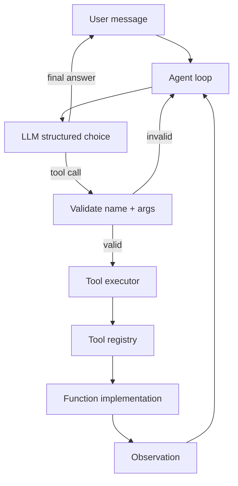

# Chapter 14: Function Calling

## Chapter Overview

Chapter 13 made model *replies* into typed objects. Function calling (tool calling) extends that contract to **actions**: the model does not only describe the world—it proposes a named operation with arguments that your runtime may execute.

That is the hinge between chatbots and agents. Without it, “I’ll check the weather” is theater. With it, the model emits something equivalent to:

```json
{
  "name": "get_weather",
  "arguments": {"city": "Berlin", "units": "metric"}
}
```

…your platform validates the schema, enforces permissions, runs the function, and returns an observation. The model may then produce a user-facing answer grounded in the tool result—not in imagination.

This chapter builds a production **toolcall** runtime: tool specs, registry, structured selection, safe execution, error mapping, and a weather-assistant mini product that demonstrates a full tool loop offline.

**Continuity:** Structured outputs (Ch 13) validate arguments. Context engineering (Ch 12) injects tool results as untrusted evidence. HTTP clients (Ch 5–6) power real tools later; here tools are local/mock so the control plane is testable.

---

## Learning Objectives

After completing this chapter, you can:

- Define tools as typed functions with JSON/Pydantic argument schemas
- Register tools with names, descriptions, and permission tags
- Parse model tool calls and reject malformed or unknown tools
- Execute tools with timeouts, structured errors, and redacted logs
- Implement a multi-step loop: plan → tool call → observation → answer
- Bound tool loops (max steps, max failures) inside a mini harness
- Build a weather assistant that never invents temperatures when a tool exists
- Distinguish tool *selection* errors from tool *execution* errors

---

## Prerequisites

- Chapter 13 (structured outputs, Pydantic, repair)
- Chapters 5–6 (HTTP ideas for real tools)
- Chapter 12 (tool results as untrusted context)

---

## Motivation

Two implementations of “weather assistant”:

**A — Prompt only:** “You know the weather; answer helpfully.”  
Users get fluent fiction. Support tickets follow.

**B — Tool loop:** Model must call `get_weather`; runtime executes; answer cites tool payload.  
Wrong city → tool error → model asks for clarification. Outage → structured failure, not a fake 22°C.

Function calling is how you move from A to B without giving the model raw shell access.

---

## First Principles

### 1. Tools are side effects with contracts

A tool is not a paragraph in a prompt. It is a function with inputs, outputs, failures, and privileges.

### 2. The model proposes; the runtime disposes

Never execute free-text “commands.” Execute only validated `(name, arguments)` against a registry allowlist.

### 3. Schemas are security boundaries

Unknown fields, wrong types, and path traversal in string args are blocked before execution.

### 4. Observations are data

Tool results re-enter the model as untrusted evidence (Ch 12 delimiters), not as new system policy.

### 5. Loops need budgets

Unlimited tool calling is a cost and safety bug. Cap steps and consecutive failures.

### 6. Errors are structured too

Transport failures, validation failures, and business failures should be distinguishable codes—not only English.

---

## Mental Model



| Role | Responsibility |
|---|---|
| LLM | Choose tool or final answer |
| Registry | Allowlist + metadata |
| Validator | Schema check arguments |
| Executor | Run function, catch errors |
| Harness | Step budgets, logging |

---

## Core Theory

### Function / tool schema

A tool definition typically includes:

- `name` — stable identifier  
- `description` — for model selection  
- `parameters` — JSON Schema / Pydantic model  
- optional `permissions`, `timeout_s`, `idempotent`  

### Tool selection

The model receives tool definitions and a user goal. It outputs either:

1. **Tool call** — name + arguments  
2. **Final response** — structured or text answer for the user  

Selection quality depends on descriptions, enums, and few-shot tool patterns (Ch 11)—not on magic.

### Execution

```text
validate call → check allowlist → invoke fn(**args) → normalize result/error
```

Timeouts matter: a hung HTTP tool blocks the agent (async in Ch 6 for production fan-out).

### Error handling classes

| Class | Example | Model-facing signal |
|---|---|---|
| `unknown_tool` | name not in registry | error observation |
| `invalid_args` | schema fail | error + schema hint |
| `execution_error` | API 500 / exception | error code + safe message |
| `timeout` | exceeded limit | retryable flag |

### Weather assistant (project)

Tools:

- `get_weather(city, units)`  
- `list_supported_cities()`  

Policy: never invent weather numbers; if tool fails, say so.

---

## Architecture

```text
code/chapter-014/
  toolcall/
    specs.py          # ToolSpec, ToolCall, ToolResult
    registry.py       # registration + schema export
    validate_call.py  # parse/validate calls
    executor.py       # run with timeout + errors
    loop.py           # ToolLoop / weather assistant
    weather.py        # mock weather backend
    mock_llm.py       # scripted tool-calling model
  tests/
  main.py
```

---

## Internal Implementation

### ToolSpec

```python
@dataclass
class ToolSpec:
    name: str
    description: str
    args_model: type[BaseModel]
    handler: Callable[..., Any]
    timeout_s: float = 5.0
```

### Structured model choice

```python
class ToolCallRequest(BaseModel):
    type: Literal["tool_call"]
    name: str
    arguments: dict[str, Any]

class FinalAnswer(BaseModel):
    type: Literal["final"]
    message: str

class AgentAction(BaseModel):
    action: ToolCallRequest | FinalAnswer  # or discriminated union
```

This chapter uses a simple discriminated `kind` field: `tool` | `final`.

### Loop

```python
for step in range(max_steps):
    action = completer.complete(messages, AgentTurn)
    if action.kind == "final":
        return action.message
    result = executor.execute(action.name, action.arguments)
    messages.append(observation(result))
raise BudgetExceeded
```

### CLI

```bash
python main.py tools
python main.py weather --city Berlin
python main.py chat --message "Weather in Paris in celsius?"
```

---

## Production Implementation

- Export tool JSON schemas to the provider’s tool/function API  
- Map provider-native tool calls into your `ToolCall` type  
- Enforce per-role allowlists (support agent ≠ admin agent)  
- Idempotency keys for mutating tools  
- Audit log: tool name, args redacted, latency, error code  
- Sandbox high-risk tools (shell, SQL) in later chapters  

---

## Framework Implementation

LangChain tools, OpenAI tools, etc. are transport formats. Keep **your** registry as source of truth; adapt vendor payloads at the edge.

---

## Trade-offs

| Design | Pros | Cons |
|---|---|---|
| Many tiny tools | Clear schemas | Selection noise |
| Few mega-tools | Simple list | Weak validation |
| Always force a tool | Grounding | Bad for pure chitchat |
| Free-text tool names | Flexible | Injection / typos |

**Default:** small allowlisted tools, structured args, optional final answer without tools when appropriate.

---

## Debugging

| Symptom | Check |
|---|---|
| Wrong tool chosen | Descriptions/enums; few-shots |
| Invalid args loop | Schema too strict/confusing; repair |
| Invented weather | Model skipped tool; enforce policy |
| Hung step | Missing timeout |
| Leaked secrets in logs | Arg redaction |

---

## Performance

- Prefer parallel tool calls only when independent (Ch 6)  
- Cache pure tools (`list_supported_cities`)  
- Bound `max_steps` tightly for simple assistants  

---

## Security

| Risk | Control |
|---|---|
| Unauthorized tool | Registry allowlist + authz |
| Path/SQL injection in args | Typed schemas + handler validation |
| Prompt injection via tool output | Untrusted observation framing |
| Over-broad `run_code` tool | Don’t ship it without sandbox |

---

## Best Practices

1. One tool = one clear side effect or query  
2. Rich descriptions, tight schemas  
3. Validate before execute  
4. Structured errors  
5. Step budgets  
6. Never invent tool results in prompts  
7. Redact secrets in logs  
8. Test handlers without the model  
9. Test loops with mock LLMs  
10. Version tool schemas  

---

## Anti-Patterns

| Anti-pattern | Failure |
|---|---|
| Execute shell from free text | RCE |
| Tools without schemas | Garbage args |
| Unlimited loops | Cost / runaway |
| Stuffing all APIs as one tool | Unvalidatable |

---

## Hands-on Exercise

1. Register weather tools.  
2. Script a mock LLM that calls `get_weather` then finals.  
3. Force invalid city → observe structured error → final apology.  
4. Assert no numeric temperature appears without a successful tool result in the transcript.

---

## Mini Project

**Weather assistant** with registry, executor, loop, CLI, tests, and diagrams.

---

## Chapter Deliverables

| Artifact | Location |
|---|---|
| Manuscript | `book/chapter-014.md` |
| Package | `code/chapter-014/toolcall/` |
| Tests | `code/chapter-014/tests/` |
| Diagrams | `diagrams/mermaid|png/chapter-014/` |

---

## Interview Questions

1. Model propose vs runtime dispose?  
2. Why schema-validate tool args?  
3. How do tool results re-enter context safely?  
4. Unknown tool vs execution error?  
5. Why max_steps?  
6. How to prevent invented tool data?  
7. Idempotency for mutating tools?  
8. Difference between function calling and structured final answers?  
9. How frameworks should map to your registry?  
10. What to log for a tool invocation?

---

## Quiz

1. Tool arguments should be: **schema-validated before execution**  
2. Tool results should be treated as: **untrusted observations**  
3. Unlimited tool loops are: **a production hazard**  

T/F: The model should execute HTTP itself inside the provider. **False** (your runtime executes).  

---

## Cheat Sheet

```bash
cd code/chapter-014 && pytest -q
python main.py chat --message "What's the weather in Berlin?"
```

| Step | Component |
|---|---|
| Define | ToolSpec + Pydantic args |
| Choose | structured AgentTurn |
| Run | Executor |
| Observe | append result |
| Stop | final message or budget |

---

## Curated Free Resources

- Provider function/tool calling docs for your pinned model  
- JSON Schema + Pydantic (Ch 13)  
- OWASP LLM tool risks  

---

## Chapter Summary

Function calling is structured output aimed at side effects: the model selects a tool and arguments; the runtime validates, executes, and returns observations under budgets and allowlists. The weather assistant shows the full loop without network flakiness.

**What changed:** `toolcall` runtime, weather project, tests, diagrams.

---

## What's Next

**Chapter 15 — Embeddings** turns text into vectors so retrieval and semantic search can feed the context manager with ranked evidence instead of keyword luck.
