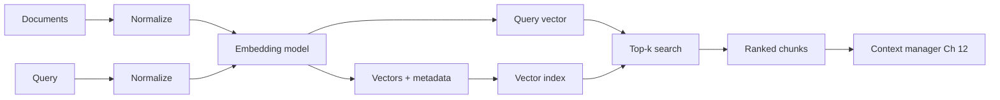
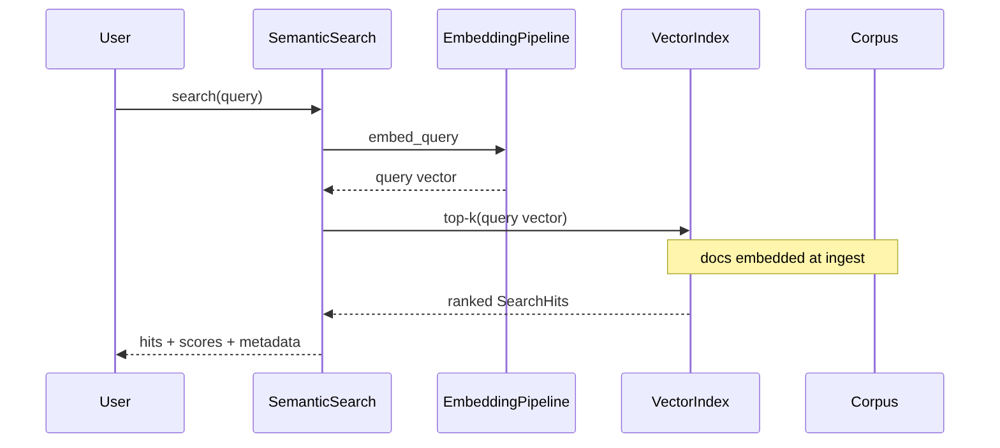
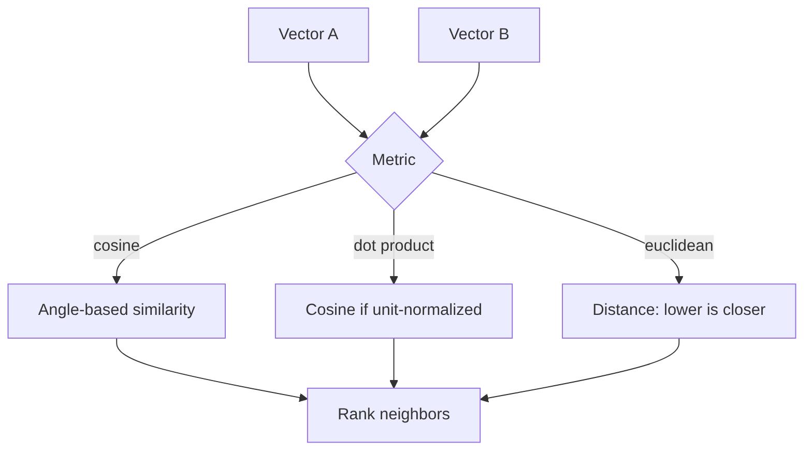

# Chapter 15: Embeddings

## Chapter Overview

Chapters 8–14 taught you how models generate language, how to meter tokens, how to pack context, how to force structured replies, and how to call tools. Those skills still leave a gap: **how do you find the right text to put into context** when the corpus is larger than the window?

Keyword search fails on paraphrase. A user asks “How do I reverse a charge?” while your docs say “refund policy.” Substring match returns nothing; an embedding search ranks the refund article near the top because meaning, not spelling, lives nearby in vector space.

An **embedding** is a fixed-length vector that represents a piece of text (or image, or audio) so that **semantically similar inputs land near each other**. Embeddings are the index of modern AI platforms: retrieval, clustering, deduplication, recommendation, and memory all ride on them.

This chapter builds a production-minded **`embedkit`** package offline: normalize text, embed with a deterministic local model, measure similarity, index documents, and run **semantic search** over a support knowledge base—without network calls or paid APIs. Later chapters replace the local embedder with vendor models and vector databases; the control plane (pipeline, metrics, contracts) stays the same.

**Continuity:** Context engineering (Ch 12) consumes ranked evidence. Structured outputs (Ch 13) and tools (Ch 14) still own actions. Embeddings feed **retrieval** so the context manager packs *relevant* untrusted evidence instead of hoping the right paragraph was pasted by hand. Part III (Ch 18+) deepens search, chunking, and vector DBs on this foundation.

---

## Learning Objectives

After completing this chapter, you can:

- Explain embeddings as points in a vector space where proximity ≈ meaning
- Choose and apply similarity metrics (cosine, dot product, Euclidean)
- Normalize text and batch-embed documents with a stable model interface
- Build an in-memory vector index and run top-k semantic search
- Separate **model choice** (how vectors are made) from **index choice** (how vectors are stored)
- Debug empty results, dimension mismatches, and “similar but wrong” hits
- Instrument embedding calls with model id, dimensions, latency, and batch size
- Ship a semantic-search mini product over a fixed support corpus

---

## Prerequisites

- Chapters 8–12 (LLM behavior, tokens, context packing)
- Basic linear algebra intuition (vectors, norms, angles)—not proofs
- Python typing and dataclasses comfort
- Chapter 5 JSON/HTTP ideas (real embedding APIs later)

---

## Motivation

Support bot v1: `if "refund" in query.lower()`.  
Users write “chargeback,” “money back,” “undo payment.” Ticket volume rises; the bot shrugs.

Support bot v2: dump the entire policy handbook into the prompt.  
Costs explode; the model still misses the right subsection under context pressure (Ch 10–12).

Support bot v3: embed handbook sections once, embed the query at runtime, retrieve top-k, pack only those chunks as untrusted evidence, then answer with grounding rules.

Embeddings turn “search by meaning” into ordinary nearest-neighbor math. Without them, RAG is keyword luck. With them—and with evaluation later—you have an engineering surface: dimensions, models, indexes, latency, and relevance metrics.

---

## First Principles

### 1. Embeddings encode *relative* meaning

A single vector has no story. Meaning lives in **distance and angle** between vectors under a fixed model. Different models → incomparable spaces. Never mix dimensions or vendors in one index without re-embedding everything.

### 2. Same model for queries and documents (usually)

Unless you use an explicit dual-encoder design with matched towers, embed corpus and queries with the **same** model id and version. Query/document asymmetry is a product decision, not a silent default.

### 3. Similarity is not truth

Nearest neighbor finds *related text*, not *correct answers*. Grounding, tools, and structured policies still apply. A highly similar but outdated policy chunk is still a footgun.

### 4. Normalize before embed; version after

Whitespace, casing, and Unicode form affect tokenizers. Document your preprocessing. Tag every vector with `model_id`, `dim`, and corpus version so you can rebuild indexes safely.

### 5. Batch and cache

Embedding is an API (or CPU) call. Batch documents. Cache stable document vectors. Do not re-embed unchanged handbook pages on every request.

### 6. Index is not model

The embedder produces vectors. The index stores and searches them. Swap FAISS/Chroma later without rewriting your semantic contracts.

---

## Mental Model



| Piece | Responsibility |
|---|---|
| Normalizer | Stable text preprocessing |
| Embedding model | `text → R^d` |
| Metrics | Score pairs of vectors |
| Index | Store vectors + metadata; top-k |
| Search service | Query API for the platform |
| Context manager | Pack hits as untrusted evidence |

---

## Core Theory

### Vector space

An embedding maps text \(x\) to \(e(x) \in \mathbb{R}^d\). Training (or a good mock) arranges the map so paraphrases cluster. Production models (OpenAI, Cohere, voyage, open-weight sentence transformers) differ in \(d\), language coverage, and domain bias—but the **integration contract** is identical: list of floats + metadata.

### Distance and similarity

| Metric | Intuition | Notes |
|---|---|---|
| **Cosine similarity** | Angle between vectors | Scale-invariant; default for many text models |
| **Dot product** | Cosine × magnitudes | Prefer when vectors are L2-normalized (then equals cosine) |
| **Euclidean distance** | Straight-line distance | Lower is closer; sensitive to magnitude |

**Default for this book:** L2-normalize embeddings and rank by **cosine similarity** (equivalent to max dot product on the unit sphere).

### Embedding models (conceptual)

- **API embedders** — HTTP batch endpoints; pay per token; strong quality  
- **Local sentence transformers** — GPU/CPU; privacy; ops burden  
- **Hashing / sparse bag-of-words** — deterministic offline teaching tools; weak semantics but real pipeline plumbing  

Chapter code ships a **deterministic hashing embedder** and a **bag-of-words embedder** so tests never need network or weights. Swap in a real model by implementing the same protocol.

### Pipeline stages

```text
ingest → normalize → embed (batch) → attach metadata → upsert index
query  → normalize → embed → top-k → optional score threshold → return hits
```

### Semantic search mini project

Corpus: support FAQs (refunds, shipping, auth).  
CLI: index, search, show similar pairs.  
Success: paraphrase queries rank the right FAQ above unrelated ones under the local model.

---

## Architecture

```text
code/chapter-015/
  embedkit/
    types.py         # Document, VectorRecord, SearchHit
    normalize.py     # text normalization
    metrics.py       # cosine, dot, euclidean
    models.py        # EmbeddingModel protocol + local embedders
    index.py         # InMemoryVectorIndex
    pipeline.py      # embed documents / queries
    corpus.py        # sample support knowledge base
    search.py        # SemanticSearch service
  fixtures/
  tests/
  main.py
```

---

## Internal Implementation

### Contracts

```python
@dataclass(frozen=True)
class Document:
    id: str
    text: str
    metadata: dict[str, Any] = field(default_factory=dict)

@dataclass(frozen=True)
class VectorRecord:
    id: str
    vector: tuple[float, ...]
    text: str
    metadata: dict[str, Any]
    model_id: str
    dim: int

@dataclass(frozen=True)
class SearchHit:
    id: str
    score: float
    text: str
    metadata: dict[str, Any]
```

### Model protocol

```python
class EmbeddingModel(Protocol):
    model_id: str
    dimensions: int

    def embed(self, texts: Sequence[str]) -> list[list[float]]:
        ...
```

### Local embedders (offline)

1. **`TfidfEmbedder`** (default for the mini project) — fit vocabulary + IDF on the corpus, embed docs and queries in the same space. Classic IR; excellent for small FAQ demos without network.  
2. **`HashingEmbedder`** — feature-hash tokens/n-grams into fixed dim; no fit step; weaker ranking due to collisions.  
3. **`BagOfWordsEmbedder`** — hashed token counts; simplest baseline.

All return L2-normalized vectors. Swap in a real neural encoder later by implementing the same protocol—do not change `SearchHit`.

### Index

Linear scan over L2-normalized vectors with cosine scores. Fine for thousands of chunks. Chapter 22+ replaces this with ANN indexes (FAISS, HNSW) without changing `SearchHit`.

### CLI

```bash
python main.py index
python main.py search "How do I get my money back?"
python main.py similar --a "refund policy" --b "return my payment"
python main.py embed "hello world"
```

---

## Production Implementation

- Pin `model_id` + version in config; store on every vector row  
- Re-embed entire corpus when the model changes  
- Batch API calls (e.g. 64–256 texts); respect rate limits (Ch 5–6, 17)  
- Persist vectors + metadata (Postgres/`pgvector`, object store + FAISS, managed vector DB)  
- Score thresholds and hybrid lexical+dense later (Ch 26)  
- Trace: `model_id`, `dim`, batch size, embed latency, search latency, hit ids  
- Evaluate retrieval with labeled queries (recall@k, MRR)—do not ship on vibes  

---

## Framework Implementation

LangChain embeddings, LlamaIndex vector stores, and vendor SDKs are **adapters**. Keep:

1. Your `Document` / `SearchHit` types  
2. Your normalize + model_id policy  
3. Your evaluation harness  

Wrap `OpenAIEmbeddings.embed_documents` behind `EmbeddingModel`. Do not let a framework dictate your storage schema.

---

## Trade-offs

| Design | Pros | Cons |
|---|---|---|
| Cosine on unit vectors | Simple, stable ranking | Ignores magnitude signal some models use |
| Huge dimensions | Capacity | Cost, storage, slower brute force |
| One global index | Simple ops | No tenancy isolation |
| Re-embed always | Fresh | Expensive |
| Cache doc vectors | Cheap queries | Stale if docs change |
| Hashing embedder | Offline tests | Weak real semantics |

**Default:** unit cosine, pinned model, cached document vectors, linear index until scale forces ANN.

---

## Debugging

| Symptom | Check |
|---|---|
| Empty / nonsense hits | Wrong model on query vs docs; empty index |
| All scores ~equal | Degenerate embedder; failed normalize; identical vectors |
| Dimension error | Mixed models or truncated vectors |
| Good keywords, bad meaning | Hashing model limits; need real encoder |
| Great demo, bad prod | No eval set; corpus drift; outdated chunks |
| Latency spikes | Unbatched embeds; re-embedding docs per request |

---

## Performance

- Embed documents **once** at ingest; embed queries online  
- Batch embed APIs  
- L2-normalize at write time so search is a dot product  
- Cap `k` and optional `min_score`  
- Async HTTP for remote embedders (Ch 6)  
- Later: ANN indexes, sharding, quantization  

---

## Security

| Risk | Control |
|---|---|
| Sensitive text in vectors | Treat vectors as sensitive as source text; access control on index |
| Prompt injection via retrieved text | Untrusted evidence framing (Ch 12); never promote hits to system policy |
| Tenant bleed | Partition indexes by tenant; filter metadata before return |
| Model exfiltration | Rate-limit embed APIs; auth on search endpoints |
| Poisoned corpus | Ingest auth, review, versioning |

Embeddings do not encrypt meaning. If the document is confidential, so is its vector.

---

## Best Practices

1. Pin and version embedding models  
2. Same model for query and document (unless dual-encoder by design)  
3. Normalize text consistently  
4. L2-normalize for cosine defaults  
5. Store metadata with every vector  
6. Batch and cache document embeddings  
7. Separate model interface from index implementation  
8. Threshold + top-k, not infinite recall dumps into context  
9. Evaluate with a small labeled query set from day one  
10. Re-embed on model change; never mix spaces  

---

## Anti-Patterns

| Anti-pattern | Failure |
|---|---|
| Mixing models in one index | Garbage neighbors |
| Re-embedding the corpus every request | Cost and latency fire |
| Dumping top-50 into the prompt | Context bloat (Ch 10–12) |
| Treating similarity as authorization | Data leaks across tenants |
| No model_id on vectors | Irreversible index rot |
| Only keyword OR only dense forever | Miss complementary signals (hybrid later) |

---

## Hands-on Exercise

1. Load the sample FAQ corpus and index it with `HashingEmbedder`.  
2. Search with a paraphrase of a refund question; confirm the refund FAQ ranks in top-3.  
3. Compare cosine(a,b) for a related pair vs an unrelated pair.  
4. Swap to `BagOfWordsEmbedder` and note ranking differences.  
5. Assert dimension mismatches raise a clear error when searching with a wrong-sized vector.

---

## Mini Project

**Semantic search service** over a support knowledge base: ingest FAQs, embed, index, query CLI, similarity helper, tests, and diagrams—fully offline.

---

## Visual diagrams







## Chapter Deliverables

| Artifact | Location |
|---|---|
| Manuscript | `book/chapter-015.md` |
| Package | `code/chapter-015/embedkit/` |
| Tests | `code/chapter-015/tests/` |
| Diagrams | `diagrams/mermaid\|png/chapter-015/` |

---

## Interview Questions

1. Why must query and document embeddings usually share a model?  
2. Cosine vs Euclidean for text—when do you care?  
3. Why L2-normalize vectors in the index?  
4. How do embeddings relate to the context manager?  
5. What metadata belongs on every vector record?  
6. Why is nearest neighbor not a truth oracle?  
7. How do you migrate to a new embedding model in production?  
8. What is the difference between embedder and vector index?  
9. How would you detect tenant data leakage in search?  
10. What would you log for an embed + search request?

---

## Quiz

1. Embeddings place similar meaning: **near each other in vector space**  
2. Default ranking metric in this chapter: **cosine similarity (on unit vectors)**  
3. Changing embedding models requires: **re-embedding the corpus**  

T/F: High cosine similarity guarantees a factually correct answer. **False**  

---

## Cheat Sheet

```bash
cd code/chapter-015 && pytest -q
python main.py index
python main.py search "How do I reverse a charge?"
python main.py similar --a "refund" --b "money back"
```

| Step | Component |
|---|---|
| Normalize | `normalize.py` |
| Embed | `EmbeddingModel.embed` |
| Store | `InMemoryVectorIndex.upsert` |
| Query | embed query → `search` |
| Use | pack hits into context (Ch 12) |

---

## Curated Free Resources

- “Efficient Estimation of Word Representations” (Word2Vec era intuition)  
- Sentence-Transformers documentation (local models)  
- Your provider’s embeddings API reference (batch sizes, dims)  
- Pinecone/pgvector engineering blogs on ANN trade-offs (preview of Ch 21–22)  

---

## Chapter Summary

Embeddings turn text into comparable vectors so semantic search can rank evidence by meaning. You normalize, embed with a pinned model, measure similarity, and index vectors with metadata—then retrieve top-k for the context manager. The chapter’s `embedkit` package and support FAQ search project establish the pipeline offline; production swaps models and indexes without changing the mental model.

**What changed:** `embedkit` package, semantic-search mini project, tests, diagrams.

---

## What's Next

**Chapter 16 — Model Selection** treats generation (and embedding) models as products with latency, cost, and quality curves—routing work to the right model instead of one default forever.
