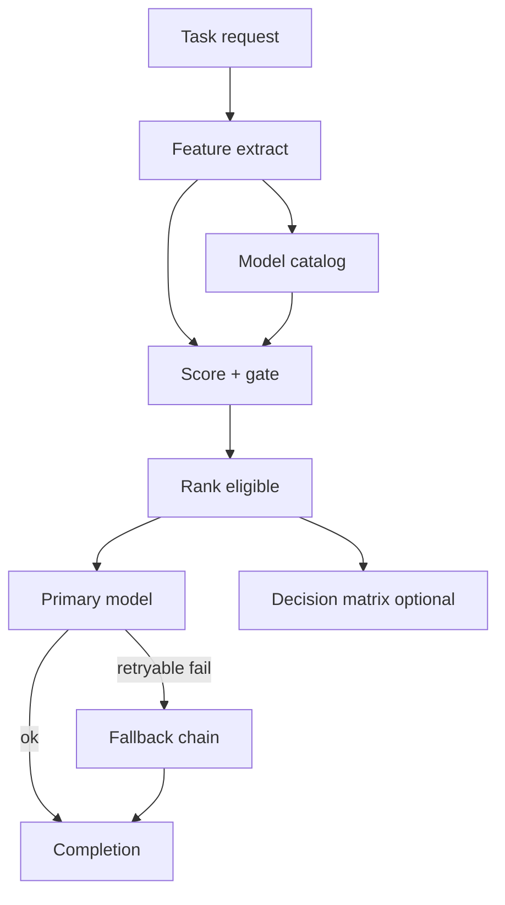
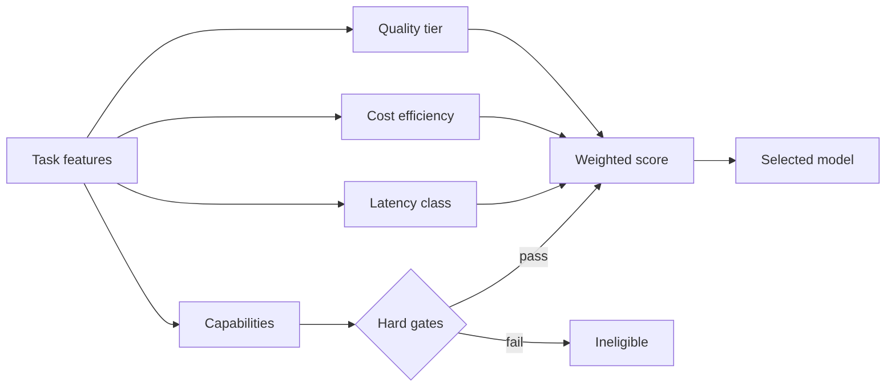
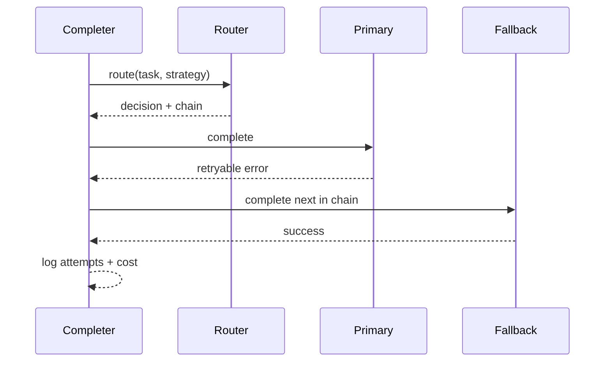
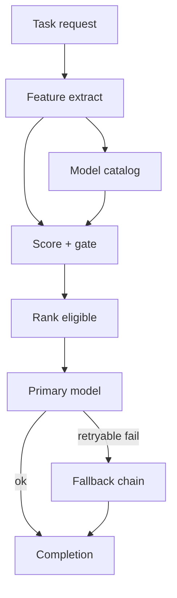

# Chapter 16: Model Selection

## Chapter Overview

Chapters 8–15 gave you generation, structure, tools, and embeddings. In production those capabilities are almost never a single model string in a `.env` file. You face a **portfolio**: small fast models for classification, mid-tier models for everyday chat and tools, flagship models for hard reasoning, open-weight models for privacy and cost control, embedding-only models for retrieval.

**Model selection** is the discipline of choosing *which* model runs *which* task under constraints: quality, latency, cost, capabilities (tools, JSON, vision, context length), and operational risk. Done poorly, you burn money on flagships for “label this ticket” or ship brittle answers from tiny models on architecture decisions. Done well, routing is a first-class platform component—observable, testable, and swappable when vendors rename SKUs.

This chapter builds **`modelroute`**: a catalog of model profiles, task feature extraction, multi-objective scoring, decision matrices, and a routed completer with **fallback chains**. Catalog prices are illustrative fixtures; the control plane is production-shaped.

**Continuity:** Embeddings (Ch 15) may use a different model family than chat. Tool calling (Ch 14) requires tool-capable models. Token budgets (Ch 10) and context packing (Ch 12) still apply after the route decision. Chapter 17 deepens cost dashboards, caching, and batching on top of routing.

---

## Learning Objectives

After completing this chapter, you can:

- Represent models as versioned profiles (capabilities, cost, latency, context)
- Infer task kinds from requests (classify, code, tools, reasoning, …)
- Score candidates under cost / latency / quality / balanced strategies
- Enforce hard constraints (tools, vision, min quality, max cost, max latency)
- Build fallback chains for provider outages
- Produce a decision matrix comparing strategies for the same task
- Avoid treating brand names as architecture—pin IDs, abstract behind a router
- Instrument every call with `model_id`, strategy, estimated vs actual cost

---

## Prerequisites

- Chapters 8–11 (LLM behavior, tokens, prompts)
- Chapter 14 (tool capability needs)
- Chapter 15 (separate embedding models)
- Basic product sense: not every request deserves the most expensive model

---

## Motivation

Team A hardcodes `gpt-flagship` for every agent. Monthly bill explodes; latency is painful for autocomplete-style features.

Team B hardcodes the cheapest model everywhere. Support quality collapses on multi-step billing disputes; tool calls are malformed.

Team C ships a **router**:

| Traffic | Route |
|---|---|
| Intent classification | small / flash |
| Normal support + tools | balanced tool-capable |
| Escalated reasoning | flagship |
| Embeddings | embed model only |
| On-prem PII path | local open-weights |

Same product surface; different economics and risk. Model selection is load balancing for intelligence.

---

## First Principles

### 1. Models are products with contracts

Each SKU has a contract: context window, modalities, tool APIs, rate limits, price, failure modes. Treat them like managed dependencies.

### 2. Route on *task features*, not vibes

“This seems hard” is not a policy. Features: task kind, token estimates, required capabilities, SLO, budget, tenancy, data residency.

### 3. Soft scores + hard gates

Hard gates: must support tools; must fit context; must meet max cost. Soft scores: weighted quality vs cost vs latency under a strategy.

### 4. Fallbacks are production, not polish

Primary model 429s or 5xx → next eligible model in the chain, with audit logs. Silent single-model dependence is an outage waiting to happen.

### 5. Pin IDs; abstract providers

Never scatter raw model strings across the codebase. One catalog, one router, adapters at the edge (OpenAI, Anthropic, Google, local).

### 6. Re-evaluate continuously

Quality and price change. Keep an eval set (later chapters) and revisit routing weights—not once a year in a slide deck.

---

## Mental Model



| Component | Responsibility |
|---|---|
| Catalog | Profiles + capabilities + unit costs |
| Classifier | Task kind + token estimates |
| Scorer | Weighted multi-objective score |
| Router | Rank, select, build fallbacks |
| Completer | Execute with failover |
| Telemetry | model_id, strategy, cost, latency |

---

## Core Theory

### Provider landscape (engineering view)

| Family | Typical strengths (generalized) | Engineering notes |
|---|---|---|
| GPT-class (OpenAI) | Broad tools/JSON ecosystem | Strong SDK gravity; pin snapshots |
| Claude-class (Anthropic) | Long context, careful writing/tools | Different tool/schema shapes |
| Gemini-class (Google) | Long context, multimodal, aggressive flash pricing | Window sizes change product design |
| Llama-class (Meta open weights) | Privacy, on-prem, $0 API | You own GPUs, ops, safety |
| Mistral-class | Efficient EU-friendly options | Same router, different adapters |

Do **not** memorize marketing leaderboards in application code. Encode *profiles* you can update.

### Decision axes

1. **Quality tier** — small → flagship  
2. **Latency class** — fast / standard / slow  
3. **Marginal cost** — $/1M input & output (illustrative here)  
4. **Capabilities** — tools, JSON, vision, embeddings, open weights  
5. **Context window** — hard fit check  

### Strategies

| Strategy | Optimize for | Use when |
|---|---|---|
| `cost` | Cheap eligible model | High-volume easy tasks |
| `latency` | Fast class | UX-critical paths |
| `quality` | Higher tiers | Hard reasoning / high stakes |
| `balanced` | Weighted mix | Default agent traffic |
| `pinned` | Explicit model_id | Debugging, evals, compliance |

### Fallback chains

```text
rank eligible by score → take top-N → try in order on retryable errors
```

Non-retryable errors (wrong modality, auth) should not walk the whole chain blindly—map error classes (Ch 5–6, 14).

---

## Architecture

```text
code/chapter-016/
  modelroute/
    types.py        # profiles, tasks, decisions
    catalog.py      # multi-provider fixture catalog
    classifier.py   # prompt → TaskRequest features
    scoring.py      # gates + weighted scores
    router.py       # rank / route / matrix
    completer.py    # mock backends + failover
    matrix.py       # reporting helpers
  tests/
  main.py
```

---

## Internal Implementation

### ModelProfile

```python
@dataclass(frozen=True)
class ModelProfile:
    model_id: str
    provider: Provider
    quality: QualityTier
    latency: LatencyClass
    context_window: int
    input_cost_per_1m: float
    output_cost_per_1m: float
    capabilities: ModelCapabilities
```

### TaskRequest

```python
TaskRequest(
    kind=TaskKind.CLASSIFY,
    prompt="...",
    expected_input_tokens=120,
    expected_output_tokens=64,
    require_tools=False,
    min_quality=None,
    max_cost_usd=None,
)
```

### Score

```text
total = (w_q * quality + w_c * cost_eff + w_l * latency_eff) * capability_fit
```

Ineligible models receive hard reject reasons and never win.

### CLI

```bash
python main.py catalog
python main.py route "Classify intent: billing" --strategy cost
python main.py matrix "Prove multi-hop architecture trade-off carefully"
python main.py complete "hello" --fail openai:gpt-balanced
python main.py compare
```

---

## Production Implementation

- Load catalog from config / feature flags; hot-reload prices  
- Separate **routing model_id** from **provider payload** (adapters)  
- Shadow traffic: log “would have picked X” while still on pinned Y  
- Budget policies per tenant / feature flag  
- Circuit breakers per provider (Ch 6 patterns)  
- Actual token usage from provider responses → cost accounting (Ch 17)  
- Offline eval harness before changing weights  
- Data residency: constrain catalog subset per region  

---

## Framework Implementation

LangChain/LlamaIndex model enums and “router chains” are optional. Keep:

1. Your `ModelProfile` catalog  
2. Your `RouteDecision` audit object  
3. Provider adapters that only know how to call APIs  

Frameworks should not own your billing truth.

---

## Trade-offs

| Design | Pros | Cons |
|---|---|---|
| Single flagship always | Simple | Cost, latency |
| Single small always | Cheap | Quality failures |
| Static if/else routes | Clear | Brittle as tasks grow |
| Scored router | Flexible, testable | Needs tuning + evals |
| Many fallbacks | Resilience | Cost variance, quality drift |
| Open-weights only | Privacy | Ops + quality ceiling |

**Default:** balanced strategy + capability gates + 2–3 fallbacks + pinned mode for evals.

---

## Debugging

| Symptom | Check |
|---|---|
| Always picks expensive model | Strategy weights; missing cheap eligible rows |
| Always picks flash | Quality floors for reasoning/code |
| No eligible model | Caps too tight; embed model in chat path |
| Fallback storms | Primary systematically failing; fix root cause |
| Tool errors after route | Model lacks tools; gate `require_tools` |
| Surprise bill | Token estimates wrong; no max_cost; no logging |

---

## Performance

- Routing itself is microseconds—catalog scans are fine until thousands of SKUs  
- Cache route decisions only for identical task fingerprints (careful with prompts)  
- Prefer small models for pre-routers / classifiers that *choose* heavy models  
- Parallel speculative execution (race two models) is advanced—costly  

---

## Security

| Risk | Control |
|---|---|
| PII to external APIs | Route to local/open-weights; DLP filters |
| Prompt injection | Unrelated to SKU brand; still apply Ch 12 framing |
| Model DoS via costly routes | max_cost_usd, rate limits, authz |
| Catalog poisoning | Signed config; admin-only updates |
| Logging secrets | Redact prompts in route logs when needed |

---

## Best Practices

1. One catalog, many callers  
2. Pin model IDs in production configs  
3. Hard gates for capabilities  
4. Explicit strategies per product surface  
5. Fallback chains with error classification  
6. Log `RouteDecision` on every call  
7. Separate embedding models from chat models  
8. Revisit routes with evals, not anecdotes  
9. Teach product owners cost vs quality trade-offs  
10. Never hardcode vendor strings in business logic  

---

## Anti-Patterns

| Anti-pattern | Failure |
|---|---|
| `MODEL=gpt-4-whatever` everywhere | Cost + rigidity |
| Routing on user-selected “smart mode” only | No guarantees |
| Mixing embed and chat IDs | Runtime errors |
| Infinite fallback to flagship | Bill shock |
| Ignoring context window | Truncation / API errors |
| Trusting marketing “best model” | Unvalidated quality |

---

## Hands-on Exercise

1. List the catalog and note open-weight vs API models.  
2. Route a classify prompt with `--strategy cost` and a reasoning prompt with `--strategy quality`.  
3. Build a matrix for one prompt; explain why winners differ.  
4. Force primary failure with `--fail` and confirm fallback_used.  
5. Add a catalog entry for an internal model and make it win under `pinned`.

---

## Mini Project

**Model router service** for the AI platform: catalog, scoring, CLI decision matrix, mock routed completion with failover—offline and tested.

---

## Visual diagrams








## Chapter Deliverables

| Artifact | Location |
|---|---|
| Manuscript | `book/chapter-016.md` |
| Package | `code/chapter-016/modelroute/` |
| Tests | `code/chapter-016/tests/` |
| Diagrams | `diagrams/mermaid\|png/chapter-016/` |

---

## Interview Questions

1. What belongs in a model profile?  
2. Soft score vs hard gate—examples?  
3. When is cost-optimal routing wrong?  
4. How do open-weight models change the cost model?  
5. Why separate embedding models in the catalog?  
6. How do you design fallback chains safely?  
7. What do you log for each routed call?  
8. How would you A/B a new routing weight?  
9. How does tool calling constrain selection?  
10. Why pin model IDs instead of “latest”?

---

## Quiz

1. High-volume intent classification should usually prefer: **cheaper/faster eligible models**  
2. Hard reasoning with quality strategy should prefer: **higher quality tiers**  
3. Provider outage handling needs: **fallback chains + error classes**  

T/F: The most expensive model is always correct for production agents. **False**

---

## Cheat Sheet

```bash
cd code/chapter-016 && pytest -q
python3 main.py compare
python3 main.py route "..." --strategy balanced
python3 main.py matrix "..."
```

| Step | Component |
|---|---|
| Describe models | `ModelProfile` catalog |
| Describe task | `TaskRequest` / classifier |
| Gate + score | `scoring.py` |
| Choose | `ModelRouter.route` |
| Execute | `RoutedCompleter` + fallbacks |

---

## Curated Free Resources

- Provider pricing and model docs (pin versions)  
- Open LLM leaderboards (signal, not policy)  
- Your own eval sets > public vibes  
- SRE patterns: circuit breaking, multi-provider failover  

---

## Chapter Summary

Model selection turns a pile of vendor SKUs into a governed platform decision: catalog profiles, task features, multi-objective scores, hard capability gates, and fallback-aware execution. The `modelroute` package shows the control plane offline so later chapters can attach real adapters, cost dashboards, and evaluation without rewriting product code.

**What changed:** `modelroute` package, decision matrix CLI, mock failover completer, tests, diagrams.

---

## What's Next

**Chapter 17 — Cost & Performance** instruments token budgets, caching, batching, and rate limits so routing choices meet real SLOs and invoices—not just elegant score tables.
