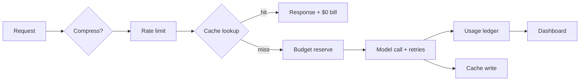
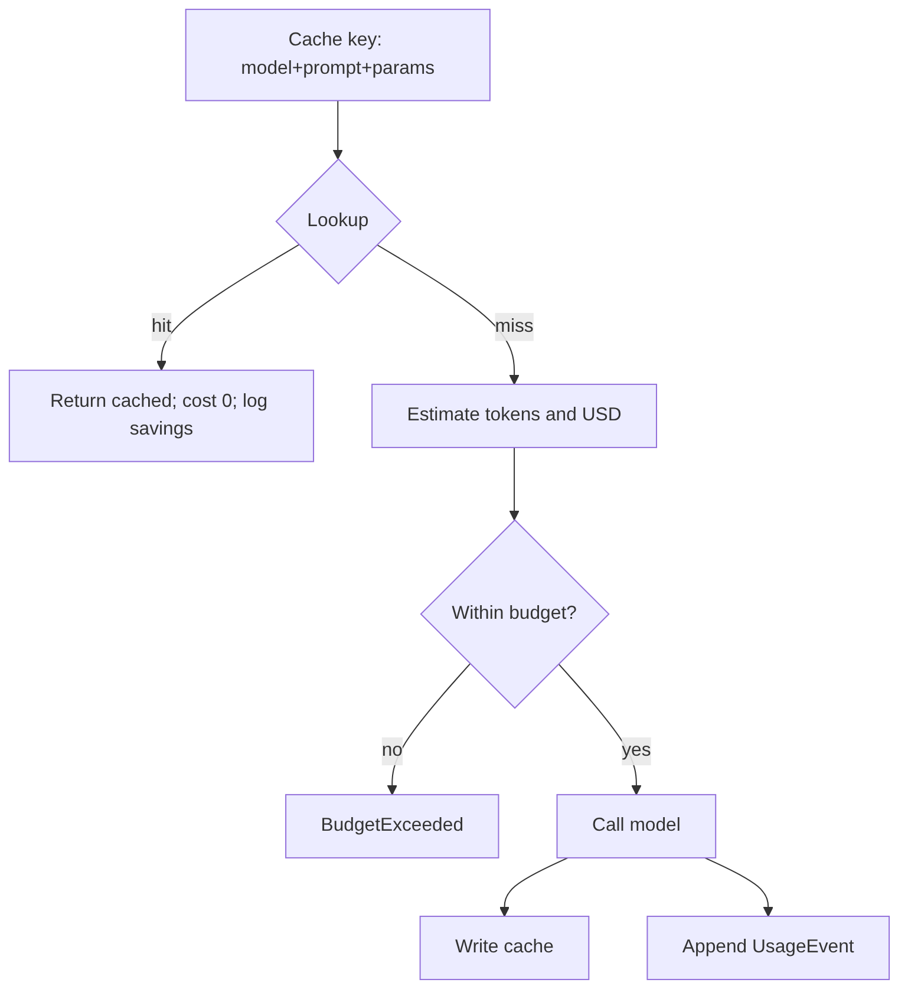
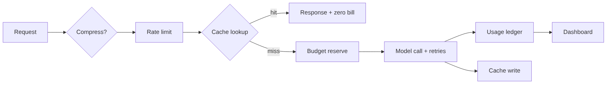
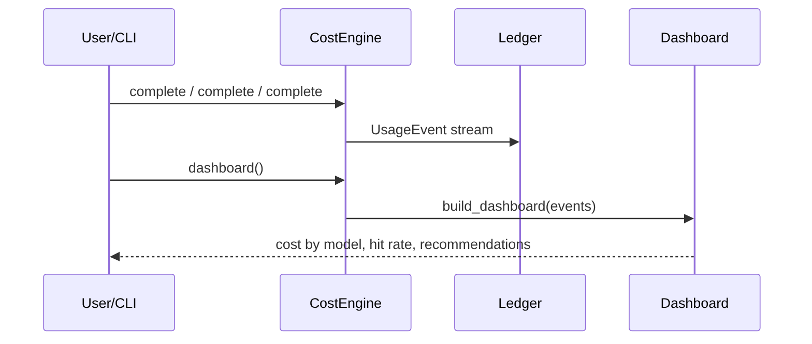

# Chapter 17: Cost & Performance

## Chapter Overview

Chapter 16 taught you to **route** work to the right model. That is necessary and still insufficient: a well-routed platform can bankrupt itself with uncached retries, unbounded `max_tokens`, serial embed loops, and no spend ceilings. Conversely, aggressive cost cuts without rate limits and budgets create outages and silent quality loss.

**Cost & performance engineering** is the control plane between product intent and the invoice:

- Measure tokens, latency, and dollars per call  
- Cache idempotent work  
- Batch where APIs allow  
- Bound retries and rate  
- Compress context before it becomes billable input  
- Account for streaming usage  
- Expose a **dashboard** with actionable recommendations  

This chapter builds **`costkit`**: pricing, response cache, dual rate limiters, retry policy, batching, compression helpers, stream aggregation, budgets, a cost-aware engine, and a dashboard mini product—fully offline and testable.

**Continuity:** Model selection (Ch 16) chooses SKUs; this chapter meters and constrains them. Token windows (Ch 10) and context packing (Ch 12) reduce input size; here those savings show up as line items. Part III retrieval will amplify embed costs—batching and caching become non-optional.

---

## Learning Objectives

After completing this chapter, you can:

- Estimate and record USD cost from token usage and a price book  
- Implement exact response caching with hit-rate and savings metrics  
- Enforce dual rate limits (requests/min and tokens/min)  
- Apply bounded exponential backoff without retry storms  
- Batch embed/classify-style workloads and measure calls saved  
- Compress prompts as a first-line cost control (with quality caveats)  
- Aggregate streaming chunks into billable usage  
- Fail closed on budget violations  
- Ship a cost dashboard with spend-by-model and recommendations  

---

## Prerequisites

- Chapters 10 (tokens), 16 (model routing / prices as fixtures)  
- Chapters 5–6 (HTTP errors, async ideas for production limiters)  
- Comfort with observability basics (counters, histograms)

---

## Motivation

A support agent goes viral on launch day.

- No cache → identical FAQ answers re-billed thousands of times  
- Flagship model on every classify (Ch 16 not wired)  
- Retry loop on 429 without backoff → amplified traffic and cost  
- No `max_cost_usd` → finance discovers the outage via the card limit  

The fix is not “use AI less.” It is **industrialize** AI: cache, batch, limit, budget, observe.

---

## First Principles

### 1. You cannot optimize what you do not meter

Every completion needs `model_id`, input/output tokens, latency, cache outcome, and cost.

### 2. The cheapest token is the one you do not send

Compression, retrieval top-k, and prompt hygiene beat heroic routing alone.

### 3. The second-cheapest token is the one you do not recompute

Exact cache for temperature-0 deterministic calls; later, semantic cache with care.

### 4. Retries are a cost multiplier

`max_attempts` and jitter are financial controls as much as reliability controls.

### 5. Rate limits protect you and the provider

Client-side token buckets prevent self-inflicted 429 storms and noisy-neighbor bills.

### 6. Budgets fail closed

When spend or call caps hit, return a structured error—do not “best effort” another flagship call.

---

## Mental Model



| Lever | Saves | Risk if abused |
|---|---|---|
| Cache | Duplicate cost/latency | Stale answers |
| Batch | Per-call overhead | Latency head-of-line |
| Compress | Input tokens | Lost detail |
| Smaller model | $/call | Quality |
| Rate limit | Overload | User throttling |
| Budget | Tail risk | Hard errors |

---

## Core Theory

### Pricing

\[
\text{cost} = \frac{n_{in}}{10^6} p_{in} + \frac{n_{out}}{10^6} p_{out}
\]

Use contract rates in production. This chapter’s `PriceBook` is illustrative and aligned with Ch 16 model IDs.

### Caching

**Exact cache key** must include at least: `model_id`, system, prompt, temperature, critical params (tools schema version, etc.).  
Hits bill **$0** marginal model cost but still count as product traffic—log `saved_cost_usd`.

### Batching

Embed and classify APIs often accept arrays. One HTTP call for 32 inputs beats 32 round trips (Ch 5–6). Track `calls_saved`.

### Streaming

Users see tokens early; billing still needs **final** output token counts. Aggregate deltas; fall back to heuristics only when providers omit counts.

### Compression

Whitespace collapse and hard caps are blunt tools. Real systems use summarization (Ch 12) and chunking (Ch 19). Never compress away safety policy text.

### Retries & rate limits

- Retry **transient** errors only (timeouts, 429/503 with care)  
- Exponential backoff + jitter  
- Token bucket: capacity + refill rate for RPM and TPM  

### Optimization loop

```text
measure → find top cost drivers → apply cache/batch/route/compress → re-measure
```

---

## Architecture

```text
code/chapter-017/
  costkit/
    types.py       # TokenUsage, UsageEvent, Budget, Dashboard
    pricing.py     # PriceBook
    cache.py       # ResponseCache
    ratelimit.py   # TokenBucket, RateLimiter
    retry.py       # RetryPolicy
    batch.py       # Batcher
    compress.py    # prompt shrinkage
    stream.py      # stream usage
    budget.py      # BudgetTracker
    dashboard.py   # aggregates + recommendations
    engine.py      # CostEngine wiring
  main.py
  tests/
```

---

## Internal Implementation

### CostEngine path

```text
compress? → cache lookup → budget reserve → rate limit → retry(model) → ledger → cache store
```

### CLI

```bash
python main.py prices
python main.py estimate --model openai:gpt-balanced --input 1000 --output 500
python main.py complete "Classify intent: billing" --repeat 3
python main.py dashboard
python main.py batch
python main.py stream "hello"
```

### Dashboard fields

- total cost, calls, tokens  
- cache hit rate + estimated savings  
- cost/calls by model  
- recommendations (low hit rate, single model domination, slow calls, output bloat)

---

## Production Implementation

- Emit OpenTelemetry metrics: `llm_cost_usd`, `llm_tokens`, `cache_hit`, `rate_limited`  
- Redis/Memcached for shared cache; include tenant in key  
- Distributed rate limits (Redis token bucket / provider headers)  
- Use provider-native cached input discounts when available—still log your own keys  
- Alert on burn rate (USD/hour) and budget %  
- Separate budgets per tenant, feature, and environment  
- Prefer async batch workers for embed backfills (Ch 6)  
- Stream partials to UX; finalize cost on `completed` event  

---

## Framework Implementation

Framework callbacks that print token counts are not a finance system. Keep:

1. Your `UsageEvent` ledger schema  
2. Your price book (or billing service)  
3. Your budget authority  

Adapt LangChain/LlamaIndex callbacks **into** that schema.

---

## Trade-offs

| Technique | Pros | Cons |
|---|---|---|
| Exact cache | Simple, safe | Low hit rate if prompts vary |
| Semantic cache | Higher hits | Wrong-answer risk |
| Large batches | Throughput | Latency |
| Aggressive compress | Cheap | Quality regressions |
| Tight budgets | Cost cap | User-facing errors |
| Many retries | Resilience | Cost spikes |

**Default:** exact cache for temp=0, moderate batches, tight budgets in prod, retries ≤ 3, dual rate limits.

---

## Debugging

| Symptom | Check |
|---|---|
| Bill higher than dashboard | Missing events; wrong price book; tools/embed not metered |
| Cache never hits | Temperature>0; unstable keys; clock/TTL |
| 429 loops | No client rate limit; retry without respect for Retry-After |
| Budget false positives | Estimate >> actual; fix reservation accounting |
| Latency high, cost low | Local model or network; not always a cost bug |

---

## Performance

- Cache lookups are O(1) in-memory; Redis RTT dominates in prod  
- Batch embed backfills offline  
- Avoid serial `for doc in docs: embed(doc)`  
- Cap output tokens at the API  
- Route easy traffic cheap (Ch 16) before micro-optimizing whitespace  

---

## Security

| Risk | Control |
|---|---|
| Cache key collision across tenants | Tenant prefix in keys |
| Cached secrets | Do not cache responses with sensitive payloads without policy |
| Budget bypass | Enforce server-side, not only client |
| Prompt injection via cached tool output | Cache does not change trust rules (Ch 12–14) |
| Log PII in dashboards | Redact; aggregate |

---

## Best Practices

1. Meter every call  
2. Pin prices and model IDs  
3. Cache only when deterministic enough  
4. Bound retries  
5. Client-side rate limits  
6. Fail closed on budgets  
7. Batch embeds  
8. Cap max output tokens  
9. Dashboard by model and feature  
10. Revisit weekly with real traffic  

---

## Anti-Patterns

| Anti-pattern | Failure |
|---|---|
| No usage logs | Flying blind |
| Retry forever | Cost and thundering herd |
| Cache without model_id | Wrong answers / security |
| Shared cache across tenants | Data leak |
| Flagship default + no budget | Bill shock |
| Compress system policy away | Safety regressions |

---

## Hands-on Exercise

1. Price 1M in + 1M out for `openai:gpt-balanced`.  
2. Complete the same prompt thrice with cache; confirm 2nd/3rd are hits.  
3. Set a tiny budget; assert hard failure.  
4. Run `dashboard` demo; explain one recommendation.  
5. Batch 7 items with `max_size=3`; compute calls saved.

---

## Mini Project

**Cost dashboard** over a ledger of mock completions: caching, multi-model spend, savings, and optimization hints—CLI + tests + diagrams.

---

## Visual diagrams








## Chapter Deliverables

| Artifact | Location |
|---|---|
| Manuscript | `book/chapter-017.md` |
| Package | `code/chapter-017/costkit/` |
| Tests | `code/chapter-017/tests/` |
| Diagrams | `diagrams/mermaid\|png/chapter-017/` |

---

## Interview Questions

1. What belongs in a cache key for LLM responses?  
2. How do retries interact with cost?  
3. RPM vs TPM limits—why both?  
4. How do you bill streaming responses?  
5. Exact vs semantic cache trade-offs?  
6. How should budgets fail?  
7. What dashboard metrics matter first week of prod?  
8. How does routing (Ch 16) reduce cost more than micro-caching?  
9. Why batch embeddings?  
10. How do you prevent cross-tenant cache reads?

---

## Quiz

1. Duplicate temperature-0 FAQ answers should: **hit an exact cache**  
2. Budgets should: **fail closed**  
3. Output token caps primarily reduce: **completion cost and latency**  

T/F: Rate limits are only the provider’s problem. **False**

---

## Cheat Sheet

```bash
cd code/chapter-017 && pytest -q
python3 main.py dashboard
python3 main.py complete "..." --repeat 3 --budget 0.01
```

| Lever | Module |
|---|---|
| Price | `pricing.py` |
| Cache | `cache.py` |
| Limit | `ratelimit.py` |
| Retry | `retry.py` |
| Batch | `batch.py` |
| Budget | `budget.py` |
| View | `dashboard.py` |

---

## Curated Free Resources

- Provider rate-limit and usage API docs  
- Token bucket / leaky bucket primers  
- FinOps for cloud (apply the same burn-rate thinking)  
- OpenTelemetry GenAI semantic conventions (emerging)

---

## Chapter Summary

Cost and performance turn model calls into a governed subsystem: meter usage, cache determinism, limit throughput, retry with bounds, batch where possible, compress inputs carefully, enforce budgets, and read a dashboard. The `costkit` engine and cost-dashboard mini project give the platform a financial and latency control plane before retrieval and agents multiply call volume.

**What changed:** `costkit` package, dashboard project, tests, diagrams.

---

## What's Next

**Chapter 18 — Semantic Search** applies embeddings (Ch 15) at retrieval scale—where batching, caching, and cost metering stop being optional extras and become path-critical infrastructure.
