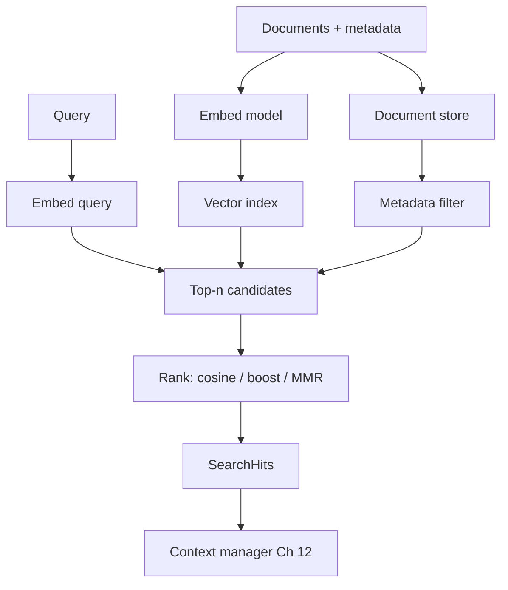
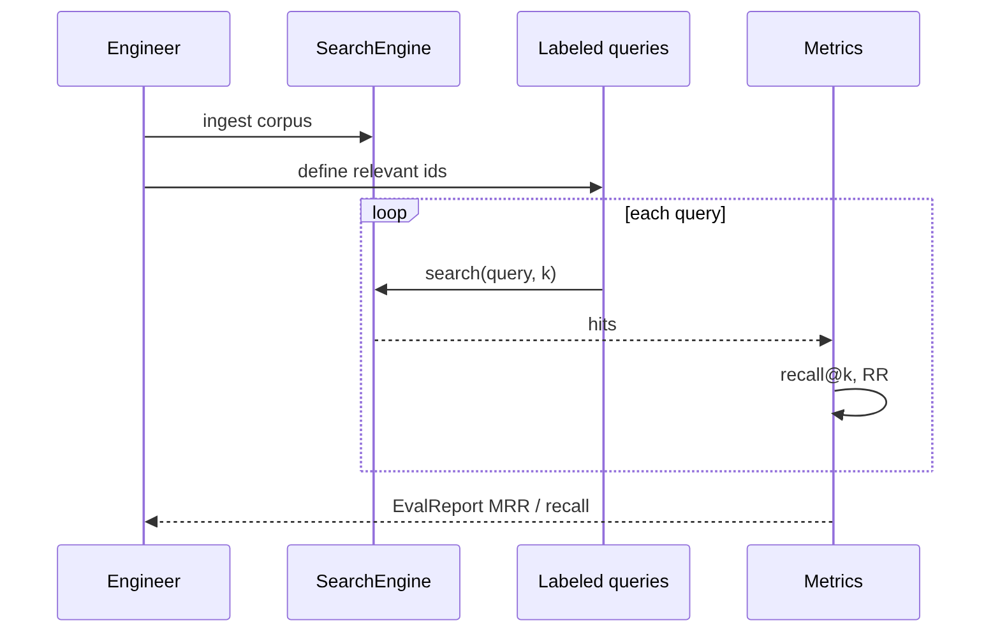
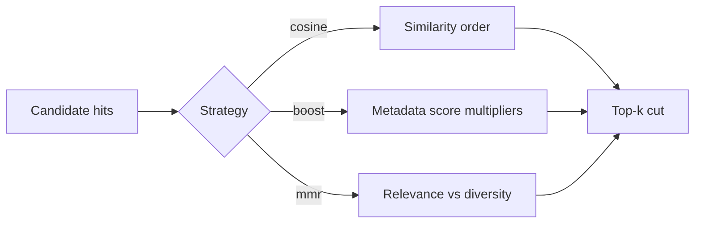
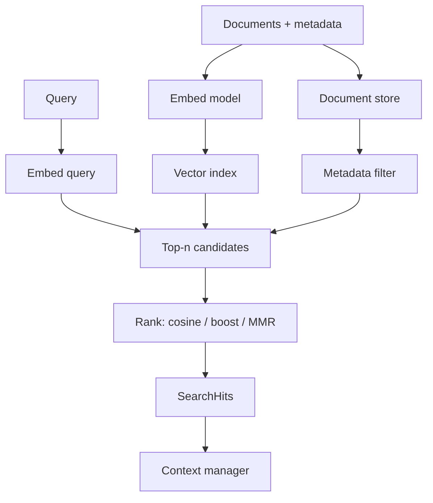

# Chapter 18: Semantic Search

## Chapter Overview

Chapter 15 introduced embeddings and a minimal FAQ search. Part III starts here: **semantic search as a product subsystem**—ingest documents, store metadata, rank by similarity, filter, diversify, explain scores, evaluate with labeled queries, and persist the index.

Keyword search fails on paraphrase (“money back” vs “refund”). Dumping the whole corpus into the prompt fails on cost and context limits (Ch 10–12, 17). Semantic search retrieves **top-k evidence** so generation stays grounded and cheap.

This chapter builds **`searchkit`**: a production-shaped offline **search engine** with TF-IDF embeddings (swap-ready for neural models), metadata filters, cosine / MMR / boost ranking, explainability, Recall@k / MRR evaluation, and JSON snapshots.

**Continuity:** Embeddings (Ch 15) supply vectors. Cost controls (Ch 17) meter embed/search traffic. Context packing (Ch 12) consumes hits as untrusted evidence. Chapter 19 adds chunking so long docs become indexable passages.

---

## Learning Objectives

After completing this chapter, you can:

- Ingest documents with metadata into a dual store (docs + vectors)
- Run similarity search with top-k and min-score thresholds  
- Filter by metadata (topic, product, tenant-ready keys)  
- Apply ranking strategies: cosine, metadata boosts, MMR diversity  
- Explain why a document scored high (overlap + cosine)  
- Evaluate retrieval with Recall@k, Precision@k, and MRR  
- Persist and reload an index snapshot  
- Ship a CLI search engine over a knowledge base  

---

## Prerequisites

- Chapter 15 (embeddings, cosine, model pinning)  
- Chapter 12 (retrieved text as untrusted evidence)  
- Chapter 17 (batch/cache ideas for embed pipelines)  
- Basic IR vocabulary: precision, recall, ranking  

---

## Motivation

Support search v1: SQL `LIKE '%refund%'`.  
Users type “reverse a charge.” Zero hits. Tickets spike.

Support search v2: embed the handbook once, embed the query online, return top-3 chunks to the agent context.  
Paraphrases work; costs stay bounded; answers cite real policy text.

Semantic search is the retrieval front door for RAG and agent memory—not a demo notebook cell.

---

## First Principles

### 1. Search is ranking, not generation

The engine returns ordered candidates. Truth still needs grounding, tools, and policies.

### 2. Same embedding space for queries and documents

Pin `model_id`. Mixing models silently corrupts neighbors (Ch 15).

### 3. Metadata is a first-class filter

Tenancy, language, product line, ACL tags—filter **before** or **while** scoring, never only in the prompt.

### 4. Score ≠ calibrated probability

Cosine 0.31 might be “best available.” Use thresholds carefully; evaluate on labels.

### 5. Measure with a query set

Without Recall@k / MRR, you are tuning vibes. Ship a tiny labeled set on day one.

### 6. Diversity can matter as much as raw similarity

Near-duplicate chunks waste context. MMR trades a bit of relevance for coverage.

---

## Mental Model



| Piece | Role |
|---|---|
| Document store | Text + metadata source of truth |
| Vector index | Similarity lookup |
| Ranker | Boosts, MMR, normalization |
| Eval harness | Recall@k, MRR |
| Snapshot | Persist model + vectors |

---

## Core Theory

### Similarity search

Embed query \(q\), score documents by \(\cos(e(q), e(d))\) (or dot product on unit vectors). Return top-k.

### Ranking layers

1. **Retrieval** — get a candidate pool (here: linear scan; later ANN)  
2. **Filter** — metadata / ACL  
3. **Re-rank** — boosts, MMR, cross-encoders (later)  
4. **Cut** — k and min_score  

### Metadata

Store fields like `topic`, `product`, `lang`, `tenant_id`. Filters are equality matches in this chapter; production adds ranges and ACL joins.

### Scoring strategies

| Strategy | Behavior |
|---|---|
| `cosine` | Pure similarity order |
| `boost` | Multiply scores by metadata weights |
| `mmr` | Maximal Marginal Relevance diversity |

### Evaluation

- **Recall@k** — fraction of relevant docs found in top-k  
- **Precision@k** — fraction of top-k that are relevant  
- **MRR** — mean reciprocal rank of first relevant hit  

---

## Architecture

```text
code/chapter-018/
  searchkit/
    types.py      # Document, SearchHit, EvalReport
    embed.py      # TfidfEmbedder, HashingEmbedder
    store.py      # DocumentStore
    index.py      # VectorIndex + filters
    rank.py       # boosts, MMR
    engine.py     # SearchEngine
    eval.py       # metrics
    persist.py    # JSON snapshot
    corpus.py     # KB + labeled queries
  main.py
  tests/
```

---

## Internal Implementation

### SearchEngine API

```python
eng = SearchEngine.with_defaults()
eng.search("money back", k=3, filters={"topic": "billing"})
eng.search("billing plans", strategy="mmr")
eng.explain("refund", "kb-refund")
eng.evaluate_default(k=3)
```

### CLI

```bash
python main.py demo
python main.py search "How do I get my money back?" -k 3
python main.py search "rate limits" --topic developers
python main.py explain "refund" kb-refund
python main.py eval -k 3
python main.py ingest --out /tmp/kb.json
```

---

## Production Implementation

- ANN indexes (FAISS/HNSW) behind the same `search()` API (Ch 22+)  
- Neural embedding APIs or local sentence-transformers (Ch 20)  
- Hybrid lexical + dense (Ch 26)  
- Async batch embed on ingest (Ch 6, 17)  
- Per-tenant indexes or mandatory `tenant_id` filter  
- Trace: query, filters, hit ids, scores, model_id, latency  
- Online eval sampling + offline golden sets  

---

## Framework Implementation

Vector DB SDKs and LangChain retrievers are adapters. Own:

1. Document + metadata schema  
2. Hit contract for the context manager  
3. Eval harness  

---

## Trade-offs

| Choice | Pros | Cons |
|---|---|---|
| Linear scan | Simple, exact | Poor at huge scale |
| TF-IDF local | Offline, clear | Weak paraphrase vs neural |
| Large k | Recall | Noise into context |
| Aggressive min_score | Precision | Empty results |
| MMR | Diversity | May drop best near-dup |

**Default:** cosine top-k, metadata filters for tenancy, small labeled eval, MMR when packing multiple chunks.

---

## Debugging

| Symptom | Check |
|---|---|
| Bad paraphrase ranking | Weak embedder; need neural model |
| Empty results | Filters too tight; min_score too high |
| Duplicates in top-k | Use MMR or dedupe by source |
| Good demo, bad prod | No eval set; corpus drift |
| Wrong tenant doc | Missing metadata filter |

---

## Performance

- Embed documents at ingest; queries online  
- Batch ingest embeds  
- Cap candidate pool before MMR  
- Cache frequent query vectors (Ch 17)  
- ANN when N grows past comfortable linear scan  

---

## Security

| Risk | Control |
|---|---|
| Cross-tenant retrieval | Force tenant filter / separate indexes |
| Sensitive vectors | ACL on search API; treat vectors as sensitive |
| Injection via hits | Untrusted evidence framing (Ch 12) |
| Poisoned corpus | Ingest auth + review |

---

## Best Practices

1. Pin embedding model IDs  
2. Store rich metadata  
3. Filter early  
4. Evaluate with labels  
5. Log hit ids for every production query  
6. Diversify multi-hit packs  
7. Threshold carefully  
8. Separate store vs index  
9. Version corpus snapshots  
10. Keep search pure—generation elsewhere  

---

## Anti-Patterns

| Anti-pattern | Failure |
|---|---|
| No metadata / ACL | Data leaks |
| k=50 into the prompt | Context bloat |
| Untested ranking tweaks | Silent regressions |
| Mixing embed models | Garbage neighbors |
| Search-as-chatbot | Unmetered hallucination |

---

## Hands-on Exercise

1. Run `demo` and inspect top hits.  
2. Filter `topic=developers` for a rate-limit query.  
3. Compare `cosine` vs `mmr` on a billing query.  
4. `explain` a hit and list token overlap.  
5. Run `eval` and require recall@3 ≥ 0.75.

---

## Mini Project

**Knowledge-base search engine** with ingest, search, filters, ranking strategies, explain, eval, and persistence.

---

## Visual diagrams








## Chapter Deliverables

| Artifact | Location |
|---|---|
| Manuscript | `book/chapter-018.md` |
| Package | `code/chapter-018/searchkit/` |
| Tests | `code/chapter-018/tests/` |
| Diagrams | `diagrams/mermaid\|png/chapter-018/` |

---

## Interview Questions

1. Cosine search vs keyword search—when does each win?  
2. Why pin the same embed model for query and document?  
3. How do metadata filters enforce tenancy?  
4. What does MMR optimize?  
5. Recall@k vs precision@k for RAG?  
6. Why is score not a probability?  
7. How would you migrate to FAISS without breaking callers?  
8. What belongs in a search trace?  
9. How do retrieved chunks enter the LLM safely?  
10. When is min_score harmful?

---

## Quiz

1. Semantic search ranks by: **vector similarity (e.g. cosine)**  
2. Tenant isolation should use: **metadata filters or separate indexes**  
3. Day-one quality signal: **labeled eval (Recall@k / MRR)**  

T/F: Highest cosine guarantees a correct answer. **False**

---

## Cheat Sheet

```bash
cd code/chapter-018 && pytest -q
python3 main.py search "money back" -k 3
python3 main.py eval -k 3
```

| Step | Component |
|---|---|
| Ingest | store + embed + index |
| Filter | metadata allow-list |
| Rank | cosine / boost / MMR |
| Measure | eval.py |
| Use | pack hits into context |

---

## Curated Free Resources

- “Introduction to Information Retrieval” (Manning et al.) — ranking basics  
- Sentence-Transformers retrieval docs  
- BEIR / retrieval eval surveys  
- Your vector DB filter syntax reference  

---

## Chapter Summary

Semantic search turns embeddings into a governed retrieval engine: documents and metadata in a store, vectors in an index, ranked hits with filters and optional diversity, plus evaluation and persistence. The `searchkit` knowledge-base engine is the platform’s retrieval front door—ready for chunking, stronger embedders, and vector databases in the next chapters.

**What changed:** `searchkit` package, search-engine mini project, tests, diagrams.

---

## What's Next

**Chapter 19 — Chunking Strategies** splits long documents into indexable passages so semantic search ranks the right *span*, not an entire handbook as one blunt vector.
