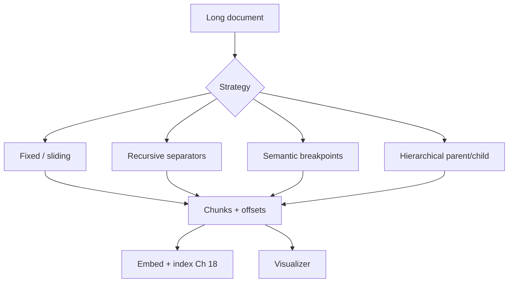
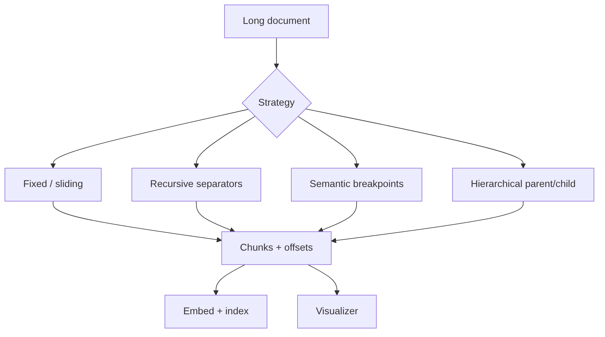
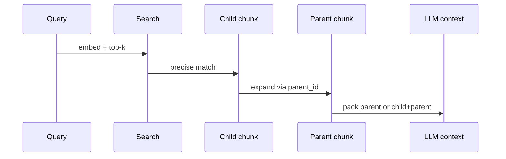
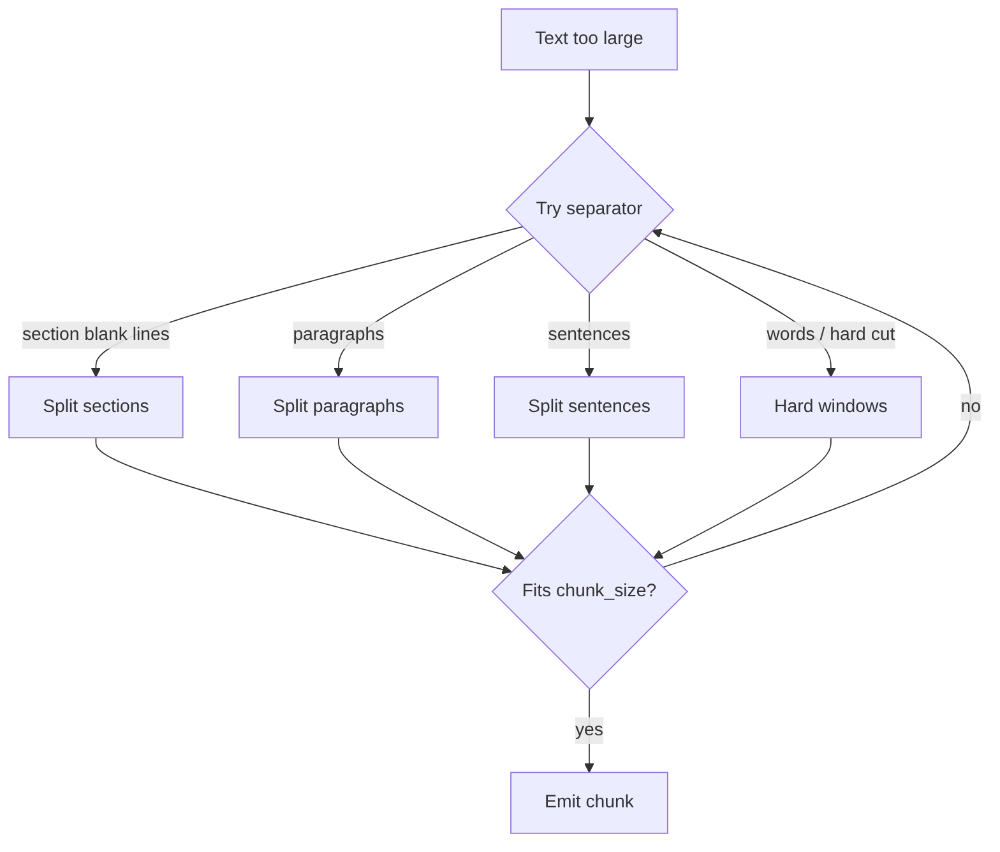

# Chapter 19: Chunking Strategies

## Chapter Overview

Chapter 18 ranked whole FAQ documents. Real corpora are longer: policy handbooks, tickets, PDFs, design docs. Embed an entire 50-page PDF as one vector and similarity search becomes mush—the “refund” paragraph averages away with shipping SLAs and SSO footnotes.

**Chunking** splits long text into retrieval-sized passages so semantic search (Ch 18) can rank the right *span*. Bad chunking causes retrieval failure even with a perfect embedding model: mid-sentence cuts, oversized blobs, missing overlap, or no parent context for the LLM.

This chapter builds **`chunkkit`**: fixed, sliding-window, recursive, semantic, and hierarchical chunkers, plus a **chunk visualizer** mini project that prints boundaries and comparison stats—offline and testable.

**Continuity:** Chunks become `Document` units for search ingest. Token budgets (Ch 10) size chunks. Context packing (Ch 12) may expand a child hit to its hierarchical parent. Cost controls (Ch 17) meter re-chunk + re-embed jobs.

---

## Learning Objectives

After completing this chapter, you can:

- Explain why long documents must be chunked before embedding  
- Implement fixed-size and sliding-window splitters with overlap  
- Apply recursive separator hierarchies (sections → paragraphs → sentences)  
- Detect semantic breakpoints between sentences  
- Build parent/child hierarchical chunks for multi-granularity retrieval  
- Estimate tokens per chunk and compare strategies  
- Visualize chunk boundaries for debugging  
- Choose a default strategy for structured vs free-form text  

---

## Prerequisites

- Chapter 15–18 (embeddings + semantic search)  
- Chapter 10 (token sizing intuition)  
- Comfort with strings, offsets, and tree-ish recursion  

---

## Motivation

You embed the whole employee handbook. Query: “How do I reverse a charge?”  
The nearest neighbor is the handbook vector—or worse, a security section that shares generic words. The refund policy never surfaces as a precise hit.

Chunk the handbook by heading and paragraph with modest overlap. The refund section becomes its own vector. Search returns that span; the agent cites real policy text.

Chunking is not preprocessing trivia. It is **schema design for retrieval**.

---

## First Principles

### 1. Chunks are the atomic unit of embedding

You retrieve what you embed. Design spans for questions users ask.

### 2. Structure beats arbitrary character cuts when available

Headings and paragraphs encode human topic boundaries—use them.

### 3. Overlap is a trade for boundary safety

Overlap costs storage and embed dollars; it saves mid-thought splits.

### 4. One size does not fit all corpora

Code, markdown, tables, and chat logs want different splitters.

### 5. Hierarchy preserves context

Small children match precisely; parents supply surrounding policy for generation.

### 6. Measure chunk distributions

Avg/max chars and tokens predict embed cost and context bloat.

---

## Mental Model



| Strategy | Best for | Risk |
|---|---|---|
| Fixed | Uniform logs, simple baselines | Cuts mid-sentence |
| Sliding | Dense coverage | More chunks / cost |
| Recursive | Markdown / prose | Weak on unstructured walls of text |
| Semantic | Topic shifts without headings | Needs good similarity signal |
| Hierarchical | RAG with expand-to-parent | More complex ingest |

---

## Core Theory

### Fixed size

Windows of `size` characters (or tokens), step `size - overlap`.

### Sliding window

Explicit `window` + `stride` (often 50% overlap). Same family as fixed; parameters emphasize coverage.

### Recursive

Try separators from coarse to fine: `\n\n\n`, `\n\n`, `\n`, `. `, ` `, hard cut. Merge undersized pieces up to `chunk_size`.

### Semantic

Split into sentences; measure adjacent similarity (here: bag-of-words cosine as offline stand-in for embedding similarity). Break when similarity drops below a threshold or size caps hit.

### Hierarchical

1. Parent chunks (large recursive sections)  
2. Child chunks (smaller fixed windows inside each parent)  
3. Children store `parent_id` for expand-on-retrieve  

### Sizing heuristics (starting points)

| Corpus | Child size (chars ~ tokens×4) | Overlap |
|---|---|---|
| Support markdown | 300–600 chars | 10–15% |
| Code | Prefer symbol-aware splitters later | low |
| Chat | Message-aware, not raw chars | n/a |

Always re-tune with retrieval eval (Ch 18 labels).

---

## Architecture

```text
code/chapter-019/
  chunkkit/
    types.py          # SourceDocument, Chunk, reports
    tokens.py         # estimate_tokens
    fixed.py
    sliding.py
    recursive.py
    semantic.py
    hierarchical.py
    visualize.py      # ASCII visualizer
    pipeline.py       # registry + compare
    sample_docs.py    # policy handbook
  main.py
  tests/
```

---

## Internal Implementation

### Unified API

```python
from chunkkit import chunk_document, SourceDocument
rep = chunk_document(doc, "recursive", chunk_size=400, chunk_overlap=40)
```

### Visualizer CLI

```bash
python main.py visualize --strategy recursive
python main.py chunk --strategy hierarchical --format json --no-text
python main.py compare --size 350
```

### Chunk fields

`id`, `doc_id`, `text`, `start`, `end`, `strategy`, `parent_id`, `level`, `token_estimate`, `metadata`.

---

## Production Implementation

- Prefer **token** lengths (tiktoken / provider counters) over raw chars  
- Version chunker config next to embedding `model_id`  
- Re-chunk + re-embed on strategy changes (like model migrations)  
- Special splitters: HTML, Markdown AST, code ASTs, PDF page/block  
- Store offsets into original object storage for citation highlighting  
- Hierarchical retrieve: search children → return parent text to the LLM  
- Job queue for bulk reprocessing (Ch 6, 17)  

---

## Framework Implementation

LangChain text splitters and LlamaIndex node parsers are optional. Keep:

1. Your `Chunk` contract  
2. Offset + parent linkage  
3. Strategy name in metadata for debugging  

---

## Trade-offs

| Choice | Pros | Cons |
|---|---|---|
| Large chunks | More context | Diluted embeddings |
| Tiny chunks | Precise match | Loss of local context |
| High overlap | Boundary safety | Cost |
| Semantic only | Topic-aware | Compute + tuning |
| Hierarchy | Best of both | Ingest complexity |

**Default for markdown handbooks:** recursive mid-size + optional hierarchy for production RAG.

---

## Debugging

| Symptom | Check |
|---|---|
| Mid-sentence junk hits | Increase structure / recursive seps |
| Missed answers at boundaries | Add overlap |
| Every hit is huge | Lower chunk_size |
| Too many near-dup chunks | Reduce overlap; MMR at search (Ch 18) |
| Child irrelevant alone | Expand to parent |

---

## Performance

- Chunking is CPU-cheap vs embedding  
- Bulk re-chunk offline  
- Avoid re-embedding unchanged content (hash text)  
- Semantic splitters that call embed APIs need batching (Ch 17)  

---

## Security

| Risk | Control |
|---|---|
| Chunk leaks sensitive spans | Same ACL as source doc metadata |
| Path injection via file chunk CLI | Read only allowed roots |
| Prompt injection in chunks | Untrusted evidence rules still apply |

---

## Best Practices

1. Preserve source offsets for citations  
2. Put `doc_id` + strategy in metadata  
3. Prefer structure-aware splitters  
4. Use overlap at noisy boundaries  
5. Compare strategies with a visualizer  
6. Evaluate retrieval after chunk changes  
7. Hierarchical for long policies  
8. Cap max chunk tokens for embed models  
9. Version configs  
10. Don’t chunk system prompts—chunk *corpus*  

---

## Anti-Patterns

| Anti-pattern | Failure |
|---|---|
| One vector per book | Unsearchable mush |
| Zero overlap always | Boundary misses |
| Random 2k char cuts on code | Broken symbols |
| Re-chunk without re-embed | Index lies |
| Ignoring tables/lists | Truncated meaning |

---

## Hands-on Exercise

1. Visualize recursive chunks on the sample handbook.  
2. Compare fixed vs recursive vs semantic at size 350.  
3. Build hierarchical chunks; expand a child to its parent.  
4. Chunk a local markdown file via `--file`.  
5. Argue which strategy you’d ship for support policies.

---

## Mini Project

**Chunk visualizer**: multi-strategy CLI, boundary maps, comparison table, handbook fixture.

---

## Visual diagrams








## Chapter Deliverables

| Artifact | Location |
|---|---|
| Manuscript | `book/chapter-019.md` |
| Package | `code/chapter-019/chunkkit/` |
| Tests | `code/chapter-019/tests/` |
| Diagrams | `diagrams/mermaid\|png/chapter-019/` |

---

## Interview Questions

1. Why not embed entire documents?  
2. Fixed vs recursive—when each?  
3. What problem does overlap solve?  
4. How does hierarchical retrieval work?  
5. How do chunk sizes interact with context windows?  
6. Why store character offsets?  
7. How would you chunk source code?  
8. What breaks if you change chunker but not vectors?  
9. Semantic chunking without embeddings?  
10. How to A/B chunk strategies safely?

---

## Quiz

1. Atomic embed unit should be: **a purposeful chunk/span**  
2. Markdown policies often use: **recursive / structure-aware splitting**  
3. Child hit needs more context: **expand to parent**  

T/F: Larger chunks always improve retrieval. **False**

---

## Cheat Sheet

```bash
cd code/chapter-019 && pytest -q
python3 main.py visualize --strategy recursive
python3 main.py compare --size 350
```

| Strategy | Module |
|---|---|
| fixed | `fixed.py` |
| sliding | `sliding.py` |
| recursive | `recursive.py` |
| semantic | `semantic.py` |
| hierarchical | `hierarchical.py` |

---

## Curated Free Resources

- LangChain recursive character splitter notes (ideas, not dependency)  
- “Lost in the middle” context papers (why span choice matters)  
- Unstructured / document AI parsers for real PDFs  
- Your eval set from Ch 18—rerun after chunk changes  

---

## Chapter Summary

Chunking turns long documents into retrieval-ready passages: fixed and sliding windows for baselines, recursive separators for structured prose, semantic breakpoints for topic shifts, and hierarchical parent/child graphs for precise match plus expandable context. The visualizer makes boundaries inspectable so you debug retrieval failures at the span layer—before blaming the model.

**What changed:** `chunkkit` package, chunk visualizer project, tests, diagrams.

---

## What's Next

**Chapter 20 — Embedding Models** compares embedding SKUs and quality/cost trade-offs so the chunks you just designed get the right vector encoder—not the first API default you remembered.
