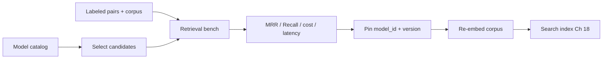
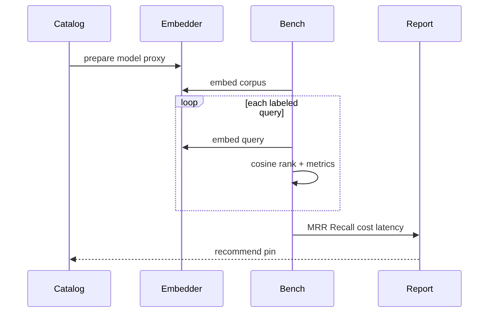
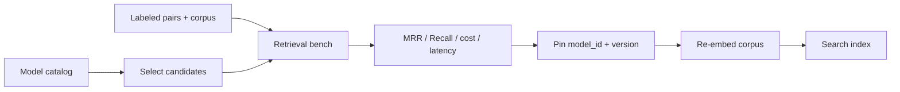
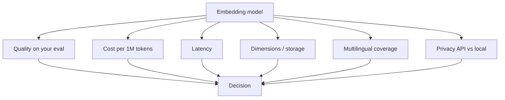

# Chapter 20: Embedding Models

## Chapter Overview

Chapters 15 and 18–19 established the pipeline: normalize → chunk → embed → index → rank. The weakest link is often not the index—it is the **embedding model**: the function that maps text into a vector space where “near” means “related.”

Choosing an embedding model is a product decision with axes of **quality**, **cost**, **latency**, **dimensions/storage**, **context length**, **multilingual coverage**, **privacy** (API vs open weights), and **ops burden**. Picking “whatever the SDK default is” freezes those trade-offs without measurement.

This chapter builds **`embbench`**: a model catalog (API, open-weight, teaching), offline embedders for CI, a retrieval **benchmark** (Recall@k, MRR, multilingual probes), a trade-off matrix, and a constraint-based **recommender**. Commercial cards use illustrative prices; the harness never needs network access.

**Continuity:** Chunks (Ch 19) are the embed inputs. Search (Ch 18) consumes vectors. Cost controls (Ch 17) meter embed batch jobs. Changing embed models requires **re-embedding the corpus** (Ch 15 principle).

---

## Learning Objectives

After completing this chapter, you can:

- Describe embedding models as versioned products with dims, cost, and language coverage  
- Compare API vs open-weight vs lexical/hash baselines  
- Run a labeled retrieval benchmark across candidate models  
- Interpret Recall@1/3, MRR, multilingual R@1, latency, and storage  
- Estimate query-side cost from $/1M tokens  
- Recommend a model under constraints (local, multilingual, max cost/dims)  
- Explain why mixing model IDs in one index is forbidden  
- Design an offline proxy harness when API keys are unavailable  

---

## Prerequisites

- Chapters 15, 18, 19 (embeddings, search, chunking)  
- Chapter 16–17 (model portfolios, cost metering)  
- Basic evaluation literacy (precision/recall/ranking)  

---

## Motivation

Team A ships `text-embedding-3-large` for every tenant FAQ. Storage and bills soar; quality barely moves on their short English tickets.

Team B uses a tiny English MiniLM for a Spanish support desk. Multilingual queries collapse to keyword luck.

Team C runs a **benchmark on their labeled queries**, pins a mid-size multilingual model, documents dims and version, and re-embeds only when eval + finance say so.

Embedding selection without measurement is cargo cult.

---

## First Principles

### 1. The embedder defines the geometry of meaning

All ranking downstream is relative to that space.

### 2. Same model ID for queries and documents

Dual encoders exist, but accidental mixing is an outage.

### 3. Quality is task-specific

Leaderboards ≠ your tickets. Measure on your pairs.

### 4. Dimensions are storage and RAM

Higher dims can help quality and always cost index space.

### 5. Multilingual is not free

Need non-English queries? Require multilingual cards and test them.

### 6. Offline baselines keep pipelines honest

Lexical/hash models validate plumbing when APIs are down.

---

## Mental Model



| Family | Pros | Cons |
|---|---|---|
| API neural | Strong quality, low ops | Cost, data leaves boundary |
| Open weights | Privacy, $0 API | GPUs, maintenance |
| Lexical TF-IDF | Fast, clear | Weak paraphrase |
| Hashing / char-n-gram | Offline, multilingual surfaces | Collisions, weak semantics |

---

## Core Theory

### Model card fields

`model_id`, dimensions, max tokens, $/1M tokens, multilingual flag, instruction support, latency class, languages, notes.

### Benchmark design

1. Fixed corpus passages with ids  
2. Labeled `(query → positive_id)` pairs (+ negatives for stress)  
3. Embed corpus once; embed each query; rank by cosine  
4. Aggregate Recall@k and MRR  
5. Slice multilingual queries separately  
6. Report latency and estimated query cost  

### Cost sketch

\[
\text{cost}_{1k\ q} \approx \frac{1000 \cdot \bar{t}_q}{10^6} \cdot p
\]

Document embedding cost is a one-time (or re-embed) capital expense—track it in FinOps too.

### Multilingual

Cross-lingual retrieval (EN docs, ES/FR/DE queries) stresses models that only share English tokens. Char-n-gram proxies and true multilingual encoders outperform pure English TF-IDF on those probes.

### When to re-benchmark

New corpus domain, new languages, cost shock, quality regressions, vendor deprecations.

---

## Architecture

```text
code/chapter-020/
  embbench/
    types.py        # cards, pairs, results
    catalog.py      # illustrative model cards
    models.py       # offline TF-IDF / hashing / char-ngram
    dataset.py      # corpus + EN/multilingual pairs
    metrics.py      # cosine, recall, MRR
    benchmark.py    # harness + compare report
    recommend.py    # constraint recommender
  main.py
  tests/
```

---

## Internal Implementation

### CLI

```bash
python main.py catalog
python main.py tradeoffs
python main.py bench
python main.py bench --models teaching:tfidf,teaching:char-ngram
python main.py recommend --multilingual --local
python main.py corpus
```

### Offline proxies

Commercial catalog entries map to teaching proxies in CI so tests need no keys. Production swaps in real SDK embedders behind the same `Embedder` protocol.

---

## Production Implementation

- Pin snapshot model IDs; store on every vector row  
- Shadow-eval a new model on sampled traffic before cutover  
- Blue/green re-embed with dual indexes  
- Batch embed APIs; respect TPM (Ch 17)  
- Instruction-tuned embedders: prefix queries consistently  
- Matryoshka / dim reduction only with eval proof  
- Multilingual routing: separate indexes per language if needed  

---

## Framework Implementation

Sentence-Transformers, OpenAI embeddings, Cohere embed are adapters. Own the **card**, **bench**, and **pin** process.

---

## Trade-offs

| Decision | Wins | Loses |
|---|---|---|
| Larger model | Quality headroom | $ and storage |
| Smaller dims | Cheap indexes | Possible quality drop |
| API only | Fast to ship | Privacy, lock-in |
| Local only | Control | Ops complexity |
| One global model | Simplicity | Domain mismatch |

**Default:** mid-size multilingual if you have non-EN traffic; otherwise small English model; always hold a lexical baseline in CI.

---

## Debugging

| Symptom | Check |
|---|---|
| Great EN, bad ES | Model not multilingual; bad chunk language mix |
| High cost, flat quality | Downshift model; confirm with bench |
| Random neighbors after migrate | Mixed dims/model_ids in index |
| Bench ≠ prod | Different chunking or query distribution |

---

## Performance

- Batch documents; cache document vectors  
- Async embed (Ch 6)  
- Prefer fewer dims when eval allows  
- ANN indexes matter more as N grows (Ch 21–22)  

---

## Security

| Risk | Control |
|---|---|
| Sensitive text to API embedders | Local models or DLP |
| Vectors as confidential data | ACL on indexes (Ch 15, 18) |
| Model supply chain (local weights) | Pin hashes, private registries |

---

## Best Practices

1. Catalog every embedder you use  
2. Benchmark on your labels  
3. Pin model_id + version  
4. Re-embed on change  
5. Track multilingual slices  
6. Include a free baseline  
7. Meter cost and storage  
8. Document why you picked the model  
9. Separate eval from production cutover  
10. Never mix spaces  

---

## Anti-Patterns

| Anti-pattern | Failure |
|---|---|
| SDK default forever | Hidden cost/quality |
| No labeled pairs | Vibe-driven swaps |
| Multilingual product, EN model | Support failures |
| Re-point model without re-embed | Corrupt retrieval |
| Leaderboard-only choice | Domain mismatch |

---

## Hands-on Exercise

1. List the catalog; note multilingual flags.  
2. Run `bench` on teaching models; record MRR.  
3. Compare English-only vs full pair set.  
4. `recommend --multilingual --local`.  
5. Write three constraints for your real product and pick a card.

---

## Mini Project

**Embedding benchmark**: catalog + retrieval harness + trade-off matrix + recommender, offline CI-friendly.

---

## Visual diagrams








## Chapter Deliverables

| Artifact | Location |
|---|---|
| Manuscript | `book/chapter-020.md` |
| Package | `code/chapter-020/embbench/` |
| Tests | `code/chapter-020/tests/` |
| Diagrams | `diagrams/mermaid\|png/chapter-020/` |

---

## Interview Questions

1. What belongs on an embedding model card?  
2. Why re-embed after model change?  
3. API vs open-weight trade-offs?  
4. How do you evaluate embedding quality for RAG?  
5. Why might higher dimensions not be worth it?  
6. How do you test multilingual retrieval?  
7. What is a dual encoder?  
8. How does embed cost differ from chat cost?  
9. How to migrate indexes safely?  
10. Why keep a lexical baseline?

---

## Quiz

1. Query and document vectors usually need: **the same model_id**  
2. Day-one selection signal: **labeled retrieval metrics**  
3. Non-English queries need: **multilingual embedders + tests**  

T/F: The most expensive embedding model always wins on your data. **False**

---

## Cheat Sheet

```bash
cd code/chapter-020 && pytest -q
python3 main.py bench
python3 main.py recommend --multilingual
```

| Concern | Tool |
|---|---|
| Inventory | `catalog` |
| Measure | `bench` |
| Decide | `recommend` |
| Compare axes | `tradeoffs` |

---

## Curated Free Resources

- MTEB / retrieval leaderboards (signal, not policy)  
- Sentence-Transformers model cards  
- Provider embedding pricing + dim docs  
- BEIR and domain eval sets  

---

## Chapter Summary

Embedding models are selectable products: catalog them, benchmark on labeled retrieval (including multilingual probes), and pin with eyes open on cost, storage, and privacy. `embbench` provides the offline control plane so later vector-database chapters sit on a justified encoder—not an accident.

**What changed:** `embbench` package, embedding benchmark project, tests, diagrams.

---

## What's Next

**Chapter 21 — Vector Databases** stores and filters the vectors your chosen embedder produces—indexes, metadata, persistence, and scaling beyond in-memory scans.
