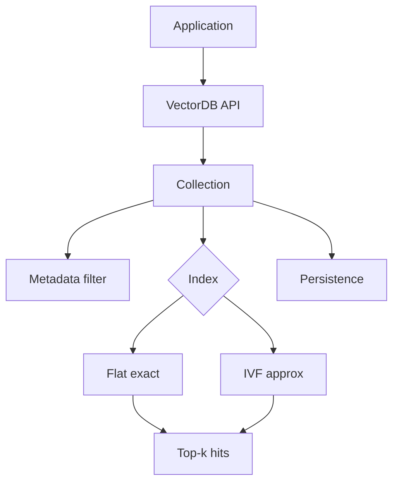
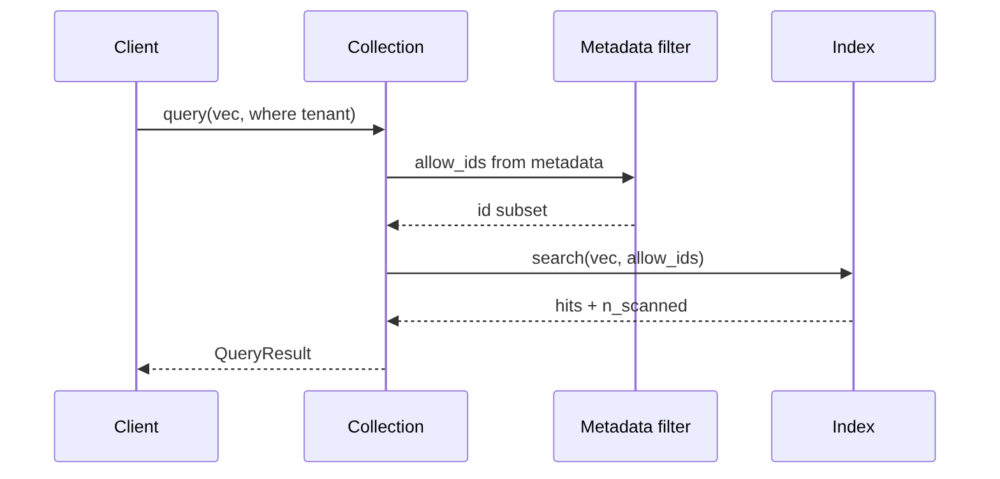
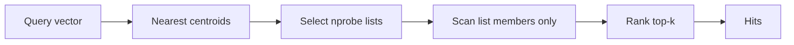

# Chapter 21: Vector Databases

## Chapter Overview

By Chapter 20 you can choose an embedding model; by Chapters 18–19 you can chunk and search in memory. Production systems need a **vector database** (or vector index service): durable storage for vectors + metadata, filtered nearest-neighbor query, operational controls for scale, and clear trade-offs between **exact** and **approximate** indexes.

A vector DB is not “magic AI storage.” It is a specialized database for the access pattern:

```text
upsert(id, vector, metadata) → query(vector, k, filters) → ranked hits
```

This chapter builds a **mini vector database** (`vectordb`): multi-collection API, **flat** (exact) and **IVF** (approximate teaching) indexes, metadata filters, JSON persistence, and a comparison harness that measures scan reduction vs top-1 agreement.

**Continuity:** Embeddings (Ch 15/20) produce vectors. Search (Ch 18) is the product surface. Chunking (Ch 19) defines rows. Cost (Ch 17) meters embed + query size. Chapter 22 (FAISS) and 23 (Chroma) are production-shaped backends behind the same ideas.

---

## Learning Objectives

After completing this chapter, you can:

- Explain the role of a vector DB in the RAG stack  
- Implement flat exact search and measure full scans  
- Explain IVF: coarse quantizer, inverted lists, `nprobe`  
- Filter by metadata before/while searching (tenancy, topic)  
- Persist and reload collections  
- Compare index types on scan count and agreement  
- Discuss scaling: sharding, replicas, ANN families  
- Design a collection API that can swap backends later  

---

## Prerequisites

- Chapters 15, 18–20 (vectors, search, models)  
- Basic database vocabulary (collections, indexes, filters)  
- Comfort with cosine/dot on unit vectors  

---

## Motivation

In-memory Python lists work for demos. Then:

- Process restarts wipe the index  
- Tenants share one list and leak hits  
- 10M chunks make linear scan miss SLOs  
- Ops asks for backups and blue/green re-embeds  

A vector database (or managed equivalent) is how retrieval becomes infrastructure.

---

## First Principles

### 1. Vectors without metadata are incomplete rows

Always store tenant, source, ACL, chunk id, model_id.

### 2. Exact vs approximate is a product knob

Flat = correctness baseline. ANN = scale with recall risk.

### 3. Filters are security boundaries

Tenant filters are not optional niceties.

### 4. The API should outlive the engine

`create_collection` / `upsert` / `query` stays; FAISS/Chroma/pgvector swap underneath.

### 5. Persistence includes model identity

Restoring vectors without `model_id` invites silent corruption.

### 6. Measure recall when you approximate

Never ship IVF/HNSW without agreement checks vs flat on a sample.

---

## Mental Model



| Component | Responsibility |
|---|---|
| Collection | Namespace + dim + model_id |
| Flat index | Exact cosine scan |
| IVF index | Probe subset of lists |
| Filter | Restrict candidate ids |
| Snapshot | Durability |

---

## Core Theory

### Flat index

Score every eligible vector; sort; take k. **Recall perfect** (within float noise). Cost O(N·d).

### IVF (Inverted File)

1. Train/select **centroids** (coarse codebook)  
2. Assign each vector to nearest centroid → inverted list  
3. At query: find `nprobe` nearest centroids; scan only those lists  

Fewer scans → lower latency; missing the true list → recall loss.

### Metadata filtering

Strategies:

- **Pre-filter:** compute allow-set from metadata, scan only those ids  
- **Post-filter:** ANN then drop non-matches (can return < k)  
- **Hybrid indexes:** metadata-aware partitioning (advanced)

This chapter uses pre-filter allow-sets.

### Persistence

Serialize records + index config. Production: WAL, snapshots, replication.

### Scaling patterns

| Technique | Idea |
|---|---|
| Sharding | Partition by tenant or hash(id) |
| Replication | Read scale + HA |
| ANN (HNSW/IVF-PQ) | Sublinear search |
| Quantization | Compress vectors |
| Tiering | Hot RAM / cold disk |

---

## Architecture

```text
code/chapter-021/
  vectordb/
    database.py      # VectorDB
    collection.py    # Collection API
    index_flat.py
    index_ivf.py
    filter.py
    persist.py
    compare.py
    embed.py         # demo hashing embedder
    demo_data.py
  main.py
  tests/
```

---

## Internal Implementation

### API sketch

```python
db = VectorDB()
col = db.create_collection("kb", index_type="flat")
col.upsert(id="refund", text="...", metadata={"tenant": "acme"})
col.query(text="money back", k=3, where={"tenant": "acme"})
```

### CLI

```bash
python main.py demo
python main.py query "money back" --where '{"topic":"billing"}'
python main.py compare
python main.py persist --path /tmp/vdb.json
```

---

## Production Implementation

- Managed: Pinecone, Weaviate, Qdrant, Vertex, OpenSearch k-NN  
- Embedded/self-host: Chroma, LanceDB, Milvus, pgvector  
- Always store `model_id`, dim, chunk provenance  
- Enforce tenant predicates in the data plane  
- Blue/green collections on re-embed  
- SLOs: p95 query latency, recall@k vs flat sample  
- Backups and restore drills  

---

## Framework Implementation

LangChain vectorstore wrappers are adapters. Own collection naming, filter schema, and migration story.

---

## Trade-offs

| Index | Pros | Cons |
|---|---|---|
| Flat | Exact, simple | Poor at large N |
| IVF | Fewer scans | Recall risk, build step |
| HNSW (later) | Strong ANN | Memory, build cost |
| PQ/SQ | Compression | Quality loss |

**Default:** flat until N hurts; then ANN with continuous recall monitoring.

---

## Debugging

| Symptom | Check |
|---|---|
| Missing known doc | Filters; wrong collection; stale snapshot |
| IVF worse than flat | Raise `nprobe`; rebuild; more lists |
| Cross-tenant hit | Filter not applied |
| Dim errors | Mixed embed models |
| Empty after persist | Load path / schema version |

---

## Performance

- Batch upserts  
- Rebuild IVF offline  
- Cache hot query embeddings (Ch 17)  
- Partition large tenants  
- Prefer pre-filter when selectivity is high  

---

## Security

| Risk | Control |
|---|---|
| Tenant bleed | Mandatory tenant filter / separate collections |
| Vector exfiltration | Authz on query API |
| Prompt injection via hits | Untrusted evidence (Ch 12) |
| Snapshot leakage | Encrypt backups |

---

## Best Practices

1. Collection per domain or tenant strategy  
2. Metadata for every row  
3. Pin model_id on the collection  
4. Flat baseline for eval  
5. Measure ANN recall  
6. Persist with config  
7. Version re-embed migrations  
8. Log n_scanned + latency  
9. Fail closed on missing tenant filter in multi-tenant apps  
10. Keep API backend-agnostic  

---

## Anti-Patterns

| Anti-pattern | Failure |
|---|---|
| One global unfiltered index | Data leaks |
| ANN without eval | Silent quality loss |
| No persistence | Rebuild from scratch forever |
| Vectors without source ids | Un-citable RAG |
| Re-embed into live index mid-read | Inconsistent results |

---

## Hands-on Exercise

1. Run `demo`; confirm refund ranks for money-back.  
2. Query with `tenant=globex` filter.  
3. Run `compare`; note scan reduction.  
4. `persist` and reload; query again.  
5. Delete a doc and verify it disappears.

---

## Mini Project

**Mini vector database** with flat + IVF, filters, persistence, and comparison report.

---

## Visual diagrams






## Chapter Deliverables

| Artifact | Location |
|---|---|
| Manuscript | `book/chapter-021.md` |
| Package | `code/chapter-021/vectordb/` |
| Tests | `code/chapter-021/tests/` |
| Diagrams | `diagrams/mermaid\|png/chapter-021/` |

---

## Interview Questions

1. What problem does a vector DB solve beyond a list of floats?  
2. Flat vs IVF trade-offs?  
3. What is `nprobe`?  
4. Pre-filter vs post-filter metadata?  
5. Why store model_id with vectors?  
6. How do you validate ANN quality?  
7. Sharding strategies for multi-tenant RAG?  
8. How does re-embedding interact with persistence?  
9. Vector DB vs relational DB with pgvector?  
10. What metrics would you alert on?

---

## Quiz

1. Exact search baseline index: **flat**  
2. IVF reduces latency by: **scanning fewer inverted lists**  
3. Tenant isolation requires: **metadata filters or separate collections**  

T/F: Approximate indexes always return the true nearest neighbor. **False**

---

## Cheat Sheet

```bash
cd code/chapter-021 && pytest -q
python3 main.py demo
python3 main.py compare
```

| API | Purpose |
|---|---|
| `create_collection` | Namespace + index type |
| `upsert` | Insert/update vector row |
| `query` | Top-k + filters |
| `save_db` / `load_db` | Persistence |

---

## Curated Free Resources

- FAISS wiki (IVF, HNSW concepts) — Ch 22 deep dive  
- pgvector / Qdrant / Weaviate filter docs  
- “Billion-scale similarity search” survey papers  
- Your cloud provider’s vector offering limits  

---

## Chapter Summary

A vector database turns embeddings into durable, filterable, queryable infrastructure. Flat indexes define correctness; IVF-style approximate indexes trade recall for fewer scans; metadata filters enforce tenancy and business facets; persistence and collection APIs make the system operable. The mini `vectordb` package is the conceptual core—later chapters attach FAISS, Chroma, and managed engines without changing the mental model.

**What changed:** `vectordb` package, mini vector DB project, tests, diagrams.

---

## What's Next

**Chapter 22 — FAISS** takes the same index ideas into a battle-tested library: production-grade ANN building blocks and a PDF search project on real local indexes.
