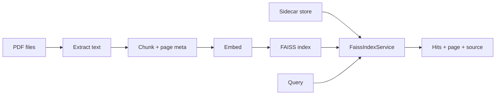
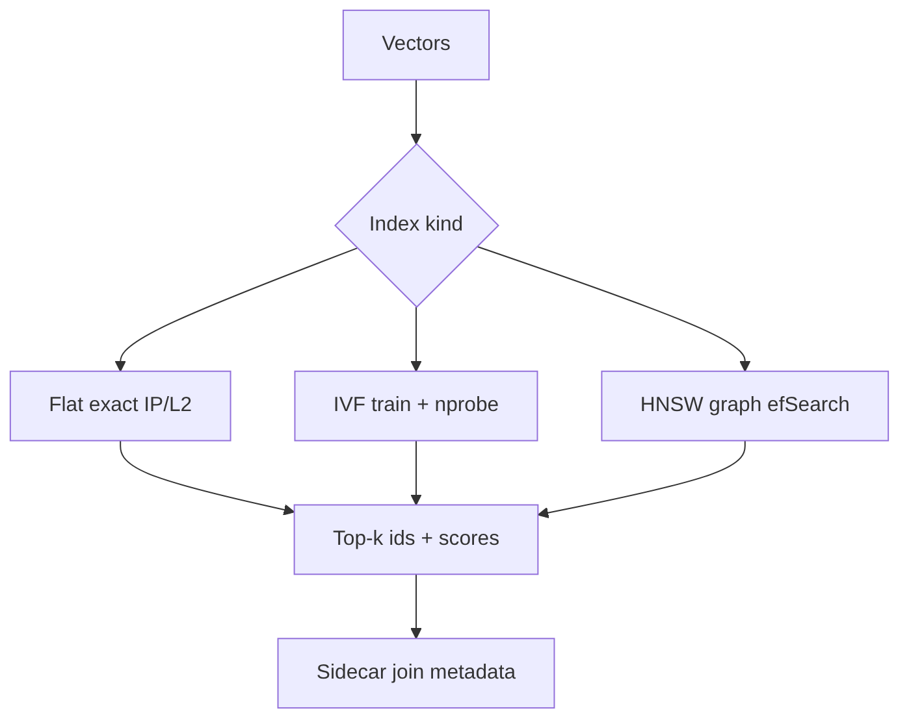
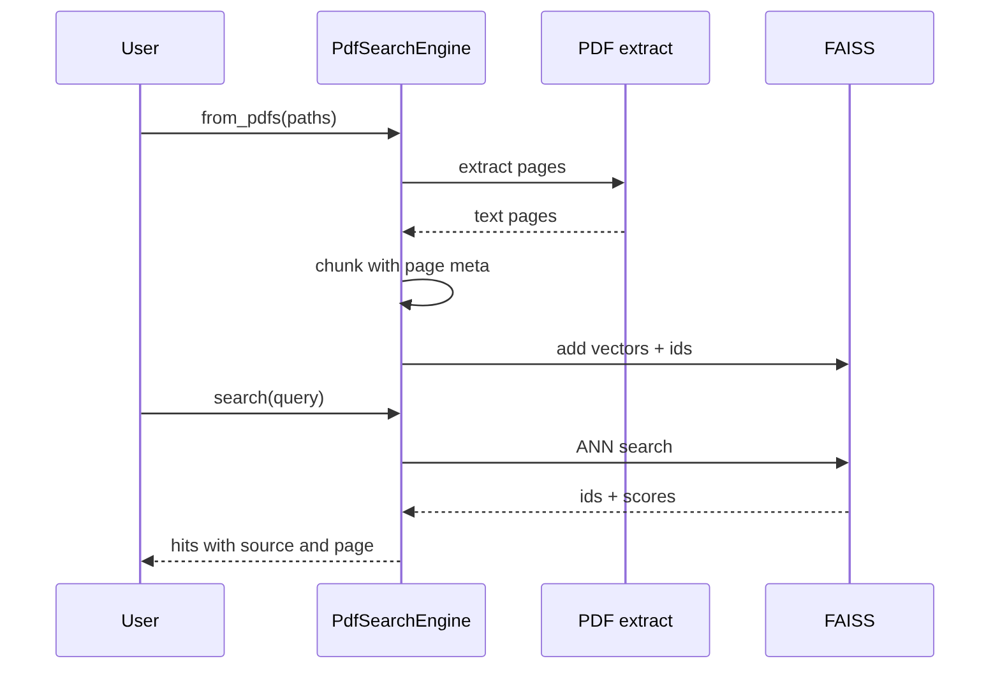

# Chapter 22: FAISS

## Chapter Overview

Chapter 21 built a mini vector database to teach collections, filters, and IVF ideas. **FAISS** (Facebook AI Similarity Search) is the industrial C++/Python library many teams use for large-scale local similarity search: exact flat indexes, IVF, HNSW, product quantization, GPU variants, and battle-tested persistence.

FAISS stores **vectors and integer ids**—not JSON metadata. Production systems pair FAISS with a **sidecar** (SQLite, files, or a document store) for text, tenant, page numbers, and model_id. This chapter wraps FAISS in `faisskit`: Flat / IVF / HNSW builders, ID maps, search with metadata filters, save/load, nprobe optimization, and a **PDF search** mini project (extract → chunk → index → query).

**Continuity:** Embeddings (Ch 15/20) feed FAISS. Chunking (Ch 19) creates rows. Vector DB concepts (Ch 21) map 1:1 onto FAISS index types. Chapter 23 (Chroma) shows a higher-level library with batteries included.

---

## Learning Objectives

After completing this chapter, you can:

- Build FAISS Flat (IP/L2), IVF-Flat, and HNSW indexes  
- Use `IndexIDMap2` for stable external ids  
- Train IVF indexes and tune `nprobe`  
- Persist `index.faiss` plus a metadata sidecar  
- Filter search hits by metadata after ANN retrieval  
- Compare index kinds on latency and top-1 agreement  
- Index PDF text chunks and search with page provenance  
- Know when to use FAISS vs a full vector DB product  

---

## Prerequisites

- Chapters 18–21 (search, chunking, embeddings, vector DB concepts)  
- NumPy basics  
- Optional: prior C++/ANN curiosity—not required  

---

## Motivation

Your corpus grows from 8 FAQs to 5 million PDF chunks. Pure-Python linear scan misses latency SLOs. You need:

- Memory-efficient ANN  
- Fast rebuilds and disk snapshots  
- The ability to A/B Flat vs HNSW offline  

FAISS is the standard toolkit for that local path—especially before paying for a managed vector service.

---

## First Principles

### 1. FAISS is an ANN kernel, not a full database

You own metadata, multi-tenancy, auth, and migrations.

### 2. Metric and normalization must match training

Inner product on unit vectors ≈ cosine. Mixing L2 and IP blindly breaks ranking.

### 3. IVF must be trained

Calling `add` before `train` on IVF fails or no-ops incorrectly—always train on a sample.

### 4. Approximate means measure recall

Raise `nprobe` / `efSearch` until agreement with Flat is acceptable.

### 5. Persistence is two artifacts

Binary index + sidecar JSON/SQL for ids and metadata.

### 6. PDFs are messy documents

Extract → chunk with page metadata → then FAISS; never embed whole PDFs as one vector.

---

## Mental Model



| FAISS kind | Role |
|---|---|
| Flat IP/L2 | Exact baseline |
| IVF Flat | Coarse lists + scan |
| HNSW | Graph ANN, strong default ANN |

---

## Core Theory

### Flat

`IndexFlatIP` / `IndexFlatL2`: exact search, O(N).

### IVF

`IndexIVFFlat(quantizer, d, nlist)`: train centroids; assign vectors; query probes `nprobe` lists.

### HNSW

`IndexHNSWFlat(d, M)`: hierarchical navigable small world graph; tune `efConstruction` / `efSearch`.

### ID maps

`IndexIDMap2` stores user-provided int64 ids; we map string document ids ↔ ints in the sidecar.

### Optimization

- **nprobe sweep:** latency vs quality for IVF  
- **efSearch:** HNSW recall/latency  
- **PQ/OPQ** (advanced): compress vectors for billion-scale (out of scope code, know the names)

---

## Architecture

```text
code/chapter-022/
  faisskit/
    indexes.py       # factory
    store.py         # sidecar
    service.py       # FaissIndexService
    persist.py       # write_index + meta.json
    optimize.py      # compare + nprobe sweep
    pdf_io.py        # minimal PDF I/O
    pdf_search.py    # PDF search engine
  main.py
  tests/
```

---

## Internal Implementation

### Service

```python
svc = FaissIndexService(kind="hnsw", dimensions=64)
svc.add_documents(docs)
svc.search("refund", k=3, where={"topic": "billing"})
save_service(svc, "/tmp/idx")
```

### PDF search

```python
paths = build_sample_pdfs("./fixtures/pdfs")
engine = PdfSearchEngine.from_pdfs(paths)
engine.search("How do I get a refund?", k=3)
```

### CLI

```bash
python main.py search "money back" --kind ivf_flat
python main.py compare
python main.py pdf-search "tracking number"
python main.py persist --path /tmp/faisskit-index
```

---

## Production Implementation

- Embed with your pinned model (Ch 20), not only hash demos  
- Store `model_id` + chunk hash in sidecar  
- Rebuild indexes offline; atomic swap directories  
- Shard by tenant or collection if N is huge  
- GPU FAISS when batch build/search justifies it  
- Prefer pypdf/unstructured for real PDF extraction  
- Monitor: ntotal, build time, p95 search, recall vs flat sample  

---

## Framework Implementation

LangChain FAISS wrapper and LlamaIndex FAISS store are thin layers. Own id scheme, sidecar schema, and re-embed jobs.

---

## Trade-offs

| Kind | Pros | Cons |
|---|---|---|
| Flat | Exact | Memory/latency at scale |
| IVF | Classic, tunable | Needs train; recall risk |
| HNSW | Strong ANN QPS | RAM for graph |
| PQ | Tiny memory | Quality loss |

**Default path:** Flat for eval; HNSW or IVF for larger local prod; managed DB when ops wants SaaS.

---

## Debugging

| Symptom | Check |
|---|---|
| IVF add fails | Not trained / too few train points |
| Random ranking | Wrong metric; vectors not normalized for IP |
| Missing metadata | Sidecar out of sync with index |
| PDF empty extract | Parser limits; use production PDF stack |
| Low recall ANN | Increase nprobe/efSearch |

---

## Performance

- Batch `add` with contiguous float32 matrices  
- Train IVF on a sample, not necessarily all data  
- Avoid re-encoding the corpus every query  
- Use `remove_ids` sparingly (can fragment); periodic rebuild  

---

## Security

| Risk | Control |
|---|---|
| Index file steals corpus semantics | Encrypt at rest; ACL paths |
| Tenant mix in one index | Filter metadata or shard indexes |
| PDF with secrets | Same ACL as source documents |

---

## Best Practices

1. Always keep a Flat baseline for eval  
2. Unit-normalize for IP cosine  
3. Sidecar for all metadata  
4. Version index directories  
5. Tune nprobe/efSearch with measurements  
6. Record model_id on the index  
7. Chunk PDFs with page numbers  
8. Atomic promote of new builds  
9. Test remove/re-add paths  
10. Don’t treat FAISS as your source of truth for documents  

---

## Anti-Patterns

| Anti-pattern | Failure |
|---|---|
| Only FAISS, no doc store | Unexplainable hits |
| Never measure ANN recall | Silent quality drop |
| One vector per PDF | Unsearchable mush |
| Shared index, no tenant filter | Data leaks |
| Editing index files by hand | Corruption |

---

## Hands-on Exercise

1. `search` with flat_ip; confirm refund ranking.  
2. `compare` flat vs IVF vs HNSW.  
3. `nprobe` sweep on IVF.  
4. `fixtures` + `pdf-search` for refund query.  
5. `persist` and reload; query again.

---

## Mini Project

**PDF search:** generate sample policy PDFs, extract text, chunk with page metadata, index with FAISS, query with source/page in hits.

---

## Visual diagrams







## Chapter Deliverables

| Artifact | Location |
|---|---|
| Manuscript | `book/chapter-022.md` |
| Package | `code/chapter-022/faisskit/` |
| Tests | `code/chapter-022/tests/` |
| Diagrams | `diagrams/mermaid\|png/chapter-022/` |

---

## Interview Questions

1. Why does FAISS need a metadata sidecar?  
2. Flat vs IVF vs HNSW?  
3. What does `nprobe` control?  
4. Why train IVF?  
5. Inner product vs L2 for text embeddings?  
6. How do you validate ANN quality?  
7. How would you re-embed without downtime?  
8. GPU FAISS when?  
9. FAISS vs pgvector vs managed vector DB?  
10. How do page numbers get into PDF search hits?

---

## Quiz

1. FAISS alone does not store: **rich metadata / text**  
2. Exact baseline index: **Flat**  
3. PDF search pipeline: **extract → chunk → embed → FAISS**  

T/F: Higher nprobe always decreases latency. **False** (usually increases latency, improves recall)

---

## Cheat Sheet

```bash
cd code/chapter-022 && pytest -q
python3 main.py pdf-search "How do I get a refund?"
python3 main.py compare
```

| Kind | Use |
|---|---|
| flat_ip | Eval / small N |
| ivf_flat | Tunable approx |
| hnsw | Strong local ANN |

---

## Curated Free Resources

- FAISS GitHub wiki (indexes, training)  
- “Billion-scale similarity search with GPUs”  
- Your PDF extraction stack docs (pypdf, pdfplumber)  
- Chapter 21 for conceptual IVF before library details  

---

## Chapter Summary

FAISS is the production-grade local ANN engine: Flat for truth, IVF and HNSW for scale, ID maps plus a sidecar for real documents, and persistence for operable indexes. The PDF search project shows the end-to-end path from messy files to ranked, citable chunks—ready to swap in neural embeddings and larger corpora.

**What changed:** `faisskit` package, PDF search project, tests, diagrams.

---

## What's Next

**Chapter 23 — Chroma** packages collections, embeddings, and persistence into a developer-friendly vector store—useful contrast to raw FAISS kernels.
