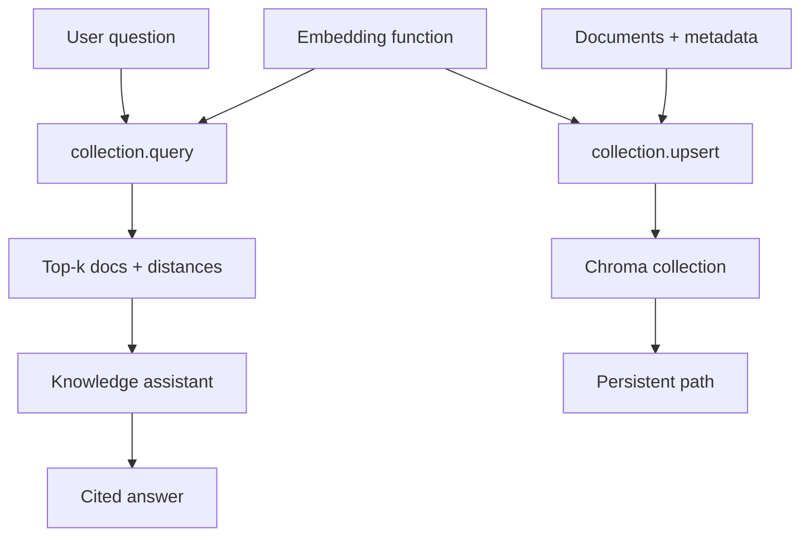
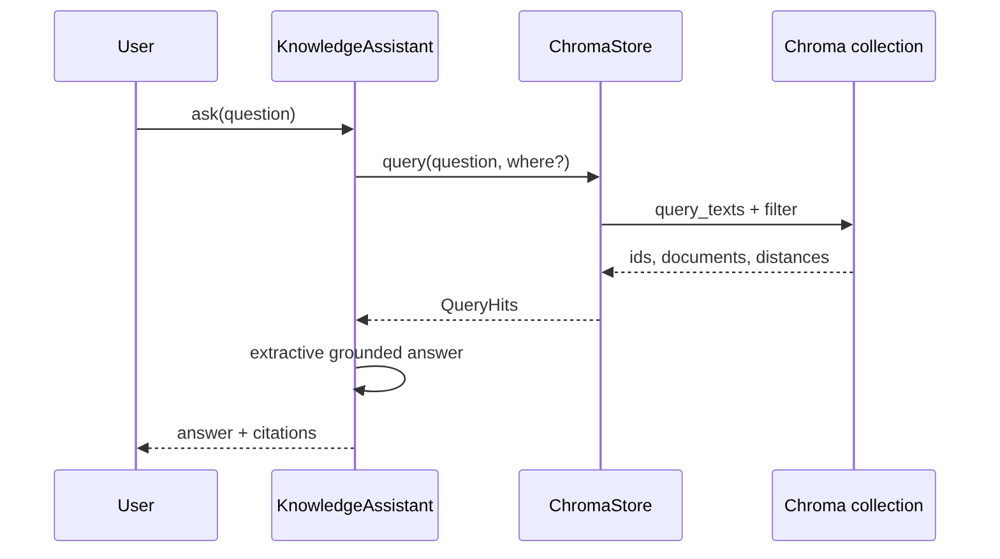
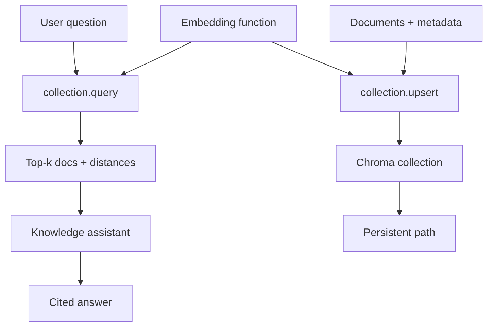
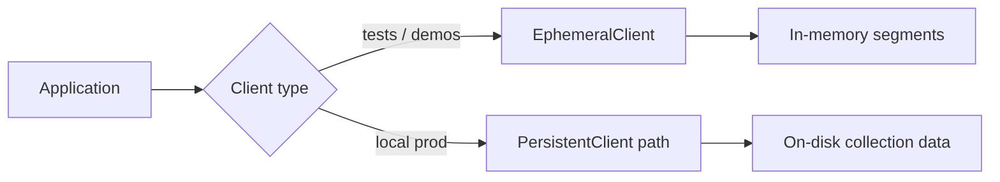

# Chapter 23: Chroma

## Chapter Overview

Chapters 21–22 built vector storage from first principles and FAISS kernels. **Chroma** is a developer-friendly vector database: collections, document upsert, embedding functions, metadata filters, and local persistence with a short API surface.

Chroma is not a substitute for understanding ANN—it packages the workflow so product teams can ship a knowledge base quickly. This chapter builds **`chromakit`**: a production-shaped façade over Chroma (ephemeral + persistent clients), an **offline hash embedding function** (so CI never downloads ONNX MiniLM weights), metadata filtering, and a **knowledge assistant** mini project that retrieves passages and returns **cited, grounded** answers.

**Continuity:** Chunks (Ch 19) and embeddings (Ch 20) still apply. FAISS (Ch 22) remains the low-level control plane when you outgrow embedded stores. Chapter 24 assembles **production RAG** on top of a retriever like this.

---

## Learning Objectives

After completing this chapter, you can:

- Create Chroma collections with custom embedding functions  
- Upsert documents with metadata and query by text  
- Filter results with `where` predicates  
- Persist a collection to disk and reload it  
- Avoid default embedding downloads in offline/CI environments  
- Build a knowledge assistant that cites retrieved passages  
- Compare Chroma’s product surface to FAISS + sidecar (Ch 22)  
- Know when Chroma is enough vs when to graduate to FAISS/managed DBs  

---

## Prerequisites

- Chapters 18–22 (search, chunking, embeddings, vector DB, FAISS)  
- Basic Python packaging  
- Optional: prior Chroma tutorials—we re-teach from engineering needs  

---

## Motivation

You want a support **knowledge assistant** this week:

1. Load FAQ/policy passages  
2. Retrieve top-k for a user question  
3. Answer with citations—not free-form hallucination  

Chroma’s collection API maps cleanly onto that loop. Without a pinned embedding function, however, first `add()` may download a large ONNX model—fine for a laptop demo, hostile to CI and air-gapped builds. Production code **injects** the embedder explicitly.

---

## First Principles

### 1. Collections are the unit of tenancy and schema

Name them carefully; put domain/tenant strategy in the name or metadata.

### 2. Embedding functions are part of the contract

Changing EF without re-ingesting corrupts similarity geometry (Ch 15/20).

### 3. Metadata filters are product features and security controls

`where={"topic": "security"}` is the same idea as Ch 21 allow-lists.

### 4. Persistence is a directory, not magic

`PersistentClient(path=...)` must be versioned and backed up like any datastore.

### 5. Retrieval ≠ generation

The assistant may use extractive snippets offline; production swaps in an LLM with the same citations (Ch 24).

### 6. Defaults are for demos

Pin dimensions, space (`cosine`), and EF in code—not “whatever Chroma shipped last month.”

---

## Mental Model



| Piece | Role |
|---|---|
| Client | Ephemeral or persistent |
| Collection | Vectors + docs + metadatas |
| Embedding function | text → vector |
| Assistant | Retrieve + ground + cite |

---

## Core Theory

### Collections

`get_or_create_collection(name, embedding_function=..., metadata={...})`

Chroma 1.x names must be ≥3 chars of `[a-zA-Z0-9._-]`.

### Upsert / query

```text
upsert(ids, documents, metadatas)
query(query_texts, n_results, where=...)
```

Returns ids, documents, metadatas, distances.

### Filtering

Equality and simple operators via `where` (see Chroma docs for `$and` / `$or` / `$eq` depending on version).

### Persistence

| Client | Lifetime |
|---|---|
| `EphemeralClient` | Process memory |
| `PersistentClient(path)` | On-disk segment files |

### Offline embeddings

Default EF downloads MiniLM ONNX. This chapter’s `HashEmbeddingFunction` implements Chroma’s `EmbeddingFunction` protocol so tests never hit the network. Production: swap for SentenceTransformer / OpenAI EF with the same interface.

---

## Architecture

```text
code/chapter-023/
  chromakit/
    embeddings.py   # HashEmbeddingFunction
    client.py       # make_client, get_or_create_collection
    store.py        # ChromaStore façade
    assistant.py    # KnowledgeAssistant
    corpus.py       # sample KB
  main.py
  tests/
```

---

## Internal Implementation

### Store

```python
store = ChromaStore("knowledge_base", path="/tmp/chroma-kb")
store.upsert_docs(knowledge_docs())
store.query("money back", n_results=3, where={"topic": "billing"})
```

### Assistant

```python
asst = KnowledgeAssistant(path="/tmp/chroma-kb")
asst.ingest_default()
asst.ask("How do I get my money back?")
# → answer + citations[{id, title, snippet, distance}]
```

### CLI

```bash
python main.py demo
python main.py ask "HTTP 429"
python main.py query "SSO" --where '{"topic":"security"}'
python main.py ingest --path /tmp/chroma-kb
```

---

## Production Implementation

- Use real embedding EF; pin model id in collection metadata  
- One collection per tenant **or** mandatory tenant filter  
- Persist under versioned paths; backup regularly  
- AuthZ in front of the assistant API  
- Swap extractive answerer for LLM + structured citations (Ch 13–14, 24)  
- Observe: count, query latency, empty-result rate  
- Cap `n_results` into context budgets (Ch 10–12)  

---

## Framework Implementation

LangChain `Chroma` vectorstore is an adapter. Own collection naming, EF choice, and assistant policy.

---

## Trade-offs

| Choice | Pros | Cons |
|---|---|---|
| Chroma embedded | Fast to ship | Ops limits at huge scale |
| Ephemeral | Perfect tests | No durability |
| Persistent | Simple local prod | Single-node semantics |
| Hash EF | Offline CI | Weak semantics |
| Default MiniLM EF | Better quality | Download + deps |

**Default for this book’s CI:** Chroma + hash EF. **Default for a real assistant:** Chroma/FAISS + pinned neural EF + LLM generation.

---

## Debugging

| Symptom | Check |
|---|---|
| First query hangs / downloads | Custom EF not attached |
| Empty results | count=0; wrong collection name |
| Filter returns nothing | metadata key/value mismatch |
| Persist “forgets” data | different path; different collection |
| Nonsense ranking | hash EF limits; need real embeddings |

---

## Performance

- Batch upserts  
- Keep collections focused (don’t dump entire web crawls into one)  
- ANN params via collection metadata when tuning HNSW  
- Move to FAISS/serverful stores when QPS and N demand it  

---

## Security

| Risk | Control |
|---|---|
| Open persistent path | Filesystem ACL / encryption |
| Cross-topic leakage | `where` filters + tests |
| Prompt injection via docs | Untrusted evidence framing (Ch 12) |
| Embedding API data exfil | Local EF or private endpoints |

---

## Best Practices

1. Always pass an explicit embedding function  
2. Store title/topic/source in metadata  
3. Persist under a configured path  
4. Cite retrieval ids in answers  
5. Fail soft when retrieval is weak  
6. Version collection rebuilds with model changes  
7. Test filters as security cases  
8. Keep assistant logic separate from the store  
9. Log distances/scores for eval  
10. Plan the exit path to FAISS/managed DB  

---

## Anti-Patterns

| Anti-pattern | Failure |
|---|---|
| Rely on default EF in CI | Flaky offline builds |
| No citations | Unverifiable answers |
| One mega-collection, no filters | Noise + leaks |
| Mutating EF in place | Silent geometry change |
| Treating Chroma as source of truth for docs | Lost provenance |

---

## Hands-on Exercise

1. Run `demo`; inspect citations for the refund question.  
2. Query with `topic=security` filter.  
3. Ingest to `--path /tmp/chroma-kb`; reopen and `ask`.  
4. Delete a doc id; confirm it no longer ranks.  
5. Sketch how you’d swap hash EF for a SentenceTransformer EF.

---

## Mini Project

**Knowledge assistant** on Chroma: ingest policy KB, retrieve with filters, return grounded answers with citation list (extractive offline; LLM-ready interface).

---

## Visual diagrams








## Chapter Deliverables

| Artifact | Location |
|---|---|
| Manuscript | `book/chapter-023.md` |
| Package | `code/chapter-023/chromakit/` |
| Tests | `code/chapter-023/tests/` |
| Diagrams | `diagrams/mermaid\|png/chapter-023/` |

---

## Interview Questions

1. What does Chroma store beyond vectors?  
2. Why inject a custom embedding function?  
3. Ephemeral vs persistent clients?  
4. How do metadata filters relate to multi-tenancy?  
5. Chroma vs FAISS responsibilities?  
6. How should a knowledge assistant use citations?  
7. What breaks if you change embeddings without re-upsert?  
8. How would you evaluate assistant groundedness?  
9. When do you outgrow embedded Chroma?  
10. How does this chapter prepare Production RAG (Ch 24)?

---

## Quiz

1. Chroma collection APIs center on: **upsert documents + query by text**  
2. CI-friendly embeddings should: **avoid network model downloads**  
3. Knowledge assistant answers should: **cite retrieved passages**  

T/F: Chroma replaces the need for chunking and evaluation. **False**

---

## Cheat Sheet

```bash
cd code/chapter-023 && pytest -q
python3 main.py demo
python3 main.py ask "How do I get my money back?"
```

| API | Purpose |
|---|---|
| `ChromaStore.upsert_docs` | Load KB |
| `ChromaStore.query` | Retrieve |
| `KnowledgeAssistant.ask` | Cited answer |

---

## Curated Free Resources

- Chroma docs: clients, collections, where filters  
- Chroma embedding function interface  
- Chapter 22 FAISS for kernel-level control  
- RAGAS / retrieval eval ideas (preview of later chapters)  

---

## Chapter Summary

Chroma shortens the path from documents to a queryable knowledge collection. With an explicit embedding function, metadata filters, and persistence, it becomes a solid substrate for a knowledge assistant that **retrieves then answers with citations**. The chapter’s offline hash EF keeps engineering honest in CI; production swaps in neural embeddings without changing the assistant contract.

**What changed:** `chromakit` package, knowledge assistant project, tests, diagrams.

---

## What's Next

**Chapter 24 — Production RAG** wires retriever, ranker, prompt assembly, citations, and memory into a full generation loop—using stores like Chroma/FAISS as the retrieval backend.
