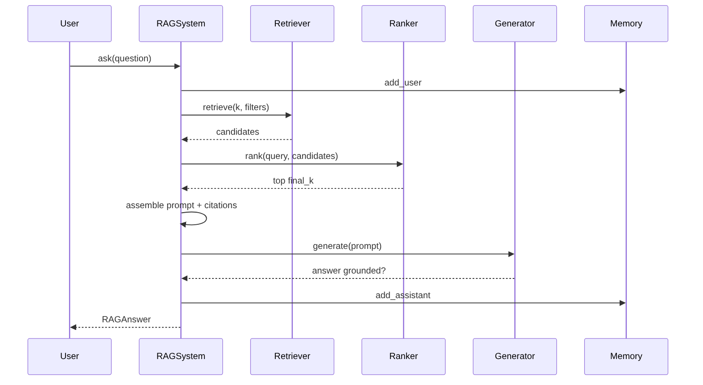
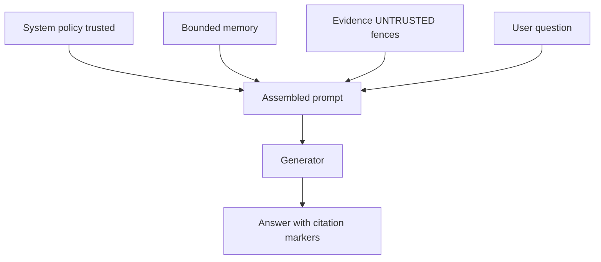

# Chapter 24: Production RAG

## Chapter Overview

Retrieval chapters (15–23) taught embeddings, chunking, indexes, FAISS, and Chroma. **Production RAG** is the full product loop:

```text
question → retrieve → rank → assemble prompt → generate → cite → (optional) remember
```

Without this wiring you have a search demo, not an assistant. With it—and with untrusted evidence framing, citation contracts, memory boundaries, and evaluation—you have a system you can ship, debug, and harden.

This chapter builds **`ragkit`**: a modular production RAG system with a dense retriever, re-ranker, prompt assembler, citation layer, short-term memory, offline grounded generator, and citation hit-rate eval. Swap the retriever for Chroma/FAISS and the generator for a real LLM without changing the pipeline shape.

**Continuity:** Context packing and trust (Ch 12), structured outputs (Ch 13), tools (Ch 14), cost controls (Ch 17), and vector stores (Ch 21–23) all plug into this spine. Chapter 25 advances retrieval quality (hybrid, multi-query, compression).

---

## Learning Objectives

After completing this chapter, you can:

- Implement a modular RAG pipeline with clear stage boundaries  
- Retrieve top-k evidence with metadata filters  
- Re-rank candidates (dense + lexical + boosts)  
- Assemble prompts that isolate untrusted evidence  
- Emit numbered citations tied to retrieved chunks  
- Integrate short-term conversational memory safely  
- Generate grounded answers (mock LLM) that refuse weak evidence  
- Evaluate citation hit-rate on a labeled question set  
- Instrument diagnostics (k, filters, token estimates, model ids)  

---

## Prerequisites

- Chapters 12, 15, 18–23 (context, embeddings, search, stores)  
- Chapters 10–11 (tokens, prompts)  
- Comfort with interfaces / dependency injection  

---

## Motivation

A support bot that “answers from the handbook” often:

1. Stuffs random FAQs into the prompt  
2. Lets the model invent policy  
3. Provides no citations for agents or users  
4. Forgets the previous turn—or worse, treats old tool dumps as system law  

Production RAG makes retrieval **mandatory infrastructure**, citations **first-class**, and memory **bounded**.

---

## First Principles

### 1. Retrieve before you generate

Generation without evidence is open-book cheating without the book.

### 2. Evidence is untrusted

Retrieved text can contain prompt injection. Delimit it; never promote it to system policy (Ch 12).

### 3. Citations are a product feature

`[1]` markers must map to real chunk ids for humans and audits.

### 4. Rank is not optional at scale

Top-k from ANN is a candidate set; a ranker improves precision before the prompt.

### 5. Memory ≠ knowledge base

Short-term chat history is ephemeral context; policies live in the corpus.

### 6. Measure groundedness

Labeled questions + citation hit-rate beat vibe checks.

---

## Mental Model


| Stage | Responsibility |
|---|---|
| Retriever | Candidate evidence |
| Ranker | Order for the window |
| Assembler | System + memory + evidence |
| Generator | Answer under policy |
| Memory | Multi-turn continuity |
| Eval | Citation / grounded metrics |

---

## Core Theory

### Retriever

Interface: `retrieve(query, k, where?) → chunks`.  
Implementation here: in-memory dense search. Production: Chroma/FAISS/pgvector adapters.

### Ranker

Blend dense score with lexical overlap; optional topic boosts. Production: cross-encoders (Ch 25).

### Prompt assembly

```text
SYSTEM: policy (trusted)
USER:
  prior conversation (bounded)
  evidence list with <<<UNTRUSTED_EVIDENCE>>> fences + [n] markers
  current question
```

### Citations

Build `Citation(index, doc_id, title, snippet, score)` from ranked chunks; require the generator to use `[n]`.

### Memory

Ring buffer of user/assistant turns. Do not store raw evidence dumps as system messages.

### Generation

Offline: extractive generator quotes top snippet + footer.  
Online: chat model with same prompt contract + structured citation check.

---

## Architecture

```text
code/chapter-024/
  ragkit/
    retriever.py
    ranker.py
    prompt.py
    citations.py
    memory.py
    generator.py
    pipeline.py      # RAGSystem
    eval.py
    corpus.py
  main.py
  tests/
```

---

## Internal Implementation

### Ask path

```python
rag = RAGSystem.with_default_corpus()
ans = rag.ask("How do I get my money back?")
# ans.answer, ans.citations, ans.grounded, ans.diagnostics
```

### CLI

```bash
python main.py ask "How do I get my money back?"
python main.py chat
python main.py retrieve "password reset"
python main.py eval
```

---

## Production Implementation

- Retriever adapter to Chroma (Ch 23) or FAISS (Ch 22)  
- Real LLM generator with JSON citation schema (Ch 13)  
- Max evidence tokens under context budget (Ch 10–12)  
- Cost metering per retrieve+generate (Ch 17)  
- Tracing: query, filters, chunk ids, model, latency, cost  
- Safety: injection tests on malicious chunks  
- Human review queue when `grounded=false`  
- Version corpus + embed model + prompt template together  

---

## Framework Implementation

LangChain/LlamaIndex RAG chains are orchestrators. Keep **your** stage interfaces so you can replace any stage without rewriting the product.

---

## Trade-offs

| Design | Pros | Cons |
|---|---|---|
| Large retrieve_k | Recall | Noise, cost |
| Aggressive ranker | Precision | Latency |
| Many citations | Transparency | Prompt bulk |
| Stateful memory | UX | Leakage / confusion |
| Extractive answers | Grounded | Less fluent |

**Default:** retrieve 8 → rank to 4 → cite all used → memory last 6 turns → refuse if weak.

---

## Debugging

| Symptom | Check |
|---|---|
| Fluent wrong policy | Missing retrieval; weak rank; model ignored evidence |
| No citations | Assembler/generator contract broken |
| Wrong tenant doc | Filter not applied |
| Multi-turn confusion | Memory too long / includes evidence |
| Eval regressions | Chunking or embed model drift |

---

## Performance

- Cache embeddings for corpus  
- Bound k and max evidence chars  
- Async retrieve when remote (Ch 6)  
- Stream tokens to UX; finalize citations at end  

---

## Security

| Risk | Control |
|---|---|
| Prompt injection in chunks | Untrusted fences + system policy primacy |
| Data exfil via memory | TTL, no secrets in memory |
| Citation spoofing | Server-side citation list only |
| Over-broad retrieve | Metadata ACL filters |

---

## Best Practices

1. Stage-separated pipeline  
2. Untrusted evidence delimiters  
3. Mandatory citations for policy answers  
4. Filters for tenancy/topic  
5. Rank before packing  
6. Bounded memory  
7. Diagnostics on every answer  
8. Labeled eval in CI  
9. Pin embed + prompt versions  
10. Refuse when evidence is weak  

---

## Anti-Patterns

| Anti-pattern | Failure |
|---|---|
| “Stuff the handbook” | Cost + lost needle |
| Generate then retrieve | Theater |
| No citation ids | Unauditable |
| Memory as knowledge base | Stale policy |
| One giant stage function | Untestable |

---

## Hands-on Exercise

1. `ask` a refund question; verify `[1]` and `doc-refund`.  
2. `retrieve` with a topic filter.  
3. Run `chat` and inspect `memory_turns`.  
4. `eval` and require hit-rate ≥ 0.8.  
5. Point the retriever interface at Chroma conceptually (sketch adapter).

---

## Mini Project

**Production RAG system** with modular stages, citations, memory, offline grounded generation, and eval harness.

---

## Visual diagrams






## Chapter Deliverables

| Artifact | Location |
|---|---|
| Manuscript | `book/chapter-024.md` |
| Package | `code/chapter-024/ragkit/` |
| Tests | `code/chapter-024/tests/` |
| Diagrams | `diagrams/mermaid\|png/chapter-024/` |

---

## Interview Questions

1. Stages of a production RAG pipeline?  
2. Why is retrieved text untrusted?  
3. Retrieve vs rank responsibilities?  
4. How do citations map to chunks?  
5. Memory vs vector store?  
6. How do you evaluate RAG quality cheaply?  
7. What diagnostics would you log?  
8. How to enforce tenancy in RAG?  
9. When should the system refuse?  
10. How frameworks should map to your interfaces?

---

## Quiz

1. Evidence in prompts should be treated as: **untrusted**  
2. Citations should include: **stable document/chunk ids**  
3. Production RAG order starts with: **retrieve (then rank/assemble/generate)**  

T/F: Long chat memory can replace a knowledge base. **False**

---

## Cheat Sheet

```bash
cd code/chapter-024 && pytest -q
python3 main.py ask "How do I get my money back?"
python3 main.py eval
```

| Stage | Module |
|---|---|
| Retrieve | `retriever.py` |
| Rank | `ranker.py` |
| Assemble | `prompt.py` |
| Cite | `citations.py` |
| Remember | `memory.py` |
| Generate | `generator.py` |
| Orchestrate | `pipeline.py` |

---

## Curated Free Resources

- “Retrieval-Augmented Generation for Knowledge-Intensive NLP” (Lewis et al.)  
- OWASP LLM prompt injection guidance  
- Your vector DB query + filter docs  
- RAG evaluation surveys (context precision/recall)  

---

## Chapter Summary

Production RAG is a staged system—not a single LLM call. Retrieve candidates, re-rank, assemble a trust-aware prompt, generate under citation policy, update bounded memory, and evaluate hit-rate. `ragkit` implements that spine offline so you can plug Chroma/FAISS and real models into a shape that already respects security, UX, and operability.

**What changed:** `ragkit` package, production RAG project, tests, diagrams.

---

## What's Next

**Chapter 25 — Advanced RAG** improves the retrieval side: hybrid search, multi-query, parent documents, compression, and re-ranking for enterprise-scale quality.
