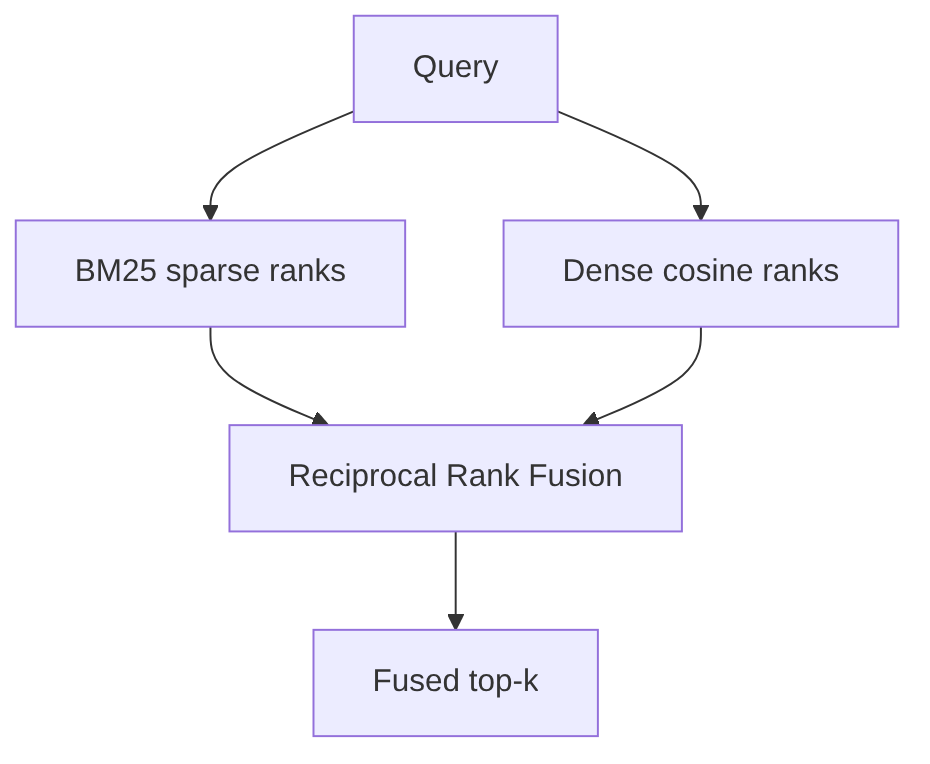
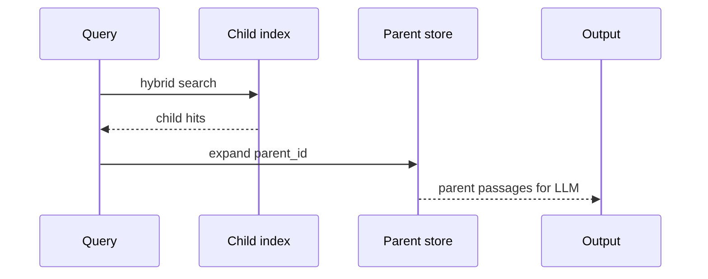

# Chapter 25: Advanced RAG

## Chapter Overview

Chapter 24 wired a production RAG spine: retrieve → rank → assemble → generate → cite. **Advanced RAG** improves the *retrieval quality* before generation ever runs.

Enterprise search fails when:

- Users say “money back” but docs say “refund” (need hybrid / expansion)  
- The right sentence is buried in a long handbook (need parent–child)  
- One query phrasing misses the doc (need multi-query)  
- Context fills with fluff (need compression)  
- ANN order is almost-right (need re-ranking)  

This chapter builds **`advrag`**: BM25 + dense hybrid with RRF fusion, query expansion, multi-query retrieval, parent-document expansion, contextual compression, re-ranking, and an **enterprise search** orchestrator that composes them.

**Continuity:** Production RAG (Ch 24) remains the outer loop. Chapter 26 deep-dives hybrid/BM25 evaluation. Agents (Part IV) will call this search as a tool.

---

## Learning Objectives

After completing this chapter, you can:

- Implement BM25 sparse retrieval and dense cosine retrieval  
- Fuse ranked lists with Reciprocal Rank Fusion (RRF)  
- Expand queries and run multi-query retrieval  
- Index child chunks and expand hits to parent documents  
- Compress retrieved text to query-relevant sentences  
- Re-rank candidates with a lightweight cross-encoder stand-in  
- Compose an enterprise search pipeline with feature toggles  
- Compare bm25 / dense / hybrid / full enterprise top-ids  

---

## Prerequisites

- Chapters 18–24 (search, chunking, embeddings, RAG pipeline)  
- Basic IR: precision, recall, term frequency  
- Comfort with ranked lists and fusion  

---

## Motivation

A single dense retriever is a good baseline—and still misses keyword-precise hits (`HTTP 429`, error codes, SKUs). Pure BM25 nails keywords—and fails paraphrases. Enterprise systems **combine** signals, **rewrite** queries, **expand** context from parents, **shrink** noise, and **re-rank** before the LLM sees evidence.

---

## First Principles

### 1. Sparse and dense fail differently

Fusion is insurance against single-channel blindness.

### 2. Children retrieve; parents explain

Small chunks match; large parents supply coherent context for generation.

### 3. Query wording is a bug surface

Multi-query and expansion attack linguistic variance.

### 4. Context is a budget

Compression is cost control and attention control (Ch 10–12, 17).

### 5. Re-rankers spend compute where it matters

Cheap recall stage → expensive precision stage on a shortlist.

### 6. Compose, don’t monolith

Each technique is a toggleable stage with diagnostics.

---

## Mental Model


| Technique | Problem solved |
|---|---|
| Hybrid + RRF | Keyword vs paraphrase |
| Multi-query | Phrasing variance |
| Parent docs | Chunk too small for answer |
| Compression | Noisy long parents |
| Re-rank | Final precision |

---

## Core Theory

### BM25

Classic probabilistic ranking with TF saturation and document-length normalization.

### Dense

Embedding cosine (here: hash embedder offline; neural in production).

### RRF

\[
\mathrm{RRF}(d)=\sum_{r\in R}\frac{1}{k+\mathrm{rank}_r(d)}
\]

Robust fusion without score calibration.

### Parent–child

Index children; map hits via `parent_id` to parent text (Ch 19 hierarchical).

### Compression

Keep sentences with high query token overlap (production: LLM or cross-encoder extractors).

### Re-ranking

Blend normalized retrieval score, lexical overlap, title match (production: cross-encoder models).

---

## Architecture

```text
code/chapter-025/
  advrag/
    bm25.py, dense.py, hybrid.py, fusion.py
    query_ops.py, parent_child.py
    compress.py, rerank.py
    enterprise.py, corpus.py
  main.py
  tests/
```

---

## Internal Implementation

### Enterprise search

```python
eng = EnterpriseSearch.with_default_corpus()
eng.search("How do I get my money back?")
```

### CLI

```bash
python main.py hybrid "refund" --mode hybrid
python main.py expand "How do I get a refund?"
python main.py search "password reset"
python main.py compare "HTTP 429"
python main.py steps "money back"
```

---

## Production Implementation

- Real BM25 (OpenSearch/Elastic) + dense (FAISS/Chroma)  
- Cross-encoder re-rankers (e.g. bge-reranker) on GPU/CPU  
- Learned sparse (SPLADE) as alternative to BM25  
- Multi-query via small LLM with diversity prompts  
- Parent–child or hierarchical indexes in the vector DB  
- A/B stages with retrieval metrics (nDCG, Recall@k)  
- Cap expanded queries for latency budgets  

---

## Framework Implementation

LangChain multi-query / compression chains are recipes. Own stage interfaces so you can disable multi-query under load.

---

## Trade-offs

| Stage | Pros | Cons |
|---|---|---|
| Hybrid | Higher recall | Dual indexes to maintain |
| Multi-query | Robust phrasing | Latency × N |
| Parent expand | Better answers | Larger context |
| Compress | Token savings | Risk of dropping nuance |
| Rerank | Precision | Extra model cost |

**Default enterprise path:** hybrid + multi-query(3) + parent expand + compress + rerank.

---

## Debugging

| Symptom | Check |
|---|---|
| Misses exact error codes | BM25 path off / stopwording too aggressive |
| Misses paraphrases | Dense weak; multi-query off |
| Answers lack context | Parent expand off |
| Prompt too long | Compression off / final_k high |
| Order still wrong | Reranker weights |

---

## Performance

- Run multi-query in parallel (Ch 6)  
- Cache BM25 and dense postings  
- Rerank only top 20–50  
- Disable multi-query for low-latency tiers  

---

## Security

| Risk | Control |
|---|---|
| Expanded queries leak intent to third parties | Local expanders; redact logs |
| Parent documents over-share | ACL metadata on parents |
| Compressed text still injectable | Untrusted evidence framing (Ch 12/24) |

---

## Best Practices

1. Measure each stage on and off  
2. Fuse with RRF before score hacking  
3. Index children, show parents  
4. Bound multi-query N  
5. Compress after expand  
6. Rerank last  
7. Emit diagnostics  
8. Keep toggles for incident response  
9. Align with Ch 24 generator citations  
10. Document corpus hierarchy  

---

## Anti-Patterns

| Anti-pattern | Failure |
|---|---|
| Only dense forever | Keyword miss |
| Only BM25 forever | Paraphrase miss |
| 20 multi-queries always | Latency blowups |
| Return full handbook parents | Context death |
| Rerank millions of docs | Cost death |

---

## Hands-on Exercise

1. Compare `--mode bm25|dense|hybrid` on “HTTP 429”.  
2. Expand a refund question; inspect variants.  
3. Run full `search` and note `parent_expand` + `compress` sources.  
4. Use `steps` to see fused vs parent ids.  
5. Filter `topic=security` on a password query.

---

## Mini Project

**Enterprise search** orchestrator with hybrid multi-query retrieval, parent expansion, compression, and re-ranking over a multi-handbook corpus.

---

## Visual diagrams







## Chapter Deliverables

| Artifact | Location |
|---|---|
| Manuscript | `book/chapter-025.md` |
| Package | `code/chapter-025/advrag/` |
| Tests | `code/chapter-025/tests/` |
| Diagrams | `diagrams/mermaid\|png/chapter-025/` |

---

## Interview Questions

1. Why hybrid search?  
2. What is RRF and why is it popular?  
3. Parent–child retrieval pattern?  
4. Multi-query vs query expansion?  
5. Where does a cross-encoder re-ranker sit?  
6. Risks of contextual compression?  
7. How do you evaluate advanced RAG stages?  
8. Latency trade-offs of multi-query?  
9. How does this extend Ch 24?  
10. When is hybrid not worth it?

---

## Quiz

1. RRF fuses: **multiple ranked lists**  
2. Children are for: **precise matching**; parents for: **context**  
3. Re-ranking improves: **precision on a shortlist**  

T/F: Dense retrieval alone always beats BM25 on error codes. **False**

---

## Cheat Sheet

```bash
cd code/chapter-025 && pytest -q
python3 main.py search "How do I get my money back?"
python3 main.py compare "HTTP 429"
```

| Stage | Module |
|---|---|
| Sparse | `bm25.py` |
| Dense | `dense.py` |
| Fuse | `fusion.py` |
| Hybrid | `hybrid.py` |
| Queries | `query_ops.py` |
| Parents | `parent_child.py` |
| Compress | `compress.py` |
| Rerank | `rerank.py` |
| Orchestrate | `enterprise.py` |

---

## Curated Free Resources

- Robertson & Zaragoza on BM25  
- RRF papers / OpenSearch hybrid search docs  
- Cohere / BGE re-ranker model cards  
- Parent document retriever notes (LlamaIndex / community)  

---

## Chapter Summary

Advanced RAG is a **retrieval refinement stack**: hybrid sparse–dense fusion, multi-query coverage, parent expansion for context, compression for budgets, and re-ranking for precision. The enterprise search project composes these stages behind one API so Chapter 24’s generator receives better evidence—and Chapter 26 can specialize hybrid evaluation further.

**What changed:** `advrag` package, enterprise search project, tests, diagrams.

---

## What's Next

**Chapter 26 — Hybrid Search** deepens BM25, dense/sparse fusion, and evaluation methodology for hybrid retrievers in isolation.
