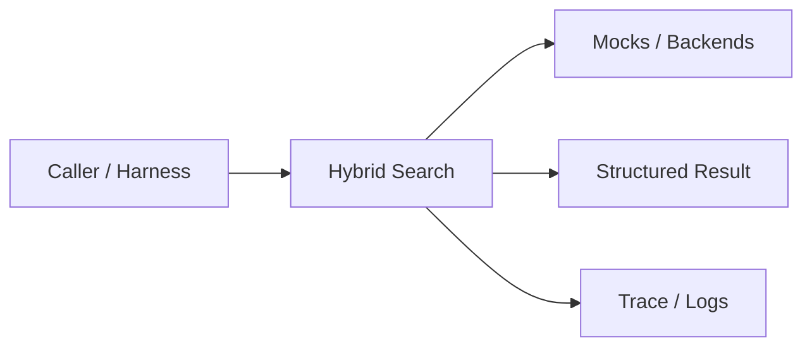
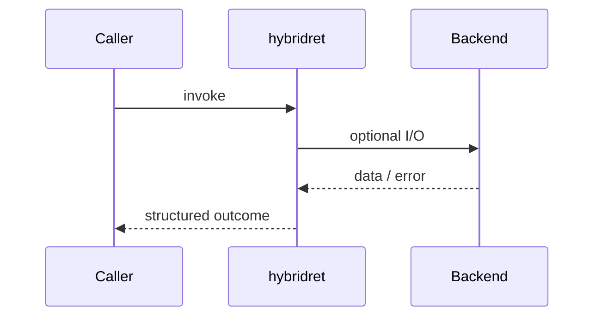
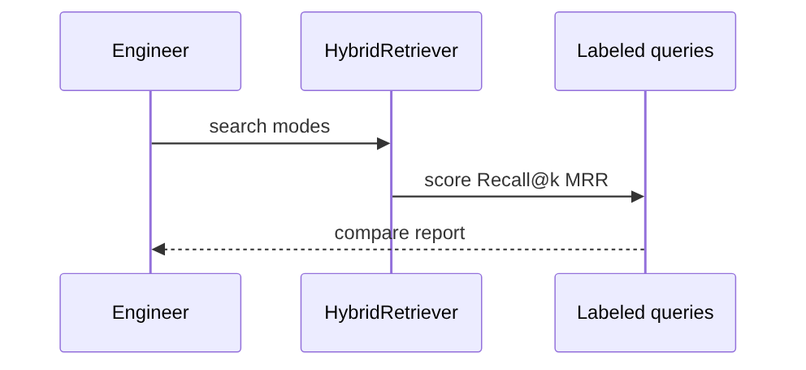
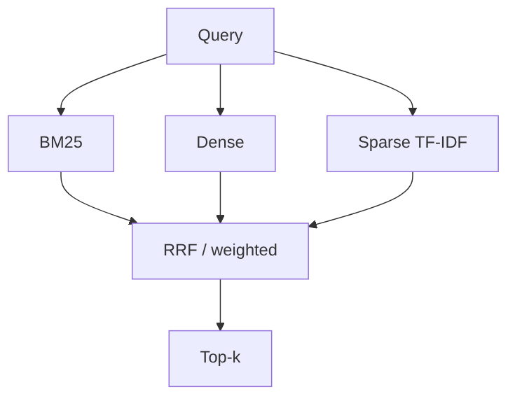

# Chapter 26: Hybrid Search

## Chapter Overview

Part III — Retrieval Engineering — **Hybrid Search** — package `hybridret`.

Chapter 25 embedded hybrid inside advanced RAG. This chapter isolates **hybrid search** as measurable engineering: parallel channels, principled fusion, and Recall@k / MRR so you can defend mode choices in review.

Chapter 25 composed hybrid retrieval inside advanced RAG. Chapter 26 isolates **Hybrid Search** with package `hybridret` so you can benchmark modes before agents consume search as a tool.

**Code:** `code/chapter-026/hybridret/`. **Continuity:** Chapter 25 advanced RAG; Chapter 26 hybrid eval; Part IV agents from Chapter 27 onward.

---

## Learning Objectives

After completing this chapter, you can:

- Explain **Hybrid Search** in a production agent architecture
- Run and extend `hybridret` offline with pytest
- Describe failure modes, budgets, and structured traces
- Connect this module to adjacent chapters in Part IV/V
- Compare the approach to common frameworks without losing your domain model
- Apply security defaults (validation, permissions, isolation)
- Complete exercises and mini project with tests passing

---

## Prerequisites

- Chapters 18–25 (chunking, embeddings, vector search, RAG, advanced RAG)
- Basic IR metrics (Recall@k, MRR)
- Comfort with pytest and CLI demos

---

## Motivation

Teams ship dense-only retrieval and wonder why error codes vanish. Others stay on BM25 forever and lose paraphrase. Without labeled eval, every model swap becomes a guessing game.

---

## First Principles

### 1. Channels fail differently

Lexical wins on SKUs and codes; dense wins on paraphrase. Design for both failure modes.

### 2. Fusion prefers ranks over raw scores

RRF avoids calibrating BM25 scores against cosine similarity.

### 3. Evaluate with labels

Offline labeled queries beat demo queries and executive vibes.

### 4. Keep modes toggleable

Incident response may require BM25-only while reindexing dense.

### 5. Sparse is more than BM25

Explicit TF-IDF sparse vectors add a third signal for ablation studies.

---

## Mental Model

Hybrid search = airport security with metal detector **and** X-ray — different sensors catch different threats.



| Piece | Responsibility |
|---|---|
| Public API | Stable entry types importers rely on |
| Policy | Budgets, permissions, retries, gates |
| State | Memory, graph, or workflow context |
| Observability | Traces you can assert in tests |

---

## Core Theory

### Retriever channels

**BM25** (`hybridret/bm25.py`) — classic lexical ranking with length normalization.

**Dense** (`dense.py`) — embedding cosine with an offline hash embedder (swap for neural models in production).

**Sparse TF-IDF** (`sparse.py`) — high-dimensional sparse vectors as an explicit third list.

### Fusion

**RRF** (`fusion.py`) accumulates `1 / (rrf_k + rank)` per document id across lists:

```python
def rrf(lists: list[list[Hit]], *, k: int = 10, rrf_k: int = 60) -> list[Hit]: ...
```

**Weighted fusion** min-max normalizes each channel, then applies weights `[0.45, 0.35, 0.20]` for bm25/dense/sparse in `HybridRetriever.search(..., mode="hybrid_weighted")`.

### Orchestration

`HybridRetriever` indexes all channels, searches with `mode` in `{bm25, dense, sparse, hybrid_rrf, hybrid_weighted}`, and exposes:

- `compare(query)` — side-by-side top-k per mode
- `eval_modes()` — runs `evaluate()` over `LABELS` in `corpus.py`

### Metrics

`eval.py` reports Recall@k and MRR on labeled `(query, relevant_ids)` pairs — the contract agents will inherit when retrieval becomes a tool (Part IV).

### Failure cases

Treat timeouts, permission denials, max steps, and failed observations as **normal** paths with structured errors — not surprise exceptions across agent boundaries.

### Performance implications

LLM calls dominate latency; keep planning, validation, and registry work cheap. Parallelize only independent steps.

### Security implications

Side effects flow through tools, MCP, and workflows — validate names and args; default deny; never execute model-produced code.

---

## Architecture

```text
code/chapter-026/
  hybridret/
  tests/
  main.py
  pyproject.toml
```



---

## Internal Implementation

```bash
cd code/chapter-026
pytest -q
python3 main.py search "E-4032" --mode bm25
python3 main.py compare "money back"
python3 main.py eval
```

Try `E-4032` on BM25 vs `money back` on dense/hybrid — the labeled eval set quantifies the gap.

Package layout:

```text
hybridret/
  bm25.py dense.py sparse.py fusion.py
  retriever.py eval.py corpus.py tokenize.py types.py
```

---

## Production Implementation

- Swap mocks for LLM providers, vector DBs, and MCP stdio transports behind the same types
- Add authz, audit logs, and metrics on every side effect
- Persist episodic memory and checkpoints when required
- Enforce tenant isolation on memory, tools, and resources
- Wire retrieval (Part III) as governed tools, not prompt paste

---

## Framework Implementation

LangChain `EnsembleRetriever`, LlamaIndex composable retrievers, and OpenSearch hybrid queries map to your fusion layer — **own the metrics and labels** regardless of vendor API.

Map vendor frameworks onto these ports; do not let SDK types leak into domain models.

---

## Trade-offs

| Option A | Option B / notes |
|---|---|
| BM25-only | Cheap, exact tokens; misses paraphrase and cross-lingual nuance. |
| Dense-only | Semantic recall; misses rare tokens and regulated exact-match requirements. |
| RRF hybrid | Robust default; pays dual/triple index maintenance and latency. |
| Weighted fusion | Tunable per domain; requires calibration data to avoid channel dominance. |

---

## Debugging

- SKU misses → tokenization/stemming; boost BM25 weight or fix analyzer
- Paraphrase misses → embedding model or fusion weights
- Flat eval scores → noisy labels, wrong k, or train/test leakage in corpus
- One channel dominates weighted fuse → scores unnormalized or weight typo

**Workflow:** reproduce with offline mocks → inspect trace/history → add one log field per policy decision → fix at validation/budget boundaries.

---

## Performance

Use `candidate_k` >> final `k` per channel before fusion; cache document embeddings; parallelize channel queries; avoid re-embedding static corpus each request.

---

## Security

Apply identical ACL filters on every channel **before** fusion so dense shortcuts cannot leak restricted docs.

---

## Best Practices

1. Keep `hybridret` public APIs small and stable
2. Prefer structured `{ok, ...}` results over bare exceptions at boundaries
3. Log traces (steps, roles, nodes) suitable for JSON export
4. Enforce budgets: steps, retries, graph nodes, workflow failures
5. Validate and authorize before side effects
6. Run `pytest -q` in CI without network keys

---

## Anti-Patterns

- **Unbounded loops** — Runaway cost and stuck sessions
- **Stringly-typed tools** — Model hallucinates names that still execute
- **Implicit memory** — Context leaks across tenants and tasks
- **Monolith agent** — Cannot test planner or tools in isolation
- **Skipping reflection on high-stakes answers** — Hallucinations reach users
- **Opaque framework defaults** — Hidden control flow you cannot trace

---

## Hands-on Exercise

1. `cd code/chapter-026 && pytest -q`
2. Change one policy (budget, permission, router, retry, confidence threshold)
3. Add a test that fails before the change and passes after
4. Run `python3 main.py` and capture structured output
5. Write three bullets: how this module connects to Chapter 28 skeleton or Part V harness

---

## Mini Project

Deliverable: **Hybrid retriever CLI with multi-mode search and labeled evaluation.** Extend the demo or compose with an adjacent chapter module; keep tests offline.

---

## Visual diagrams





---

## Chapter Deliverables

| Artifact | Location |
|---|---|
| Manuscript | `book/chapter-026.md` |
| Package | `code/chapter-026/hybridret/` |
| Tests | `code/chapter-026/tests/` |
| Diagrams | `diagrams/mermaid/chapter-026/` |

---

## Interview Questions

1. Why run BM25 and dense together instead of picking one?
2. Explain RRF without score calibration.
3. When would weighted fusion beat RRF?
4. How do you detect retrieval regression before launch?
5. What is the operational cost of maintaining two indexes?

---

## Quiz

1. RRF primarily combines:
   A) Raw BM25 scores B) Document ranks C) GPU clocks D) Prompt tokens
   **Answer:** B

2. Error code queries often favor:
   A) Dense only B) Lexical/BM25 C) Random D) No index
   **Answer:** B

3. Hybrid default engineering goal:
   A) Higher robust recall/precision on labels B) Fewer Dockerfiles C) Larger context D) More agents
   **Answer:** A

---

## Cheat Sheet

- `HybridRetriever.search(q, mode=..., k=5)`
- Modes: bm25 | dense | sparse | hybrid_rrf | hybrid_weighted
- `compare(q)` and `eval_modes()` for benchmarks
- cd code/chapter-026 && pytest -q && python3 main.py eval

---

## Curated Free Resources

- [Reciprocal Rank Fusion paper (Cormack et al.)](https://plg.uwaterloo.ca/~gvcormac/cormacksigir09-rrf.pdf)
- [Elasticsearch hybrid search](https://www.elastic.co/guide/en/elasticsearch/reference/current/index.html)
- [BEIR benchmark](https://github.com/beir-cellar/beir)

---

## Chapter Summary

**Hybrid Search** (`hybridret`) closes the retrieval engineering arc with labeled evaluation and multi-channel fusion — the evidence layer Part IV agents will call through governed tools.

---

## What's Next

**Chapter 27: What is an AI Agent?.** Part IV opens with autonomous agents that call retrieval as a governed tool — not ad-hoc string search in prompts.
