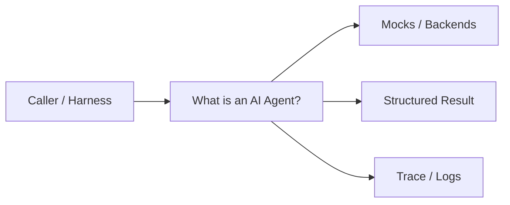
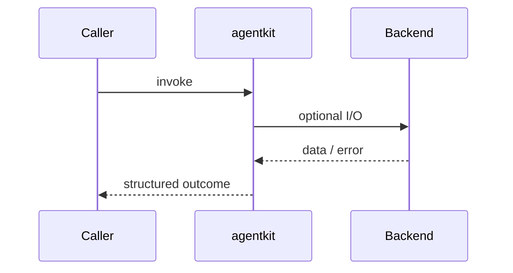
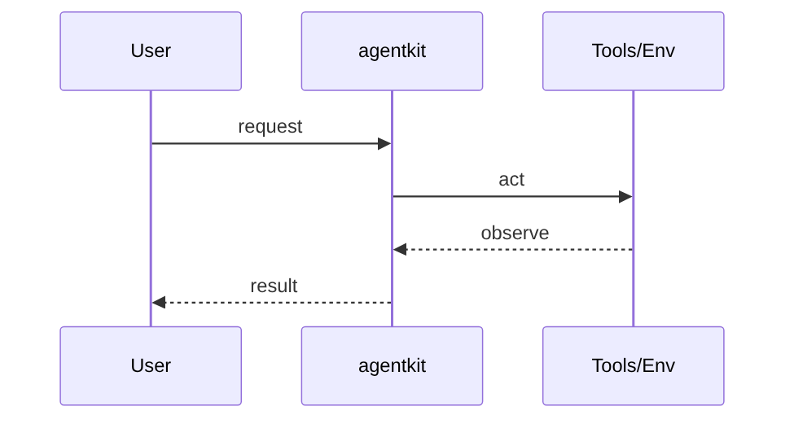
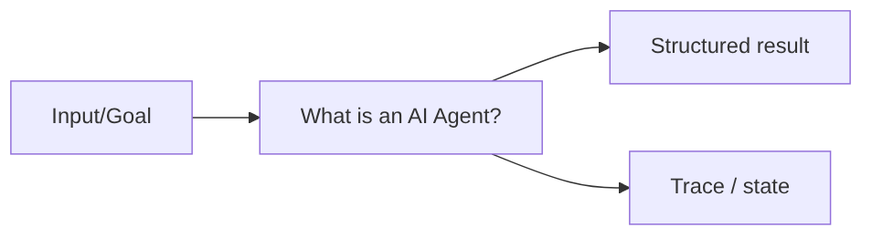

# Chapter 27: What is an AI Agent?

## Chapter Overview

Part IV — Agent Engineering — **What is an AI Agent?** — package `agentkit`.

Before architecture and frameworks, you need a crisp **autonomy contract**: goals, actions, observations, terminal states, and `AgentResult` traces you can assert in pytest.

Parts I–III built models, context, retrieval, and hybrid search. Part IV implements **What is an AI Agent?** as `agentkit` — an offline-testable building block toward harnesses (Part V) and your own framework (Part VIII).

**Code:** `code/chapter-027/agentkit/`. **Continuity:** Chapter 25 advanced RAG; Chapter 26 hybrid eval; Part IV agents from Chapter 27 onward.

---

## Learning Objectives

After completing this chapter, you can:

- Explain **What is an AI Agent?** in a production agent architecture
- Run and extend `agentkit` offline with pytest
- Describe failure modes, budgets, and structured traces
- Connect this module to adjacent chapters in Part IV/V
- Compare the approach to common frameworks without losing your domain model
- Apply security defaults (validation, permissions, isolation)
- Complete exercises and mini project with tests passing

---

## Prerequisites

- Chapters 1–26 (LLM platform, RAG, hybrid search)
- Prior Part IV chapters when `n > 27` (through Chapter 26)
- Python dataclasses, typing, pytest

---

## Motivation

Scripts are deterministic; agents choose actions based on observations. Without explicit states, step budgets, and structured results, 'agent' becomes a marketing label on a while-loop.

---

## First Principles

### 1. Autonomy is bounded

`max_steps` turns infinite loops into fail-fast incidents you can test.

### 2. Goals are typed

`Goal(description=...)` separates intent from policy implementation.

### 3. Policy decides; environment executes

`policy.decide` returns `Action`; `env.execute` returns `Observation` — test each side.

### 4. Terminal states are explicit

`finish`, `fail`, and `max_steps_exceeded` must be observable in traces.

---

## Mental Model

An agent = employee with a goal, a budget, and a logbook — not a single prompt that hopes for the best.



| Piece | Responsibility |
|---|---|
| Public API | Stable entry types importers rely on |
| Policy | Budgets, permissions, retries, gates |
| State | Memory, graph, or workflow context |
| Observability | Traces you can assert in tests |

---

## Core Theory

### Lifecycle

`AutonomousAgent.run(goal)` transitions `AgentState`: CREATED → RUNNING → SUCCEEDED | FAILED.

Each step:

1. `policy.decide(goal, history)` → `Action` (`act`, `finish`, or `fail`)
2. On `act`, `env.execute(action)` → `Observation` appended to `history`
3. Stop on finish/fail, failed observation, or step budget

### Offline policy

`agentkit/policy.py` implements a **toy** rule policy: fetch weather or refund policy evidence, then `finish` with a summary. Replace with LLM policy later; keep the **same** `Action`/`Observation` types.

### Types

`AgentResult(ok, state, message, steps)` carries the auditable step list for harnesses (Part V).

### Failure cases

Treat timeouts, permission denials, max steps, and failed observations as **normal** paths with structured errors — not surprise exceptions across agent boundaries.

### Performance implications

LLM calls dominate latency; keep planning, validation, and registry work cheap. Parallelize only independent steps.

### Security implications

Side effects flow through tools, MCP, and workflows — validate names and args; default deny; never execute model-produced code.

---

## Architecture

```text
code/chapter-027/
  agentkit/
  tests/
  main.py
  pyproject.toml
```



---

## Internal Implementation

```bash
cd code/chapter-027 && pytest -q && python3 main.py
```

Inspect `AutonomousAgent` in `agentkit/agent.py` and extend `policy.decide` with a new tool branch — add a test that expects your new action kind.

---

## Production Implementation

- Swap mocks for LLM providers, vector DBs, and MCP stdio transports behind the same types
- Add authz, audit logs, and metrics on every side effect
- Persist episodic memory and checkpoints when required
- Enforce tenant isolation on memory, tools, and resources
- Wire retrieval (Part III) as governed tools, not prompt paste

---

## Framework Implementation

OpenAI Agents SDK, LangGraph graphs, and CrewAI crews all implement variants of goal→act→observe. Your `agentkit` types are the **ports** those frameworks should implement, not replace.

Map vendor frameworks onto these ports; do not let SDK types leak into domain models.

---

## Trade-offs

| Option A | Option B / notes |
|---|---|
| Rule policy (chapter) | Deterministic CI; not representative of LLM variability. |
| LLM policy (production) | Flexible; requires eval, budgets, and tool gates. |
| Fat agent class | Fast demo; untestable side effects. |

---

## Debugging

- Immediate max_steps_exceeded → policy never emits finish
- Empty steps → run not invoked or exception swallowed
- Wrong city in weather → `_city` heuristic; pass city in goal text

**Workflow:** reproduce with offline mocks → inspect trace/history → add one log field per policy decision → fix at validation/budget boundaries.

---

## Performance

Policy here is O(steps); production cost is dominated by LLM + tool I/O — still cap steps early.

---

## Security

Even offline env should model permission errors — agents are trust boundaries once tools are real.

---

## Best Practices

1. Keep `agentkit` public APIs small and stable
2. Prefer structured `{ok, ...}` results over bare exceptions at boundaries
3. Log traces (steps, roles, nodes) suitable for JSON export
4. Enforce budgets: steps, retries, graph nodes, workflow failures
5. Validate and authorize before side effects
6. Run `pytest -q` in CI without network keys

---

## Anti-Patterns

- **Unbounded loops** — Runaway cost and stuck sessions
- **Stringly-typed tools** — Model hallucinates names that still execute
- **Implicit memory** — Context leaks across tenants and tasks
- **Monolith agent** — Cannot test planner or tools in isolation
- **Skipping reflection on high-stakes answers** — Hallucinations reach users
- **Opaque framework defaults** — Hidden control flow you cannot trace

---

## Hands-on Exercise

1. `cd code/chapter-027 && pytest -q`
2. Change one policy (budget, permission, router, retry, confidence threshold)
3. Add a test that fails before the change and passes after
4. Run `python3 main.py` and capture structured output
5. Write three bullets: how this module connects to Chapter 28 skeleton or Part V harness

---

## Mini Project

Deliverable: **First autonomous agent with `AgentResult` lifecycle.** Extend the demo or compose with an adjacent chapter module; keep tests offline.

---

## Visual diagrams





---

## Chapter Deliverables

| Artifact | Location |
|---|---|
| Manuscript | `book/chapter-027.md` |
| Package | `code/chapter-027/agentkit/` |
| Tests | `code/chapter-027/tests/` |
| Diagrams | `diagrams/mermaid/chapter-027/` |

---

## Interview Questions

1. Define agent vs workflow vs chain.
2. What belongs in policy vs environment?
3. How do you test an agent without live models?
4. Why is max_steps a security control?

---

## Quiz

1. AutonomousAgent stops when:
   A) GPU full B) finish/fail/budget C) Random D) Never
   **Answer:** B

2. Observations live in:
   A) history list B) GPU RAM only C) DNS D) Markdown
   **Answer:** A

3. AgentResult.steps exists for:
   A) Auditing/traces B) Training GPUs C) CSS D) PDF
   **Answer:** A

---

## Cheat Sheet

- `AutonomousAgent(max_steps=6).run(goal)`
- `Action(kind=act|finish|fail, ...)`
- `AgentResult(ok, state, message, steps)`

---

## Curated Free Resources

- [Russell & Norvig — agents (conceptual)](https://aima.cs.berkeley.edu/)
- [OpenAI Agents SDK docs](https://platform.openai.com/docs/guides/agents)

---

## Chapter Summary

**What is an AI Agent?** (`agentkit`) — First autonomous agent with `AgentResult` lifecycle. Explicit types, traces, and tests so agent behavior stays swappable as models and vendors change.

---

## What's Next

**Chapter 28: Agent Architecture.** Chapter 28 wires planner, memory, tools, skills, and executor into one skeleton.
