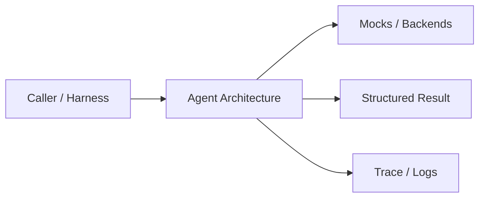
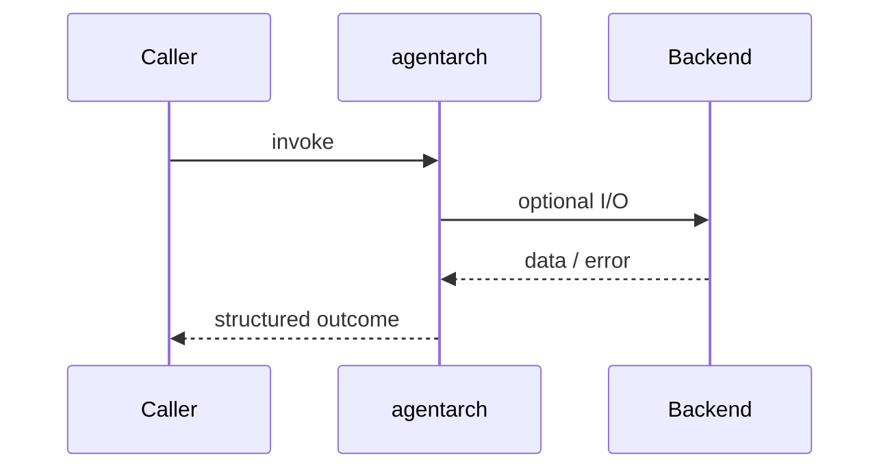
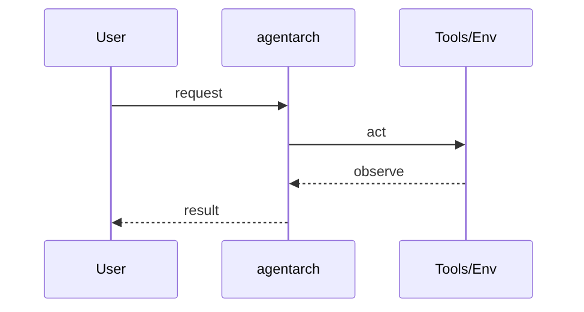
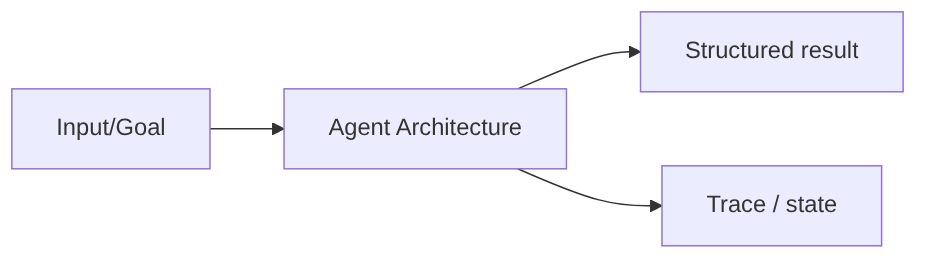

# Chapter 28: Agent Architecture

## Chapter Overview

Part IV — Agent Engineering — **Agent Architecture** — package `agentarch`.

`AgentSkeleton` shows the **reference layout** production teams use: ports for planner, working memory, tool bus, step executor, and optional skills — composed, not concatenated.

Parts I–III built models, context, retrieval, and hybrid search. Part IV implements **Agent Architecture** as `agentarch` — an offline-testable building block toward harnesses (Part V) and your own framework (Part VIII).

**Code:** `code/chapter-028/agentarch/`. **Continuity:** Chapter 25 advanced RAG; Chapter 26 hybrid eval; Part IV agents from Chapter 27 onward.

---

## Learning Objectives

After completing this chapter, you can:

- Explain **Agent Architecture** in a production agent architecture
- Run and extend `agentarch` offline with pytest
- Describe failure modes, budgets, and structured traces
- Connect this module to adjacent chapters in Part IV/V
- Compare the approach to common frameworks without losing your domain model
- Apply security defaults (validation, permissions, isolation)
- Complete exercises and mini project with tests passing

---

## Prerequisites

- Chapters 1–26 (LLM platform, RAG, hybrid search)
- Prior Part IV chapters when `n > 27` (through Chapter 27)
- Python dataclasses, typing, pytest

---

## Motivation

Monolithic agent scripts interleave planning, tool calls, and memory updates. You cannot swap the planner, mock tools, or inspect memory without rewriting everything.

---

## First Principles

### 1. Separation of concerns

Planner emits steps; executor runs steps; tools own side effects.

### 2. Working memory is explicit

`WorkingMemory.context()` feeds downstream prompts.

### 3. Skills are optional accelerators

Registered skills can short-circuit generic executor paths.

### 4. Trace everything

Return plan, trace, and memory snapshot from `run(goal)`.

---

## Mental Model

Agent architecture = city zoning — planner, memory, tools, and executor each get a district with defined roads between them.



| Piece | Responsibility |
|---|---|
| Public API | Stable entry types importers rely on |
| Policy | Budgets, permissions, retries, gates |
| State | Memory, graph, or workflow context |
| Observability | Traces you can assert in tests |

---

## Core Theory

### Components (`agentarch/components.py`)

- `SimplePlanner` — emits step names from goal keywords
- `WorkingMemory` — short rolling context
- `ToolBus` — register callable tools by name
- `StepExecutor` — resolves a step to tool calls or echo behavior
- `Skill` — named bundle invoked when step name matches

### Skeleton run loop

```python
plan = self.planner.plan(goal)
for step in plan[:max_steps]:
    if step in self.skills:
        out = self.skills[step].run(goal)
    else:
        out = self.executor.execute(step, self.tools, goal, self.memory)
```

Default tools: `weather`, `policy`, `echo`.

This is the blueprint Part VIII re-implements module-by-module; Part V adds harness/runtime concerns.

### Failure cases

Treat timeouts, permission denials, max steps, and failed observations as **normal** paths with structured errors — not surprise exceptions across agent boundaries.

### Performance implications

LLM calls dominate latency; keep planning, validation, and registry work cheap. Parallelize only independent steps.

### Security implications

Side effects flow through tools, MCP, and workflows — validate names and args; default deny; never execute model-produced code.

---

## Architecture

```text
code/chapter-028/
  agentarch/
  tests/
  main.py
  pyproject.toml
```



---

## Internal Implementation

```bash
cd code/chapter-028 && pytest -q && python3 main.py
```

Register a custom `Skill` on the skeleton and assert it appears in the trace before generic executor runs.

---

## Production Implementation

- Swap mocks for LLM providers, vector DBs, and MCP stdio transports behind the same types
- Add authz, audit logs, and metrics on every side effect
- Persist episodic memory and checkpoints when required
- Enforce tenant isolation on memory, tools, and resources
- Wire retrieval (Part III) as governed tools, not prompt paste

---

## Framework Implementation

LangGraph node/edge graphs, Semantic Kernel planners, and AutoGen agent chat map onto these **components** — draw the mapping explicitly in design docs.

Map vendor frameworks onto these ports; do not let SDK types leak into domain models.

---

## Trade-offs

| Option A | Option B / notes |
|---|---|
| Skeleton (explicit ports) | More files; swappable pieces. |
| Monolith script | Fast hack; no seams for testing. |
| Microservice agents | Strong isolation; higher latency and ops. |

---

## Debugging

- Empty plan → planner not recognizing goal tokens
- Tool not found → step name mismatch on ToolBus
- Skill never runs → step string not in skills dict

**Workflow:** reproduce with offline mocks → inspect trace/history → add one log field per policy decision → fix at validation/budget boundaries.

---

## Performance

Keep planner synchronous and cheap; parallelize only independent tool calls in later workflow chapter.

---

## Security

ToolBus must not expose admin tools to default roles — mirror Chapter 31 permissions.

---

## Best Practices

1. Keep `agentarch` public APIs small and stable
2. Prefer structured `{ok, ...}` results over bare exceptions at boundaries
3. Log traces (steps, roles, nodes) suitable for JSON export
4. Enforce budgets: steps, retries, graph nodes, workflow failures
5. Validate and authorize before side effects
6. Run `pytest -q` in CI without network keys

---

## Anti-Patterns

- **Unbounded loops** — Runaway cost and stuck sessions
- **Stringly-typed tools** — Model hallucinates names that still execute
- **Implicit memory** — Context leaks across tenants and tasks
- **Monolith agent** — Cannot test planner or tools in isolation
- **Skipping reflection on high-stakes answers** — Hallucinations reach users
- **Opaque framework defaults** — Hidden control flow you cannot trace

---

## Hands-on Exercise

1. `cd code/chapter-028 && pytest -q`
2. Change one policy (budget, permission, router, retry, confidence threshold)
3. Add a test that fails before the change and passes after
4. Run `python3 main.py` and capture structured output
5. Write three bullets: how this module connects to Chapter 28 skeleton or Part V harness

---

## Mini Project

Deliverable: **Composable agent skeleton with planner, memory, tools, executor, skills.** Extend the demo or compose with an adjacent chapter module; keep tests offline.

---

## Visual diagrams





---

## Chapter Deliverables

| Artifact | Location |
|---|---|
| Manuscript | `book/chapter-028.md` |
| Package | `code/chapter-028/agentarch/` |
| Tests | `code/chapter-028/tests/` |
| Diagrams | `diagrams/mermaid/chapter-028/` |

---

## Interview Questions

1. List the core agent components and their contracts.
2. Where would you insert human approval?
3. How does working memory differ from episodic memory (Ch 33)?

---

## Quiz

1. ToolBus responsibility:
   A) GPU B) Named tool registry C) DNS D) PDF export
   **Answer:** B

2. Skills differ from tools because:
   A) Skills are higher-level composed behaviors B) Skills are free C) Skills replace Python D) Skills are illegal
   **Answer:** A

3. AgentSkeleton returns trace for:
   A) Debugging/observability B) CSS C) Only training D) Never
   **Answer:** A

---

## Cheat Sheet

- `AgentSkeleton(planner, memory, tools, executor, skills)`
- `register_skill(Skill(...))`
- `run(goal) -> {plan, trace, memory}`

---

## Curated Free Resources

- [LangGraph concepts](https://langchain-ai.github.io/langgraph/)
- [Microsoft Semantic Kernel](https://learn.microsoft.com/en-us/semantic-kernel/)

---

## Chapter Summary

**Agent Architecture** (`agentarch`) — Composable agent skeleton with planner, memory, tools, executor, skills. Explicit types, traces, and tests so agent behavior stays swappable as models and vendors change.

---

## What's Next

**Chapter 29: Execution Loops.** Chapter 29 formalizes think→act→observe with retries and terminate flags.
