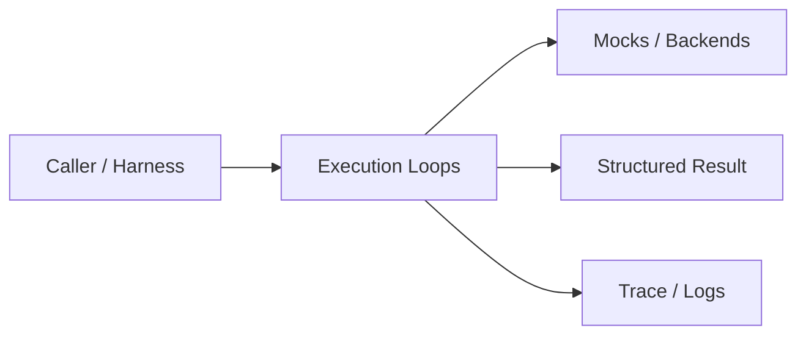
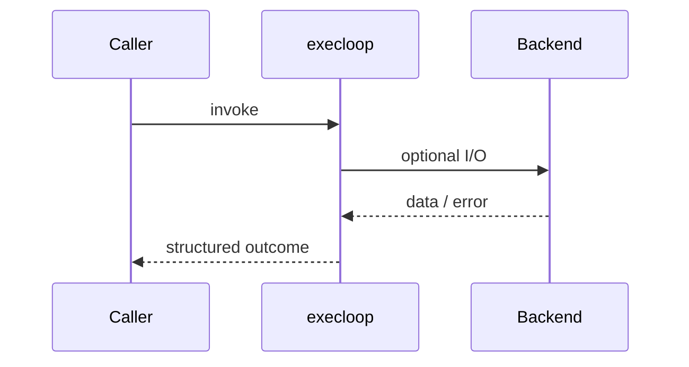
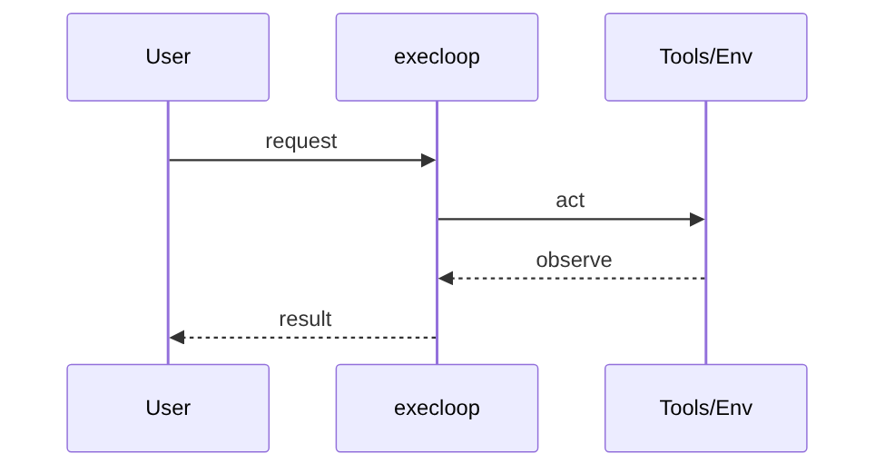
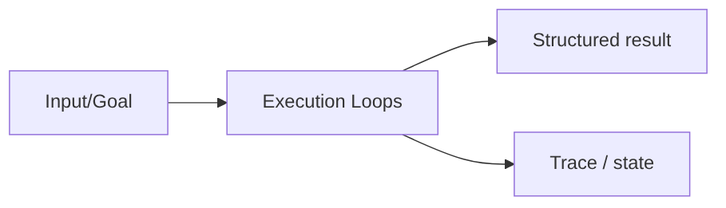

# Chapter 29: Execution Loops

## Chapter Overview

Part IV — Agent Engineering — **Execution Loops** — package `execloop`.

`ExecutionEngine` separates injectable `decide` and `act` functions, records phased history, and enforces `max_steps` plus `max_retries` on failed observations.

Parts I–III built models, context, retrieval, and hybrid search. Part IV implements **Execution Loops** as `execloop` — an offline-testable building block toward harnesses (Part V) and your own framework (Part VIII).

**Code:** `code/chapter-029/execloop/`. **Continuity:** Chapter 25 advanced RAG; Chapter 26 hybrid eval; Part IV agents from Chapter 27 onward.

---

## Learning Objectives

After completing this chapter, you can:

- Explain **Execution Loops** in a production agent architecture
- Run and extend `execloop` offline with pytest
- Describe failure modes, budgets, and structured traces
- Connect this module to adjacent chapters in Part IV/V
- Compare the approach to common frameworks without losing your domain model
- Apply security defaults (validation, permissions, isolation)
- Complete exercises and mini project with tests passing

---

## Prerequisites

- Chapters 1–26 (LLM platform, RAG, hybrid search)
- Prior Part IV chapters when `n > 27` (through Chapter 28)
- Python dataclasses, typing, pytest

---

## Motivation

Ad-hoc while-loops mix reasoning text, tool JSON, and termination heuristics. Retries either never happen or loop forever on permanent errors.

---

## First Principles

### 1. Phases are logged

Each history entry records think, act, observe, or retry.

### 2. Terminate is explicit

`thought.terminate` ends cleanly with a result payload.

### 3. Retries are for transient act failures

Permanent errors should surface after retry budget.

### 4. Inject decision logic

Swap `default_engine()` for LLM-backed decide in production.

---

## Mental Model

Execution loop = OODA loop for software — think, act, observe, with a retry budget when actions stumble.



| Piece | Responsibility |
|---|---|
| Public API | Stable entry types importers rely on |
| Policy | Budgets, permissions, retries, gates |
| State | Memory, graph, or workflow context |
| Observability | Traces you can assert in tests |

---

## Core Theory

### Engine loop

For each step until `max_steps`:

1. `thought = decide(goal, history)`
2. If `thought.terminate`: return success with `result`
3. `obs = act(thought.action)`
4. On failed `obs.ok`: increment retries; exceed `max_retries` → fail
5. On `obs.done`: return success

`default_engine()` demonstrates a weather fetch narrative with internal state.

### History shape

History entries are dicts with `phase` in `{think, act, observe, retry}` — ready for JSON logging and UI timelines.

### Failure cases

Treat timeouts, permission denials, max steps, and failed observations as **normal** paths with structured errors — not surprise exceptions across agent boundaries.

### Performance implications

LLM calls dominate latency; keep planning, validation, and registry work cheap. Parallelize only independent steps.

### Security implications

Side effects flow through tools, MCP, and workflows — validate names and args; default deny; never execute model-produced code.

---

## Architecture

```text
code/chapter-029/
  execloop/
  tests/
  main.py
  pyproject.toml
```



---

## Internal Implementation

```bash
cd code/chapter-029 && pytest -q && python3 main.py
```

Write a `decide` that terminates early on unsafe goals; assert `reason` in the engine result.

---

## Production Implementation

- Swap mocks for LLM providers, vector DBs, and MCP stdio transports behind the same types
- Add authz, audit logs, and metrics on every side effect
- Persist episodic memory and checkpoints when required
- Enforce tenant isolation on memory, tools, and resources
- Wire retrieval (Part III) as governed tools, not prompt paste

---

## Framework Implementation

ReAct papers and LangChain agents implement the same loop under different names — your engine is the **minimal test harness** for those policies.

Map vendor frameworks onto these ports; do not let SDK types leak into domain models.

---

## Trade-offs

| Option A | Option B / notes |
|---|---|
| Synchronous loop | Simple tests; blocks on slow tools. |
| Event-driven / async loop | Better UX; harder local reasoning. |
| Implicit termination | Fewer lines; non-deterministic stop. |

---

## Debugging

- max_retries always → act never sets ok/done correctly
- max_steps with no terminate → policy too greedy
- Missing action key → act receives empty dict

**Workflow:** reproduce with offline mocks → inspect trace/history → add one log field per policy decision → fix at validation/budget boundaries.

---

## Performance

Batch tool calls when observations are independent; cap history size fed back into LLM decide.

---

## Security

Treat decide output as untrusted — validate action names against a registry before act.

---

## Best Practices

1. Keep `execloop` public APIs small and stable
2. Prefer structured `{ok, ...}` results over bare exceptions at boundaries
3. Log traces (steps, roles, nodes) suitable for JSON export
4. Enforce budgets: steps, retries, graph nodes, workflow failures
5. Validate and authorize before side effects
6. Run `pytest -q` in CI without network keys

---

## Anti-Patterns

- **Unbounded loops** — Runaway cost and stuck sessions
- **Stringly-typed tools** — Model hallucinates names that still execute
- **Implicit memory** — Context leaks across tenants and tasks
- **Monolith agent** — Cannot test planner or tools in isolation
- **Skipping reflection on high-stakes answers** — Hallucinations reach users
- **Opaque framework defaults** — Hidden control flow you cannot trace

---

## Hands-on Exercise

1. `cd code/chapter-029 && pytest -q`
2. Change one policy (budget, permission, router, retry, confidence threshold)
3. Add a test that fails before the change and passes after
4. Run `python3 main.py` and capture structured output
5. Write three bullets: how this module connects to Chapter 28 skeleton or Part V harness

---

## Mini Project

Deliverable: **Think–act–observe engine with retry and terminate semantics.** Extend the demo or compose with an adjacent chapter module; keep tests offline.

---

## Visual diagrams





---

## Chapter Deliverables

| Artifact | Location |
|---|---|
| Manuscript | `book/chapter-029.md` |
| Package | `code/chapter-029/execloop/` |
| Tests | `code/chapter-029/tests/` |
| Diagrams | `diagrams/mermaid/chapter-029/` |

---

## Interview Questions

1. Difference between max_steps and max_retries?
2. Where should tool validation live — decide or act?
3. How do you replay a failed agent run from history?

---

## Quiz

1. terminate flag means:
   A) Kill OS B) Clean stop with result C) Infinite loop D) Delete memory
   **Answer:** B

2. Retry phase increments when:
   A) act observation not ok B) Success C) Import pytest D) Never
   **Answer:** A

3. ExecutionEngine injects:
   A) decide and act callables B) Only CSS C) GPU drivers D) DNS
   **Answer:** A

---

## Cheat Sheet

- `ExecutionEngine(decide, act, max_steps, max_retries)`
- History phases: think | act | observe | retry
- `default_engine()` demo weather flow

---

## Curated Free Resources

- [ReAct paper](https://arxiv.org/abs/2210.03629)
- [OpenAI function calling](https://platform.openai.com/docs/guides/function-calling)

---

## Chapter Summary

**Execution Loops** (`execloop`) — Think–act–observe engine with retry and terminate semantics. Explicit types, traces, and tests so agent behavior stays swappable as models and vendors change.

---

## What's Next

**Chapter 30: Agent Skills.** Chapter 30 introduces versioned, composable skills above raw tools.
