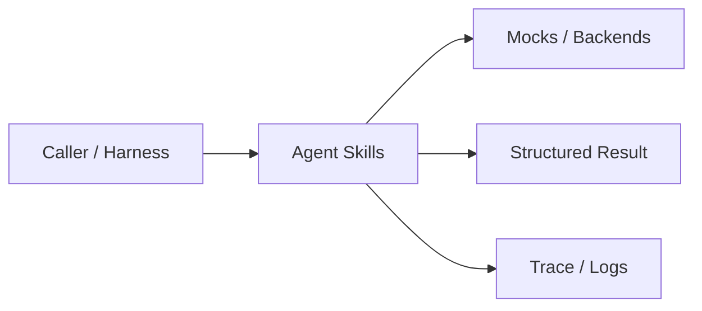
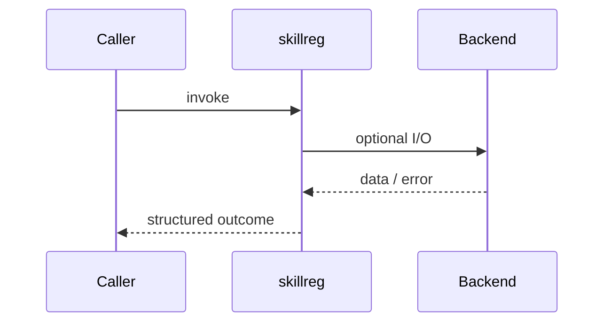
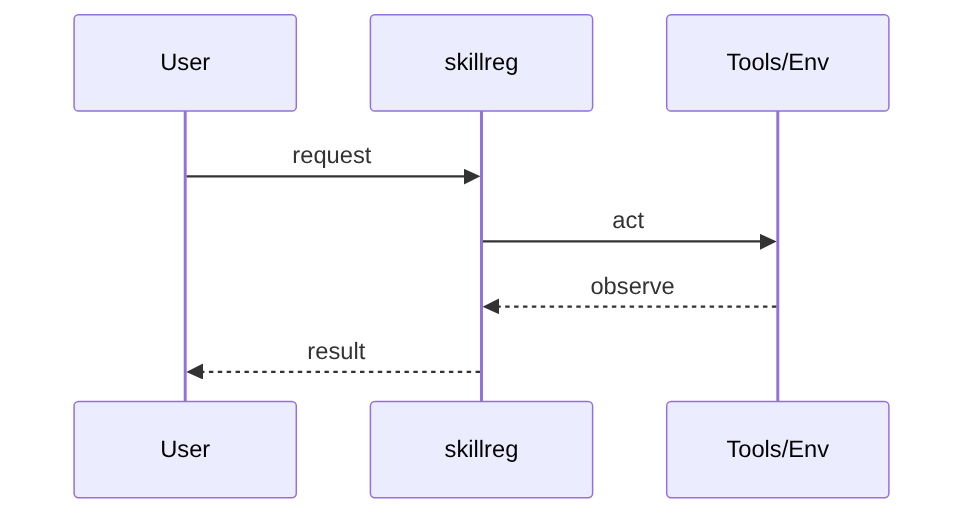
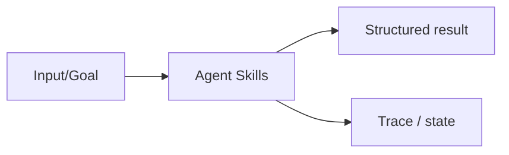

# Chapter 30: Agent Skills

## Chapter Overview

Part IV — Agent Engineering — **Agent Skills** — package `skillreg`.

`SkillRegistry` tracks `SkillSpec` metadata (name, version, tags), supports discovery by tag, and `compose(names, text)` chains skills deterministically.

Parts I–III built models, context, retrieval, and hybrid search. Part IV implements **Agent Skills** as `skillreg` — an offline-testable building block toward harnesses (Part V) and your own framework (Part VIII).

**Code:** `code/chapter-030/skillreg/`. **Continuity:** Chapter 25 advanced RAG; Chapter 26 hybrid eval; Part IV agents from Chapter 27 onward.

---

## Learning Objectives

After completing this chapter, you can:

- Explain **Agent Skills** in a production agent architecture
- Run and extend `skillreg` offline with pytest
- Describe failure modes, budgets, and structured traces
- Connect this module to adjacent chapters in Part IV/V
- Compare the approach to common frameworks without losing your domain model
- Apply security defaults (validation, permissions, isolation)
- Complete exercises and mini project with tests passing

---

## Prerequisites

- Chapters 1–26 (LLM platform, RAG, hybrid search)
- Prior Part IV chapters when `n > 27` (through Chapter 29)
- Python dataclasses, typing, pytest

---

## Motivation

Teams register one-off functions as tools and lose discoverability, versioning, and composable text transforms.

---

## First Principles

### 1. Skills carry metadata

Name, version, description, tags for discovery.

### 2. Version keys

`name@version` plus latest alias on bare name.

### 3. Composition is ordered

`compose` pipes text through each skill sequentially.

### 4. Skills ≠ tools

Skills transform state; tools perform external side effects (Ch 31).

---

## Mental Model

Skills = npm packages for agents — named, versioned capabilities you compose in pipelines.



| Piece | Responsibility |
|---|---|
| Public API | Stable entry types importers rely on |
| Policy | Budgets, permissions, retries, gates |
| State | Memory, graph, or workflow context |
| Observability | Traces you can assert in tests |

---

## Core Theory

### Skill model

`Skill(SkillSpec(...), handler)` — handler is a callable; `run(**kwargs)` invoked by registry.

### Registry API

- `register(skill)` — stores versioned and alias keys
- `get(name, version=None)`
- `list()` — deduplicated specs for catalog UI
- `discover(tag)` — filter by tag
- `compose(["normalize", "summarize"], text)`

`default_registry()` registers normalize, summarize, and cite skills for pipeline demos.

### Failure cases

Treat timeouts, permission denials, max steps, and failed observations as **normal** paths with structured errors — not surprise exceptions across agent boundaries.

### Performance implications

LLM calls dominate latency; keep planning, validation, and registry work cheap. Parallelize only independent steps.

### Security implications

Side effects flow through tools, MCP, and workflows — validate names and args; default deny; never execute model-produced code.

---

## Architecture

```text
code/chapter-030/
  skillreg/
  tests/
  main.py
  pyproject.toml
```



---

## Internal Implementation

```bash
cd code/chapter-030 && pytest -q && python3 main.py
```

Register a `translate` skill with tag `nlp` and discover it via `discover('nlp')`.

---

## Production Implementation

- Swap mocks for LLM providers, vector DBs, and MCP stdio transports behind the same types
- Add authz, audit logs, and metrics on every side effect
- Persist episodic memory and checkpoints when required
- Enforce tenant isolation on memory, tools, and resources
- Wire retrieval (Part III) as governed tools, not prompt paste

---

## Framework Implementation

Claude Skills, ChatGPT GPTs, and internal 'playbooks' are productized skill catalogs — same lifecycle problems: versioning and eval.

Map vendor frameworks onto these ports; do not let SDK types leak into domain models.

---

## Trade-offs

| Option A | Option B / notes |
|---|---|
| In-memory registry | Great for tests; use DB for multi-team catalogs. |
| Composition in-process | Low latency; no isolation from buggy skill code. |
| Skills as microservices | Isolation; network overhead. |

---

## Debugging

- KeyError on get → wrong version pin
- compose order wrong → skills applied backwards
- Duplicate list entries → alias keys iterated twice (registry dedupes in list())

**Workflow:** reproduce with offline mocks → inspect trace/history → add one log field per policy decision → fix at validation/budget boundaries.

---

## Performance

Skills should stay CPU-light; push heavy ML to async jobs or tools.

---

## Security

Do not let users register arbitrary skill code without signing/review — same as plugins.

---

## Best Practices

1. Keep `skillreg` public APIs small and stable
2. Prefer structured `{ok, ...}` results over bare exceptions at boundaries
3. Log traces (steps, roles, nodes) suitable for JSON export
4. Enforce budgets: steps, retries, graph nodes, workflow failures
5. Validate and authorize before side effects
6. Run `pytest -q` in CI without network keys

---

## Anti-Patterns

- **Unbounded loops** — Runaway cost and stuck sessions
- **Stringly-typed tools** — Model hallucinates names that still execute
- **Implicit memory** — Context leaks across tenants and tasks
- **Monolith agent** — Cannot test planner or tools in isolation
- **Skipping reflection on high-stakes answers** — Hallucinations reach users
- **Opaque framework defaults** — Hidden control flow you cannot trace

---

## Hands-on Exercise

1. `cd code/chapter-030 && pytest -q`
2. Change one policy (budget, permission, router, retry, confidence threshold)
3. Add a test that fails before the change and passes after
4. Run `python3 main.py` and capture structured output
5. Write three bullets: how this module connects to Chapter 28 skeleton or Part V harness

---

## Mini Project

Deliverable: **Skill registry with discovery and composition.** Extend the demo or compose with an adjacent chapter module; keep tests offline.

---

## Visual diagrams





---

## Chapter Deliverables

| Artifact | Location |
|---|---|
| Manuscript | `book/chapter-030.md` |
| Package | `code/chapter-030/skillreg/` |
| Tests | `code/chapter-030/tests/` |
| Diagrams | `diagrams/mermaid/chapter-030/` |

---

## Interview Questions

1. When is a skill better than a tool?
2. How do tags support discovery at scale?
3. How would you eval a new skill version?

---

## Quiz

1. compose applies skills:
   A) Random order B) Listed order C) Reverse alpha D) Never
   **Answer:** B

2. SkillSpec tags enable:
   A) GPU sizing B) discover(tag) C) TLS D) PDF
   **Answer:** B

3. Version pin uses key:
   A) name@version B) GPU id C) MAC address D) None
   **Answer:** A

---

## Cheat Sheet

- `SkillRegistry.register/get/list/discover/compose`
- `Skill(SkillSpec(name, desc, tags=..., version=...), fn)`

---

## Curated Free Resources

- [Semantic versioning](https://semver.org/)
- [Anthropic skills (product pattern)](https://docs.anthropic.com/)

---

## Chapter Summary

**Agent Skills** (`skillreg`) — Skill registry with discovery and composition. Explicit types, traces, and tests so agent behavior stays swappable as models and vendors change.

---

## What's Next

**Chapter 31: Tool Calling.** Chapter 31 governs side-effecting tools with permissions and schemas.
