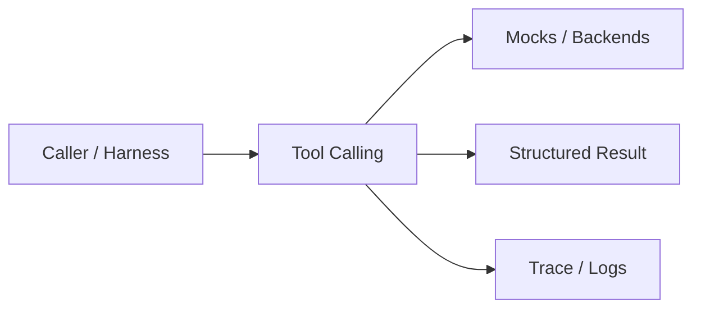
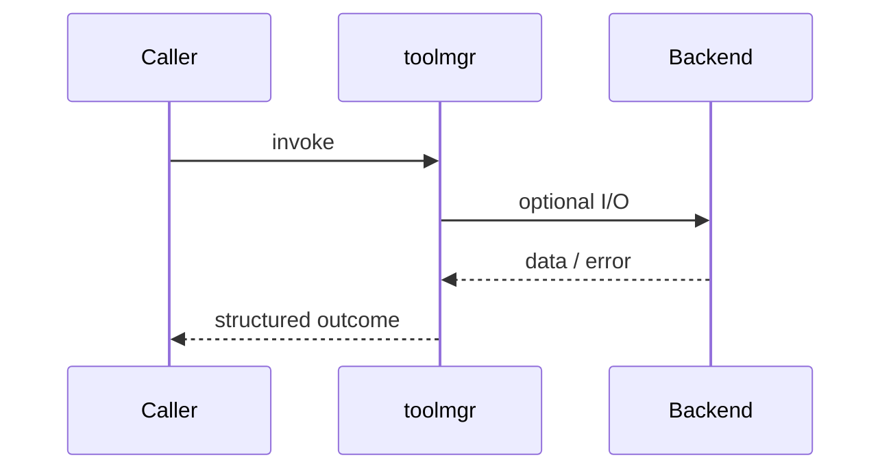
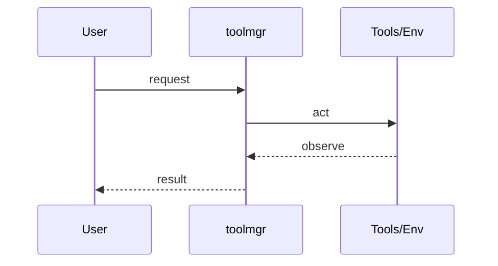
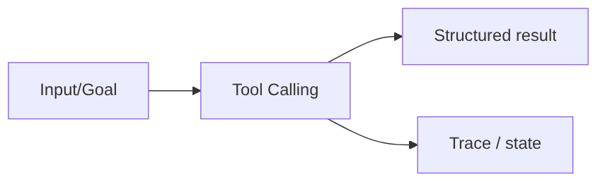

# Chapter 31: Tool Calling

## Chapter Overview

Part IV — Agent Engineering — **Tool Calling** — package `toolmgr`.

`ToolManager` validates args against typed schemas, checks role permissions, wraps handler errors, and exposes sandbox flags for policy.

Parts I–III built models, context, retrieval, and hybrid search. Part IV implements **Tool Calling** as `toolmgr` — an offline-testable building block toward harnesses (Part V) and your own framework (Part VIII).

**Code:** `code/chapter-031/toolmgr/`. **Continuity:** Chapter 25 advanced RAG; Chapter 26 hybrid eval; Part IV agents from Chapter 27 onward.

---

## Learning Objectives

After completing this chapter, you can:

- Explain **Tool Calling** in a production agent architecture
- Run and extend `toolmgr` offline with pytest
- Describe failure modes, budgets, and structured traces
- Connect this module to adjacent chapters in Part IV/V
- Compare the approach to common frameworks without losing your domain model
- Apply security defaults (validation, permissions, isolation)
- Complete exercises and mini project with tests passing

---

## Prerequisites

- Chapters 1–26 (LLM platform, RAG, hybrid search)
- Prior Part IV chapters when `n > 27` (through Chapter 30)
- Python dataclasses, typing, pytest

---

## Motivation

Models emit tool names and JSON args that handlers execute blindly. Billing tools run for anonymous users; shell tools run in prod.

---

## First Principles

### 1. Register explicitly

Unknown tool names fail closed.

### 2. Validate before execute

Missing or mistyped args never hit handlers.

### 3. Permissions intersect roles

Unless role includes admin or overlaps tool permissions.

### 4. Structured errors

`{ok: false, error: ...}` across the agent boundary.

---

## Mental Model

Tool manager = airport gate agent — ticket (schema), passport (role), then boarding (handler).



| Piece | Responsibility |
|---|---|
| Public API | Stable entry types importers rely on |
| Policy | Budgets, permissions, retries, gates |
| State | Memory, graph, or workflow context |
| Observability | Traces you can assert in tests |

---

## Core Theory

### Tool record

`Tool(name, description, handler, permissions, sandboxed, schema)`.

### Call path

1. `validate(name, args)` → unknown_tool | missing:k | type:k
2. Permission check on `roles` tuple
3. `handler(**args)` with exceptions mapped to `execution_error`

Default tools: `get_weather`, `search_kb`, `run_shell` (admin-only, sandboxed=False).

This mirrors Part VIII `fwtools` at framework depth; here you learn the **product security** story.

### Failure cases

Treat timeouts, permission denials, max steps, and failed observations as **normal** paths with structured errors — not surprise exceptions across agent boundaries.

### Performance implications

LLM calls dominate latency; keep planning, validation, and registry work cheap. Parallelize only independent steps.

### Security implications

Side effects flow through tools, MCP, and workflows — validate names and args; default deny; never execute model-produced code.

---

## Architecture

```text
code/chapter-031/
  toolmgr/
  tests/
  main.py
  pyproject.toml
```



---

## Internal Implementation

```bash
cd code/chapter-031 && pytest -q && python3 main.py
```

Add a tool your role cannot call; assert `permission_denied` without handler execution.

---

## Production Implementation

- Swap mocks for LLM providers, vector DBs, and MCP stdio transports behind the same types
- Add authz, audit logs, and metrics on every side effect
- Persist episodic memory and checkpoints when required
- Enforce tenant isolation on memory, tools, and resources
- Wire retrieval (Part III) as governed tools, not prompt paste

---

## Framework Implementation

OpenAI tool schemas, MCP tools (Ch 38), and LangChain `@tool` decorators — all need the same validate→authorize→execute stack.

Map vendor frameworks onto these ports; do not let SDK types leak into domain models.

---

## Trade-offs

| Option A | Option B / notes |
|---|---|
| Typed dict schema (chapter) | Simple; not JSON Schema. |
| JSON Schema + pydantic | Rich validation; more codegen. |
| Sandbox flag only | Policy hint; real isolation needs OS/container sandbox. |

---

## Debugging

- permission_denied with admin role → check tool.permissions tuple
- type errors → isinstance checks are strict
- Handler throws → mapped to execution_error string

**Workflow:** reproduce with offline mocks → inspect trace/history → add one log field per policy decision → fix at validation/budget boundaries.

---

## Performance

Validate is cheap; batch read-only tools when possible.

---

## Security

Default deny; separate admin tools; never expose run_shell to model-visible catalogs in prod.

---

## Best Practices

1. Keep `toolmgr` public APIs small and stable
2. Prefer structured `{ok, ...}` results over bare exceptions at boundaries
3. Log traces (steps, roles, nodes) suitable for JSON export
4. Enforce budgets: steps, retries, graph nodes, workflow failures
5. Validate and authorize before side effects
6. Run `pytest -q` in CI without network keys

---

## Anti-Patterns

- **Unbounded loops** — Runaway cost and stuck sessions
- **Stringly-typed tools** — Model hallucinates names that still execute
- **Implicit memory** — Context leaks across tenants and tasks
- **Monolith agent** — Cannot test planner or tools in isolation
- **Skipping reflection on high-stakes answers** — Hallucinations reach users
- **Opaque framework defaults** — Hidden control flow you cannot trace

---

## Hands-on Exercise

1. `cd code/chapter-031 && pytest -q`
2. Change one policy (budget, permission, router, retry, confidence threshold)
3. Add a test that fails before the change and passes after
4. Run `python3 main.py` and capture structured output
5. Write three bullets: how this module connects to Chapter 28 skeleton or Part V harness

---

## Mini Project

Deliverable: **Permission-safe tool manager with schema validation.** Extend the demo or compose with an adjacent chapter module; keep tests offline.

---

## Visual diagrams





---

## Chapter Deliverables

| Artifact | Location |
|---|---|
| Manuscript | `book/chapter-031.md` |
| Package | `code/chapter-031/toolmgr/` |
| Tests | `code/chapter-031/tests/` |
| Diagrams | `diagrams/mermaid/chapter-031/` |

---

## Interview Questions

1. Where do JSON schema and authz fit relative to the model?
2. How do you test permission_matrix without LLM?
3. Sandboxed flag vs real sandbox?

---

## Quiz

1. Unknown tool returns:
   A) ok true B) unknown_tool error C) Shell D) Random GPU
   **Answer:** B

2. run_shell requires:
   A) admin role B) No schema C) Public internet D) None
   **Answer:** A

3. validate runs:
   A) Before handler B) After handler C) Never D) On GPU only
   **Answer:** A

---

## Cheat Sheet

- `ToolManager.register/validate/execute/list`
- `Tool(..., permissions=(...), schema={field: type})`

---

## Curated Free Resources

- [OWASP LLM Top 10](https://owasp.org/www-project-top-10-for-large-language-model-applications/)
- [OpenAI tools guide](https://platform.openai.com/docs/guides/tools)

---

## Chapter Summary

**Tool Calling** (`toolmgr`) — Permission-safe tool manager with schema validation. Explicit types, traces, and tests so agent behavior stays swappable as models and vendors change.

---

## What's Next

**Chapter 32: Planning.** Chapter 32 adds plan-and-execute vs ReAct planning strategies.
