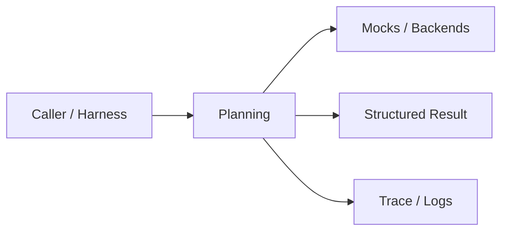
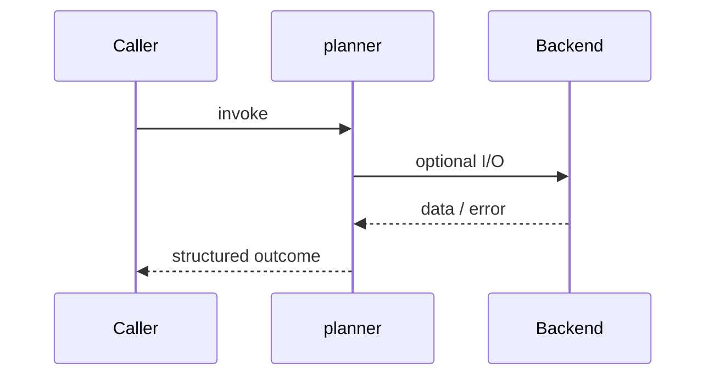
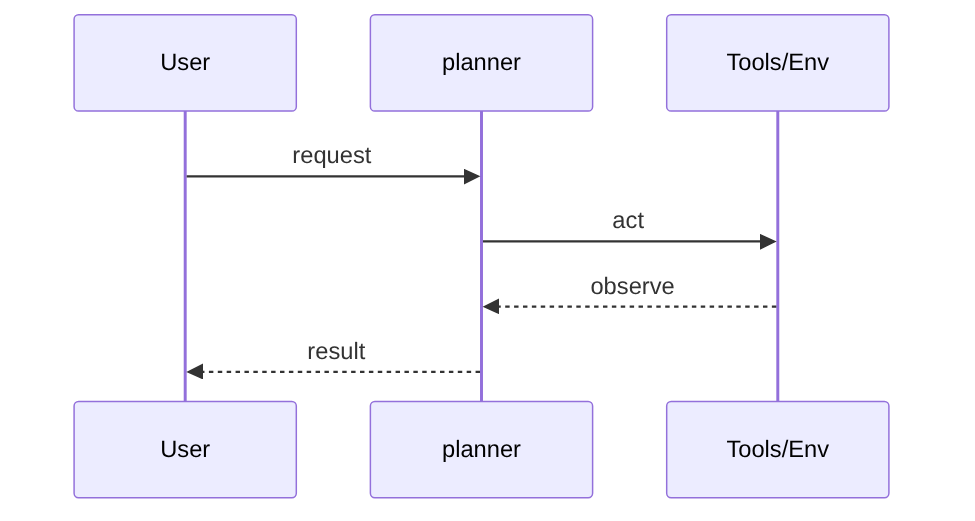
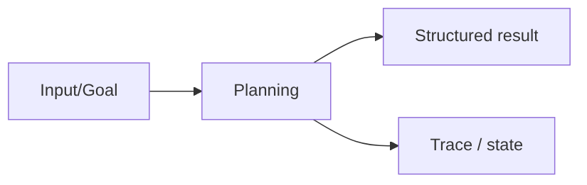

# Chapter 32: Planning

## Chapter Overview

Part IV — Agent Engineering — **Planning** — package `planner`.

`Planner.plan(goal, strategy=...)` returns a `Plan` with `plan_execute` or `react` step lists; `PlanExecutor` simulates execution trace for offline tests.

Parts I–III built models, context, retrieval, and hybrid search. Part IV implements **Planning** as `planner` — an offline-testable building block toward harnesses (Part V) and your own framework (Part VIII).

**Code:** `code/chapter-032/planner/`. **Continuity:** Chapter 25 advanced RAG; Chapter 26 hybrid eval; Part IV agents from Chapter 27 onward.

---

## Learning Objectives

After completing this chapter, you can:

- Explain **Planning** in a production agent architecture
- Run and extend `planner` offline with pytest
- Describe failure modes, budgets, and structured traces
- Connect this module to adjacent chapters in Part IV/V
- Compare the approach to common frameworks without losing your domain model
- Apply security defaults (validation, permissions, isolation)
- Complete exercises and mini project with tests passing

---

## Prerequisites

- Chapters 1–26 (LLM platform, RAG, hybrid search)
- Prior Part IV chapters when `n > 27` (through Chapter 31)
- Python dataclasses, typing, pytest

---

## Motivation

Agents jump straight to tool calls without decomposed steps. When goals change, there is no artifact to diff or replay.

---

## First Principles

### 1. Strategy is explicit

`plan_execute` vs `react` changes step templates.

### 2. Plans are data

Serialize `Plan.to_dict()` for logs and human review.

### 3. Decompose before act

Even stub planners beat zero structure.

### 4. Executor can be swapped

This chapter stubs execution; loops/graphs run real steps later.

---

## Mental Model

Planner = trip itinerary — ordered steps before you leave, with an alternate packing list (ReAct) when roads close.



| Piece | Responsibility |
|---|---|
| Public API | Stable entry types importers rely on |
| Policy | Budgets, permissions, retries, gates |
| State | Memory, graph, or workflow context |
| Observability | Traces you can assert in tests |

---

## Core Theory

### Strategies

**plan_execute** — keyword heuristics on goal:

- research/compare → decompose, research_sources, synthesize, deliver
- weather/lookup → decompose, call_tools, format, deliver
- default → decompose, draft, verify, deliver

**react** — fixed micro-loop labels: thought:analyze → action:gather → observe:results → thought:answer → final

### PlanExecutor

Runs each step name, appends `{i, step, status, note}` trace — placeholder for real tool invocation in integrated harnesses.

### Failure cases

Treat timeouts, permission denials, max steps, and failed observations as **normal** paths with structured errors — not surprise exceptions across agent boundaries.

### Performance implications

LLM calls dominate latency; keep planning, validation, and registry work cheap. Parallelize only independent steps.

### Security implications

Side effects flow through tools, MCP, and workflows — validate names and args; default deny; never execute model-produced code.

---

## Architecture

```text
code/chapter-032/
  planner/
  tests/
  main.py
  pyproject.toml
```



---

## Internal Implementation

```bash
cd code/chapter-032 && pytest -q && python3 main.py
```

Add a new strategy branch for `security audit` goals and snapshot the plan JSON.

---

## Production Implementation

- Swap mocks for LLM providers, vector DBs, and MCP stdio transports behind the same types
- Add authz, audit logs, and metrics on every side effect
- Persist episodic memory and checkpoints when required
- Enforce tenant isolation on memory, tools, and resources
- Wire retrieval (Part III) as governed tools, not prompt paste

---

## Framework Implementation

LangGraph plan nodes, CrewAI task lists, and OpenAI deep research products all expose **plan artifacts** — store them.

Map vendor frameworks onto these ports; do not let SDK types leak into domain models.

---

## Trade-offs

| Option A | Option B / notes |
|---|---|
| Heuristic planner | Offline deterministic; replace with LLM planner in prod. |
| LLM-only planning | Flexible; harder to regression-test. |
| ReAct vs plan-execute | ReAct adapts live; plan-execute easier to approve upfront. |

---

## Debugging

- Unexpected steps → goal keyword heuristics misfired
- Empty trace → executor not iterating plan.steps
- Strategy typo → normalizer lowercases and replaces `-`

**Workflow:** reproduce with offline mocks → inspect trace/history → add one log field per policy decision → fix at validation/budget boundaries.

---

## Performance

Planning should be sub-second; cache plans for idempotent batch jobs.

---

## Security

Human-in-the-loop approval attaches to **plan steps**, not raw model stream.

---

## Best Practices

1. Keep `planner` public APIs small and stable
2. Prefer structured `{ok, ...}` results over bare exceptions at boundaries
3. Log traces (steps, roles, nodes) suitable for JSON export
4. Enforce budgets: steps, retries, graph nodes, workflow failures
5. Validate and authorize before side effects
6. Run `pytest -q` in CI without network keys

---

## Anti-Patterns

- **Unbounded loops** — Runaway cost and stuck sessions
- **Stringly-typed tools** — Model hallucinates names that still execute
- **Implicit memory** — Context leaks across tenants and tasks
- **Monolith agent** — Cannot test planner or tools in isolation
- **Skipping reflection on high-stakes answers** — Hallucinations reach users
- **Opaque framework defaults** — Hidden control flow you cannot trace

---

## Hands-on Exercise

1. `cd code/chapter-032 && pytest -q`
2. Change one policy (budget, permission, router, retry, confidence threshold)
3. Add a test that fails before the change and passes after
4. Run `python3 main.py` and capture structured output
5. Write three bullets: how this module connects to Chapter 28 skeleton or Part V harness

---

## Mini Project

Deliverable: **Planner with plan-and-execute and ReAct templates.** Extend the demo or compose with an adjacent chapter module; keep tests offline.

---

## Visual diagrams





---

## Chapter Deliverables

| Artifact | Location |
|---|---|
| Manuscript | `book/chapter-032.md` |
| Package | `code/chapter-032/planner/` |
| Tests | `code/chapter-032/tests/` |
| Diagrams | `diagrams/mermaid/chapter-032/` |

---

## Interview Questions

1. Plan-and-execute vs ReAct — when to use which?
2. What belongs in a plan artifact for auditors?
3. How do you detect plan drift across model versions?

---

## Quiz

1. react strategy includes step:
   A) thought:analyze B) GPU spin C) docker push D) TLS handshake
   **Answer:** A

2. Plan.to_dict includes:
   A) goal, strategy, steps B) Only GPU C) DNS D) Nothing
   **Answer:** A

3. Heuristic planner uses:
   A) Goal keywords B) Random C) MAC address D) Image pixels
   **Answer:** A

---

## Cheat Sheet

- `Planner().plan(goal, strategy='plan_execute'|'react')`
- `PlanExecutor().run(goal)` → plan + trace

---

## Curated Free Resources

- [Plan-and-Solve / chain-of-thought literature](https://arxiv.org/list/cs.AI/recent)
- [LangGraph planning examples](https://langchain-ai.github.io/langgraph/)

---

## Chapter Summary

**Planning** (`planner`) — Planner with plan-and-execute and ReAct templates. Explicit types, traces, and tests so agent behavior stays swappable as models and vendors change.

---

## What's Next

**Chapter 33: Memory Systems.** Chapter 33 splits working, episodic, and semantic memory.
