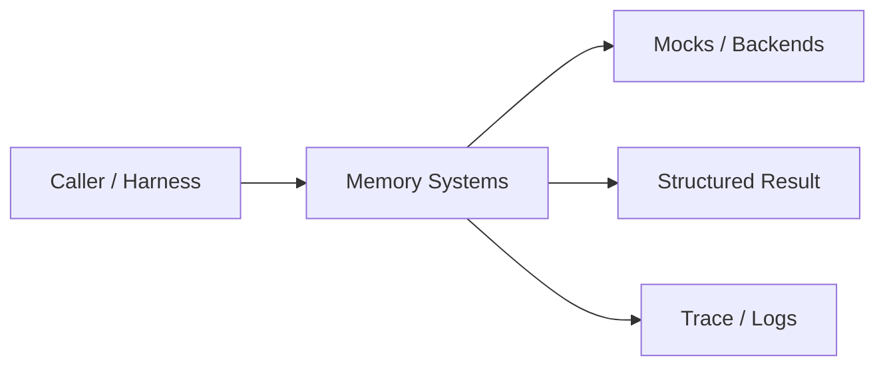
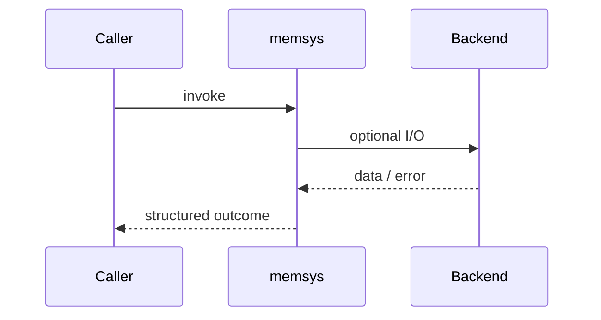
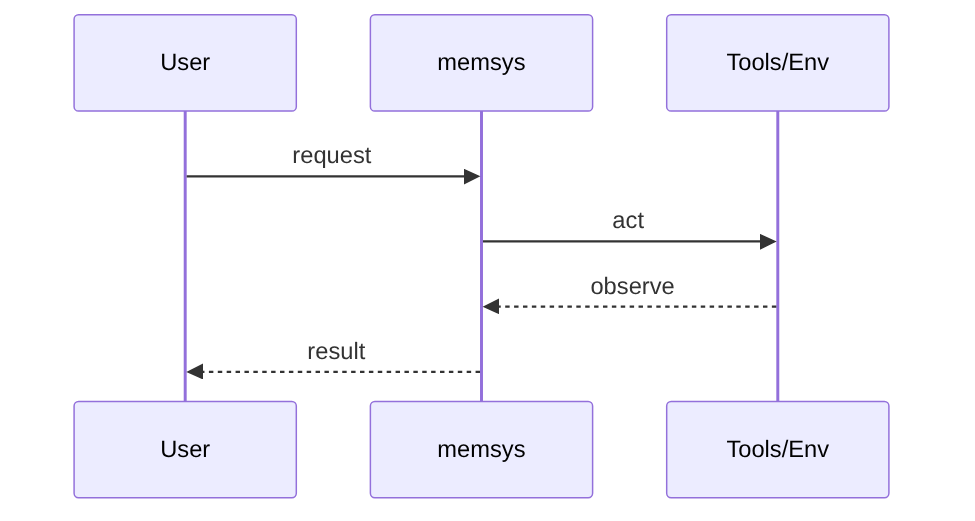
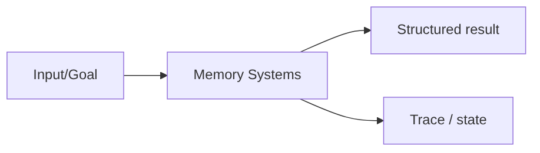

# Chapter 33: Memory Systems

## Chapter Overview

Part IV — Agent Engineering — **Memory Systems** — package `memsys`.

`MemorySystem` coordinates working buffer, episodic log, and keyword semantic store with explicit `remember_turn`, `remember_fact`, and `context(query)`.

Parts I–III built models, context, retrieval, and hybrid search. Part IV implements **Memory Systems** as `memsys` — an offline-testable building block toward harnesses (Part V) and your own framework (Part VIII).

**Code:** `code/chapter-033/memsys/`. **Continuity:** Chapter 25 advanced RAG; Chapter 26 hybrid eval; Part IV agents from Chapter 27 onward.

---

## Learning Objectives

After completing this chapter, you can:

- Explain **Memory Systems** in a production agent architecture
- Run and extend `memsys` offline with pytest
- Describe failure modes, budgets, and structured traces
- Connect this module to adjacent chapters in Part IV/V
- Compare the approach to common frameworks without losing your domain model
- Apply security defaults (validation, permissions, isolation)
- Complete exercises and mini project with tests passing

---

## Prerequisites

- Chapters 1–26 (LLM platform, RAG, hybrid search)
- Prior Part IV chapters when `n > 27` (through Chapter 32)
- Python dataclasses, typing, pytest

---

## Motivation

Single chat buffer conflates transient context with long-term facts. Agents forget nothing or remember unsafe snippets forever.

---

## First Principles

### 1. Working memory is capacity-bound

Rolling window prevents unbounded prompt growth.

### 2. Episodic memory is temporal

Recent episodes summarize sessions.

### 3. Semantic memory is queryable

Facts retrieved by overlap search (upgrade to vectors in prod).

### 4. Context assembly is explicit

`context()` returns structured slices for prompts.

---

## Mental Model

Memory = desk (working), journal (episodic), and encyclopedia (semantic) — different retention and lookup rules.



| Piece | Responsibility |
|---|---|
| Public API | Stable entry types importers rely on |
| Policy | Budgets, permissions, retries, gates |
| State | Memory, graph, or workflow context |
| Observability | Traces you can assert in tests |

---

## Core Theory

### Subsystems

- `WorkingMemory(capacity=20)` — FIFO trim
- `EpisodicMemory.recent(n=5)`
- `SemanticMemory.search(query, k=3)` — token overlap score

### MemorySystem

- `remember_turn(user, assistant)` — updates working + episodic
- `remember_fact(fact, **meta)` — semantic upsert with hash id
- `context(query)` — dict with working/episodic/semantic lists

Upgrade path: swap semantic search with embeddings (Part III) and add tenant ids per record.

### Failure cases

Treat timeouts, permission denials, max steps, and failed observations as **normal** paths with structured errors — not surprise exceptions across agent boundaries.

### Performance implications

LLM calls dominate latency; keep planning, validation, and registry work cheap. Parallelize only independent steps.

### Security implications

Side effects flow through tools, MCP, and workflows — validate names and args; default deny; never execute model-produced code.

---

## Architecture

```text
code/chapter-033/
  memsys/
  tests/
  main.py
  pyproject.toml
```



---

## Internal Implementation

```bash
cd code/chapter-033 && pytest -q && python3 main.py
```

Lower working capacity to 2 and assert oldest turns drop; add facts and verify semantic search ranks overlaps.

---

## Production Implementation

- Swap mocks for LLM providers, vector DBs, and MCP stdio transports behind the same types
- Add authz, audit logs, and metrics on every side effect
- Persist episodic memory and checkpoints when required
- Enforce tenant isolation on memory, tools, and resources
- Wire retrieval (Part III) as governed tools, not prompt paste

---

## Framework Implementation

LangGraph checkpointing, MemGPT, and vector DB memory all sit on these **classes** of memory — name them in design reviews.

Map vendor frameworks onto these ports; do not let SDK types leak into domain models.

---

## Trade-offs

| Option A | Option B / notes |
|---|---|
| Keyword semantic store | Offline simple; weak paraphrase. |
| Vector semantic store | Better recall; embedding cost. |
| Single buffer | Simple; pollutes long-term facts. |

---

## Debugging

- Empty semantic hits → query tokens disjoint from facts
- Missing episodes → remember_turn not called
- Working memory too long → capacity not enforced

**Workflow:** reproduce with offline mocks → inspect trace/history → add one log field per policy decision → fix at validation/budget boundaries.

---

## Performance

Trim working memory aggressively; embed facts async; paginate episodic recall.

---

## Security

Tenant-isolate memory keys; redact PII before episodic persistence; ACL on semantic facts.

---

## Best Practices

1. Keep `memsys` public APIs small and stable
2. Prefer structured `{ok, ...}` results over bare exceptions at boundaries
3. Log traces (steps, roles, nodes) suitable for JSON export
4. Enforce budgets: steps, retries, graph nodes, workflow failures
5. Validate and authorize before side effects
6. Run `pytest -q` in CI without network keys

---

## Anti-Patterns

- **Unbounded loops** — Runaway cost and stuck sessions
- **Stringly-typed tools** — Model hallucinates names that still execute
- **Implicit memory** — Context leaks across tenants and tasks
- **Monolith agent** — Cannot test planner or tools in isolation
- **Skipping reflection on high-stakes answers** — Hallucinations reach users
- **Opaque framework defaults** — Hidden control flow you cannot trace

---

## Hands-on Exercise

1. `cd code/chapter-033 && pytest -q`
2. Change one policy (budget, permission, router, retry, confidence threshold)
3. Add a test that fails before the change and passes after
4. Run `python3 main.py` and capture structured output
5. Write three bullets: how this module connects to Chapter 28 skeleton or Part V harness

---

## Mini Project

Deliverable: **Three-store memory with context assembly.** Extend the demo or compose with an adjacent chapter module; keep tests offline.

---

## Visual diagrams





---

## Chapter Deliverables

| Artifact | Location |
|---|---|
| Manuscript | `book/chapter-033.md` |
| Package | `code/chapter-033/memsys/` |
| Tests | `code/chapter-033/tests/` |
| Diagrams | `diagrams/mermaid/chapter-033/` |

---

## Interview Questions

1. Define working vs episodic vs semantic in production.
2. How do you prevent cross-tenant memory leakage?
3. When should memory be forgotten?

---

## Quiz

1. WorkingMemory trims by:
   A) capacity B) GPU C) Random D) Never
   **Answer:** A

2. remember_turn writes to:
   A) working and episodic B) DNS C) GPU only D) None
   **Answer:** A

3. Semantic search here uses:
   A) Token overlap B) Satellite GPS C) TLS D) PDF
   **Answer:** A

---

## Cheat Sheet

- `MemorySystem.working|episodic|semantic`
- `remember_turn / remember_fact / context(query)`

---

## Curated Free Resources

- [MemGPT paper](https://arxiv.org/abs/2310.08560)
- [Cognitive architectures survey](https://en.wikipedia.org/wiki/Cognitive_architecture)

---

## Chapter Summary

**Memory Systems** (`memsys`) — Three-store memory with context assembly. Explicit types, traces, and tests so agent behavior stays swappable as models and vendors change.

---

## What's Next

**Chapter 34: Reflection.** Chapter 34 critiques answers before users see them.
