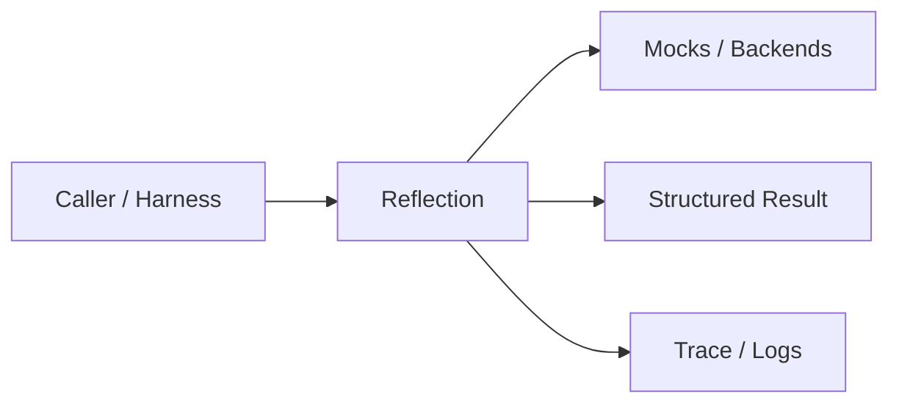
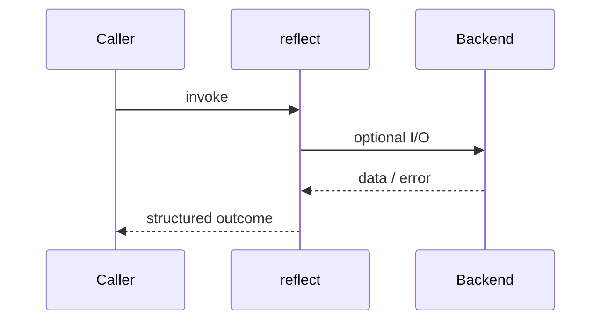
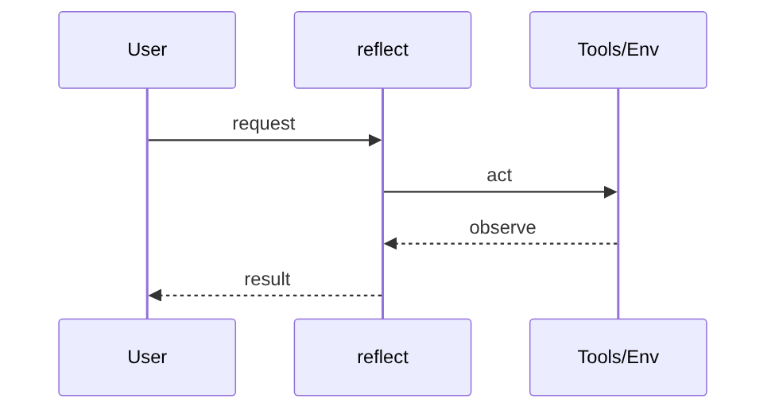
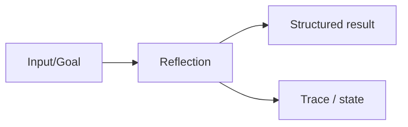

# Chapter 34: Reflection

## Chapter Overview

Part IV — Agent Engineering — **Reflection** — package `reflect`.

`ReflectionEngine.reflect(answer, evidence=..., goal=...)` returns `ReflectionResult` with critique tags, confidence, and revised text gated by `min_confidence`.

Parts I–III built models, context, retrieval, and hybrid search. Part IV implements **Reflection** as `reflect` — an offline-testable building block toward harnesses (Part V) and your own framework (Part VIII).

**Code:** `code/chapter-034/reflect/`. **Continuity:** Chapter 25 advanced RAG; Chapter 26 hybrid eval; Part IV agents from Chapter 27 onward.

---

## Learning Objectives

After completing this chapter, you can:

- Explain **Reflection** in a production agent architecture
- Run and extend `reflect` offline with pytest
- Describe failure modes, budgets, and structured traces
- Connect this module to adjacent chapters in Part IV/V
- Compare the approach to common frameworks without losing your domain model
- Apply security defaults (validation, permissions, isolation)
- Complete exercises and mini project with tests passing

---

## Prerequisites

- Chapters 1–26 (LLM platform, RAG, hybrid search)
- Prior Part IV chapters when `n > 27` (through Chapter 33)
- Python dataclasses, typing, pytest

---

## Motivation

Agents ship first-token answers with no grounding check. Support bots hallucinate policies; coding agents miss failing tests.

---

## First Principles

### 1. Critique before send

Separate generation from verification.

### 2. Confidence is calibrated heuristically

Start with rules; evolve to model+eval.

### 3. Ground against evidence

Weak grounding triggers revision append.

### 4. Accept/reject is explicit

`accepted` boolean drives harness retry.

---

## Mental Model

Reflection = editor reviewing a draft before publish — critique, confidence score, optional rewrite.



| Piece | Responsibility |
|---|---|
| Public API | Stable entry types importers rely on |
| Policy | Budgets, permissions, retries, gates |
| State | Memory, graph, or workflow context |
| Observability | Traces you can assert in tests |

---

## Core Theory

### Heuristics (offline)

Issues detected: empty_answer, uncertain_language, weak_grounding, too_short.

Confidence starts at 0.8 with deductions; weak grounding may append evidence snippet to `revised`.

`accepted = confidence >= min_confidence` (default 0.55).

Production replaces heuristics with LLM judge + unit tests on golden violations.

### Failure cases

Treat timeouts, permission denials, max steps, and failed observations as **normal** paths with structured errors — not surprise exceptions across agent boundaries.

### Performance implications

LLM calls dominate latency; keep planning, validation, and registry work cheap. Parallelize only independent steps.

### Security implications

Side effects flow through tools, MCP, and workflows — validate names and args; default deny; never execute model-produced code.

---

## Architecture

```text
code/chapter-034/
  reflect/
  tests/
  main.py
  pyproject.toml
```



---

## Internal Implementation

```bash
cd code/chapter-034 && pytest -q && python3 main.py
```

Feed an answer without evidence overlap; assert weak_grounding critique and revised text.

---

## Production Implementation

- Swap mocks for LLM providers, vector DBs, and MCP stdio transports behind the same types
- Add authz, audit logs, and metrics on every side effect
- Persist episodic memory and checkpoints when required
- Enforce tenant isolation on memory, tools, and resources
- Wire retrieval (Part III) as governed tools, not prompt paste

---

## Framework Implementation

LangChain evaluators, OpenAI graders, and RAGAS faithfulness metrics occupy this slot — keep a local `ReflectionResult` type.

Map vendor frameworks onto these ports; do not let SDK types leak into domain models.

---

## Trade-offs

| Option A | Option B / notes |
|---|---|
| Rule reflection | Fast CI; incomplete coverage. |
| LLM-as-judge | Richer; costly and gameable. |
| Human review queue | Safe; slow. |

---

## Debugging

- Always accepted → min_confidence too low or no issues triggered
- Never accepted → thresholds too aggressive
- Revised equals original → issue list empty

**Workflow:** reproduce with offline mocks → inspect trace/history → add one log field per policy decision → fix at validation/budget boundaries.

---

## Performance

Run reflection only on high-stakes paths or low-confidence drafts.

---

## Security

Reflection must not leak evidence from other tenants; sanitize appended snippets.

---

## Best Practices

1. Keep `reflect` public APIs small and stable
2. Prefer structured `{ok, ...}` results over bare exceptions at boundaries
3. Log traces (steps, roles, nodes) suitable for JSON export
4. Enforce budgets: steps, retries, graph nodes, workflow failures
5. Validate and authorize before side effects
6. Run `pytest -q` in CI without network keys

---

## Anti-Patterns

- **Unbounded loops** — Runaway cost and stuck sessions
- **Stringly-typed tools** — Model hallucinates names that still execute
- **Implicit memory** — Context leaks across tenants and tasks
- **Monolith agent** — Cannot test planner or tools in isolation
- **Skipping reflection on high-stakes answers** — Hallucinations reach users
- **Opaque framework defaults** — Hidden control flow you cannot trace

---

## Hands-on Exercise

1. `cd code/chapter-034 && pytest -q`
2. Change one policy (budget, permission, router, retry, confidence threshold)
3. Add a test that fails before the change and passes after
4. Run `python3 main.py` and capture structured output
5. Write three bullets: how this module connects to Chapter 28 skeleton or Part V harness

---

## Mini Project

Deliverable: **Reflection engine with confidence gating.** Extend the demo or compose with an adjacent chapter module; keep tests offline.

---

## Visual diagrams





---

## Chapter Deliverables

| Artifact | Location |
|---|---|
| Manuscript | `book/chapter-034.md` |
| Package | `code/chapter-034/reflect/` |
| Tests | `code/chapter-034/tests/` |
| Diagrams | `diagrams/mermaid/chapter-034/` |

---

## Interview Questions

1. Where does reflection sit in the agent loop?
2. How do you prevent infinite reflect→rewrite loops?
3. Rule vs model judges — trade-offs?

---

## Quiz

1. weak_grounding fires when:
   A) Evidence not reflected in answer B) GPU hot C) DNS fails D) Never
   **Answer:** A

2. ReflectionResult.accepted uses:
   A) min_confidence B) Random C) MAC D) TLS
   **Answer:** A

3. Revised text may:
   A) Append evidence snippet B) Delete database C) Format GPU D) None
   **Answer:** A

---

## Cheat Sheet

- `ReflectionEngine(min_confidence=0.55).reflect(...)`
- Fields: original, critique, confidence, revised, accepted

---

## Curated Free Resources

- [Self-refine / critique papers](https://arxiv.org/search/?query=self-refine+LLM)
- [RAGAS metrics](https://docs.ragas.io/)

---

## Chapter Summary

**Reflection** (`reflect`) — Reflection engine with confidence gating. Explicit types, traces, and tests so agent behavior stays swappable as models and vendors change.

---

## What's Next

**Chapter 35: Agent Graphs.** Chapter 35 routes multi-step work through a graph with checkpoints.
