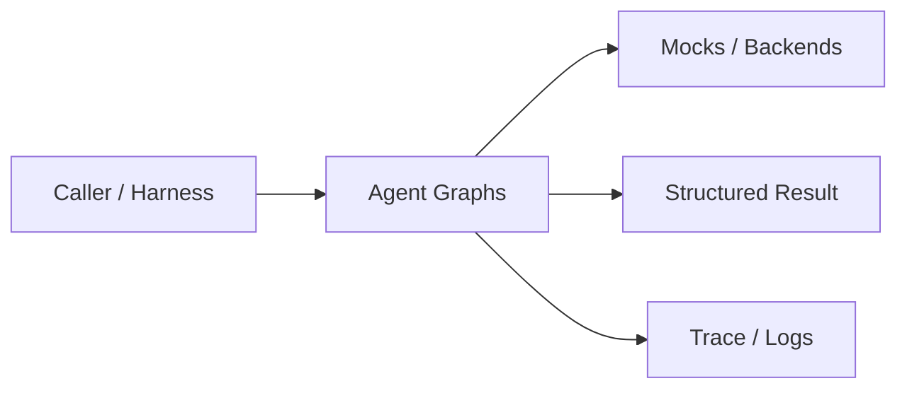
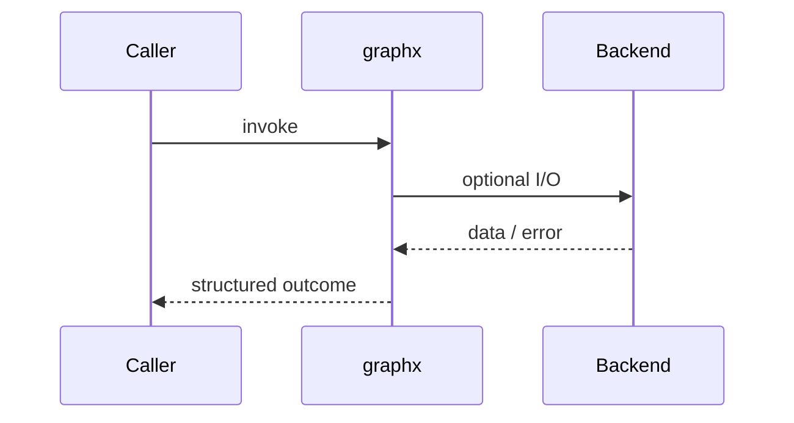
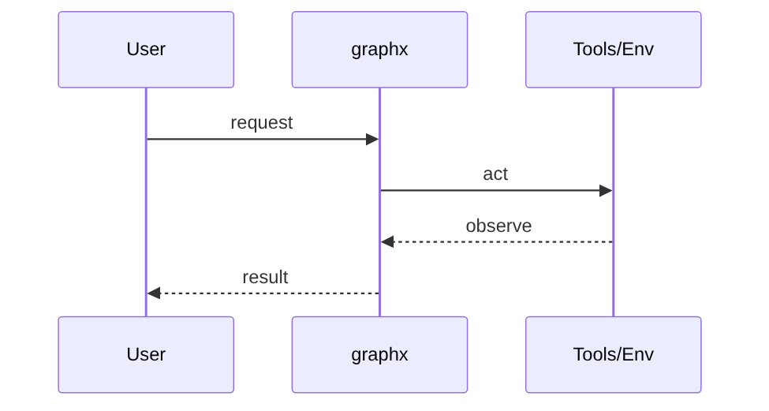
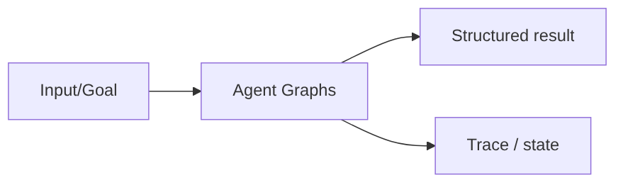

# Chapter 35: Agent Graphs

## Chapter Overview

Part IV — Agent Engineering — **Agent Graphs** — package `graphx`.

`Graph` runs DAG-style nodes with static `nexts` or dynamic `router`, tracks `trace` and `checkpoints` for replay and debugging.

Parts I–III built models, context, retrieval, and hybrid search. Part IV implements **Agent Graphs** as `graphx` — an offline-testable building block toward harnesses (Part V) and your own framework (Part VIII).

**Code:** `code/chapter-035/graphx/`. **Continuity:** Chapter 25 advanced RAG; Chapter 26 hybrid eval; Part IV agents from Chapter 27 onward.

---

## Learning Objectives

After completing this chapter, you can:

- Explain **Agent Graphs** in a production agent architecture
- Run and extend `graphx` offline with pytest
- Describe failure modes, budgets, and structured traces
- Connect this module to adjacent chapters in Part IV/V
- Compare the approach to common frameworks without losing your domain model
- Apply security defaults (validation, permissions, isolation)
- Complete exercises and mini project with tests passing

---

## Prerequisites

- Chapters 1–26 (LLM platform, RAG, hybrid search)
- Prior Part IV chapters when `n > 27` (through Chapter 34)
- Python dataclasses, typing, pytest

---

## Motivation

Linear scripts cannot express branching research flows, conditional routing, or fan-out/fan-in without spaghetti conditionals.

---

## First Principles

### 1. Nodes are pure functions on state

`fn(state) -> partial update dict`.

### 2. Routing is data

Static lists or router callables return next node names.

### 3. Checkpoints snapshot progress

Store result/branch fields per node.

### 4. Budget graph steps

`max_nodes` prevents runaway traversal.

---

## Mental Model

Agent graph = subway map — nodes are stations, edges are lines; routers handle express vs local routes.



| Piece | Responsibility |
|---|---|
| Public API | Stable entry types importers rely on |
| Policy | Budgets, permissions, retries, gates |
| State | Memory, graph, or workflow context |
| Observability | Traces you can assert in tests |

---

## Core Theory

### Node model

`Node(name, fn, nexts=[], router=None)`

### Execution

Pop current frontier, run node, merge outputs into state, append trace + checkpoint, enqueue next nodes from router or nexts.

`research_graph()` demo: plan → search → write → end.

LangGraph, Temporal, and Airflow users should recognize the pattern — this is the **in-process teaching version**.

### Failure cases

Treat timeouts, permission denials, max steps, and failed observations as **normal** paths with structured errors — not surprise exceptions across agent boundaries.

### Performance implications

LLM calls dominate latency; keep planning, validation, and registry work cheap. Parallelize only independent steps.

### Security implications

Side effects flow through tools, MCP, and workflows — validate names and args; default deny; never execute model-produced code.

---

## Architecture

```text
code/chapter-035/
  graphx/
  tests/
  main.py
  pyproject.toml
```



---

## Internal Implementation

```bash
cd code/chapter-035 && pytest -q && python3 main.py
```

Add a router node that sends `billing` intents to a different branch; assert checkpoint order.

---

## Production Implementation

- Swap mocks for LLM providers, vector DBs, and MCP stdio transports behind the same types
- Add authz, audit logs, and metrics on every side effect
- Persist episodic memory and checkpoints when required
- Enforce tenant isolation on memory, tools, and resources
- Wire retrieval (Part III) as governed tools, not prompt paste

---

## Framework Implementation

LangGraph StateGraph, AWS Step Functions, and Dagster ops — map node fn + router to their primitives.

Map vendor frameworks onto these ports; do not let SDK types leak into domain models.

---

## Trade-offs

| Option A | Option B / notes |
|---|---|
| In-process graph | Easy tests; no durability. |
| Durable workflow engine | Survives crashes; ops overhead. |
| LLM-chosen next node | Flexible; needs allowlist of edges. |

---

## Debugging

- missing_node in trace → typo in nexts/router
- Infinite loop → cycle without max_nodes guard
- Empty result → node fn not setting result key

**Workflow:** reproduce with offline mocks → inspect trace/history → add one log field per policy decision → fix at validation/budget boundaries.

---

## Performance

Parallelize independent branches via workflow engine (Ch 36); keep node fns small.

---

## Security

Router must not jump to privileged nodes without auth checks on state.

---

## Best Practices

1. Keep `graphx` public APIs small and stable
2. Prefer structured `{ok, ...}` results over bare exceptions at boundaries
3. Log traces (steps, roles, nodes) suitable for JSON export
4. Enforce budgets: steps, retries, graph nodes, workflow failures
5. Validate and authorize before side effects
6. Run `pytest -q` in CI without network keys

---

## Anti-Patterns

- **Unbounded loops** — Runaway cost and stuck sessions
- **Stringly-typed tools** — Model hallucinates names that still execute
- **Implicit memory** — Context leaks across tenants and tasks
- **Monolith agent** — Cannot test planner or tools in isolation
- **Skipping reflection on high-stakes answers** — Hallucinations reach users
- **Opaque framework defaults** — Hidden control flow you cannot trace

---

## Hands-on Exercise

1. `cd code/chapter-035 && pytest -q`
2. Change one policy (budget, permission, router, retry, confidence threshold)
3. Add a test that fails before the change and passes after
4. Run `python3 main.py` and capture structured output
5. Write three bullets: how this module connects to Chapter 28 skeleton or Part V harness

---

## Mini Project

Deliverable: **DAG graph runner with routing and checkpoints.** Extend the demo or compose with an adjacent chapter module; keep tests offline.

---

## Visual diagrams





---

## Chapter Deliverables

| Artifact | Location |
|---|---|
| Manuscript | `book/chapter-035.md` |
| Package | `code/chapter-035/graphx/` |
| Tests | `code/chapter-035/tests/` |
| Diagrams | `diagrams/mermaid/chapter-035/` |

---

## Interview Questions

1. Graph vs linear loop — when to switch?
2. What do checkpoints enable in prod?
3. How do you test routers offline?

---

## Quiz

1. router returns:
   A) Next node names B) GPU count C) DNS D) PDF
   **Answer:** A

2. max_nodes prevents:
   A) Runaway traversal B) TLS C) Logging D) Nothing
   **Answer:** A

3. Checkpoints store:
   A) Snapshots per node B) Only cookies C) GPU D) None
   **Answer:** A

---

## Cheat Sheet

- `Graph.add(Node(...)); graph.run(payload)`
- trace + checkpoints on state
- `research_graph()` demo

---

## Curated Free Resources

- [LangGraph](https://langchain-ai.github.io/langgraph/)
- [Google ADK workflows](https://google.github.io/adk-docs/)

---

## Chapter Summary

**Agent Graphs** (`graphx`) — DAG graph runner with routing and checkpoints. Explicit types, traces, and tests so agent behavior stays swappable as models and vendors change.

---

## What's Next

**Chapter 36: Workflow Orchestration.** Chapter 36 adds sequential, parallel, and retry policies at workflow layer.
