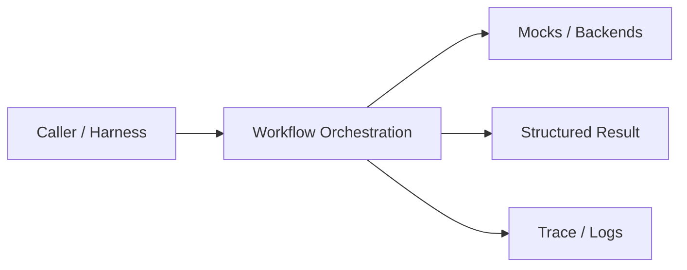
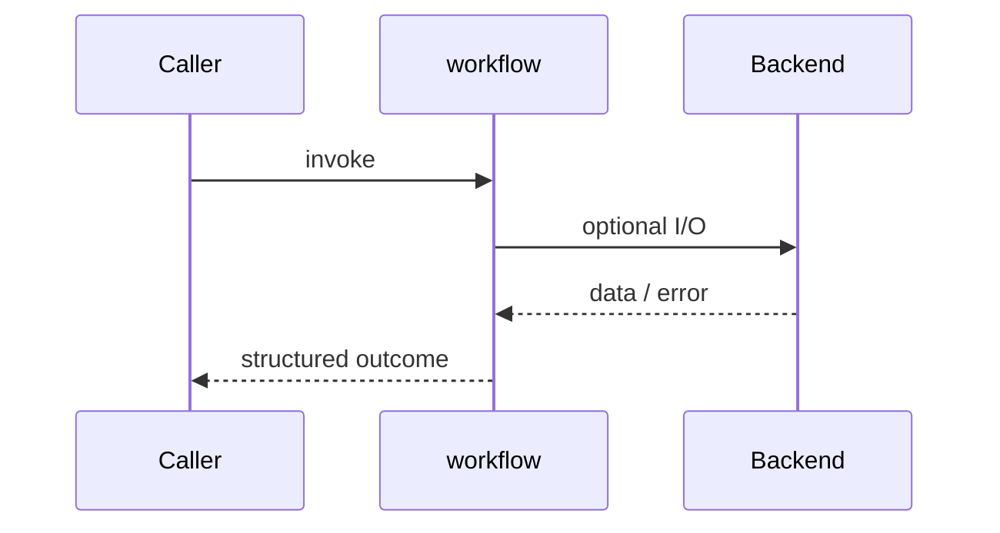
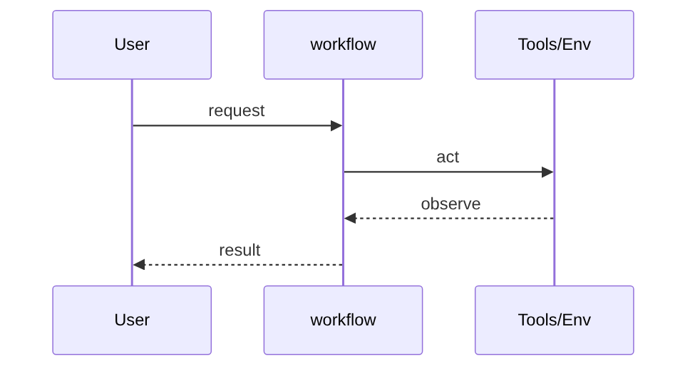
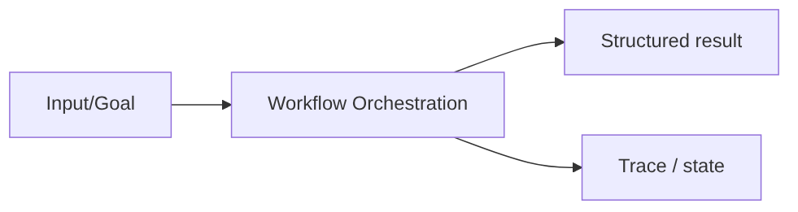

# Chapter 36: Workflow Orchestration

## Chapter Overview

Part IV — Agent Engineering — **Workflow Orchestration** — package `workflow`.

`Workflow` runs `Step` objects sequentially or as parallel batches (`add_parallel`), with per-step `retries` and merged context.

Parts I–III built models, context, retrieval, and hybrid search. Part IV implements **Workflow Orchestration** as `workflow` — an offline-testable building block toward harnesses (Part V) and your own framework (Part VIII).

**Code:** `code/chapter-036/workflow/`. **Continuity:** Chapter 25 advanced RAG; Chapter 26 hybrid eval; Part IV agents from Chapter 27 onward.

---

## Learning Objectives

After completing this chapter, you can:

- Explain **Workflow Orchestration** in a production agent architecture
- Run and extend `workflow` offline with pytest
- Describe failure modes, budgets, and structured traces
- Connect this module to adjacent chapters in Part IV/V
- Compare the approach to common frameworks without losing your domain model
- Apply security defaults (validation, permissions, isolation)
- Complete exercises and mini project with tests passing

---

## Prerequisites

- Chapters 1–26 (LLM platform, RAG, hybrid search)
- Prior Part IV chapters when `n > 27` (through Chapter 35)
- Python dataclasses, typing, pytest

---

## Motivation

Agents need parallel safety checks, retry flaky retrieval, and stop the line when a step fails — not a single-threaded for-loop.

---

## First Principles

### 1. Steps mutate shared context

Return partial dict merged into ctx.

### 2. Parallel steps merge outputs

ThreadPoolExecutor with per-step trace.

### 3. Fail fast on required steps

Return failed step name when retries exhausted.

### 4. Retries are step-local

Do not retry entire workflow blindly.

---

## Mental Model

Workflow = kitchen line — sequential courses, parallel sides, and remakes (retries) when a plate drops.



| Piece | Responsibility |
|---|---|
| Public API | Stable entry types importers rely on |
| Policy | Budgets, permissions, retries, gates |
| State | Memory, graph, or workflow context |
| Observability | Traces you can assert in tests |

---

## Core Theory

### Step execution

`_run_step` loops `attempts <= step.retries`, try/except around `step.fn(ctx)`.

### Demo workflow

`demo_workflow()` — classify → retrieve (retries=1) → parallel safety+tone → answer.

Parallel block stores `{step_name: result}` under `ctx['parallel']`.

Use this layer when graph topology is fixed but ops needs retries/concurrency.

### Failure cases

Treat timeouts, permission denials, max steps, and failed observations as **normal** paths with structured errors — not surprise exceptions across agent boundaries.

### Performance implications

LLM calls dominate latency; keep planning, validation, and registry work cheap. Parallelize only independent steps.

### Security implications

Side effects flow through tools, MCP, and workflows — validate names and args; default deny; never execute model-produced code.

---

## Architecture

```text
code/chapter-036/
  workflow/
  tests/
  main.py
  pyproject.toml
```



---

## Internal Implementation

```bash
cd code/chapter-036 && pytest -q && python3 main.py
```

Make retrieve fail twice then succeed; assert attempts in trace.

---

## Production Implementation

- Swap mocks for LLM providers, vector DBs, and MCP stdio transports behind the same types
- Add authz, audit logs, and metrics on every side effect
- Persist episodic memory and checkpoints when required
- Enforce tenant isolation on memory, tools, and resources
- Wire retrieval (Part III) as governed tools, not prompt paste

---

## Framework Implementation

Temporal, Prefect, and Airflow orchestrate at datacenter scale — same semantics at agent layer.

Map vendor frameworks onto these ports; do not let SDK types leak into domain models.

---

## Trade-offs

| Option A | Option B / notes |
|---|---|
| Thread pool parallel | Simple; watch shared context races. |
| Async gather | Scales I/O; harder debugging. |
| Monolithic script | No retry granularity. |

---

## Debugging

- Parallel merge missing keys → step fn returned empty output
- Failed workflow → check trace[-1] failed step
- Retries exhausted → exception not caught inside fn

**Workflow:** reproduce with offline mocks → inspect trace/history → add one log field per policy decision → fix at validation/budget boundaries.

---

## Performance

Parallelize only independent steps; cap pool workers; short-circuit on classify.

---

## Security

Run safety_check before answer generation; never skip parallel gates for speed.

---

## Best Practices

1. Keep `workflow` public APIs small and stable
2. Prefer structured `{ok, ...}` results over bare exceptions at boundaries
3. Log traces (steps, roles, nodes) suitable for JSON export
4. Enforce budgets: steps, retries, graph nodes, workflow failures
5. Validate and authorize before side effects
6. Run `pytest -q` in CI without network keys

---

## Anti-Patterns

- **Unbounded loops** — Runaway cost and stuck sessions
- **Stringly-typed tools** — Model hallucinates names that still execute
- **Implicit memory** — Context leaks across tenants and tasks
- **Monolith agent** — Cannot test planner or tools in isolation
- **Skipping reflection on high-stakes answers** — Hallucinations reach users
- **Opaque framework defaults** — Hidden control flow you cannot trace

---

## Hands-on Exercise

1. `cd code/chapter-036 && pytest -q`
2. Change one policy (budget, permission, router, retry, confidence threshold)
3. Add a test that fails before the change and passes after
4. Run `python3 main.py` and capture structured output
5. Write three bullets: how this module connects to Chapter 28 skeleton or Part V harness

---

## Mini Project

Deliverable: **Workflow with sequential, parallel, and retry policies.** Extend the demo or compose with an adjacent chapter module; keep tests offline.

---

## Visual diagrams





---

## Chapter Deliverables

| Artifact | Location |
|---|---|
| Manuscript | `book/chapter-036.md` |
| Package | `code/chapter-036/workflow/` |
| Tests | `code/chapter-036/tests/` |
| Diagrams | `diagrams/mermaid/chapter-036/` |

---

## Interview Questions

1. Workflow vs graph — division of labor?
2. How do retries differ from agent-level max_retries?
3. Shared context pitfalls in parallel steps?

---

## Quiz

1. add_parallel runs steps:
   A) Concurrently B) Never C) On GPU only D) Randomly unordered always
   **Answer:** A

2. Step.retries applies:
   A) Per step B) Globally infinite C) DNS D) Never
   **Answer:** A

3. Failed required step:
   A) Stops workflow B) Ignored always C) Deletes repo D) None
   **Answer:** A

---

## Cheat Sheet

- `Workflow.add(Step(...)); add_parallel([...])`
- `run(context) -> {ok, trace, context}`

---

## Curated Free Resources

- [Temporal docs](https://docs.temporal.io/)
- [Prefect](https://docs.prefect.io/)

---

## Chapter Summary

**Workflow Orchestration** (`workflow`) — Workflow with sequential, parallel, and retry policies. Explicit types, traces, and tests so agent behavior stays swappable as models and vendors change.

---

## What's Next

**Chapter 37: Multi-Agent Systems.** Chapter 37 coordinates multiple role-specialized agents.
