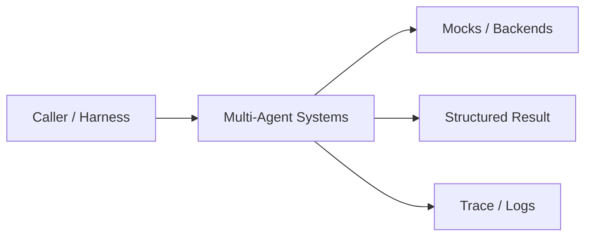
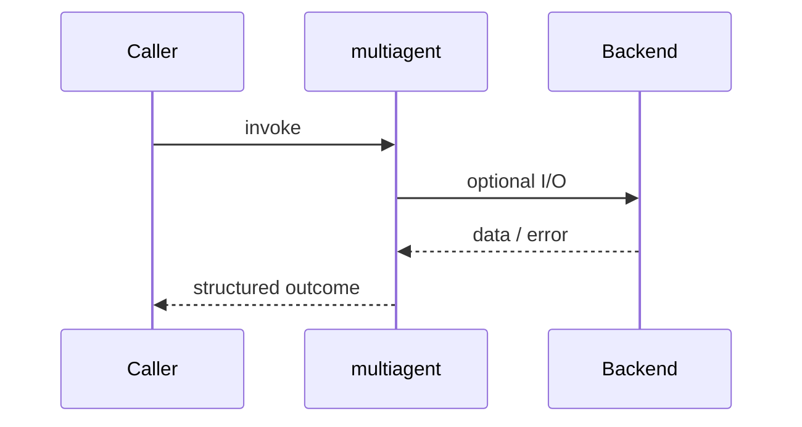
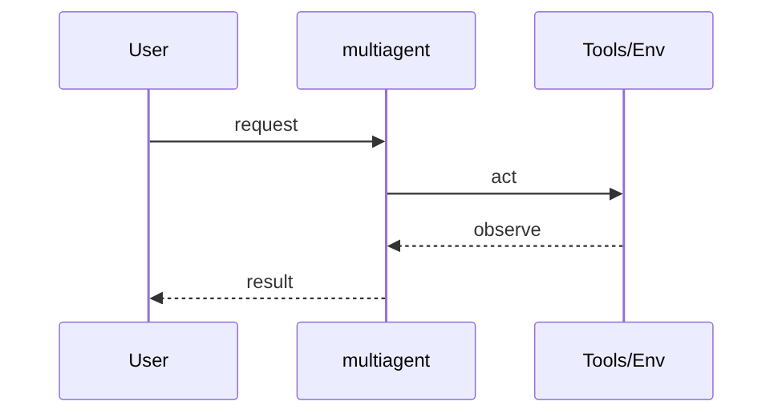
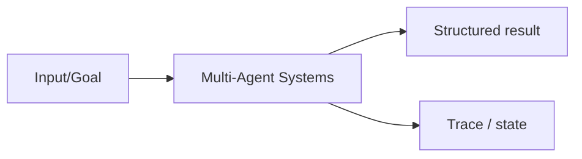

# Chapter 37: Multi-Agent Systems

## Chapter Overview

Part IV — Agent Engineering — **Multi-Agent Systems** — package `multiagent`.

`MultiAgentSystem` runs ordered roles (planner → researcher → writer → reviewer) with optional revision loop when `needs_revision`.

Parts I–III built models, context, retrieval, and hybrid search. Part IV implements **Multi-Agent Systems** as `multiagent` — an offline-testable building block toward harnesses (Part V) and your own framework (Part VIII).

**Code:** `code/chapter-037/multiagent/`. **Continuity:** Chapter 25 advanced RAG; Chapter 26 hybrid eval; Part IV agents from Chapter 27 onward.

---

## Learning Objectives

After completing this chapter, you can:

- Explain **Multi-Agent Systems** in a production agent architecture
- Run and extend `multiagent` offline with pytest
- Describe failure modes, budgets, and structured traces
- Connect this module to adjacent chapters in Part IV/V
- Compare the approach to common frameworks without losing your domain model
- Apply security defaults (validation, permissions, isolation)
- Complete exercises and mini project with tests passing

---

## Prerequisites

- Chapters 1–26 (LLM platform, RAG, hybrid search)
- Prior Part IV chapters when `n > 27` (through Chapter 36)
- Python dataclasses, typing, pytest

---

## Motivation

One agent playing every role mixes planning bias with writing voice and skips independent review.

---

## First Principles

### 1. Roles are explicit agents

`Agent(role, run callable)`.

### 2. Shared state dict

Each role reads/writes keys; trace records role outputs.

### 3. Consensus via reviewer

Second writer pass if reviewer rejects.

### 4. Order is policy

Customize order for different products.

---

## Mental Model

Multi-agent = film crew — planner, researcher, writer, reviewer each own a role; reshoot if reviewer rejects.



| Piece | Responsibility |
|---|---|
| Public API | Stable entry types importers rely on |
| Policy | Budgets, permissions, retries, gates |
| State | Memory, graph, or workflow context |
| Observability | Traces you can assert in tests |

---

## Core Theory

### research_assistant()

Registers planner, researcher, writer, reviewer callables.

Reviewer sets `needs_revision` when draft too short or missing facts — triggers writer+reviewer rerun.

Return payload includes plan, notes, draft, review, final, trace.

Debate/swarm patterns extend this with message bus — same state/trace discipline.

### Failure cases

Treat timeouts, permission denials, max steps, and failed observations as **normal** paths with structured errors — not surprise exceptions across agent boundaries.

### Performance implications

LLM calls dominate latency; keep planning, validation, and registry work cheap. Parallelize only independent steps.

### Security implications

Side effects flow through tools, MCP, and workflows — validate names and args; default deny; never execute model-produced code.

---

## Architecture

```text
code/chapter-037/
  multiagent/
  tests/
  main.py
  pyproject.toml
```



---

## Internal Implementation

```bash
cd code/chapter-037 && pytest -q && python3 main.py
```

Force reviewer to reject first draft; assert two writer entries in trace.

---

## Production Implementation

- Swap mocks for LLM providers, vector DBs, and MCP stdio transports behind the same types
- Add authz, audit logs, and metrics on every side effect
- Persist episodic memory and checkpoints when required
- Enforce tenant isolation on memory, tools, and resources
- Wire retrieval (Part III) as governed tools, not prompt paste

---

## Framework Implementation

CrewAI crews, AutoGen group chat, and OpenAI multi-agent patterns — all need **role contracts** and termination.

Map vendor frameworks onto these ports; do not let SDK types leak into domain models.

---

## Trade-offs

| Option A | Option B / notes |
|---|---|
| Sequential roles | Easy traces; higher latency. |
| Parallel agents + merge | Faster; conflict resolution needed. |
| Single mega-agent | Lower ops; weaker separation of concerns. |

---

## Debugging

- Missing role skipped silently → role not in agents dict
- No revision loop → needs_revision never true
- Empty draft → researcher returned no notes

**Workflow:** reproduce with offline mocks → inspect trace/history → add one log field per policy decision → fix at validation/budget boundaries.

---

## Performance

Run researcher queries in parallel; cap revision loops to 1–2.

---

## Security

Reviewer should red-team tool outputs; separate credentials per role in prod.

---

## Best Practices

1. Keep `multiagent` public APIs small and stable
2. Prefer structured `{ok, ...}` results over bare exceptions at boundaries
3. Log traces (steps, roles, nodes) suitable for JSON export
4. Enforce budgets: steps, retries, graph nodes, workflow failures
5. Validate and authorize before side effects
6. Run `pytest -q` in CI without network keys

---

## Anti-Patterns

- **Unbounded loops** — Runaway cost and stuck sessions
- **Stringly-typed tools** — Model hallucinates names that still execute
- **Implicit memory** — Context leaks across tenants and tasks
- **Monolith agent** — Cannot test planner or tools in isolation
- **Skipping reflection on high-stakes answers** — Hallucinations reach users
- **Opaque framework defaults** — Hidden control flow you cannot trace

---

## Hands-on Exercise

1. `cd code/chapter-037 && pytest -q`
2. Change one policy (budget, permission, router, retry, confidence threshold)
3. Add a test that fails before the change and passes after
4. Run `python3 main.py` and capture structured output
5. Write three bullets: how this module connects to Chapter 28 skeleton or Part V harness

---

## Mini Project

Deliverable: **Multi-agent research crew with reviewer revision loop.** Extend the demo or compose with an adjacent chapter module; keep tests offline.

---

## Visual diagrams





---

## Chapter Deliverables

| Artifact | Location |
|---|---|
| Manuscript | `book/chapter-037.md` |
| Package | `code/chapter-037/multiagent/` |
| Tests | `code/chapter-037/tests/` |
| Diagrams | `diagrams/mermaid/chapter-037/` |

---

## Interview Questions

1. When do multi-agent systems beat one agent?
2. How do you prevent infinite reviewer loops?
3. What goes in shared state vs message envelopes?

---

## Quiz

1. Default order includes role:
   A) reviewer B) GPU driver C) DNS D) TLS
   **Answer:** A

2. needs_revision triggers:
   A) Extra writer pass B) OS reboot C) Delete DB D) Never
   **Answer:** A

3. trace records:
   A) Role outputs B) Only cookies C) GPU temp D) None
   **Answer:** A

---

## Cheat Sheet

- `MultiAgentSystem.add(Agent(role, run))`
- `research_assistant()` demo pipeline

---

## Curated Free Resources

- [CrewAI](https://docs.crewai.com/)
- [AutoGen](https://microsoft.github.io/autogen/)

---

## Chapter Summary

**Multi-Agent Systems** (`multiagent`) — Multi-agent research crew with reviewer revision loop. Explicit types, traces, and tests so agent behavior stays swappable as models and vendors change.

---

## What's Next

**Chapter 38: Model Context Protocol (MCP).** Chapter 38 exposes tools/resources via MCP for cross-process integration.
