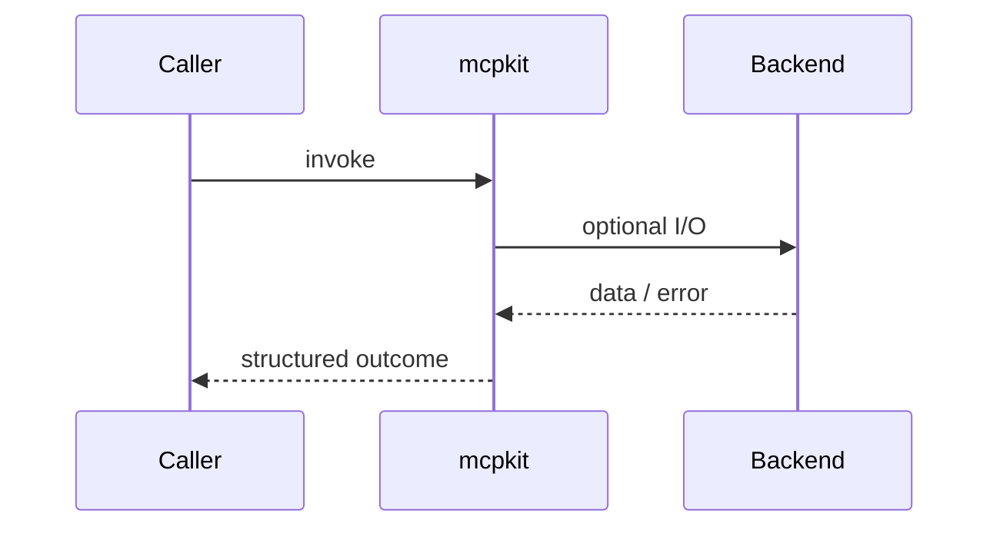
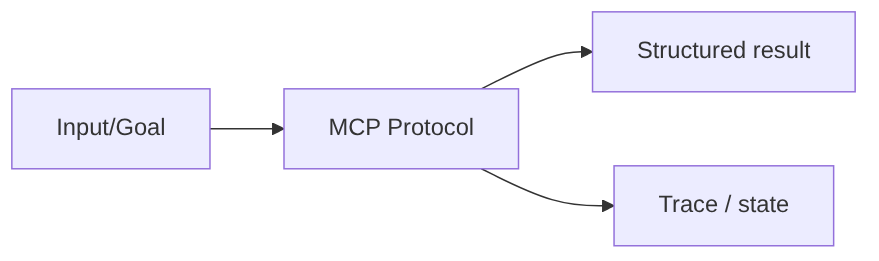

# Chapter 38: Model Context Protocol (MCP)

## Chapter Overview

Part IV — Agent Engineering — **Model Context Protocol (MCP)** — package `mcpkit`.

`MCPServer` / `MCPClient` implement tools, resources, prompts, and in-process transport so you can swap stdio/HTTP later without rewriting agent logic.

Parts I–III built models, context, retrieval, and hybrid search. Part IV implements **Model Context Protocol (MCP)** as `mcpkit` — an offline-testable building block toward harnesses (Part V) and your own framework (Part VIII).

**Code:** `code/chapter-038/mcpkit/`. **Continuity:** Chapter 25 advanced RAG; Chapter 26 hybrid eval; Part IV agents from Chapter 27 onward.

---

## Learning Objectives

After completing this chapter, you can:

- Explain **Model Context Protocol (MCP)** in a production agent architecture
- Run and extend `mcpkit` offline with pytest
- Describe failure modes, budgets, and structured traces
- Connect this module to adjacent chapters in Part IV/V
- Compare the approach to common frameworks without losing your domain model
- Apply security defaults (validation, permissions, isolation)
- Complete exercises and mini project with tests passing

---

## Prerequisites

- Chapters 1–26 (LLM platform, RAG, hybrid search)
- Prior Part IV chapters when `n > 27` (through Chapter 37)
- Python dataclasses, typing, pytest

---

## Motivation

Every SaaS builds a bespoke integration. Agents duplicate auth, schema, and transport logic per vendor.

---

## First Principles

### 1. Three surfaces

Tools (actions), resources (read-only context), prompts (templates).

### 2. List before call

Catalog endpoints mirror production MCP discovery.

### 3. Transport is pluggable

In-process client today; stdio/SSE tomorrow.

### 4. Structured ok/error

Same envelope pattern as ToolManager.

---

## Mental Model

MCP = USB-C for agents — standard port for tools, files (resources), and prompt templates across hosts.

```mermaid
flowchart LR
  Caller[Caller / Harness] --> Mod[Model Context Protocol (MCP)]
  Mod --> Dep[Mocks / Backends]
  Mod --> Out[Structured Result]
  Mod --> Trace[Trace / Logs]
```

| Piece | Responsibility |
|---|---|
| Public API | Stable entry types importers rely on |
| Policy | Budgets, permissions, retries, gates |
| State | Memory, graph, or workflow context |
| Observability | Traces you can assert in tests |

---

## Core Theory

### Server

`add_tool`, `add_resource`, `add_prompt`, `call_tool`, `read_resource`, `get_prompt`.

### Client

`initialize()`, `tools()`, `resources()`, `call_tool`, `read_resource`, `prompt`.

`demo_server()` registers search/weather tools, refund policy resource, support prompt template.

Production MCP adds auth, capability negotiation, and streaming — this chapter teaches **shape and boundaries**.

### Failure cases

Treat timeouts, permission denials, max steps, and failed observations as **normal** paths with structured errors — not surprise exceptions across agent boundaries.

### Performance implications

LLM calls dominate latency; keep planning, validation, and registry work cheap. Parallelize only independent steps.

### Security implications

Side effects flow through tools, MCP, and workflows — validate names and args; default deny; never execute model-produced code.

---

## Architecture

```text
code/chapter-038/
  mcpkit/
  tests/
  main.py
  pyproject.toml
```



---

## Internal Implementation

```bash
cd code/chapter-038 && pytest -q && python3 main.py
```

Initialize client, list tools, call search, read `kb://refund`, render support prompt with `{issue}`.

---

## Production Implementation

- Swap mocks for LLM providers, vector DBs, and MCP stdio transports behind the same types
- Add authz, audit logs, and metrics on every side effect
- Persist episodic memory and checkpoints when required
- Enforce tenant isolation on memory, tools, and resources
- Wire retrieval (Part III) as governed tools, not prompt paste

---

## Framework Implementation

Anthropic MCP spec, Cursor/Claude Desktop integrations — align names with official MCP terminology when wiring real transport.

Map vendor frameworks onto these ports; do not let SDK types leak into domain models.

---

## Trade-offs

| Option A | Option B / notes |
|---|---|
| In-process transport | Zero IPC overhead; not cross-language. |
| stdio MCP | Industry default; process isolation concerns. |
| HTTP/SSE MCP | Remote servers; auth and rate limits required. |

---

## Debugging

- unknown_tool → name mismatch vs catalog
- prompt format error → missing template variable
- resource 404 → uri not registered

**Workflow:** reproduce with offline mocks → inspect trace/history → add one log field per policy decision → fix at validation/budget boundaries.

---

## Performance

Cache resource reads; batch tool list at session start.

---

## Security

Treat MCP servers as privileged code; TLS + token scopes for remote servers; never expose admin tools in public catalogs.

---

## Best Practices

1. Keep `mcpkit` public APIs small and stable
2. Prefer structured `{ok, ...}` results over bare exceptions at boundaries
3. Log traces (steps, roles, nodes) suitable for JSON export
4. Enforce budgets: steps, retries, graph nodes, workflow failures
5. Validate and authorize before side effects
6. Run `pytest -q` in CI without network keys

---

## Anti-Patterns

- **Unbounded loops** — Runaway cost and stuck sessions
- **Stringly-typed tools** — Model hallucinates names that still execute
- **Implicit memory** — Context leaks across tenants and tasks
- **Monolith agent** — Cannot test planner or tools in isolation
- **Skipping reflection on high-stakes answers** — Hallucinations reach users
- **Opaque framework defaults** — Hidden control flow you cannot trace

---

## Hands-on Exercise

1. `cd code/chapter-038 && pytest -q`
2. Change one policy (budget, permission, router, retry, confidence threshold)
3. Add a test that fails before the change and passes after
4. Run `python3 main.py` and capture structured output
5. Write three bullets: how this module connects to Chapter 28 skeleton or Part V harness

---

## Mini Project

Deliverable: **MCP-lite client/server with tools, resources, prompts.** Extend the demo or compose with an adjacent chapter module; keep tests offline.

---

## Visual diagrams



---

## Chapter Deliverables

| Artifact | Location |
|---|---|
| Manuscript | `book/chapter-038.md` |
| Package | `code/chapter-038/mcpkit/` |
| Tests | `code/chapter-038/tests/` |
| Diagrams | `diagrams/mermaid/chapter-038/` |

---

## Interview Questions

1. MCP tools vs resources vs prompts?
2. How does MCP relate to OpenAI function calling?
3. Threat model for third-party MCP servers?

---

## Quiz

1. MCPResource represents:
   A) Read-only context B) GPU C) DNS D) TLS cert
   **Answer:** A

2. initialize returns:
   A) Protocol metadata B) Random C) Deletes server D) Nothing
   **Answer:** A

3. In-process client uses:
   A) Direct server calls B) Satellite link C) Only fax D) None
   **Answer:** A

---

## Cheat Sheet

- `MCPServer` / `MCPClient`
- `call_tool`, `read_resource`, `get_prompt`
- demo_server(): kb://refund resource

---

## Curated Free Resources

- [Model Context Protocol](https://modelcontextprotocol.io/)
- [MCP specification (GitHub)](https://github.com/modelcontextprotocol/specification)

---

## Chapter Summary

**Model Context Protocol (MCP)** (`mcpkit`) — MCP-lite client/server with tools, resources, prompts. Explicit types, traces, and tests so agent behavior stays swappable as models and vendors change.

---

## What's Next

**Chapter 39: Agent Harnesses.** Part V begins with agent harnesses that wrap loops, tools, memory, and MCP clients under one runtime.
