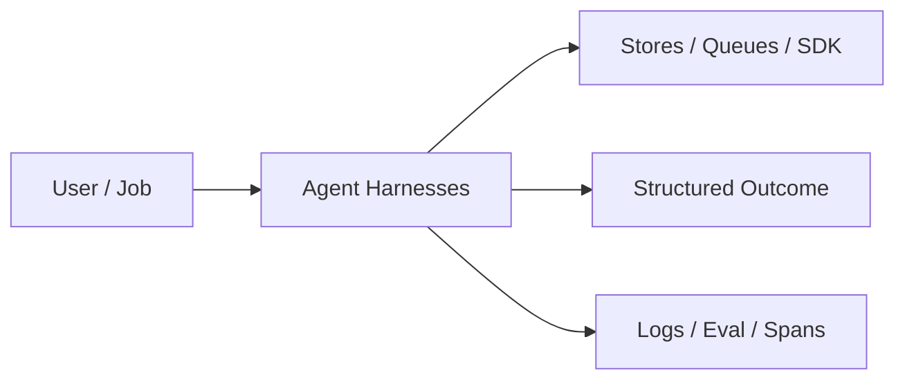
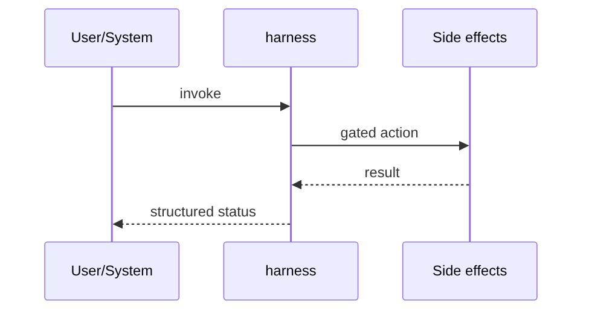
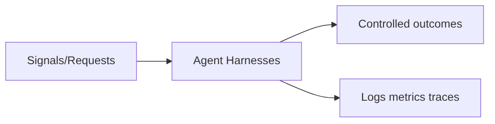

# Chapter 39: Agent Harnesses

## Chapter Overview

Part V — Agent Systems Engineering — **Agent Harnesses** — package `harness`.

`AgentHarness` wraps any `AgentFn` with step/cost budgets, exception recovery, state snapshots, and `on_step` callbacks for evaluation and telemetry.

Part IV gave you agent building blocks; Part V makes them **operable**: harnesses, mode choice, FSMs, events, HITL, eval, observability, security, cost, and scale. Chapter 39 implements **Agent Harnesses** as `harness`.

**Code:** `code/chapter-039/harness/`.

---

## Learning Objectives

After completing this chapter, you can:

- Explain **Agent Harnesses** in a production agent platform
- Run and extend `harness` offline with pytest
- Connect this module to Part IV building blocks and Part V operations
- Compare trade-offs and failure modes with structured traces
- Apply security, cost, and scaling concerns where relevant
- Complete exercises with tests passing

---

## Prerequisites

- Part IV (Chapters 27–38): agents, tools, memory, graphs, MCP
- Prior Part V chapters when `n > 39` (through Chapter 38)
- pytest and structured logging comfort

---

## Motivation

Bare agent loops have no shared budgets, recovery, or eval hooks. Incidents show up as mystery 500s and runaway bills.

---

## First Principles

### 1. Budgets are triple

max_steps, max_cost_usd, max_seconds (extend wall clock in prod).

### 2. Recovery is explicit

Exceptions mark `recovering`; harness may continue until budget exhausted.

### 3. Agent returns structured steps

`done`, `result`, `cost_usd`, `state` updates — not raw strings only.

### 4. Hooks enable eval/obs

`on_step` receives snapshot dicts for metrics pipelines.

---

## Mental Model

Harness = flight recorder + fuel gauge + autopilot limits — the runtime that keeps agents inside policy.



---

## Core Theory

### Types

- `Budget` — caps for steps, USD, seconds
- `HarnessState` — step count, accumulated cost, status, last_error, snapshots
- `AgentHarness.run(goal, context=...)` — loop until done or budget

### Agent contract

```python
def agent(goal: str, ctx: dict) -> dict:
    # ctx includes step, history
    return {"done": True, "result": "...", "cost_usd": 0.04, "state": {...}}
```

`demo_agent` simulates think → act → answer with incremental cost.

### Status outcomes

`succeeded`, `budget_exceeded`, `max_steps`, `failed`, `recovering` — all visible in `_meta()`.

### Failure cases

Design for partial failure: budget exceeded, rejected approvals, eval failures, handler exceptions on the event bus, and tool authorization denials.

### Performance implications

Measure p95 end-to-end latency and cost per successful task; optimize cache hits and worker concurrency before bigger models.

### Security implications

Combine guards, HITL, least-privilege tools, and redaction — models are not security boundaries.

---

## Architecture

```text
code/chapter-039/
  harness/
  tests/
  main.py
  pyproject.toml
```

---

## Internal Implementation

```bash
cd code/chapter-039 && pytest -q && python3 main.py
```

Register an `on_step` hook that fails the run if cost exceeds $0.10 in tests.

---

## Production Implementation

- Replace in-memory buses, telemetry, and pools with managed services (Kafka, OTel, Celery/K8s)
- Persist sessions, approvals, and checkpoints durably
- Wire real SDK clients in Part VI chapters while keeping adapter tests from this repo
- Connect observability export to your metrics backend
- Enforce org policy on mode selection and cost routing tables

---

## Framework Implementation

LangGraph checkpointers, OpenAI Agents tracing, and Temporal workflows are production harness layers — same responsibilities, richer durability.

---

## Trade-offs

| Option A | Option B / notes |
|---|---|
| In-process harness | Simple pytest; dies with process. |
| Durable workflow engine | Survives crashes; ops complexity. |
| Fat SDK runtime | Fast start; opaque budgets. |

---

## Debugging

- Always budget_exceeded → agent reports high cost_usd each step
- Never succeeds → agent never sets done=True
- Empty snapshots → on_step not wired or loop exits early

---

## Performance

Keep harness overhead O(1) per step; export snapshots async.

---

## Security

Harness should enforce tool authz before agent runs — not after damage is done.

---

## Best Practices

1. Keep `harness` interfaces stable for tests and adapters
2. Emit structured traces (steps, spans, approvals, eval rows)
3. Enforce budgets before work starts, not after bills arrive
4. Default deny on risky tools and unapproved actions
5. Run regression eval suites on every prompt/model change
6. Map framework demos to your Part IV ports explicitly

---

## Anti-Patterns

- **Agent without harness** — No budgets, recovery, or eval hooks
- **Observability as printf** — Cannot slice latency or token metrics
- **Skipping HITL on financial actions** — Compliance and trust failures
- **Eval-free releases** — Silent regressions on model swaps
- **Framework-first design** — Vendor types leak into domain core
- **Opaque framework defaults** — Hidden control flow and untraceable tool calls

---

## Hands-on Exercise

1. `cd code/chapter-039 && pytest -q`
2. Change one policy knob (budget, guard, mode rule, eval case, worker count)
3. Add/adjust a test proving the behavior
4. Run `python3 main.py` and inspect structured output
5. Document which Part IV module this replaces or wraps

---

## Mini Project

**Runtime harness with budgets, recovery, and step hooks.** Extend the demo or integrate with a Part IV package in notes (offline).

---

## Visual diagrams





---

## Chapter Deliverables

| Artifact | Location |
|---|---|
| Manuscript | `book/chapter-039.md` |
| Package | `code/chapter-039/harness/` |
| Tests | `code/chapter-039/tests/` |

---

## Interview Questions

1. What belongs in a harness vs inside the agent?
2. How do budgets interact with HITL (Ch 43)?
3. What snapshots do you need for incident replay?

---

## Quiz

1. Harness stops when cost exceeds:
   A) max_cost_usd B) RAM C) DNS D) Never
   **Answer:** A

2. on_step hooks support:
   A) Eval/telemetry B) CSS only C) GPU D) PDF
   **Answer:** A

3. Agent should return done as:
   A) Structured field B) Hidden global C) Email only D) Never
   **Answer:** A

---

## Cheat Sheet

- `AgentHarness(agent, budget, on_step=[])`
- Agent returns: done, result, cost_usd, state
- Statuses: succeeded | budget_exceeded | max_steps

---

## Curated Free Resources

- [OpenTelemetry](https://opentelemetry.io/docs/)
- [Temporal durable execution](https://docs.temporal.io/)

---

## Chapter Summary

**Agent Harnesses** (`harness`) — Runtime harness with budgets, recovery, and step hooks. Treat it as production infrastructure, not demo glue.

---

## What's Next

**Chapter 40: Workflows vs Agents.** Chapter 40 decides when workflows beat agents for a given task shape.
