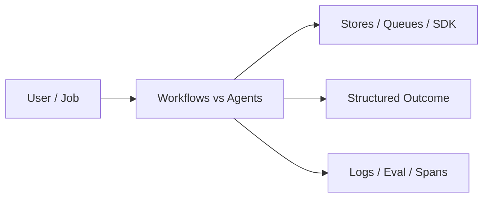
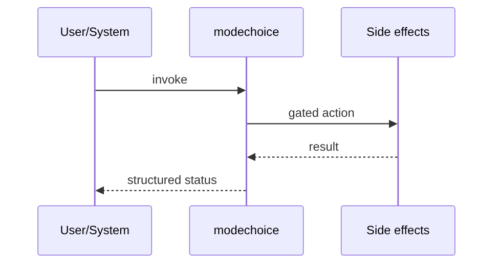
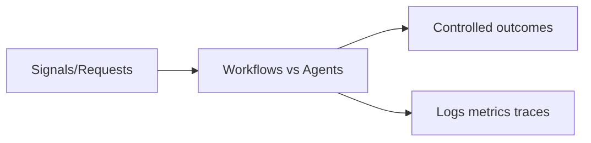

# Chapter 40: Workflows vs Agents

## Chapter Overview

Part V — Agent Systems Engineering — **Workflows vs Agents** — package `modechoice`.

`select_mode(task, needs_tools, deterministic, open_ended)` returns `ModeDecision` with mode, reason, confidence; `run_selected` simulates the chosen path.

Part IV gave you agent building blocks; Part V makes them **operable**: harnesses, mode choice, FSMs, events, HITL, eval, observability, security, cost, and scale. Chapter 40 implements **Workflows vs Agents** as `modechoice`.

**Code:** `code/chapter-040/modechoice/`.

---

## Learning Objectives

After completing this chapter, you can:

- Explain **Workflows vs Agents** in a production agent platform
- Run and extend `modechoice` offline with pytest
- Connect this module to Part IV building blocks and Part V operations
- Compare trade-offs and failure modes with structured traces
- Apply security, cost, and scaling concerns where relevant
- Complete exercises with tests passing

---

## Prerequisites

- Part IV (Chapters 27–38): agents, tools, memory, graphs, MCP
- Prior Part V chapters when `n > 39` (through Chapter 39)
- pytest and structured logging comfort

---

## Motivation

Teams force LLM agents onto ETL jobs or hard-code workflows for research tasks. Wrong mode wastes money and reliability.

---

## First Principles

### 1. Deterministic → workflow

Invoices, ETL, schedules favor explicit steps.

### 2. Open-ended → agent

Research/investigation needs autonomy.

### 3. Tool-heavy support → hybrid

Structured flow plus tool loop.

### 4. Record the decision

Audit why mode X was chosen.

---

## Mental Model

Mode choice = triage nurse — stable broken bone to X-ray workflow; vague pain to exploratory clinician.



---

## Core Theory

### Heuristics

Keyword triggers in `select_mode`:

- `invoice`, `etl`, `batch`, `schedule` → **workflow** (0.9)
- `research`, `investigate`, `explore`, `why` → **agent** (0.85)
- `lookup`, `search`, `weather`, `ticket` or `needs_tools` → **hybrid** (0.8)
- default → **hybrid** (0.6)

### run_selected

Returns `{decision, run}` where run contains illustrative steps and output prefix `workflow:|agent:|hybrid:`.

Production replaces heuristics with classifier model + policy table.

### Failure cases

Design for partial failure: budget exceeded, rejected approvals, eval failures, handler exceptions on the event bus, and tool authorization denials.

### Performance implications

Measure p95 end-to-end latency and cost per successful task; optimize cache hits and worker concurrency before bigger models.

### Security implications

Combine guards, HITL, least-privilege tools, and redaction — models are not security boundaries.

---

## Architecture

```text
code/chapter-040/
  modechoice/
  tests/
  main.py
  pyproject.toml
```

---

## Internal Implementation

```bash
cd code/chapter-040 && pytest -q && python3 main.py
```

Add a task string that should force workflow mode; assert confidence ≥ 0.8.

---

## Production Implementation

- Replace in-memory buses, telemetry, and pools with managed services (Kafka, OTel, Celery/K8s)
- Persist sessions, approvals, and checkpoints durably
- Wire real SDK clients in Part VI chapters while keeping adapter tests from this repo
- Connect observability export to your metrics backend
- Enforce org policy on mode selection and cost routing tables

---

## Framework Implementation

Compare to LangGraph `interrupt`, CrewAI crews vs chains, and BPMN — this chapter is the **product policy** layer.

---

## Trade-offs

| Option A | Option B / notes |
|---|---|
| Rules-first selector | Testable; misses nuance. |
| LLM classifier | Flexible; needs eval set. |
| Always agent | Simple narrative; expensive ETL. |

---

## Debugging

- Wrong mode → keywords not in task string
- Low confidence default → no signals matched

---

## Performance

Mode selection must be sub-millisecond; cache decisions per task template id.

---

## Security

High-risk actions should bump to workflow + HITL regardless of mode suggestion.

---

## Best Practices

1. Keep `modechoice` interfaces stable for tests and adapters
2. Emit structured traces (steps, spans, approvals, eval rows)
3. Enforce budgets before work starts, not after bills arrive
4. Default deny on risky tools and unapproved actions
5. Run regression eval suites on every prompt/model change
6. Map framework demos to your Part IV ports explicitly

---

## Anti-Patterns

- **Agent without harness** — No budgets, recovery, or eval hooks
- **Observability as printf** — Cannot slice latency or token metrics
- **Skipping HITL on financial actions** — Compliance and trust failures
- **Eval-free releases** — Silent regressions on model swaps
- **Framework-first design** — Vendor types leak into domain core
- **Opaque framework defaults** — Hidden control flow and untraceable tool calls

---

## Hands-on Exercise

1. `cd code/chapter-040 && pytest -q`
2. Change one policy knob (budget, guard, mode rule, eval case, worker count)
3. Add/adjust a test proving the behavior
4. Run `python3 main.py` and inspect structured output
5. Document which Part IV module this replaces or wraps

---

## Mini Project

**Mode selector with workflow/agent/hybrid routing.** Extend the demo or integrate with a Part IV package in notes (offline).

---

## Visual diagrams





---

## Chapter Deliverables

| Artifact | Location |
|---|---|
| Manuscript | `book/chapter-040.md` |
| Package | `code/chapter-040/modechoice/` |
| Tests | `code/chapter-040/tests/` |

---

## Interview Questions

1. Give examples of workflow vs agent vs hybrid in your domain.
2. Who owns mode policy — platform or product?
3. How do you measure wrong-mode incidents?

---

## Quiz

1. ETL-like tasks map to:
   A) workflow B) agent only C) None D) Random
   **Answer:** A

2. ModeDecision includes:
   A) mode, reason, confidence B) GPU only C) DNS D) TLS
   **Answer:** A

3. Hybrid default when:
   A) Uncertain/task needs tools B) Never C) GPU hot D) DNS fail
   **Answer:** A

---

## Cheat Sheet

- `select_mode(task, needs_tools=..., deterministic=..., open_ended=...)`
- `run_selected(task)`

---

## Curated Free Resources

- [Martin Fowler — workflow patterns](https://martinfowler.com/)
- [Anthropic — building effective agents](https://docs.anthropic.com/en/docs/build-with-claude/agents)

---

## Chapter Summary

**Workflows vs Agents** (`modechoice`) — Mode selector with workflow/agent/hybrid routing. Treat it as production infrastructure, not demo glue.

---

## What's Next

**Chapter 41: State Machines.** Chapter 41 models control flow as explicit finite state machines.
