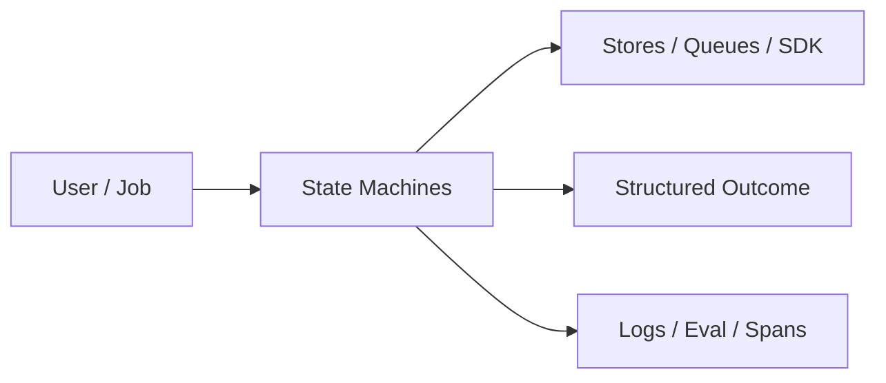
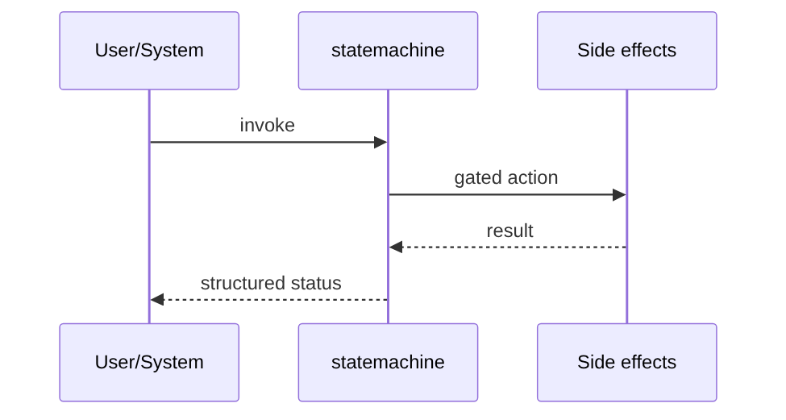
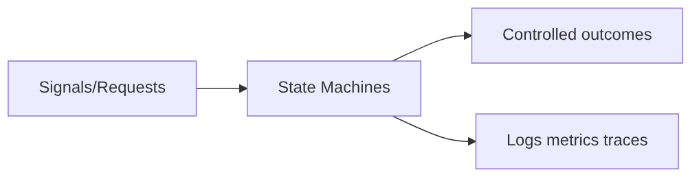

# Chapter 41: State Machines

## Chapter Overview

Part V — Agent Systems Engineering — **State Machines** — package `statemachine`.

`StateMachine` supports `on(state, event, target, guard)`, `send(event, ctx)`, history, and `support_fsm()` demo from idle → triage → acting → answering → human → completed.

Part IV gave you agent building blocks; Part V makes them **operable**: harnesses, mode choice, FSMs, events, HITL, eval, observability, security, cost, and scale. Chapter 41 implements **State Machines** as `statemachine`.

**Code:** `code/chapter-041/statemachine/`.

---

## Learning Objectives

After completing this chapter, you can:

- Explain **State Machines** in a production agent platform
- Run and extend `statemachine` offline with pytest
- Connect this module to Part IV building blocks and Part V operations
- Compare trade-offs and failure modes with structured traces
- Apply security, cost, and scaling concerns where relevant
- Complete exercises with tests passing

---

## Prerequisites

- Part IV (Chapters 27–38): agents, tools, memory, graphs, MCP
- Prior Part V chapters when `n > 39` (through Chapter 40)
- pytest and structured logging comfort

---

## Motivation

Nested if/else for support flows becomes unmaintainable; illegal states slip through without guards.

---

## First Principles

### 1. Events drive transitions

Explicit event names, not hidden flags.

### 2. Guards read context

e.g. escalate when confidence < 0.5.

### 3. History is auditable

Every send appends from/event/to or blocked/error.

### 4. FSM complements graphs

Regulated flows; graphs for DAG research (Ch 35).

---

## Mental Model

FSM = traffic lights for agents — only legal transitions on known events, with guards for yellow-light cases.



---

## Core Theory

### API

```python
sm.on("answering", "escalate", "human", guard=lambda c: c.get("confidence", 1) < 0.5)
sm.send("start")  # from idle
```

Blocked guards append `{blocked: True}` without changing state.

Missing transitions append `{error: no_transition}`.

### support_fsm topology

idle → triage → (acting|answering) → completed, with human escalation path.

### Failure cases

Design for partial failure: budget exceeded, rejected approvals, eval failures, handler exceptions on the event bus, and tool authorization denials.

### Performance implications

Measure p95 end-to-end latency and cost per successful task; optimize cache hits and worker concurrency before bigger models.

### Security implications

Combine guards, HITL, least-privilege tools, and redaction — models are not security boundaries.

---

## Architecture

```text
code/chapter-041/
  statemachine/
  tests/
  main.py
  pyproject.toml
```

---

## Internal Implementation

```bash
cd code/chapter-041 && pytest -q && python3 main.py
```

Add guard that blocks `acting` without `tools_ready` in ctx.

---

## Production Implementation

- Replace in-memory buses, telemetry, and pools with managed services (Kafka, OTel, Celery/K8s)
- Persist sessions, approvals, and checkpoints durably
- Wire real SDK clients in Part VI chapters while keeping adapter tests from this repo
- Connect observability export to your metrics backend
- Enforce org policy on mode selection and cost routing tables

---

## Framework Implementation

AWS Step Functions, XState, LangGraph state nodes — same event/guard semantics at different scales.

---

## Trade-offs

| Option A | Option B / notes |
|---|---|
| Explicit FSM | Clear compliance story; more boilerplate. |
| LLM-routed states | Flexible; harder to prove invariants. |

---

## Debugging

- Stuck in state → event name typo or guard false
- no_transition → missing on() registration

---

## Performance

FSM send is O(transitions); keep guards cheap.

---

## Security

Guards enforce authorization for sensitive transitions (human, refund).

---

## Best Practices

1. Keep `statemachine` interfaces stable for tests and adapters
2. Emit structured traces (steps, spans, approvals, eval rows)
3. Enforce budgets before work starts, not after bills arrive
4. Default deny on risky tools and unapproved actions
5. Run regression eval suites on every prompt/model change
6. Map framework demos to your Part IV ports explicitly

---

## Anti-Patterns

- **Agent without harness** — No budgets, recovery, or eval hooks
- **Observability as printf** — Cannot slice latency or token metrics
- **Skipping HITL on financial actions** — Compliance and trust failures
- **Eval-free releases** — Silent regressions on model swaps
- **Framework-first design** — Vendor types leak into domain core
- **Opaque framework defaults** — Hidden control flow and untraceable tool calls

---

## Hands-on Exercise

1. `cd code/chapter-041 && pytest -q`
2. Change one policy knob (budget, guard, mode rule, eval case, worker count)
3. Add/adjust a test proving the behavior
4. Run `python3 main.py` and inspect structured output
5. Document which Part IV module this replaces or wraps

---

## Mini Project

**FSM with guards for support-style agent control.** Extend the demo or integrate with a Part IV package in notes (offline).

---

## Visual diagrams





---

## Chapter Deliverables

| Artifact | Location |
|---|---|
| Manuscript | `book/chapter-041.md` |
| Package | `code/chapter-041/statemachine/` |
| Tests | `code/chapter-041/tests/` |

---

## Interview Questions

1. FSM vs agent graph — when to pick FSM?
2. How do guards relate to HITL?
3. Testing illegal transitions?

---

## Quiz

1. Guard false leads to:
   A) blocked transition B) OS reboot C) GPU melt D) DNS
   **Answer:** A

2. send returns:
   A) New state name B) Random C) MAC D) TLS
   **Answer:** A

3. support_fsm starts at:
   A) idle B) human C) completed D) None
   **Answer:** A

---

## Cheat Sheet

- `StateMachine.on/send`
- `support_fsm()` reference flow

---

## Curated Free Resources

- [XState docs](https://xstate.js.org/docs/)
- [UML state machines](https://www.omg.org/spec/UML/)

---

## Chapter Summary

**State Machines** (`statemachine`) — FSM with guards for support-style agent control. Treat it as production infrastructure, not demo glue.

---

## What's Next

**Chapter 42: Event-Driven Agents.** Chapter 42 decouples agents with an event bus.
