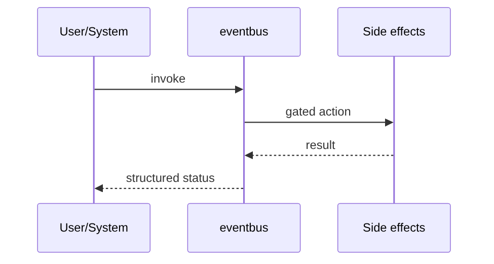
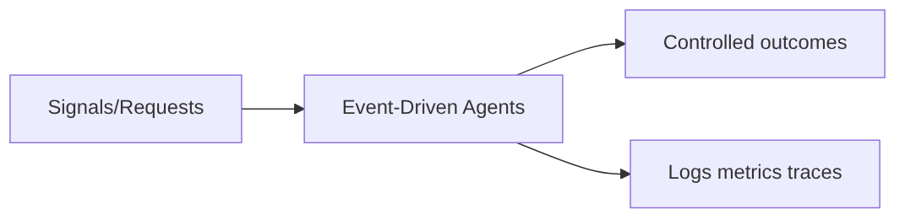

# Chapter 42: Event-Driven Agents

## Chapter Overview

Queue + pub/sub event bus for ticket-style agent reactions and dead-lettering.

This chapter is part of **Part V — Agent Systems Engineering**: operating, evaluating, securing, and scaling agents as production systems.

## Learning Objectives

After completing this chapter, you can:

- Events decouple producers/consumers
- Queues buffer load
- Dead letters preserve failures
- Run the chapter package tests and CLI
- Integrate the component into a harnessed agent platform

## Prerequisites

- Part IV agent building blocks (chapters 27–38)
- Prior Part V chapters through 41

## Motivation

Demo agents break under real traffic: no budgets, no approvals, no metrics, no security boundary, no scale plan. This chapter makes **Event-Driven Agents** an operable subsystem.

## First Principles

### 1. Events decouple producers/consumers

### 2. Queues buffer load

### 3. Dead letters preserve failures


## Mental Model

See Visual diagrams.

## Core Theory

Encode control as data: budgets, states, events, approvals, metrics, and policies. Prefer fail-closed defaults for cost and security.

## Architecture

```text
code/chapter-042/eventbus/
  tests/
  main.py
```

## Internal Implementation

See `code/chapter-042/` for the `eventbus` package, CLI, and tests.

## Production Implementation

- Wire real backends (queues, OTEL, policy engines) behind the same interfaces
- Persist audit trails for approvals, security decisions, and eval runs
- Alert on budget burn, error rates, and eval regressions

## Framework Implementation

Platform features should wrap frameworks—not disappear inside them.

## Trade-offs

| Choice | Pros | Cons |
|---|---|---|
| More control plane | Safer ops | More moving parts |
| Auto-approve low risk | UX speed | Mis-tiered risk |

## Debugging

| Symptom | Check |
|---|---|
| Hang / runaway cost | Harness budgets |
| Silent policy break | Eval suite |
| Missing trace | Observability hooks |

## Performance

Parallelize independent work; cache pure steps; bound fan-out.

## Security

Least privilege, sandbox, redact, and treat all external text as untrusted.

## Best Practices

1. Budgets everywhere
2. Explicit states/events
3. Human gates on high risk
4. Continuous eval
5. Full telemetry

## Anti-Patterns

| Anti-pattern | Failure |
|---|---|
| Infinite agent loops | Bill shock |
| No HITL for money moves | Fraud/loss |
| Metrics without traces | Slow RCAs |

## Hands-on Exercise

1. `pytest -q` in the chapter folder
2. Run `python3 main.py`
3. Tighten one policy/budget and re-test

## Mini Project

**Ticket event flow**

## Visual diagrams






## Chapter Deliverables

| Artifact | Location |
|---|---|
| Manuscript | `book/chapter-042.md` |
| Package | `code/chapter-042/eventbus/` |
| Tests | `code/chapter-042/tests/` |

## Interview Questions

1. Why does this belong in systems engineering rather than model prompting?
2. What fails open vs fail closed?
3. How do you test it in CI?
4. What signals would you alert on?
5. How does it interact with the harness?

## Quiz

1. Part V emphasizes: **operability of agents**
2. High-risk actions need: **human approval**
3. Scale uses: **queues and workers**

## Cheat Sheet

```bash
cd code/chapter-042 && pytest -q && python3 main.py
```

## Chapter Summary

Queue + pub/sub event bus for ticket-style agent reactions and dead-lettering.

## What's Next

**Chapter 43** continues Part V.