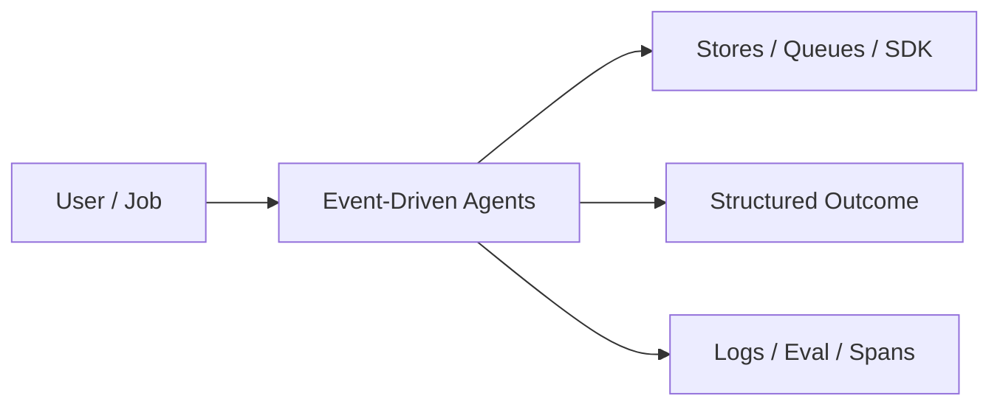

# Chapter 42: Event-Driven Agents

## Chapter Overview

Part V — Agent Systems Engineering — **Event-Driven Agents** — package `eventbus`.

`EventBus` provides per-topic queues, pub/sub handlers, `consume`, and dead-letter capture on handler exceptions.

Part IV gave you agent building blocks; Part V makes them **operable**: harnesses, mode choice, FSMs, events, HITL, eval, observability, security, cost, and scale. Chapter 42 implements **Event-Driven Agents** as `eventbus`.

**Code:** `code/chapter-042/eventbus/`.

---

## Learning Objectives

After completing this chapter, you can:

- Explain **Event-Driven Agents** in a production agent platform
- Run and extend `eventbus` offline with pytest
- Connect this module to Part IV building blocks and Part V operations
- Compare trade-offs and failure modes with structured traces
- Apply security, cost, and scaling concerns where relevant
- Complete exercises with tests passing

---

## Prerequisites

- Part IV (Chapters 27–38): agents, tools, memory, graphs, MCP
- Prior Part V chapters when `n > 39` (through Chapter 41)
- pytest and structured logging comfort

---

## Motivation

Synchronous agent chains block on slow steps and tangle dependencies when new consumers appear.

---

## First Principles

### 1. Topics are contracts

`ticket.created`, `ticket.enriched`, etc.

### 2. Handlers must be idempotent

Retries and duplicate events happen.

### 3. Dead letter for poison handlers

Do not lose failing events silently.

### 4. Publish can chain

Handler publishes follow-on events (demo).

---

## Mental Model

Event bus = post office — publishers drop mail; subscribers react without knowing each other.



---

## Core Theory

### demo_ticket_flow

1. Publish `ticket.created`
2. Subscriber triages id
3. Another subscriber enriches → publishes `ticket.enriched`
4. Router subscriber appends handling trace

Returns handled messages, queue depth, dead_letter list.

### Failure cases

Design for partial failure: budget exceeded, rejected approvals, eval failures, handler exceptions on the event bus, and tool authorization denials.

### Performance implications

Measure p95 end-to-end latency and cost per successful task; optimize cache hits and worker concurrency before bigger models.

### Security implications

Combine guards, HITL, least-privilege tools, and redaction — models are not security boundaries.

---

## Architecture

```text
code/chapter-042/
  eventbus/
  tests/
  main.py
  pyproject.toml
```

---

## Internal Implementation

```bash
cd code/chapter-042 && pytest -q && python3 main.py
```

Add subscriber that raises; assert event lands in dead_letter.

---

## Production Implementation

- Replace in-memory buses, telemetry, and pools with managed services (Kafka, OTel, Celery/K8s)
- Persist sessions, approvals, and checkpoints durably
- Wire real SDK clients in Part VI chapters while keeping adapter tests from this repo
- Connect observability export to your metrics backend
- Enforce org policy on mode selection and cost routing tables

---

## Framework Implementation

Kafka, NATS, Redis streams, AWS EventBridge — production transports with this pub/sub shape.

---

## Trade-offs

| Option A | Option B / notes |
|---|---|
| In-process bus | Easy tests; no cross-service durability. |
| Kafka | Durable; operational cost. |
| Sync calls | Simple; tight coupling. |

---

## Debugging

- Empty handled → subscribe after publish order wrong
- Growing queues → consumers not running
- dead_letter populated → fix handler exceptions

---

## Performance

Batch consume; partition topics by tenant; avoid heavy work in pub thread.

---

## Security

Sign events; ACL per topic; scrub PII from payloads.

---

## Best Practices

1. Keep `eventbus` interfaces stable for tests and adapters
2. Emit structured traces (steps, spans, approvals, eval rows)
3. Enforce budgets before work starts, not after bills arrive
4. Default deny on risky tools and unapproved actions
5. Run regression eval suites on every prompt/model change
6. Map framework demos to your Part IV ports explicitly

---

## Anti-Patterns

- **Agent without harness** — No budgets, recovery, or eval hooks
- **Observability as printf** — Cannot slice latency or token metrics
- **Skipping HITL on financial actions** — Compliance and trust failures
- **Eval-free releases** — Silent regressions on model swaps
- **Framework-first design** — Vendor types leak into domain core
- **Opaque framework defaults** — Hidden control flow and untraceable tool calls

---

## Hands-on Exercise

1. `cd code/chapter-042 && pytest -q`
2. Change one policy knob (budget, guard, mode rule, eval case, worker count)
3. Add/adjust a test proving the behavior
4. Run `python3 main.py` and inspect structured output
5. Document which Part IV module this replaces or wraps

---

## Mini Project

**Event bus with pub/sub and dead-letter list.** Extend the demo or integrate with a Part IV package in notes (offline).

---

## Visual diagrams


---

## Chapter Deliverables

| Artifact | Location |
|---|---|
| Manuscript | `book/chapter-042.md` |
| Package | `code/chapter-042/eventbus/` |
| Tests | `code/chapter-042/tests/` |

---

## Interview Questions

1. Event-driven vs request/response agents?
2. Idempotency keys on consumers?
3. When dead-letter queue is mandatory?

---

## Quiz

1. publish delivers to:
   A) Queue + subscribers B) GPU only C) DNS D) None
   **Answer:** A

2. Handler exceptions go to:
   A) dead_letter B) /dev/null C) stdout only D) GPU
   **Answer:** A

3. Topics should be:
   A) Named contracts B) Random C) Secret only D) Never logged
   **Answer:** A

---

## Cheat Sheet

- `EventBus.publish/subscribe/consume`
- `demo_ticket_flow()`

---

## Curated Free Resources

- [CloudEvents spec](https://cloudevents.io/)
- [Kafka intro](https://kafka.apache.org/documentation/)

---

## Chapter Summary

**Event-Driven Agents** (`eventbus`) — Event bus with pub/sub and dead-letter list. Treat it as production infrastructure, not demo glue.

---

## What's Next

**Chapter 43: Human-in-the-Loop.** Chapter 43 pauses execution for human approval on risky actions.
