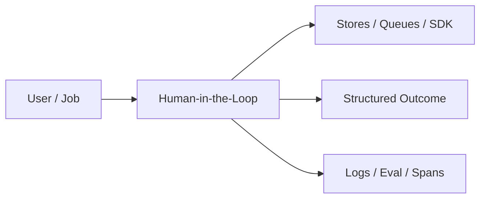
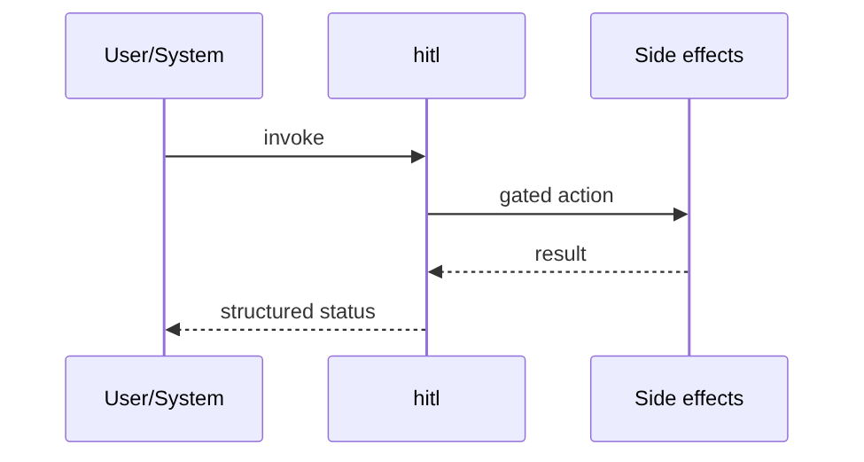
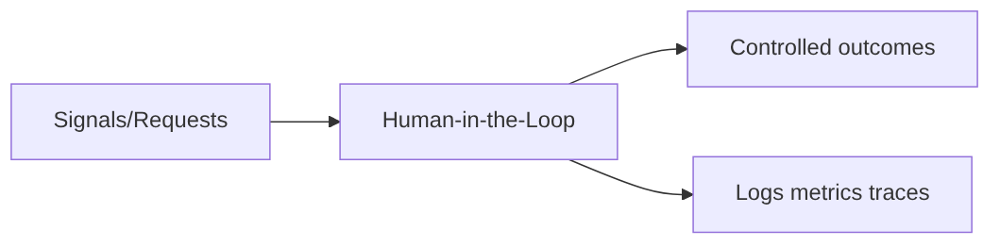

# Chapter 43: Human-in-the-Loop

## Chapter Overview

Part V — Agent Systems Engineering — **Human-in-the-Loop** — package `hitl`.

`HITLController` manages `ApprovalRequest` lifecycle: auto-approve low risk, pending queue, approve/reject/escalate, `run_action` interrupt until approved.

Part IV gave you agent building blocks; Part V makes them **operable**: harnesses, mode choice, FSMs, events, HITL, eval, observability, security, cost, and scale. Chapter 43 implements **Human-in-the-Loop** as `hitl`.

**Code:** `code/chapter-043/hitl/`.

---

## Learning Objectives

After completing this chapter, you can:

- Explain **Human-in-the-Loop** in a production agent platform
- Run and extend `hitl` offline with pytest
- Connect this module to Part IV building blocks and Part V operations
- Compare trade-offs and failure modes with structured traces
- Apply security, cost, and scaling concerns where relevant
- Complete exercises with tests passing

---

## Prerequisites

- Part IV (Chapters 27–38): agents, tools, memory, graphs, MCP
- Prior Part V chapters when `n > 39` (through Chapter 42)
- pytest and structured logging comfort

---

## Motivation

Autonomous refund or shell tools execute instantly; regulators and customers require approval trails.

---

## First Principles

### 1. Risk tiers drive policy

low → auto-approved; medium+ → pending.

### 2. Interrupt before execute

`run_action` returns interrupted=True if not approved.

### 3. Audit log every decision

`log` list for compliance.

### 4. Escalation is first-class

Not the same as reject.

---

## Mental Model

HITL = co-pilot approval before landing — low-risk autopilot continues; high-risk needs human sign-off.



---

## Core Theory

### Flow

`request(action, payload, risk=...)` creates `apr-N`.

`run_action(..., auto_approve=False)` stops with `{ok: False, interrupted: True}` until `approve(id)`.

Escalate marks status without removing pending entry until resolved.

### Failure cases

Design for partial failure: budget exceeded, rejected approvals, eval failures, handler exceptions on the event bus, and tool authorization denials.

### Performance implications

Measure p95 end-to-end latency and cost per successful task; optimize cache hits and worker concurrency before bigger models.

### Security implications

Combine guards, HITL, least-privilege tools, and redaction — models are not security boundaries.

---

## Architecture

```text
code/chapter-043/
  hitl/
  tests/
  main.py
  pyproject.toml
```

---

## Internal Implementation

```bash
cd code/chapter-043 && pytest -q && python3 main.py
```

Request medium-risk action; approve; assert executed ok.

---

## Production Implementation

- Replace in-memory buses, telemetry, and pools with managed services (Kafka, OTel, Celery/K8s)
- Persist sessions, approvals, and checkpoints durably
- Wire real SDK clients in Part VI chapters while keeping adapter tests from this repo
- Connect observability export to your metrics backend
- Enforce org policy on mode selection and cost routing tables

---

## Framework Implementation

LangGraph `interrupt`, OpenAI realtime approvals, ServiceNow tickets — same gate pattern.

---

## Trade-offs

| Option A | Option B / notes |
|---|---|
| Sync approval UI | Simple; blocks workers. |
| Async approval queue | Scales; complex state. |
| Auto-approve low | Frictionless; risk misclassification hurts. |

---

## Debugging

- Always interrupted → never approved
- Auto approve not working → risk not low

---

## Performance

Do not block event loops — use webhook resume tokens in prod.

---

## Security

Bind approvals to authenticated principal; expire pending requests.

---

## Best Practices

1. Keep `hitl` interfaces stable for tests and adapters
2. Emit structured traces (steps, spans, approvals, eval rows)
3. Enforce budgets before work starts, not after bills arrive
4. Default deny on risky tools and unapproved actions
5. Run regression eval suites on every prompt/model change
6. Map framework demos to your Part IV ports explicitly

---

## Anti-Patterns

- **Agent without harness** — No budgets, recovery, or eval hooks
- **Observability as printf** — Cannot slice latency or token metrics
- **Skipping HITL on financial actions** — Compliance and trust failures
- **Eval-free releases** — Silent regressions on model swaps
- **Framework-first design** — Vendor types leak into domain core
- **Opaque framework defaults** — Hidden control flow and untraceable tool calls

---

## Hands-on Exercise

1. `cd code/chapter-043 && pytest -q`
2. Change one policy knob (budget, guard, mode rule, eval case, worker count)
3. Add/adjust a test proving the behavior
4. Run `python3 main.py` and inspect structured output
5. Document which Part IV module this replaces or wraps

---

## Mini Project

**Approval gates with interrupt semantics.** Extend the demo or integrate with a Part IV package in notes (offline).

---

## Visual diagrams





---

## Chapter Deliverables

| Artifact | Location |
|---|---|
| Manuscript | `book/chapter-043.md` |
| Package | `code/chapter-043/hitl/` |
| Tests | `code/chapter-043/tests/` |

---

## Interview Questions

1. Which actions require HITL in your org?
2. How to resume interrupted agent runs?
3. Audit fields regulators expect?

---

## Quiz

1. low risk requests:
   A) auto-approved B) never run C) GPU D) DNS
   **Answer:** A

2. run_action without approve:
   A) interrupted B) always ok C) deletes DB D) reboot
   **Answer:** A

3. escalate changes:
   A) status to escalated B) GPU C) DNS D) nothing
   **Answer:** A

---

## Cheat Sheet

- `HITLController.request/approve/reject/escalate/run_action`
- Risk: low | medium | high

---

## Curated Free Resources

- [NIST AI RMF](https://www.nist.gov/itl/ai-risk-management-framework)
- [OWASP LLM Top 10](https://owasp.org/www-project-top-10-for-large-language-model-applications/)

---

## Chapter Summary

**Human-in-the-Loop** (`hitl`) — Approval gates with interrupt semantics. Treat it as production infrastructure, not demo glue.

---

## What's Next

**Chapter 44: Agent Evaluation.** Chapter 44 scores agent behavior on labeled cases.
