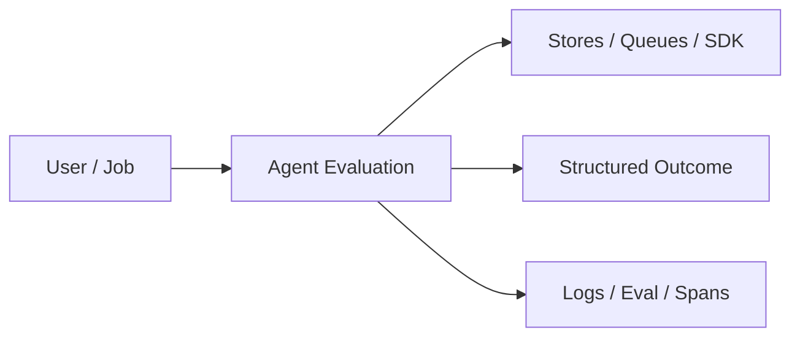
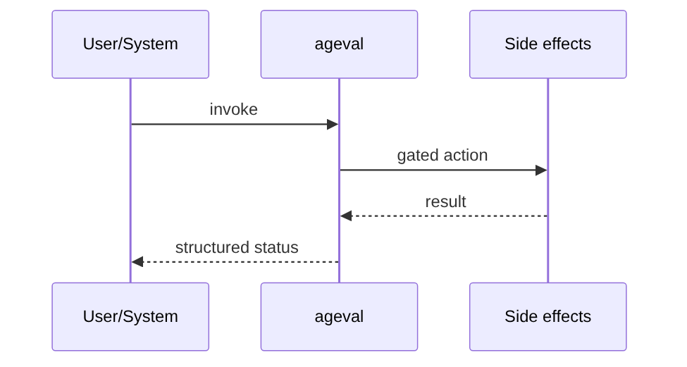
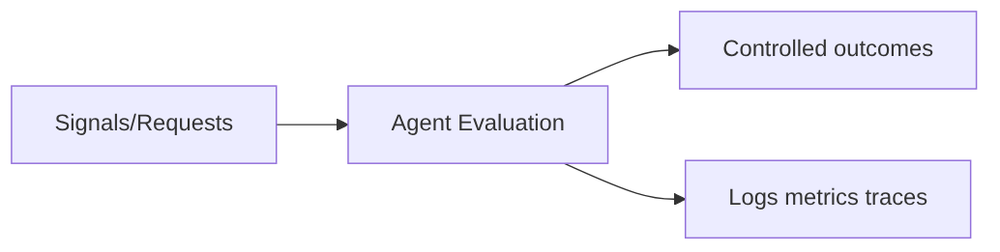

# Chapter 44: Agent Evaluation

## Chapter Overview

Part V — Agent Systems Engineering — **Agent Evaluation** — package `ageval`.

`evaluate(agent, cases)` checks ok flag, substring expectations, and tools_used against `Case` records; includes `DEFAULT_CASES` and `demo_agent`.

Part IV gave you agent building blocks; Part V makes them **operable**: harnesses, mode choice, FSMs, events, HITL, eval, observability, security, cost, and scale. Chapter 44 implements **Agent Evaluation** as `ageval`.

**Code:** `code/chapter-044/ageval/`.

---

## Learning Objectives

After completing this chapter, you can:

- Explain **Agent Evaluation** in a production agent platform
- Run and extend `ageval` offline with pytest
- Connect this module to Part IV building blocks and Part V operations
- Compare trade-offs and failure modes with structured traces
- Apply security, cost, and scaling concerns where relevant
- Complete exercises with tests passing

---

## Prerequisites

- Part IV (Chapters 27–38): agents, tools, memory, graphs, MCP
- Prior Part V chapters when `n > 39` (through Chapter 43)
- pytest and structured logging comfort

---

## Motivation

Demo prompts look fine; regressions ship when models or prompts change.

---

## First Principles

### 1. Cases are data

id, goal, expect_ok, expect_contains, expect_tools

### 2. Report pass_rate

Track over time in CI

### 3. Separate agent fn from harness

Test agent logic in isolation first

### 4. Substring checks are brittle — use carefully

Prefer structured fields in prod evaluators

---

## Mental Model

Eval = unit tests for stochastic employees — golden tasks with expected tools and phrases.



---

## Core Theory

### Case checks

```python
checks = {
  "ok_match": ok == case.expect_ok,
  "contains": all(s in text for s in case.expect_contains),
  "tools": all(t in tools for t in case.expect_tools),
}
```

Returns `{n, pass_rate, passed, rows}` with per-case diagnostics.

### Failure cases

Design for partial failure: budget exceeded, rejected approvals, eval failures, handler exceptions on the event bus, and tool authorization denials.

### Performance implications

Measure p95 end-to-end latency and cost per successful task; optimize cache hits and worker concurrency before bigger models.

### Security implications

Combine guards, HITL, least-privilege tools, and redaction — models are not security boundaries.

---

## Architecture

```text
code/chapter-044/
  ageval/
  tests/
  main.py
  pyproject.toml
```

---

## Internal Implementation

```bash
cd code/chapter-044 && pytest -q && python3 main.py
```

Add failing case; watch pass_rate drop; fix agent or case intentionally.

---

## Production Implementation

- Replace in-memory buses, telemetry, and pools with managed services (Kafka, OTel, Celery/K8s)
- Persist sessions, approvals, and checkpoints durably
- Wire real SDK clients in Part VI chapters while keeping adapter tests from this repo
- Connect observability export to your metrics backend
- Enforce org policy on mode selection and cost routing tables

---

## Framework Implementation

LangSmith, RAGAS, OpenAI evals, Braintrust — hosted suites with same Case mindset.

---

## Trade-offs

| Option A | Option B / notes |
|---|---|
| Substring asserts | Easy; flaky on wording. |
| LLM judge | Flexible; costly. |
| Human eval | Gold standard; slow. |

---

## Debugging

- False negative contains → case sensitivity (lower() used)
- tools check fails → agent omitted tools_used list

---

## Performance

Run eval parallel; shard cases by suite.

---

## Security

Eval datasets must not contain production secrets.

---

## Best Practices

1. Keep `ageval` interfaces stable for tests and adapters
2. Emit structured traces (steps, spans, approvals, eval rows)
3. Enforce budgets before work starts, not after bills arrive
4. Default deny on risky tools and unapproved actions
5. Run regression eval suites on every prompt/model change
6. Map framework demos to your Part IV ports explicitly

---

## Anti-Patterns

- **Agent without harness** — No budgets, recovery, or eval hooks
- **Observability as printf** — Cannot slice latency or token metrics
- **Skipping HITL on financial actions** — Compliance and trust failures
- **Eval-free releases** — Silent regressions on model swaps
- **Framework-first design** — Vendor types leak into domain core
- **Opaque framework defaults** — Hidden control flow and untraceable tool calls

---

## Hands-on Exercise

1. `cd code/chapter-044 && pytest -q`
2. Change one policy knob (budget, guard, mode rule, eval case, worker count)
3. Add/adjust a test proving the behavior
4. Run `python3 main.py` and inspect structured output
5. Document which Part IV module this replaces or wraps

---

## Mini Project

**Regression eval harness with pass rate.** Extend the demo or integrate with a Part IV package in notes (offline).

---

## Visual diagrams





---

## Chapter Deliverables

| Artifact | Location |
|---|---|
| Manuscript | `book/chapter-044.md` |
| Package | `code/chapter-044/ageval/` |
| Tests | `code/chapter-044/tests/` |

---

## Interview Questions

1. CI gate on pass_rate threshold?
2. Eval unit vs integration vs prod shadow?
3. Prevent eval overfitting to substrings?

---

## Quiz

1. Case expect_tools checks:
   A) tools_used list B) GPU C) DNS D) RAM
   **Answer:** A

2. pass_rate is:
   A) passed/n B) n only C) random D) GPU
   **Answer:** A

3. demo_agent handles:
   A) weather/refund goals B) only DNS C) nothing D) GPU
   **Answer:** A

---

## Cheat Sheet

- `evaluate(agent, cases)`
- `Case(id, goal, expect_ok, expect_contains, expect_tools)`

---

## Curated Free Resources

- [RAGAS](https://docs.ragas.io/)
- [OpenAI evals guide](https://platform.openai.com/docs/guides/evals)

---

## Chapter Summary

**Agent Evaluation** (`ageval`) — Regression eval harness with pass rate. Treat it as production infrastructure, not demo glue.

---

## What's Next

**Chapter 45: Observability.** Chapter 45 exports logs, metrics, and traces.
