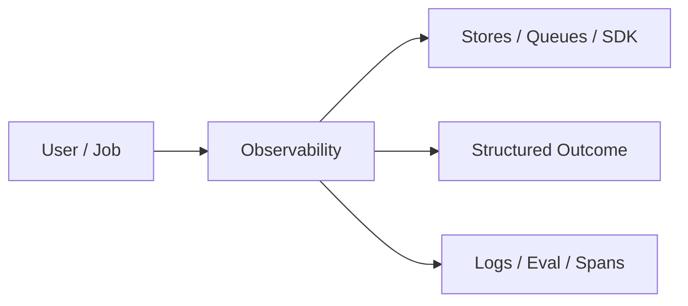
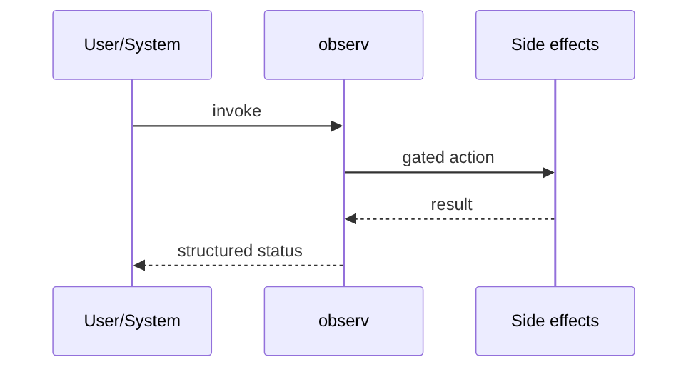
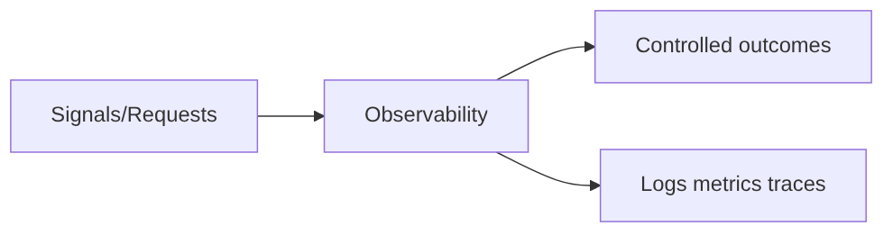

# Chapter 45: Observability

## Chapter Overview

Part V — Agent Systems Engineering — **Observability** — package `observ`.

`Telemetry` collects structured logs, counters, and spans with context manager `span()` recording duration_ms and errors.

Part IV gave you agent building blocks; Part V makes them **operable**: harnesses, mode choice, FSMs, events, HITL, eval, observability, security, cost, and scale. Chapter 45 implements **Observability** as `observ`.

**Code:** `code/chapter-045/observ/`.

---

## Learning Objectives

After completing this chapter, you can:

- Explain **Observability** in a production agent platform
- Run and extend `observ` offline with pytest
- Connect this module to Part IV building blocks and Part V operations
- Compare trade-offs and failure modes with structured traces
- Apply security, cost, and scaling concerns where relevant
- Complete exercises with tests passing

---

## Prerequisites

- Part IV (Chapters 27–38): agents, tools, memory, graphs, MCP
- Prior Part V chapters when `n > 39` (through Chapter 44)
- pytest and structured logging comfort

---

## Motivation

You cannot debug agent failures from a single final string; need span-level latency and token counters.

---

## First Principles

### 1. Structured logs

level, msg, fields — not printf soup.

### 2. Metrics increment

retrieve.hits, tokens, span.errors

### 3. Spans nest work

retrieve → generate in `traced_agent_run`

### 4. export() for pipelines

JSON-ready for OTel collectors later.

---

## Mental Model

Observability = EKG for agents — logs (symptoms), metrics (counts), traces (timing).



---

## Core Theory

### Span context

```python
with tel.span("retrieve", goal=goal) as sp:
    sp.events.append({"hits": 2})
    tel.incr("retrieve.hits", 2)
```

On exception, span status=error, incr span.errors.

`export()` returns logs, metrics, traces arrays.

### Failure cases

Design for partial failure: budget exceeded, rejected approvals, eval failures, handler exceptions on the event bus, and tool authorization denials.

### Performance implications

Measure p95 end-to-end latency and cost per successful task; optimize cache hits and worker concurrency before bigger models.

### Security implications

Combine guards, HITL, least-privilege tools, and redaction — models are not security boundaries.

---

## Architecture

```text
code/chapter-045/
  observ/
  tests/
  main.py
  pyproject.toml
```

---

## Internal Implementation

```bash
cd code/chapter-045 && pytest -q && python3 main.py
```

Add span around a failing function; assert span.errors incremented.

---

## Production Implementation

- Replace in-memory buses, telemetry, and pools with managed services (Kafka, OTel, Celery/K8s)
- Persist sessions, approvals, and checkpoints durably
- Wire real SDK clients in Part VI chapters while keeping adapter tests from this repo
- Connect observability export to your metrics backend
- Enforce org policy on mode selection and cost routing tables

---

## Framework Implementation

OpenTelemetry SDK, Datadog LLM Observability, Langfuse — replace in-memory Telemetry with exporters.

---

## Trade-offs

| Option A | Option B / notes |
|---|---|
| In-memory telemetry | Zero deps; not durable. |
| Full OTel | Standard; setup cost. |
| Log-only | Easy; no latency histograms. |

---

## Debugging

- Zero duration spans → span ctx not used
- Missing metrics → incr never called

---

## Performance

Sample traces in high QPS; aggregate metrics centrally.

---

## Security

Redact PII in log fields; restrict trace access by tenant.

---

## Best Practices

1. Keep `observ` interfaces stable for tests and adapters
2. Emit structured traces (steps, spans, approvals, eval rows)
3. Enforce budgets before work starts, not after bills arrive
4. Default deny on risky tools and unapproved actions
5. Run regression eval suites on every prompt/model change
6. Map framework demos to your Part IV ports explicitly

---

## Anti-Patterns

- **Agent without harness** — No budgets, recovery, or eval hooks
- **Observability as printf** — Cannot slice latency or token metrics
- **Skipping HITL on financial actions** — Compliance and trust failures
- **Eval-free releases** — Silent regressions on model swaps
- **Framework-first design** — Vendor types leak into domain core
- **Opaque framework defaults** — Hidden control flow and untraceable tool calls

---

## Hands-on Exercise

1. `cd code/chapter-045 && pytest -q`
2. Change one policy knob (budget, guard, mode rule, eval case, worker count)
3. Add/adjust a test proving the behavior
4. Run `python3 main.py` and inspect structured output
5. Document which Part IV module this replaces or wraps

---

## Mini Project

**Structured telemetry with spans and counters.** Extend the demo or integrate with a Part IV package in notes (offline).

---

## Visual diagrams





---

## Chapter Deliverables

| Artifact | Location |
|---|---|
| Manuscript | `book/chapter-045.md` |
| Package | `code/chapter-045/observ/` |
| Tests | `code/chapter-045/tests/` |

---

## Interview Questions

1. Logs vs metrics vs traces for agents?
2. Which spans are mandatory for LLM apps?
3. Cardinality pitfalls with tool names?

---

## Quiz

1. Telemetry.span records:
   A) duration_ms B) GPU temp C) DNS TTL D) MAC
   **Answer:** A

2. export includes:
   A) logs, metrics, traces B) only cookies C) GPU D) nothing
   **Answer:** A

3. span errors increment:
   A) span.errors counter B) RAM C) DNS D) never
   **Answer:** A

---

## Cheat Sheet

- `Telemetry.log/incr/span/export`
- `traced_agent_run(goal)` demo

---

## Curated Free Resources

- [OpenTelemetry Python](https://opentelemetry.io/docs/languages/python/)
- [Google SRE — monitoring](https://sre.google/sre-book/monitoring-distributed-systems/)

---

## Chapter Summary

**Observability** (`observ`) — Structured telemetry with spans and counters. Treat it as production infrastructure, not demo glue.

---

## What's Next

**Chapter 46: Agent Security.** Chapter 46 adds security guards on tools and untrusted text.
