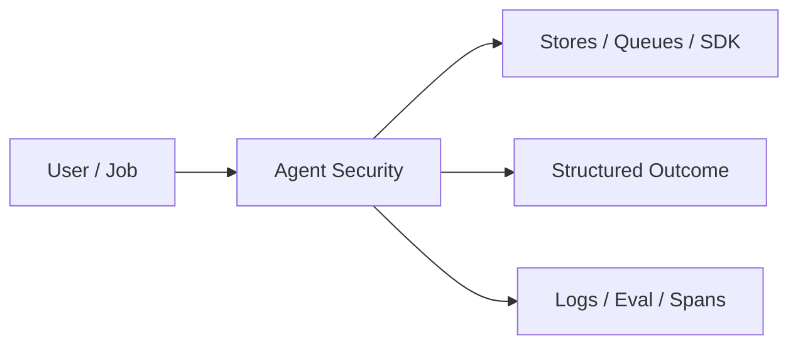
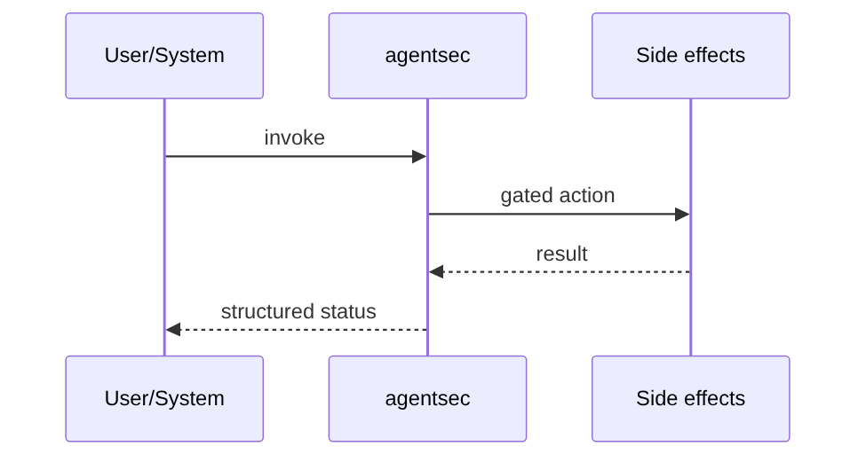
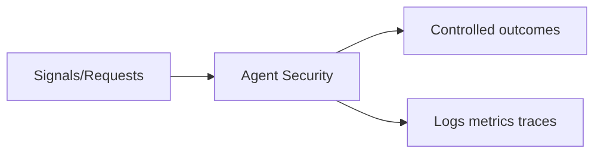

# Chapter 46: Agent Security

## Chapter Overview

Part V — Agent Systems Engineering — **Agent Security** — package `agentsec`.

`SecurityGuard` regex-scans for injection phrases, redacts secrets in text/args, and `authorize_tool` blocks shell/admin tools under suspicion.

Part IV gave you agent building blocks; Part V makes them **operable**: harnesses, mode choice, FSMs, events, HITL, eval, observability, security, cost, and scale. Chapter 46 implements **Agent Security** as `agentsec`.

**Code:** `code/chapter-046/agentsec/`.

---

## Learning Objectives

After completing this chapter, you can:

- Explain **Agent Security** in a production agent platform
- Run and extend `agentsec` offline with pytest
- Connect this module to Part IV building blocks and Part V operations
- Compare trade-offs and failure modes with structured traces
- Apply security, cost, and scaling concerns where relevant
- Complete exercises with tests passing

---

## Prerequisites

- Part IV (Chapters 27–38): agents, tools, memory, graphs, MCP
- Prior Part V chapters when `n > 39` (through Chapter 45)
- pytest and structured logging comfort

---

## Motivation

Prompt injection and secret exfiltration via tools are routine LLM incidents.

---

## First Principles

### 1. Inspect untrusted context

User/docs/email before tool authorize.

### 2. Default deny shell

allow_shell=False unless explicitly enabled.

### 3. Injection blocks admin tools

Heuristic example — extend with policy engine.

### 4. Redact before log/forward

Secrets become [REDACTED].

---

## Mental Model

Security guard = bouncer with metal detector — scans untrusted text, redacts secrets, blocks risky tools.



---

## Core Theory

### inspect_untrusted_text

Flags `possible_prompt_injection`, `secrets_redacted`.

Always returns allowed=True in teaching guard — combine with authorize_tool denial.

### authorize_tool

Blocks `run_shell`/`bash`/`exec` when sandboxed.

Blocks `admin_*` tools when injection suspected.

Returns cleaned args dict.

### Failure cases

Design for partial failure: budget exceeded, rejected approvals, eval failures, handler exceptions on the event bus, and tool authorization denials.

### Performance implications

Measure p95 end-to-end latency and cost per successful task; optimize cache hits and worker concurrency before bigger models.

### Security implications

Combine guards, HITL, least-privilege tools, and redaction — models are not security boundaries.

---

## Architecture

```text
code/chapter-046/
  agentsec/
  tests/
  main.py
  pyproject.toml
```

---

## Internal Implementation

```bash
cd code/chapter-046 && pytest -q && python3 main.py
```

Feed injection string + admin tool; assert injection_blocks_admin_tool.

---

## Production Implementation

- Replace in-memory buses, telemetry, and pools with managed services (Kafka, OTel, Celery/K8s)
- Persist sessions, approvals, and checkpoints durably
- Wire real SDK clients in Part VI chapters while keeping adapter tests from this repo
- Connect observability export to your metrics backend
- Enforce org policy on mode selection and cost routing tables

---

## Framework Implementation

LlamaGuard, NeMo Guardrails, Azure Prompt Shields — production classifiers atop same hook points.

---

## Trade-offs

| Option A | Option B / notes |
|---|---|
| Regex heuristics | Fast; incomplete coverage. |
| ML classifiers | Better recall; maintenance. |
| Human review | Safe; slow. |

---

## Debugging

- False injection → tune patterns
- Secrets not redacted → regex mismatch on format

---

## Performance

Run guards once per tool call; cache inspect results per request id.

---

## Security

Defense in depth — guards do not replace authz or network isolation.

---

## Best Practices

1. Keep `agentsec` interfaces stable for tests and adapters
2. Emit structured traces (steps, spans, approvals, eval rows)
3. Enforce budgets before work starts, not after bills arrive
4. Default deny on risky tools and unapproved actions
5. Run regression eval suites on every prompt/model change
6. Map framework demos to your Part IV ports explicitly

---

## Anti-Patterns

- **Agent without harness** — No budgets, recovery, or eval hooks
- **Observability as printf** — Cannot slice latency or token metrics
- **Skipping HITL on financial actions** — Compliance and trust failures
- **Eval-free releases** — Silent regressions on model swaps
- **Framework-first design** — Vendor types leak into domain core
- **Opaque framework defaults** — Hidden control flow and untraceable tool calls

---

## Hands-on Exercise

1. `cd code/chapter-046 && pytest -q`
2. Change one policy knob (budget, guard, mode rule, eval case, worker count)
3. Add/adjust a test proving the behavior
4. Run `python3 main.py` and inspect structured output
5. Document which Part IV module this replaces or wraps

---

## Mini Project

**Injection heuristics, redaction, tool authorization.** Extend the demo or integrate with a Part IV package in notes (offline).

---

## Visual diagrams





---

## Chapter Deliverables

| Artifact | Location |
|---|---|
| Manuscript | `book/chapter-046.md` |
| Package | `code/chapter-046/agentsec/` |
| Tests | `code/chapter-046/tests/` |

---

## Interview Questions

1. Where do guards sit in the request path?
2. Limits of regex injection detection?
3. Tool sandbox vs policy guard?

---

## Quiz

1. allow_shell default:
   A) False B) True always C) GPU D) DNS
   **Answer:** A

2. authorize_tool redacts:
   A) Secret patterns in args B) GPU C) DNS D) nothing
   **Answer:** A

3. Injection may block:
   A) admin_* tools B) all tools always C) DNS D) GPU
   **Answer:** A

---

## Cheat Sheet

- `SecurityGuard.inspect_untrusted_text/authorize_tool`
- Shell tools blocked unless allow_shell

---

## Curated Free Resources

- [OWASP LLM Top 10](https://owasp.org/www-project-top-10-for-large-language-model-applications/)
- [NVIDIA NeMo Guardrails](https://github.com/NVIDIA/NeMo-Guardrails)

---

## Chapter Summary

**Agent Security** (`agentsec`) — Injection heuristics, redaction, tool authorization. Treat it as production infrastructure, not demo glue.

---

## What's Next

**Chapter 47: Cost Optimization.** Chapter 47 optimizes model spend with cache and routing.
