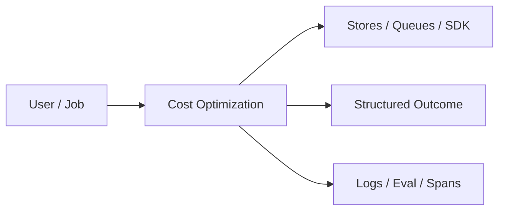
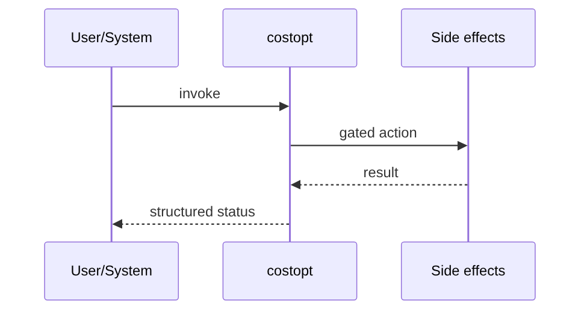
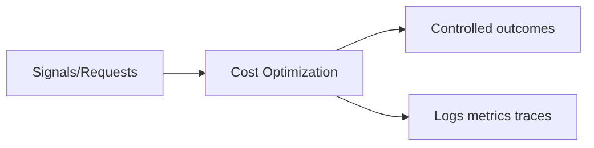

# Chapter 47: Cost Optimization

## Chapter Overview

Part V — Agent Systems Engineering — **Cost Optimization** — package `costopt`.

`CostOptimizer` routes simple tasks to `small` model, complex to `large`, caches SHA256(prompt|model), enforces `budget_usd`.

Part IV gave you agent building blocks; Part V makes them **operable**: harnesses, mode choice, FSMs, events, HITL, eval, observability, security, cost, and scale. Chapter 47 implements **Cost Optimization** as `costopt`.

**Code:** `code/chapter-047/costopt/`.

---

## Learning Objectives

After completing this chapter, you can:

- Explain **Cost Optimization** in a production agent platform
- Run and extend `costopt` offline with pytest
- Connect this module to Part IV building blocks and Part V operations
- Compare trade-offs and failure modes with structured traces
- Apply security, cost, and scaling concerns where relevant
- Complete exercises with tests passing

---

## Prerequisites

- Part IV (Chapters 27–38): agents, tools, memory, graphs, MCP
- Prior Part V chapters when `n > 39` (through Chapter 46)
- pytest and structured logging comfort

---

## Motivation

Every prompt hits the largest model; repeated queries re-bill; budgets blow silently.

---

## First Principles

### 1. Route by task complexity

Keywords like plan/multi-hop → large.

### 2. Cache idempotent completes

cached=True, cost_usd=0.

### 3. Track spend_usd

Fail closed with budget_exceeded.

### 4. Prices table per model tier

Swap for real vendor pricing.

---

## Mental Model

Cost optimizer = smart thermostat — route to small model when cool enough, cache heat when repeated.



---

## Core Theory

### complete()

1. choose_model(task or prompt)
2. cache hit → return cached text, zero cost
3. budget check → error if spend + cost > budget
4. increment spend, store cache entry

Returns model, cached flag, cost_usd, spend_usd.

### Failure cases

Design for partial failure: budget exceeded, rejected approvals, eval failures, handler exceptions on the event bus, and tool authorization denials.

### Performance implications

Measure p95 end-to-end latency and cost per successful task; optimize cache hits and worker concurrency before bigger models.

### Security implications

Combine guards, HITL, least-privilege tools, and redaction — models are not security boundaries.

---

## Architecture

```text
code/chapter-047/
  costopt/
  tests/
  main.py
  pyproject.toml
```

---

## Internal Implementation

```bash
cd code/chapter-047 && pytest -q && python3 main.py
```

Call same prompt twice; second response cached=True.

---

## Production Implementation

- Replace in-memory buses, telemetry, and pools with managed services (Kafka, OTel, Celery/K8s)
- Persist sessions, approvals, and checkpoints durably
- Wire real SDK clients in Part VI chapters while keeping adapter tests from this repo
- Connect observability export to your metrics backend
- Enforce org policy on mode selection and cost routing tables

---

## Framework Implementation

LiteLLM routing, OpenAI model tiering, semantic cache products — same cache+routing seam.

---

## Trade-offs

| Option A | Option B / notes |
|---|---|
| Exact cache | Hit only on identical prompt. |
| Semantic cache | Higher hit rate; false positives. |
| Always large model | Quality max; cost max. |

---

## Debugging

- Never caches → key changes (model/prompt whitespace)
- budget_exceeded early → prices too high vs budget

---

## Performance

TTL cache entries; track hit rate metric.

---

## Security

Do not cache responses containing secrets or per-user PII without tenant-scoped keys.

---

## Best Practices

1. Keep `costopt` interfaces stable for tests and adapters
2. Emit structured traces (steps, spans, approvals, eval rows)
3. Enforce budgets before work starts, not after bills arrive
4. Default deny on risky tools and unapproved actions
5. Run regression eval suites on every prompt/model change
6. Map framework demos to your Part IV ports explicitly

---

## Anti-Patterns

- **Agent without harness** — No budgets, recovery, or eval hooks
- **Observability as printf** — Cannot slice latency or token metrics
- **Skipping HITL on financial actions** — Compliance and trust failures
- **Eval-free releases** — Silent regressions on model swaps
- **Framework-first design** — Vendor types leak into domain core
- **Opaque framework defaults** — Hidden control flow and untraceable tool calls

---

## Hands-on Exercise

1. `cd code/chapter-047 && pytest -q`
2. Change one policy knob (budget, guard, mode rule, eval case, worker count)
3. Add/adjust a test proving the behavior
4. Run `python3 main.py` and inspect structured output
5. Document which Part IV module this replaces or wraps

---

## Mini Project

**Model routing, prompt cache, USD budget.** Extend the demo or integrate with a Part IV package in notes (offline).

---

## Visual diagrams





---

## Chapter Deliverables

| Artifact | Location |
|---|---|
| Manuscript | `book/chapter-047.md` |
| Package | `code/chapter-047/costopt/` |
| Tests | `code/chapter-047/tests/` |

---

## Interview Questions

1. Cache key design with tenant isolation?
2. When routing hurts quality?
3. FinOps metrics for agents?

---

## Quiz

1. Cache hit cost_usd:
   A) 0.0 B) 999 C) random D) GPU
   **Answer:** A

2. complex tasks route to:
   A) large model B) small always C) DNS D) none
   **Answer:** A

3. budget_exceeded when:
   A) spend+cost > budget B) always C) never D) GPU
   **Answer:** A

---

## Cheat Sheet

- `CostOptimizer.complete(prompt, task=...)`
- `choose_model` keyword heuristics

---

## Curated Free Resources

- [LiteLLM](https://docs.litellm.ai/)
- [OpenAI pricing](https://openai.com/api/pricing/)

---

## Chapter Summary

**Cost Optimization** (`costopt`) — Model routing, prompt cache, USD budget. Treat it as production infrastructure, not demo glue.

---

## What's Next

**Chapter 48: Scaling AI Agents.** Chapter 48 scales work across worker pools.
