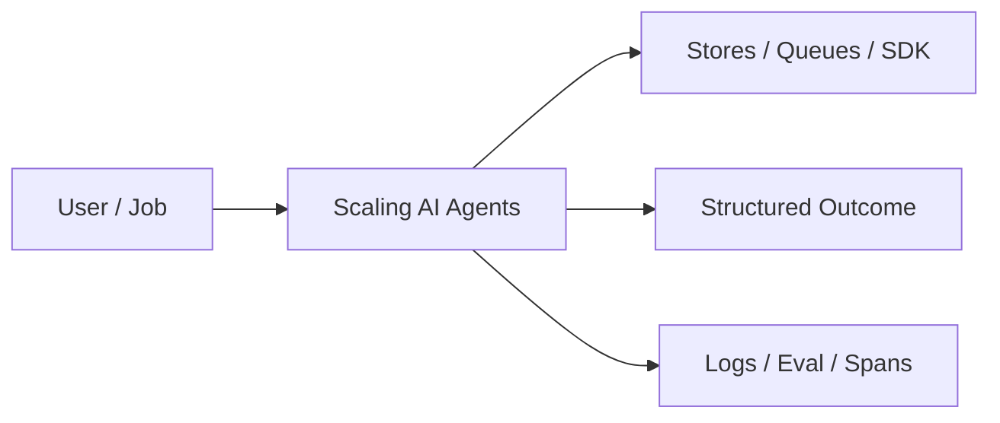

# Chapter 48: Scaling AI Agents

## Chapter Overview

Part V — Agent Systems Engineering — **Scaling AI Agents** — package `scalekit`.

`WorkerPool.map(jobs)` uses ThreadPoolExecutor; `shard_goals` round-robin splits goals; `demo_scale` runs batch echo jobs.

Part IV gave you agent building blocks; Part V makes them **operable**: harnesses, mode choice, FSMs, events, HITL, eval, observability, security, cost, and scale. Chapter 48 implements **Scaling AI Agents** as `scalekit`.

**Code:** `code/chapter-048/scalekit/`.

---

## Learning Objectives

After completing this chapter, you can:

- Explain **Scaling AI Agents** in a production agent platform
- Run and extend `scalekit` offline with pytest
- Connect this module to Part IV building blocks and Part V operations
- Compare trade-offs and failure modes with structured traces
- Apply security, cost, and scaling concerns where relevant
- Complete exercises with tests passing

---

## Prerequisites

- Part IV (Chapters 27–38): agents, tools, memory, graphs, MCP
- Prior Part V chapters when `n > 39` (through Chapter 47)
- pytest and structured logging comfort

---

## Motivation

Single-threaded agent runs cannot absorb burst ticket volume.

---

## First Principles

### 1. Jobs are id + payload

Serializable for real queues later.

### 2. Worker pool bounds concurrency

max_workers cap.

### 3. Results sorted by job id

Deterministic tests.

### 4. Shard for horizontal scale

Round-robin buckets for N workers.

---

## Mental Model

Scale kit = warehouse shift — shard goals, worker pool maps jobs, sort results by id.



---

## Core Theory

### WorkerPool

Submit each Job to handler; collect ok/error rows.

### shard_goals

Distributes goals across `shards` buckets for partition-aware routing (Kafka partition mindset).

### Failure cases

Design for partial failure: budget exceeded, rejected approvals, eval failures, handler exceptions on the event bus, and tool authorization denials.

### Performance implications

Measure p95 end-to-end latency and cost per successful task; optimize cache hits and worker concurrency before bigger models.

### Security implications

Combine guards, HITL, least-privilege tools, and redaction — models are not security boundaries.

---

## Architecture

```text
code/chapter-048/
  scalekit/
  tests/
  main.py
  pyproject.toml
```

---

## Internal Implementation

```bash
cd code/chapter-048 && pytest -q && python3 main.py
```

Set max_workers=1 vs 4 and compare wall time on 10 jobs (local demo).

---

## Production Implementation

- Replace in-memory buses, telemetry, and pools with managed services (Kafka, OTel, Celery/K8s)
- Persist sessions, approvals, and checkpoints durably
- Wire real SDK clients in Part VI chapters while keeping adapter tests from this repo
- Connect observability export to your metrics backend
- Enforce org policy on mode selection and cost routing tables

---

## Framework Implementation

Celery, RQ, Temporal task queues, K8s HPA — production scale layers.

---

## Trade-offs

| Option A | Option B / notes |
|---|---|
| Thread pool | Good I/O; GIL for CPU Python. |
| Process pool | CPU parallel; heavier. |
| External queue | Durable; ops. |

---

## Debugging

- Partial ok → handler exceptions on subset
- Ordering surprises → sort by id already applied

---

## Performance

Right-size workers; back-pressure when queue depth high.

---

## Security

Workers must inherit auth context per job; no shared mutable globals.

---

## Best Practices

1. Keep `scalekit` interfaces stable for tests and adapters
2. Emit structured traces (steps, spans, approvals, eval rows)
3. Enforce budgets before work starts, not after bills arrive
4. Default deny on risky tools and unapproved actions
5. Run regression eval suites on every prompt/model change
6. Map framework demos to your Part IV ports explicitly

---

## Anti-Patterns

- **Agent without harness** — No budgets, recovery, or eval hooks
- **Observability as printf** — Cannot slice latency or token metrics
- **Skipping HITL on financial actions** — Compliance and trust failures
- **Eval-free releases** — Silent regressions on model swaps
- **Framework-first design** — Vendor types leak into domain core
- **Opaque framework defaults** — Hidden control flow and untraceable tool calls

---

## Hands-on Exercise

1. `cd code/chapter-048 && pytest -q`
2. Change one policy knob (budget, guard, mode rule, eval case, worker count)
3. Add/adjust a test proving the behavior
4. Run `python3 main.py` and inspect structured output
5. Document which Part IV module this replaces or wraps

---

## Mini Project

**Worker pool batch execution and goal sharding.** Extend the demo or integrate with a Part IV package in notes (offline).

---

## Visual diagrams


---

## Chapter Deliverables

| Artifact | Location |
|---|---|
| Manuscript | `book/chapter-048.md` |
| Package | `code/chapter-048/scalekit/` |
| Tests | `code/chapter-048/tests/` |

---

## Interview Questions

1. Agent stateful vs stateless workers?
2. Sharding by tenant vs by task type?
3. Back-pressure strategies?

---

## Quiz

1. WorkerPool.map returns:
   A) Sorted results by id B) random C) GPU D) DNS
   **Answer:** A

2. shard_goals uses:
   A) round-robin B) never C) GPU only D) TLS
   **Answer:** A

3. Job includes:
   A) id and payload B) only GPU C) DNS D) nothing
   **Answer:** A

---

## Cheat Sheet

- `WorkerPool(handler, max_workers).map(jobs)`
- `shard_goals(goals, shards=...)`

---

## Curated Free Resources

- [Celery](https://docs.celeryq.dev/)
- [Kubernetes HPA](https://kubernetes.io/docs/tasks/run-application/horizontal-pod-autoscale/)

---

## Chapter Summary

**Scaling AI Agents** (`scalekit`) — Worker pool batch execution and goal sharding. Treat it as production infrastructure, not demo glue.

---

## What's Next

**Chapter 49: OpenAI Agents SDK.** Part VI maps concepts onto OpenAI Agents SDK (Chapter 49).
