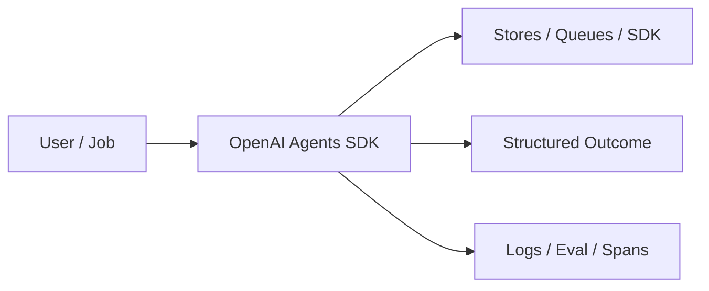
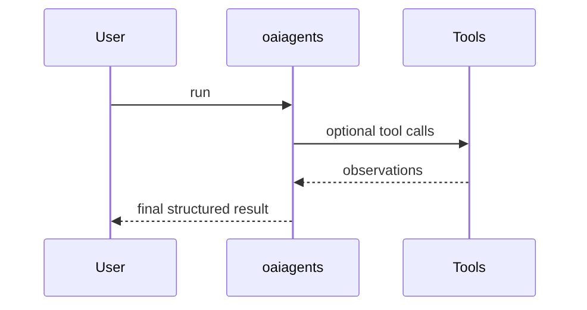
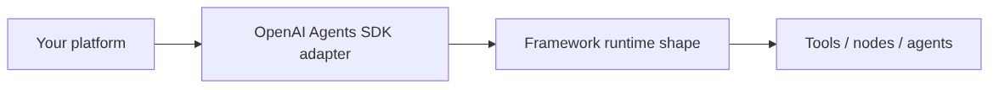

# Chapter 49: OpenAI Agents SDK

## Chapter Overview

Part VI — Frameworks — **OpenAI Agents SDK** — package `oaiagents`.

Offline `Runner` + `Agent` + `Tool` + `handoffs` models SDK runs with scripted weather tool use and specialist routing.

Part VI maps Part IV–V concepts onto mainstream frameworks. Chapter 49 teaches **OpenAI Agents SDK** via offline `oaiagents` so you can compare SDK shapes without cloud lock-in during learning.

**Code:** `code/chapter-049/oaiagents/`.

---

## Learning Objectives

After completing this chapter, you can:

- Explain **OpenAI Agents SDK** in a production agent platform
- Run and extend `oaiagents` offline with pytest
- Connect this module to Part IV building blocks and Part V operations
- Compare trade-offs and failure modes with structured traces
- Apply security, cost, and scaling concerns where relevant
- Complete exercises with tests passing

---

## Prerequisites

- Parts IV–V (agent modules + systems engineering)
- Prior framework chapters when `n > 49` (through Chapter 48)
- Read official SDK docs alongside this offline clone

---

## Motivation

Teams reimplement tool loops and handoffs per product instead of mapping to a known SDK shape.

---

## First Principles

### 1. Agents have instructions + tools

Mirror SDK Agent config.

### 2. Runner owns turn loop

max_turns budget.

### 3. Handoffs chain agents

specialist keyword triggers billing agent.

### 4. Trace messages for debugging

user/tool/assistant roles.

---

## Mental Model

OpenAI Agents SDK = concierge desk with handoffs — front agent tools weather, passes specialist cases to billing.



---

## Core Theory

### demo()

Support agent with `get_weather` tool and handoff to billing agent.

`Runner.run(agent_name, user_input)` returns framework tag `openai_agents_sdk`, final text, trace.

Replace scripted branches with real SDK `Runner` in production; keep the same trace fields in tests via adapters.

### Failure cases

Design for partial failure: budget exceeded, rejected approvals, eval failures, handler exceptions on the event bus, and tool authorization denials.

### Performance implications

Measure p95 end-to-end latency and cost per successful task; optimize cache hits and worker concurrency before bigger models.

### Security implications

Combine guards, HITL, least-privilege tools, and redaction — models are not security boundaries.

---

## Architecture

```text
code/chapter-049/
  oaiagents/
  tests/
  main.py
  pyproject.toml
```

---

## Internal Implementation

```bash
cd code/chapter-049 && pytest -q && python3 main.py
```

Compare trace structure to your Part IV tool loop (Ch 29).

---

## Production Implementation

- Replace in-memory buses, telemetry, and pools with managed services (Kafka, OTel, Celery/K8s)
- Persist sessions, approvals, and checkpoints durably
- Wire real SDK clients in Part VI chapters while keeping adapter tests from this repo
- Connect observability export to your metrics backend
- Enforce org policy on mode selection and cost routing tables

---

## Framework Implementation

This chapter **is** the OpenAI Agents SDK mapping — also compare LangGraph (Ch 50) for graph-native control.

---

## Trade-offs

| Option A | Option B / notes |
|---|---|
| SDK-managed loop | Less code; less custom policy. |
| Owned harness (Part V) | More work; full control. |

---

## Debugging

- Handoff not triggered → keyword specialist missing
- Tool skipped → agent lacks registered tool

---

## Performance

Use SDK streaming APIs; cap max_turns.

---

## Security

SDK tool allowlists + server-side validation still required.

---

## Best Practices

1. Keep `oaiagents` interfaces stable for tests and adapters
2. Emit structured traces (steps, spans, approvals, eval rows)
3. Enforce budgets before work starts, not after bills arrive
4. Default deny on risky tools and unapproved actions
5. Run regression eval suites on every prompt/model change
6. Map framework demos to your Part IV ports explicitly

---

## Anti-Patterns

- **Agent without harness** — No budgets, recovery, or eval hooks
- **Observability as printf** — Cannot slice latency or token metrics
- **Skipping HITL on financial actions** — Compliance and trust failures
- **Eval-free releases** — Silent regressions on model swaps
- **Framework-first design** — Vendor types leak into domain core
- **Opaque framework defaults** — Hidden control flow and untraceable tool calls

---

## Hands-on Exercise

1. `cd code/chapter-049 && pytest -q`
2. Change one policy knob (budget, guard, mode rule, eval case, worker count)
3. Add/adjust a test proving the behavior
4. Run `python3 main.py` and inspect structured output
5. Document which Part IV module this replaces or wraps

---

## Mini Project

**Offline OpenAI Agents SDK-shaped runtime demo.** Extend the demo or integrate with a Part IV package in notes (offline).

---

## Visual diagrams





---

## Chapter Deliverables

| Artifact | Location |
|---|---|
| Manuscript | `book/chapter-049.md` |
| Package | `code/chapter-049/oaiagents/` |
| Tests | `code/chapter-049/tests/` |

---

## Interview Questions

1. When choose OpenAI Agents vs raw Chat Completions?
2. How do handoffs differ from multi-agent crews?
3. Testing strategy with SDK?

---

## Quiz

1. Runner.run returns framework:
   A) openai_agents_sdk B) GPU C) DNS D) none
   **Answer:** A

2. Handoffs connect:
   A) Agents B) GPUs C) DNS D) disks
   **Answer:** A

3. Tools attach to:
   A) Agent B) only env C) DNS D) nothing
   **Answer:** A

---

## Cheat Sheet

- `Runner(agents).run(name, input)`
- `Agent(name, instructions, tools, handoffs)`

---

## Curated Free Resources

- [OpenAI Agents SDK](https://openai.github.io/openai-agents-python/)
- [Function calling](https://platform.openai.com/docs/guides/function-calling)

---

## Chapter Summary

**OpenAI Agents SDK** (`oaiagents`) — Offline OpenAI Agents SDK-shaped runtime demo. Use the offline runtime to learn ports; adopt the real SDK in production with the same trace mindset.

---

## What's Next

**Chapter 50: LangGraph.** Chapter 50 covers LangGraph-style compiled graphs.
